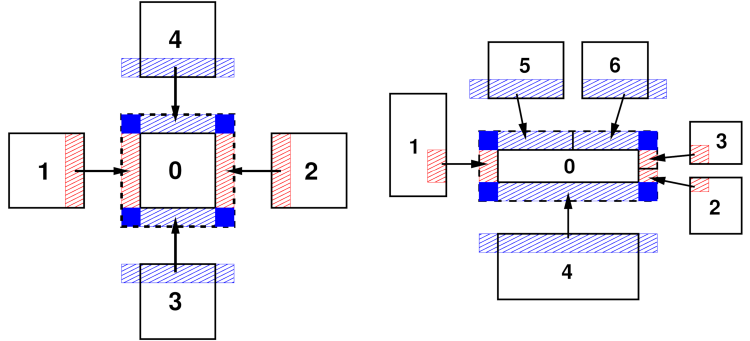

Communication
^^^^^^^^^^^^^

Following the partitioning scheme in use all per-atom data is
distributed across the MPI processes, which allows LAMMPS to handle very
large systems provided it uses a correspondingly large number of MPI
processes.  Since The per-atom data (atom IDs, positions, velocities,
types, etc.)  To be able to compute the short-range interactions MPI
processes need not only access to data of atoms they "own" but also
information about atoms from neighboring sub-domains, in LAMMPS referred
to as "ghost" atoms.  These are copies of atoms storing required
per-atom data for up to the communication cutoff distance. The green
dashed-line boxes in the :ref:`domain-decomposition` figure illustrate
the extended ghost-atom sub-domain for one processor.

This approach is also used to implement periodic boundary
conditions: atoms that lie within the cutoff distance across a periodic
boundary are also stored as ghost atoms and taken from the periodic
replication of the sub-domain, which may be the same sub-domain, e.g. if
running in serial.  As a consequence of this, force computation in
LAMMPS is not subject to minimum image conventions and thus cutoffs may
be larger than half the simulation domain.

.. _ghost-atom-comm:

   ghost atom communication

   This figure shows the ghost atom communication patterns between
   sub-domains for "brick" (left) and "tiled" communication styles for
   2d simulations.  The numbers indicate MPI process ranks.  Here the
   sub-domains are drawn spatially separated for clarity.  The
   dashed-line box is the extended sub-domain of processor 0 which
   includes its ghost atoms.  The red- and blue-shaded boxes are the
   regions of communicated ghost atoms.

Efficient communication patterns are needed to update the "ghost" atom
data, since that needs to be done at every MD time step or minimization
step.  The diagrams of the `ghost-atom-comm` figure illustrate how ghost
atom communication is performed in two stages for a 2d simulation (three
in 3d) for both a regular and irregular partitioning of the simulation
box.  For the regular case (left) atoms are exchanged first in the
*x*-direction, then in *y*, with four neighbors in the grid of processor
sub-domains.

In the *x* stage, processor ranks 1 and 2 send owned atoms in their
red-shaded regions to rank 0 (and vice versa).  Then in the *y* stage,
ranks 3 and 4 send atoms in their blue-shaded regions to rank 0, which
includes ghost atoms they received in the *x* stage.  Rank 0 thus
acquires all its ghost atoms; atoms in the solid blue corner regions
are communicated twice before rank 0 receives them.

For the irregular case (right) the two stages are similar, but a
processor can have more than one neighbor in each direction.  In the
*x* stage, MPI ranks 1,2,3 send owned atoms in their red-shaded regions to
rank 0 (and vice versa).  These include only atoms between the lower
and upper *y*-boundary of rank 0's sub-domain.  In the *y* stage, ranks
4,5,6 send atoms in their blue-shaded regions to rank 0.  This may
include ghost atoms they received in the *x* stage, but only if they
are needed by rank 0 to fill its extended ghost atom regions in the
+/-*y* directions (blue rectangles).  Thus in this case, ranks 5 and
6 do not include ghost atoms they received from each other (in the *x*
stage) in the atoms they send to rank 0.  The key point is that while
the pattern of communication is more complex in the irregular
partitioning case, it can still proceed in two stages (three in 3d)
via atom exchanges with only neighboring processors.

When attributes of owned atoms are sent to neighboring processors to
become attributes of their ghost atoms, LAMMPS calls this a "forward"
communication.  On timesteps when atoms migrate to new owning processors
and neighbor lists are rebuilt, each processor creates a list of its
owned atoms which are ghost atoms in each of its neighbor processors.
These lists are used to pack per-atom coordinates (for example) into
message buffers in subsequent steps until the next reneighboring.

A "reverse" communication is when computed ghost atom attributes are
sent back to the processor who owns the atom.  This is used (for
example) to sum partial forces on ghost atoms to the complete force on
owned atoms.  The order of the two stages described in the
:ref:`ghost-atom-comm` figure is inverted and the same lists of atoms
are used to pack and unpack message buffers with per-atom forces.  When
a received buffer is unpacked, the ghost forces are summed to owned atom
forces.  As in forward communication, forces on atoms in the four blue
corners of the diagrams are sent, received, and summed twice (once at
each stage) before owning processors have the full force.

These two operations are used many places within LAMMPS aside from
exchange of coordinates and forces, for example by manybody potentials
to share intermediate per-atom values, or by rigid-body integrators to
enable each atom in a body to access body properties.  Here are
additional details about how these communication operations are
performed in LAMMPS:

- When exchanging data with different processors, forward and reverse
  communication is done using ``MPI_Send()`` and ``MPI_IRecv()`` calls.
  If a processor is "exchanging" atoms with itself, only the pack and
  unpack operations are performed, e.g. to create ghost atoms across
  periodic boundaries when running on a single processor.

- For forward communication of owned atom coordinates, periodic box
  lengths are added and subtracted when the receiving processor is
  across a periodic boundary from the sender.  There is then no need to
  apply a minimum image convention when calculating distances between
  atom pairs when building neighbor lists or computing forces.

- The cutoff distance for exchanging ghost atoms is typically equal to
  the neighbor cutoff.  But it can also chosen to be longer if needed,
  e.g. half the diameter of a rigid body composed of multiple atoms or
  over 3x the length of a stretched bond for dihedral interactions.  It
  can also exceed the periodic box size.  For the regular communication
  pattern (left), if the cutoff distance extends beyond a neighbor
  processor's sub-domain, then multiple exchanges are performed in the
  same direction.  Each exchange is with the same neighbor processor,
  but buffers are packed/unpacked using a different list of atoms. For
  forward communication, in the first exchange a processor sends only
  owned atoms.  In subsequent exchanges, it sends ghost atoms received
  in previous exchanges.  For the irregular pattern (right) overlaps of
  a processor's extended ghost-atom sub-domain with all other processors
  in each dimension are detected.
