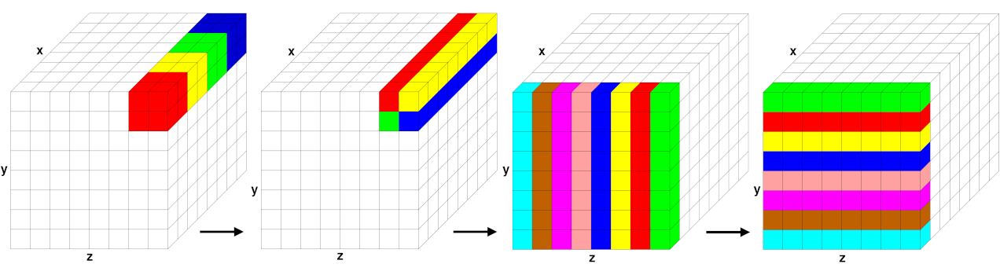

Long-range interactions
^^^^^^^^^^^^^^^^^^^^^^^

For charged systems, LAMMPS can compute long-range Coulombic
interactions via the FFT-based particle-particle/particle-mesh (PPPM)
method implemented in :doc:`kspace style pppm and its variants
<kspace_style>`.  For that Coulombic interactions are partitioned into
short- and long-range components.  The short-ranged portion is computed
in real space as a loop over pairs of charges within a cutoff distance,
using neighbor lists.  The long-range portion is computed in reciprocal
space using a kspace style.  For the PPPM implementation the simulation
cell is overlaid with a regular FFT grid in 3d. It proceeds in several stages:

a) each atom's point charge is interpolated to nearby FFT grid points,
b) a forward 3d FFT is performed,
c) a convolution operation is performed in reciprocal space,
d) one or more inverse 3d FFTs are performed, and
e) electric field values from grid points near each atom are interpolated to compute
   its forces.

For any of the spatial-decomposition partitioning schemes each processor
owns the brick-shaped portion of FFT grid points contained within its
subdomain.  The two interpolation operations use a stencil of grid
points surrounding each atom.  To accommodate the stencil size, each
processor also stores a few layers of ghost grid points surrounding its
brick.  Forward and reverse communication of grid point values is
performed similar to the corresponding :doc:`atom data communication
<Developer_par_comm>`.  In this case, electric field values on owned
grid points are sent to neighboring processors to become ghost point
values.  Likewise charge values on ghost points are sent and summed to
values on owned points.

For triclinic simulation boxes, the FFT grid planes are parallel to
the box faces, but the mapping of charge and electric field values
to/from grid points is done in reduced coordinates where the tilted
box is conceptually a unit cube, so that the stencil and FFT
operations are unchanged.  However the FFT grid size required for a
given accuracy is larger for triclinic domains than it is for
orthogonal boxes.

.. _fft-parallel:

   Parallel FFT in PPPM

      Stages of a parallel FFT for a simulation domain overlaid with an
      8x8x8 3d FFT grid, partitioned across 64 processors.  Within each
      of the 4 diagrams, grid cells of the same color are owned by a
      single processor; for simplicity, only cells owned by 4 or 8 of
      the 64 processors are colored.  The two images on the left
      illustrate brick-to-pencil communication.  The two images on the
      right illustrate pencil-to-pencil communication, which in this
      case transposes the *y* and *z* dimensions of the grid.

Parallel 3d FFTs require substantial communication relative to their
computational cost.  A 3d FFT is implemented by a series of 1d FFTs
along the *x-*, *y-*, and *z-*\ direction of the FFT grid.  Thus, the
FFT grid cannot be decomposed like atoms into 3 dimensions for parallel
processing of the FFTs but only in 1 (as planes) or 2 (as pencils)
dimensions and in between the steps the grid needs to be transposed to
have the FFT grid portion "owned" by each MPI process complete in the
direction of the 1d FFTs it has to perform. LAMMPS uses the
pencil-decomposition algorithm as shown in the :ref:`fft-parallel`
figure.

Initially (far left), each processor owns a brick of same-color grid
cells (actually grid points) contained within in its subdomain.  A
brick-to-pencil communication operation converts this layout to 1d
pencils in the *x*-dimension (center left).  Again, cells of the same
color are owned by the same processor.  Each processor can then compute
a 1d FFT on each pencil of data it wholly owns using a call to the
configured FFT library.  A pencil-to-pencil communication then converts
this layout to pencils in the *y* dimension (center right) which
effectively transposes the *x* and *y* dimensions of the grid, followed
by 1d FFTs in *y*.  A final transpose of pencils from *y* to *z* (far
right) followed by 1d FFTs in *z* completes the forward FFT.  The data
is left in a *z*-pencil layout for the convolution operation.  One or
more inverse FFTs then perform the sequence of 1d FFTs and communication
steps in reverse order; the final layout of resulting grid values is the
same as the initial brick layout.

Each communication operation within the FFT (brick-to-pencil or
pencil-to-pencil or pencil-to-brick) converts one tiling of the 3d grid
to another, where a tiling in this context means an assignment of a
small brick-shaped subset of grid points to each processor, the union of
which comprise the entire grid.  The parallel `fftMPI library
<https://lammps.github.io/fftmpi/>`_ written for LAMMPS allows arbitrary
definitions of the tiling so that an irregular partitioning of the
simulation domain can use it directly.  Transforming data from one
tiling to another is implemented in `fftMPI` using point-to-point
communication, where each processor sends data to a few other
processors, since each tile in the initial tiling overlaps with a
handful of tiles in the final tiling.

The transformations could also be done using collective communication
across all $P$ processors with a single call to ``MPI_Alltoall()``, but
this is typically much slower.  However, for the specialized brick and
pencil tiling illustrated in :ref:`fft-parallel` figure, collective
communication across the entire MPI communicator is not required.  In
the example, an :math:`8^3` grid with 512 grid cells is partitioned
across 64 processors; each processor owns a 2x2x2 3d brick of grid
cells.  The initial brick-to-pencil communication (upper left to upper
right) only requires collective communication within subgroups of 4
processors, as illustrated by the 4 colors.  More generally, a
brick-to-pencil communication can be performed by partitioning *P*
processors into :math:`P^{\frac{2}{3}}` subgroups of
:math:`P^{\frac{1}{3}}` processors each.  Each subgroup performs
collective communication only within its subgroup.  Similarly,
pencil-to-pencil communication can be performed by partitioning *P*
processors into :math:`P^{\frac{1}{2}}` subgroups of
:math:`P^{\frac{1}{2}}` processors each.  This is illustrated in the
figure for the :math:`y \Rightarrow z` communication (center).  An
eight-processor subgroup owns the front *yz* plane of data and performs
collective communication within the subgroup to transpose from a
*y*-pencil to *z*-pencil layout.

LAMMPS invokes point-to-point communication by default, but also
provides the option of partitioned collective communication when using a
:doc:`kspace_modify collective yes <kspace_modify>` command to switch to
that mode.  In the latter case, the code detects the size of the
disjoint subgroups and partitions the single *P*-size communicator into
multiple smaller communicators, each of which invokes collective
communication.  Testing on a large IBM Blue Gene/Q machine at Argonne
National Labs showed a significant improvement in FFT performance for
large processor counts; partitioned collective communication was faster
than point-to-point communication or global collective communication
involving all *P* processors.

Here are some additional details about FFTs for long-range and related
grid/particle operations that LAMMPS supports:

- The fftMPI library allows each grid dimension to be a multiple of
  small prime factors (2,3,5), and allows any number of processors to
  perform the FFT.  The resulting brick and pencil decompositions are
  thus not always as well-aligned, but the size of subgroups of
  processors for the two modes of communication (brick/pencil and
  pencil/pencil) still scale as :math:`O(P^{\frac{1}{3}})` and
  :math:`O(P^{\frac{1}{2}})`.

- For efficiency in performing 1d FFTs, the grid transpose
  operations illustrated in Figure \ref{fig:fft} also involve
  reordering the 3d data so that a different dimension is contiguous
  in memory.  This reordering can be done during the packing or
  unpacking of buffers for MPI communication.

- For large systems and particularly many MPI processes, the dominant
  cost for parallel FFTs is often the communication, not the computation
  of 1d FFTs, even though the latter scales as :math:`N \log(N)` in the
  number of grid points *N* per grid direction.  This is due to the fact
  that only a 2d decomposition into pencils is possible while atom data
  (and their corresponding short-range force and energy computations)
  can be decomposed efficiently in 3d.

  Reducing the number of MPI processes involved in the MPI communication
  will reduce this kind of overhead.  By using a :doc:`hybrid MPI +
  OpenMP parallelization <Speed_omp>` it is still possible to use all
  processes for parallel computation.  It will use OpenMP
  parallelization inside the MPI domains. While that may have a lower
  parallel efficiency for some part of the computation, that can be less
  than the communication overhead in the 3d FFTs.

  As an alternative, it is also possible to start a :ref:`multi-partition
  <partition>` calculation and then use the :doc:`verlet/split
  integrator <run_style>` to perform the PPPM computation on a
  dedicated, separate partition of MPI processes.  This uses an integer
  "1:*p*" mapping of *p* subdomains of the atom decomposition to one
  subdomain of the FFT grid decomposition and where pairwise non-bonded
  and bonded forces and energies are computed on the larger partition
  and the PPPM kspace computation concurrently on the smaller partition.

- LAMMPS also implements PPPM-based solvers for other long-range
  interactions, dipole and dispersion (Lennard-Jones), which can be used
  in conjunction with long-range  Coulombics for point charges.

- LAMMPS implements a ``GridComm`` class which overlays the simulation
  domain with a regular grid, partitions it across processors in a
  manner consistent with processor subdomains, and provides methods for
  forward and reverse communication of owned and ghost grid point
  values.  It is used for PPPM as an FFT grid (as outlined above) and
  also for the MSM algorithm, which uses a cascade of grid sizes from
  fine to coarse to compute long-range Coulombic forces.  The GridComm
  class is also useful for models where continuum fields interact with
  particles.  For example, the two-temperature model (TTM) defines heat
  transfer between atoms (particles) and electrons (continuum gas) where
  spatial variations in the electron temperature are computed by finite
  differences of a discretized heat equation on a regular grid.  The
  :doc:`fix ttm/grid <fix_ttm>` command uses the ``GridComm`` class
  internally to perform its grid operations on a distributed grid
  instead of the original :doc:`fix ttm <fix_ttm>` which uses a
  replicated grid.
