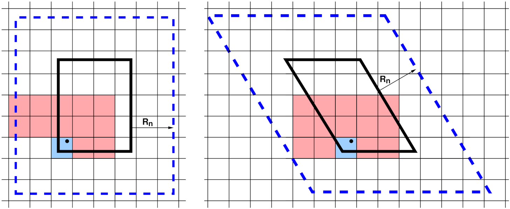

Neighbor lists
^^^^^^^^^^^^^^

To compute forces efficiently, each processor creates a Verlet-style
neighbor list which enumerates all pairs of atoms *i,j* (*i* = owned,
*j* = owned or ghost) with separation less than the applicable neighbor
list cutoff distance.  In LAMMPS, the neighbor lists are stored in a
multiple-page data structure; each page is a contiguous chunk of memory
which stores vectors of neighbor atoms *j* for many *i* atoms.  This
allows pages to be incrementally allocated or deallocated in blocks as
needed.  Neighbor lists typically consume the most memory of any data
structure in LAMMPS.  The neighbor list is rebuilt (from scratch) once
every few timesteps, then used repeatedly each step for force or other
computations.  The neighbor cutoff distance is :math:`R_n = R_f +
\Delta_s`, where :math:`R_f` is the (largest) force cutoff defined by
the interatomic potential for computing short-range pairwise or manybody
forces and :math:`\Delta_s` is a "skin" distance that allows the list to
be used for multiple steps assuming that atoms do not move very far
between consecutive time steps.  Typically, the code triggers
reneighboring when any atom has moved half the skin distance since the
last reneighboring; this and other options of the neighbor list rebuild
can be adjusted with the :doc:`neigh_modify <neigh_modify>` command.

On steps when reneighboring is performed, atoms which have moved outside
their owning processor's subdomain are first migrated to new processors
via communication.  Periodic boundary conditions are also (only)
enforced on these steps to ensure each atom is re-assigned to the
correct processor.  After migration, the atoms owned by each processor
are stored in a contiguous vector.  Periodically, each processor
spatially sorts owned atoms within its vector to reorder it for improved
cache efficiency in force computations and neighbor list building.  For
that, atoms are spatially binned and then reordered so that atoms in the
same bin are adjacent in the vector.  Atom sorting can be disabled or
its settings modified with the :doc:`atom_modify <atom_modify>` command.

.. _neighbor-stencil:

   neighbor list stencils

   A 2d simulation subdomain (thick black line) and the corresponding
   ghost atom cutoff region (dashed blue line) for both orthogonal
   (left) and triclinic (right) domains.  A regular grid of neighbor
   bins (thin lines) overlays the entire simulation domain and need not
   align with subdomain boundaries; only the portion overlapping the
   augmented subdomain is shown.  In the triclinic case, it overlaps the
   bounding box of the tilted rectangle.  The blue- and red-shaded bins
   represent a stencil of bins searched to find neighbors of a particular
   atom (black dot).

To build a local neighbor list in linear time, the simulation domain is
overlaid (conceptually) with a regular 3d (or 2d) grid of neighbor bins,
as shown in the :ref:`neighbor-stencil` figure for 2d models and a
single MPI processor's subdomain.  Each processor stores a set of
neighbor bins which overlap its subdomain, extended by the neighbor
cutoff distance :math:`R_n`.  As illustrated, the bins need not align
with processor boundaries; an integer number in each dimension is fit to
the size of the entire simulation box.

Most often, LAMMPS builds what is called a "half" neighbor list where
each *i,j* neighbor pair is stored only once, with either atom *i* or
*j* as the central atom.  The build can be done efficiently by using a
pre-computed "stencil" of bins around a central origin bin which
contains the atom whose neighbors are being searched for.  A stencil
is simply a list of integer offsets in *x,y,z* of nearby bins
surrounding the origin bin which are close enough to contain any
neighbor atom *j* within a distance :math:`R_n` from any atom *i* in the
origin bin.  Note that for a half neighbor list, the stencil can be
asymmetric, since each atom only need store half its nearby neighbors.

These stencils are illustrated in the figure for a half list and a bin
size of :math:`\frac{1}{2} R_n`.  There are 13 red+blue stencil bins in
2d (for the orthogonal case, 15 for triclinic).  In 3d there would be
63, 13 in the plane of bins that contain the origin bin and 25 in each
of the two planes above it in the *z* direction (75 for triclinic).  The
triclinic stencil has extra bins because the bins tile the bounding box
of the entire triclinic domain, and thus are not periodic with respect
to the simulation box itself.  The stencil and logic for determining
which *i,j* pairs to include in the neighbor list are altered slightly
to account for this.

To build a neighbor list, a processor first loops over its "owned" plus
"ghost" atoms and assigns each to a neighbor bin.  This uses an integer
vector to create a linked list of atom indices within each bin.  It then
performs a triply-nested loop over its owned atoms *i*, the stencil of
bins surrounding atom *i*'s bin, and the *j* atoms in each stencil bin
(including ghost atoms).  If the distance :math:`r_{ij} < R_n`, then
atom *j* is added to the vector of atom *i*'s neighbors.

Here are additional details about neighbor list build options LAMMPS
supports:

- The choice of bin size is an option; a size half of :math:`R_n` has
  been found to be optimal for many typical cases.  Smaller bins incur
  additional overhead to loop over; larger bins require more distance
  calculations.  Note that for smaller bin sizes, the 2d stencil in the
  figure would be of a more semicircular shape (hemispherical in 3d),
  with bins near the corners of the square eliminated due to their
  distance from the origin bin.

- Depending on the interatomic potential(s) and other commands used in
  an input script, multiple neighbor lists and stencils with different
  attributes may be needed.  This includes lists with different cutoff
  distances, e.g. for force computation versus occasional diagnostic
  computations such as a radial distribution function, or for the
  r-RESPA time integrator which can partition pairwise forces by
  distance into subsets computed at different time intervals.  It
  includes "full" lists (as opposed to half lists) where each *i,j* pair
  appears twice, stored once with *i* and *j*, and which use a larger
  symmetric stencil.  It also includes lists with partial enumeration of
  ghost atom neighbors.  The full and ghost-atom lists are used by
  various manybody interatomic potentials.  Lists may also use different
  criteria for inclusion of a pairwise interaction.  Typically, this
  simply depends only on the distance between two atoms and the cutoff
  distance.  But for finite-size coarse-grained particles with
  individual diameters (e.g. polydisperse granular particles), it can
  also depend on the diameters of the two particles.

- When using :doc:`pair style hybrid <pair_hybrid>` multiple sub-lists
  of the master neighbor list for the full system need to be generated,
  one for each sub-style, which contains only the *i,j* pairs needed to
  compute interactions between subsets of atoms for the corresponding
  potential.  This means, not all *i* or *j* atoms owned by a processor
  are included in a particular sub-list.

- Some models use different cutoff lengths for pairwise interactions
  between different kinds of particles, which are stored in a single
  neighbor list.  One example is a solvated colloidal system with large
  colloidal particles where colloid/colloid, colloid/solvent, and
  solvent/solvent interaction cutoffs can be dramatically different.
  Another is a model of polydisperse finite-size granular particles;
  pairs of particles interact only when they are in contact with each
  other.  Mixtures with particle size ratios as high as 10-100x may be
  used to model realistic systems.  Efficient neighbor list building
  algorithms for these kinds of systems are available in LAMMPS.  They
  include a method which uses different stencils for different cutoff
  lengths and trims the stencil to only include bins that straddle the
  cutoff sphere surface.  More recently a method which uses both
  multiple stencils and multiple bin sizes was developed; it builds
  neighbor lists efficiently for systems with particles of any size
  ratio, though other considerations (timestep size, force computations)
  may limit the ability to model systems with huge polydispersity.

- For small and sparse systems and as a fallback method, LAMMPS also
  supports neighbor list construction without binning by using a full
  :math:`O(N^2)` loop over all *i,j* atom pairs in a subdomain when
  using the :doc:`neighbor nsq <neighbor>` command.

- Dependent on the "pair" setting of the :doc:`newton <newton>` command,
  the "half" neighbor lists may contain **all** pairs of atoms where
  atom *j* is a ghost atom (i.e. when the newton pair setting is *off*)
  For the newton pair *on* setting the atom *j* is only added to the
  list if its *z* coordinate is larger, or if equal the *y* coordinate
  is larger, and that is equal, too, the *x* coordinate is larger.  For
  homogeneously dense systems, that will result in picking neighbors from
  a same size sector in always the same direction relative to the
  "owned" atom, and thus it should lead to similar length neighbor lists
  and reduce the chance of a load imbalance.
