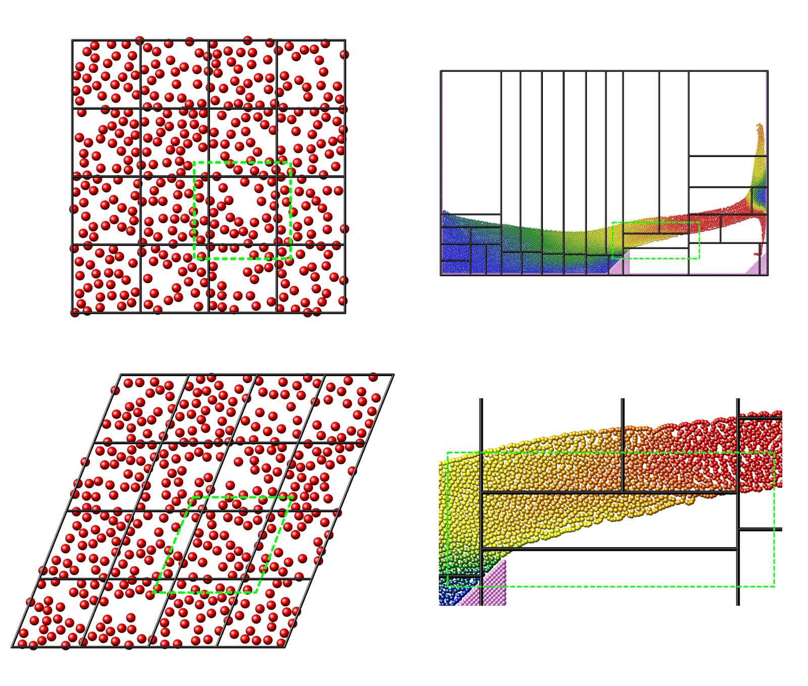
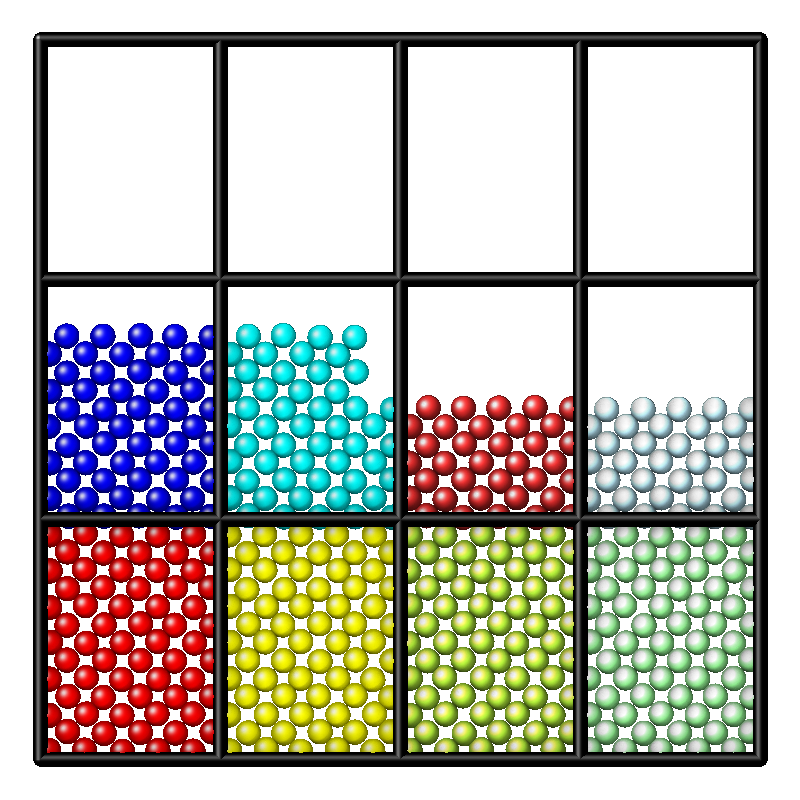
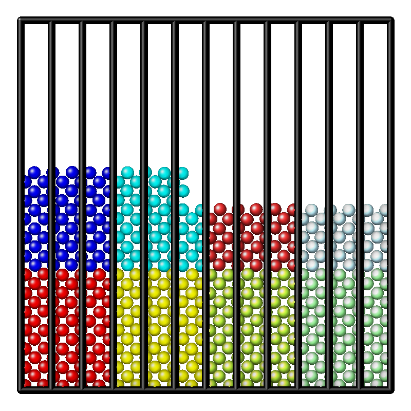
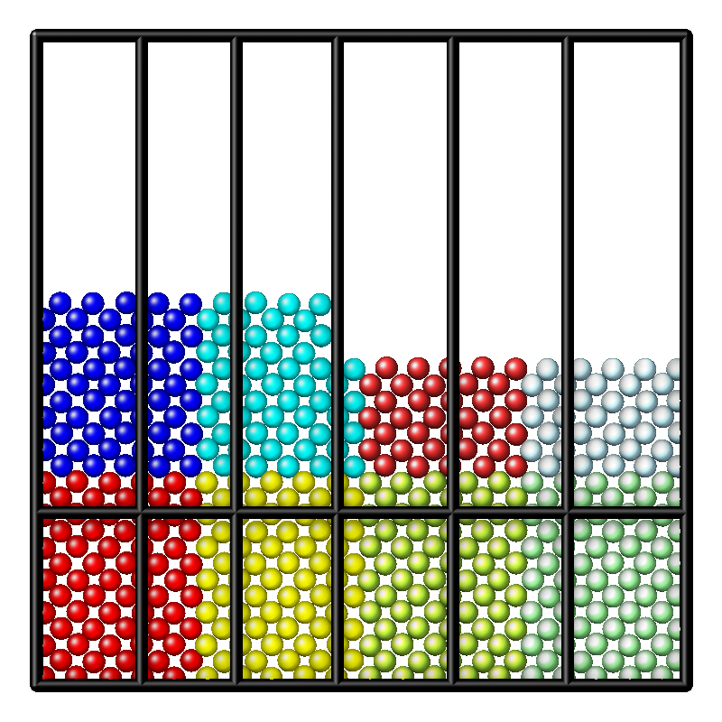

Partitioning
^^^^^^^^^^^^

The underlying spatial decomposition strategy used by LAMMPS for
distributed-memory parallelism is set with the :doc:`comm_style command
<comm_style>` and can be either "brick" (a regular grid) or "tiled".

.. _domain-decomposition:

   domain decomposition

   This figure shows the different kinds of domain decomposition used
   for MPI parallelization: "brick" on the left with an orthogonal
   (left) and a triclinic (middle) simulation domain, and a "tiled"
   decomposition (right).  The black lines show the division into
   sub-domains and the contained atoms are "owned" by the corresponding
   MPI process. The green dashed lines indicate how sub-domains are
   extended with "ghost" atoms up to the communication cutoff distance.

The LAMMPS simulation box is a 3d or 2d volume, which can be orthogonal
or triclinic in shape, as illustrated in the :ref:`domain-decomposition`
figure for the 2d case.  Orthogonal means the box edges are aligned with
the *x*, *y*, *z* Cartesian axes, and the box faces are thus all
rectangular.  Triclinic allows for a more general parallelepiped shape
in which edges are aligned with three arbitrary vectors and the box
faces are parallelograms.  In each dimension box faces can be periodic,
or non-periodic with fixed or shrink-wrapped boundaries.  In the fixed
case, atoms which move outside the face are deleted; shrink-wrapped
means the position of the box face adjusts continuously to enclose all
the atoms.

For distributed-memory MPI parallelism, the simulation box is spatially
decomposed (partitioned) into non-overlapping sub-domains which fill the
box. The default partitioning, "brick", is most suitable when atom
density is roughly uniform, as shown in the left-side images of the
:ref:`domain-decomposition` figure.  The sub-domains comprise a regular
grid and all sub-domains are identical in size and shape.  Both the
orthogonal and triclinic boxes can deform continuously during a
simulation, e.g. to compress a solid or shear a liquid, in which case
the processor sub-domains likewise deform.

For models with non-uniform density, the number of particles per
processor can be load-imbalanced with the default partitioning.  This
reduces parallel efficiency, as the overall simulation rate is limited
by the slowest processor, i.e. the one with the largest computational
load.  For such models, LAMMPS supports multiple strategies to reduce
the load imbalance:

- The processor grid decomposition is by default based on the simulation
  cell volume and tries to optimize the volume to surface ratio for the sub-domains.
  This can be changed with the :doc:`processors command <processors>`.
- The parallel planes defining the size of the sub-domains can be shifted
  with the :doc:`balance command <balance>`. Which can be done in addition
  to choosing a more optimal processor grid.
- The recursive bisectioning algorithm in combination with the "tiled"
  communication style can produce a partitioning with equal numbers of
  particles in each sub-domain.

.. |decomp4| image:: img/decomp-rcb.png
   :width: 24%

|decomp1|  |decomp2|  |decomp3|  |decomp4|

The pictures above demonstrate different decompositions for a 2d system
with 12 MPI ranks.  The atom colors indicate the load imbalance of each
sub-domain with green being optimal and red the least optimal.

Due to the vacuum in the system, the default decomposition is unbalanced
with several MPI ranks without atoms (left). By forcing a 1x12x1
processor grid, every MPI rank does computations now, but number of
atoms per sub-domain is still uneven and the thin slice shape increases
the amount of communication between sub-domains (center left). With a
2x6x1 processor grid and shifting the sub-domain divisions, the load
imbalance is further reduced and the amount of communication required
between sub-domains is less (center right).  And using the recursive
bisectioning leads to further improved decomposition (right).
