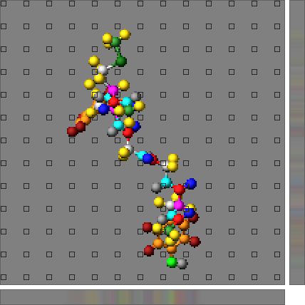
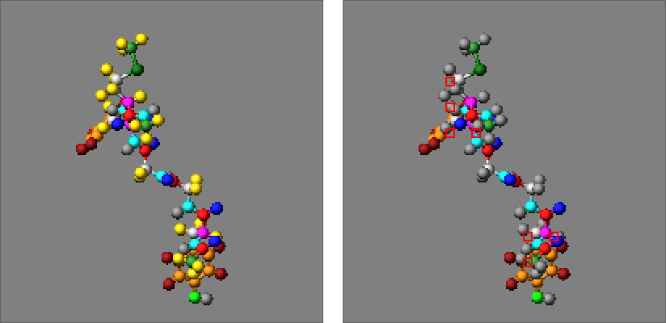

Adding tests for unit testing
-----------------------------

.. contents::
   :local:

------------

This section discusses adding or expanding tests for the unit test
infrastructure included into the LAMMPS source code distribution.
Unlike example inputs, unit tests focus on testing the "local" behavior
of individual features, tend to run fast, and should be set up to cover
as much of the added code as possible.  When contributing code to the
distribution, the LAMMPS developers will appreciate if additions to the
integrated unit test facility are included.

Given the complex nature of MD simulations where many operations can
only be performed when suitable "real" simulation environment has been
set up, not all tests will be unit tests in the strict definition of
the term.  They are rather executed on a more abstract level by issuing
LAMMPS script commands and then inspecting the changes to the internal
data.  For some classes of tests, generic test programs have been
written that can be applied to parts of LAMMPS that use the same
interface (via polymorphism) and those are driven by input files, so
tests can be added by simply adding more of those input files.  Those
tests should be seen more as a hybrid between unit and regression tests.

When adding tests it is recommended to also :ref:`enable support for
code coverage reporting <testing>`, and study the coverage reports
so that it is possible to monitor which parts of the code of a given
file are executed during the tests and which tests would need to be
added to increase the coverage.

The tests are grouped into categories and corresponding folders.
The following sections describe how the tests are implemented and
executed in those categories with increasing complexity of tests
and implementation.

Tests for utility functions
^^^^^^^^^^^^^^^^^^^^^^^^^^^

These tests are driven by programs in the ``unittest/utils`` folder
and most closely resemble conventional unit tests.  There is one test
program for each namespace or group of classes or file.  The naming
convention for the sources and executables is that they start with
with ``test_``.  The following sources and groups of tests are currently
available:

.. list-table::
   :header-rows: 1
   :widths: 32 18 50
   :align: left

   * - File name:
     - Test name:
     - Description:
   * - ``test_argutils.cpp``
     - ArgInfo
     - Tests for ``ArgInfo`` class used by LAMMPS
   * - ``test_fmtlib.cpp``
     - FmtLib
     - Tests for ``{fmt}`` or ``std::format`` functions used by LAMMPS
   * - ``test_math_eigen_impl.cpp``
     - MathEigen
     - Tests for ``MathEigen::`` classes and functions
   * - ``test_mempool.cpp``
     - MemPool
     - Tests for :cpp:class:`MyPage <LAMMPS_NS::MyPage>` and :cpp:class:`MyPoolChunk <LAMMPS_NS::MyPoolChunk>`
   * - ``test_tokenizer.cpp``
     - Tokenizer
     - Tests for :cpp:class:`Tokenizer <LAMMPS_NS::Tokenizer>` and :cpp:class:`ValueTokenizer <LAMMPS_NS::ValueTokenizer>`
   * - ``test_utils.cpp``
     - Utils
     - Tests for ``utils::`` :doc:`functions <Developer_utils>`
   * - ``test_fft3d.cpp``
     - FFT3D
     - Tests for standard FFT3d wrapper (KISS, FFTW3, MKL, NVPL)
   * - ``test_fft3d_kokkos.cpp``
     - FFT3DKokkos
     - Tests for KOKKOS FFT3d wrapper (CPU and GPU back ends)

To add tests either an existing source file needs to be modified or a
new source file needs to be added to the distribution and enabled for
testing.  To add a new file suitable CMake script code needs to be added
to the ``CMakeLists.txt`` file in the ``unittest/utils`` folder.  Example:

.. code-block:: cmake

   add_executable(test_tokenizer test_tokenizer.cpp)
   target_link_libraries(test_tokenizer PRIVATE lammps GTest::GMockMain GTest::GMock GTest::GTest)
   add_test(Tokenizer test_tokenizer)

This adds instructions to build the ``test_tokenizer`` executable from
``test_tokenizer.cpp`` and links it with the GoogleTest libraries and the
LAMMPS library as well as it uses the ``main()`` function from the
GoogleMock library of GoogleTest.  The third line registers the executable
as a test program to be run from ``ctest`` under the name ``Tokenizer``.

The test executable itself will execute multiple individual tests
through the GoogleTest framework.  In this case each test consists of
creating a tokenizer class instance with a given string and explicit or
default separator choice, and then executing member functions of the
class and comparing their results with expected values.  A few examples:

.. code-block:: c++

   TEST(Tokenizer, empty_string)
   {
       Tokenizer t("", " ");
       ASSERT_EQ(t.count(), 0);
   }

   TEST(Tokenizer, two_words)
   {
       Tokenizer t("test word", " ");
       ASSERT_EQ(t.count(), 2);
   }

   TEST(Tokenizer, default_separators)
   {
       Tokenizer t(" \r\n test \t word \f");
       ASSERT_THAT(t.next(), Eq("test"));
       ASSERT_THAT(t.next(), Eq("word"));
       ASSERT_EQ(t.count(), 2);
   }

Each of these TEST functions will become an individual
test run by the test program.  When using the ``ctest``
command as a front end to run the tests, their output
will be suppressed and only a summary printed, but adding
the '-V' option will then produce output from the tests
above like the following:

.. code-block:: console

   [...]
   1: [ RUN      ] Tokenizer.empty_string
   1: [       OK ] Tokenizer.empty_string (0 ms)
   1: [ RUN      ] Tokenizer.two_words
   1: [       OK ] Tokenizer.two_words (0 ms)
   1: [ RUN      ] Tokenizer.default_separators
   1: [       OK ] Tokenizer.default_separators (0 ms)
   [...]

The MathEigen test collection has been adapted from a standalone test
and does not use the GoogleTest framework and thus not representative.
The other test sources, however, can serve as guiding examples for
additional tests.

FFT Testing Infrastructure
""""""""""""""""""""""""""

.. versionadded:: 10Dec2025

The FFT tests (``test_fft3d.cpp`` and ``test_fft3d_kokkos.cpp``)
validate the LAMMPS FFT wrapper implementations for both standard (CPU)
and KOKKOS (CPU/GPU) back ends.  These tests require the KSPACE package
and use specialized helper utilities to ensure FFT correctness across
different library back ends (KISS FFT, FFTW3, MKL, NVPL, cuFFT, hipFFT,
etc.).

**Building and Running FFT Tests:**

The FFT tests are automatically enabled when ``ENABLE_TESTING=ON`` and
``PKG_KSPACE=ON`` are set during CMake configuration.  For KOKKOS FFT tests,
``PKG_KOKKOS=ON`` is also required.

Run only FFT tests using the ``ctest`` command of the CMake software:

.. code-block:: bash

   ctest -R FFT3D          # Run all tests with FFT3D in their name
   ctest -R FFT3D -V       # Same as above but with verbose output
   ctest -L fft            # Run all tests labeled with 'fft'

Tests automatically skip configurations requiring libraries or back ends
not available in the current build (e.g., FFTW3, MPI, CUDA).

**FFT Test Helper Header:**

The testing infrastructure uses ``fft_test_helpers.h`` which contains
test data generators, validators, and utilities.

For runtime configuration detection, tests use the existing ``Info``
class API (``Info::has_package()``, ``Info::has_accelerator_feature()``,
etc.).

The ``fft_test_helpers.h`` header provides three main namespaces:

1. **FFTTestHelpers** - utility functions:
   ``FFTBuffer`` (RAII wrapper), ``idx3d()`` (index conversion),
   ``scaled_tolerance()`` (grid-size-dependent precision)

2. **FFTTestData** - test data generators:
   ``DeltaFunctionGenerator``, ``ConstantGenerator``, ``SineWaveGenerator``,
   ``GaussianGenerator``, ``RandomComplexGenerator``, ``MixedModesGenerator``

3. **FFTValidation** - validators:
   ``RoundTripValidator``, ``KnownAnswerValidator``, ``ParsevalValidator``,
   ``HermitianSymmetryValidator``, ``LinearityValidator``

**Example Test:**

.. code-block:: c++

   TEST_F(FFT3DTest, RoundTrip_32x32x32) {
       FFTBuffer original(32, 32, 32), fft_result(32, 32, 32), recovered(32, 32, 32);

       GaussianGenerator generator(2.0);
       generator.generate(original.data(), 32, 32, 32);

       fft->compute(original.data(), fft_result.data(), FFT3d::FORWARD);
       fft->compute(fft_result.data(), recovered.data(), FFT3d::BACKWARD);

       RoundTripValidator validator(original.data(), recovered.data(), 32, 32, 32,
                                     scaled_tolerance(ROUNDTRIP_TOLERANCE, 32, 32, 32));
       EXPECT_TRUE(validator.validate());
   }

**Precision and Tolerances:**

FFT tests use precision-aware tolerances that automatically adjust based
on floating-point precision (``-D FFT_SINGLE=ON`` vs ``-D
FFT_SINGLE=off``), grid size, and accelerator back end.  Base tolerances
(``ROUNDTRIP_TOLERANCE``, ``PARSEVAL_TOLERANCE``, etc.)  are defined in
``fft_test_helpers.h``.  Use ``scaled_tolerance()`` to adjust for grid
size effects.

Tests for individual LAMMPS commands
^^^^^^^^^^^^^^^^^^^^^^^^^^^^^^^^^^^^

The tests ``unittest/commands`` are a bit more complex as they require
to first create a :cpp:class:`LAMMPS <LAMMPS_NS::LAMMPS>` class instance
and then use the :doc:`C++ API <Cplusplus>` to pass individual commands
to that LAMMPS instance.  For that reason these tests use a GoogleTest
"test fixture", i.e. a class derived from ``testing::Test`` that will
create (and delete) the required LAMMPS class instance for each set of
tests in a ``TEST_F()`` function.  Please see the individual source files
for different examples of setting up suitable test fixtures.  Here is an
example for implementing a test using a fixture by first checking the
default value and then issuing LAMMPS commands and checking whether they
have the desired effect:

.. code-block:: c++

   TEST_F(SimpleCommandsTest, ResetTimestep)
   {
       ASSERT_EQ(lmp->update->ntimestep, 0);

       BEGIN_HIDE_OUTPUT();
       command("reset_timestep 10");
       END_HIDE_OUTPUT();
       ASSERT_EQ(lmp->update->ntimestep, 10);

       BEGIN_HIDE_OUTPUT();
       command("reset_timestep 0");
       END_HIDE_OUTPUT();
       ASSERT_EQ(lmp->update->ntimestep, 0);

       TEST_FAILURE(".*ERROR: Timestep must be >= 0.*", command("reset_timestep -10"););
       TEST_FAILURE(".*ERROR: Illegal reset_timestep .*", command("reset_timestep"););
       TEST_FAILURE(".*ERROR: Illegal reset_timestep .*", command("reset_timestep 10 10"););
       TEST_FAILURE(".*ERROR: Expected integer .*", command("reset_timestep xxx"););
   }

Please note the use of the ``BEGIN_HIDE_OUTPUT`` and ``END_HIDE_OUTPUT``
functions that will capture output from running LAMMPS.  This is normally
discarded but by setting the verbose flag (via setting the ``TEST_ARGS``
environment variable, ``TEST_ARGS=-v``) it can be printed and used to
understand why tests fail unexpectedly.

The specifics of so-called "death tests", i.e. conditions where LAMMPS
should fail and throw an exception, are implemented in the
``TEST_FAILURE()`` macro.  These tests operate by capturing the screen
output when executing the failing command and then comparing that with a
provided regular expression string pattern.  Example:

.. code-block:: c++

   TEST_F(SimpleCommandsTest, UnknownCommand)
   {
       TEST_FAILURE(".*ERROR: Unknown command.*", lmp->input->one("XXX one two"););
   }

The following test programs are currently available:

.. list-table::
   :header-rows: 1
   :widths: auto
   :align: left

   * - File name:
     - Test name:
     - Description:
   * - ``test_simple_commands.cpp``
     - SimpleCommands
     - Tests for LAMMPS commands that do not require a box
   * - ``test_lattice_region.cpp``
     - LatticeRegion
     - Tests to validate the :doc:`lattice <lattice>` and :doc:`region <region>` commands
   * - ``test_groups.cpp``
     - GroupTest
     - Tests to validate the :doc:`group <group>` command
   * - ``test_variables.cpp``
     - VariableTest
     - Tests to validate the :doc:`variable <variable>` command
   * - ``test_kim_commands.cpp``
     - KimCommands
     - Tests for several commands from the :ref:`KIM package <PKG-KIM>`
   * - ``test_reset_atoms.cpp``
     - ResetAtoms
     - Tests to validate the :doc:`reset_atoms <reset_atoms>` sub-commands

Tests for the C-style library interface
^^^^^^^^^^^^^^^^^^^^^^^^^^^^^^^^^^^^^^^

Tests for validating the LAMMPS C-style library interface are in the
``unittest/c-library`` folder.  They text either utility functions or
LAMMPS commands, but use the functions implemented in
``src/library.cpp`` as much as possible.  There may be some overlap with
other tests as far as the LAMMPS functionality is concerned, but the
focus is on testing the C-style library API.  The tests are distributed
over multiple test programs which try to match the grouping of the
functions in the source code and :ref:`in the manual <lammps_c_api>`.

This group of tests also includes tests invoking LAMMPS in parallel
through the library interface, provided that LAMMPS was compiled with
MPI support.  These include tests where LAMMPS is run in multi-partition
mode or only on a subset of the MPI world communicator.  The CMake
script code for adding this kind of test looks like this:

.. code-block:: cmake

   if (BUILD_MPI)
     add_executable(test_library_mpi test_library_mpi.cpp)
     target_link_libraries(test_library_mpi PRIVATE lammps GTest::GTest GTest::GMock)
     target_compile_definitions(test_library_mpi PRIVATE ${TEST_CONFIG_DEFS})
     add_mpi_test(NAME LibraryMPI NUM_PROCS 4 COMMAND $<TARGET_FILE:test_library_mpi>)
   endif()

Note the custom function ``add_mpi_test()`` which adapts how ``ctest``
will execute the test so it is launched in parallel (with 4 MPI ranks).

Tests for the Python module and package
^^^^^^^^^^^^^^^^^^^^^^^^^^^^^^^^^^^^^^^

The ``unittest/python`` folder contains primarily tests for classes and
functions in the LAMMPS python module but also for commands in the
PYTHON package.  These tests are only enabled, if the necessary
prerequisites are detected or enabled during configuration and
compilation of LAMMPS (shared library build enabled, Python interpreter
found, Python development files found).

The Python tests are implemented using the ``unittest`` standard Python
module and split into multiple files with similar categories as the
tests for the C-style library interface.

Tests for the Fortran interface
^^^^^^^^^^^^^^^^^^^^^^^^^^^^^^^

Tests for using the Fortran module are in the ``unittest/fortran``
folder.  Since they are also using the GoogleTest library, they require
test wrappers written in C++ that will call fortran functions with a C
function interface through ISO_C_BINDINGS which will in turn call the
functions in the LAMMPS Fortran module.

Tests for the C++-style library interface
^^^^^^^^^^^^^^^^^^^^^^^^^^^^^^^^^^^^^^^^^

The tests in the ``unittest/cplusplus`` folder are somewhat similar to
the tests for the C-style library interface, but do not need to test the
convenience and utility functions that are only available through the
C-style library interface.  Instead they focus on the more generic
features that are used in LAMMPS internally.  This part of the unit
tests is currently still mostly in the planning stage.

Tests for reading and writing file formats
^^^^^^^^^^^^^^^^^^^^^^^^^^^^^^^^^^^^^^^^^^

The ``unittest/formats`` folder contains test programs for reading and
writing files like data files, restart files, potential files or dump
files.  This covers simple things like the file i/o convenience
functions in the ``utils::`` namespace to complex tests of atom styles
where creating and deleting of atoms with different properties is tested
in different ways and through script commands or reading and writing of
data or restart files.

Tests for styles computing or modifying forces
^^^^^^^^^^^^^^^^^^^^^^^^^^^^^^^^^^^^^^^^^^^^^^

These are tests common configurations for pair styles, bond styles,
angle styles, kspace styles and certain fix styles.  Those are tests
driven by some test executables build from sources in the
``unittest/force-styles`` folder and use LAMMPS input template and data
files as well as input files in YAML format from the
``unittest/force-styles/tests`` folder.  The YAML file names have to
follow some naming conventions so they get associated with the test
programs and categorized and listed with canonical names in the list
of tests as displayed by ``ctest -N``.  If you add a new YAML file,
you need to re-run CMake to update the corresponding list of tests.
The same folder also contains two more test programs built on the same
YAML infrastructure: one for minimizer styles and one for the output
data of computes and fixes; they are described in their own subsections
at the end of this section.

A minimal YAML file for a (molecular) pair style test will looks
something like the following (see ``mol-pair-zero.yaml``):

.. code-block:: yaml

   ---
   lammps_version: 24 Aug 2020
   date_generated: Tue Sep 15 09:44:21 202
   epsilon: 1e-14
   prerequisites: ! |
     atom full
     pair zero
   pre_commands: ! ""
   post_commands: ! ""
   input_file: in.fourmol
   pair_style: zero 8.0
   pair_coeff: ! |
     * *
   extract: ! ""
   natoms: 29
   init_vdwl: 0
   init_coul: 0

   [...]

The following table describes the available keys and their purpose.  The
``Tester`` column lists which test program(s) use each key.  ``all`` means
every force-style tester (``test_pair_style``, ``test_bond_style``,
``test_angle_style``, ``test_dihedral_style``, ``test_improper_style``,
``test_fix_timestep``, and the ``test_min_style`` and ``test_output_style``
programs described in the subsections below), and ``bonded interaction
tests`` means the ``test_bond_style``, ``test_angle_style``,
``test_dihedral_style``, and ``test_improper_style`` testers.  The
``Required`` column indicates whether
a valid YAML file (for the listed tester) must contain the key (``yes``) or
whether it may be omitted (``no``).  The reference generator always writes
the required keys; the optional keys are either metadata added by hand
(``skip_tests``, ``tags``) or reference data that is only emitted when the
tested style actually provides it (e.g. ``global_scalar`` only for a fix
with scalar output):

.. list-table::
   :header-rows: 1

   * - Key:
     - Tester:
     - Required:
     - Description:
   * - lammps_version
     - all
     - yes
     - LAMMPS version used to last update the reference data
   * - date_generated
     - all
     - yes
     - date when the file was last updated
   * - epsilon
     - all
     - yes
     - base value for the relative precision required for tests to pass
   * - skip_tests
     - all
     - no
     - request to skip the indicated test fixtures (see table below)
   * - tags
     - all
     - no
     - used to classify tests and to adjust behavior of test fixtures (see table below)
   * - prerequisites
     - all
     - yes
     - list of style kind / style name pairs required to run the test
   * - pre_commands
     - all
     - yes
     - LAMMPS commands to be executed before the input template file is read
   * - post_commands
     - all
     - yes
     - LAMMPS commands to be executed right before the actual tests
   * - input_file
     - all
     - yes
     - LAMMPS input file template
   * - input_coeffs
     - test_fix_timestep, test_min_style, test_output_style
     - yes
     - file with the force-field and group setup commands applied after the input
       template (optional for ``test_output_style`` when the input template is
       self-contained, e.g. the metal system template)
   * - natoms
     - all
     - yes
     - number of atoms in the input file template
   * - timestep
     - test_fix_timestep, test_min_style, test_output_style
     - no
     - timestep size for the test run, overriding the tester's default
   * - pair_style
     - test_pair_style
     - yes
     - arguments to the pair_style command to be tested
   * - pair_coeff
     - test_pair_style
     - yes
     - list of pair_coeff arguments to set parameters for the input template
   * - init_vdwl
     - test_pair_style
     - yes
     - non-Coulomb pair energy after "run 0"
   * - init_coul
     - test_pair_style
     - yes
     - Coulomb pair energy after "run 0"
   * - run_vdwl
     - test_pair_style
     - yes
     - non-Coulomb pair energy after "run 4"
   * - run_coul
     - test_pair_style
     - yes
     - Coulomb pair energy after "run 4"
   * - bond_style
     - test_bond_style
     - yes
     - arguments to the bond_style command to be tested
   * - bond_coeff
     - test_bond_style
     - yes
     - list of bond_coeff arguments to set parameters
   * - angle_style
     - test_angle_style
     - yes
     - arguments to the angle_style command to be tested
   * - angle_coeff
     - test_angle_style
     - yes
     - list of angle_coeff arguments to set parameters
   * - dihedral_style
     - test_dihedral_style
     - yes
     - arguments to the dihedral_style command to be tested
   * - dihedral_coeff
     - test_dihedral_style
     - yes
     - list of dihedral_coeff arguments to set parameters
   * - improper_style
     - test_improper_style
     - yes
     - arguments to the improper_style command to be tested
   * - improper_coeff
     - test_improper_style
     - yes
     - list of improper_coeff arguments to set parameters
   * - init_energy
     - bonded interaction tests, test_min_style
     - yes
     - bonded interaction energy after "run 0"; for ``test_min_style`` the
       potential energy before the minimization
   * - run_energy
     - bonded interaction tests, test_min_style
     - yes
     - bonded interaction energy after "run 4"; for ``test_min_style`` the
       potential energy after the minimization
   * - equilibrium
     - test_bond_style
     - yes
     - equilibrium distance for each type
   * - equilibrium
     - test_angle_style
     - yes
     - equilibrium angle for each type
   * - extract
     - pair and bonded interaction tests
     - yes
     - list of keywords supported by the style's ``extract()`` method and their dimension
   * - init_stress
     - pair and bonded interaction tests
     - yes
     - stress tensor after "run 0"
   * - init_forces
     - pair and bonded interaction tests
     - yes
     - forces on atoms after "run 0"
   * - run_stress
     - pair and bonded interaction tests, test_fix_timestep
     - no
     - stress tensor after the run (omitted by ``test_fix_timestep`` when the fix has no virial contribution)
   * - run_forces
     - pair and bonded interaction tests
     - yes
     - forces on atoms after "run 4"
   * - run_pos
     - test_fix_timestep
     - yes
     - per-atom positions after the run
   * - run_vel
     - test_fix_timestep
     - yes
     - per-atom velocities after the run
   * - run_torque
     - test_fix_timestep
     - no
     - per-atom torques after the run (only when the atom style stores torque)
   * - global_scalar
     - test_fix_timestep, test_min_style, test_output_style
     - no
     - the global scalar output of the tested fix, if any; for
       ``test_min_style`` the total force norm after the minimization
   * - global_vector
     - test_fix_timestep, test_min_style, test_output_style
     - no
     - the global vector output of the tested fix, if any; for
       ``test_min_style`` the box dimensions and tilt factors after the
       minimization
   * - global_array
     - test_output_style
     - no
     - the global array output of the tested compute or fix, if any
   * - peratom_data
     - test_output_style
     - no
     - the per-atom vector or array output of the tested compute or fix, if any
   * - local_data
     - test_output_style
     - no
     - the local vector or array output of the tested compute or fix, if any

These reference files can be validated against the JSON schema file
``tools/json/force-style-test-schema.json`` with the ``check-jsonschema``
tool, which catches typos in keys, missing required keys, and values of the
wrong type.  For example, to validate all of them at once:

.. code-block:: sh

   check-jsonschema --schemafile tools/json/force-style-test-schema.json \
       unittest/force-styles/tests/*.yaml

See the :ref:`JSON support files <json>` section of the :doc:`Tools`
documentation for how to install ``check-jsonschema``.

The test program will read all this data from the YAML file and then
create a LAMMPS instance, apply the settings/commands from the YAML file
as needed and then issue a "run 0" command, write out a restart file, a
data file and a coeff file.  The actual test will then compare computed
energies, stresses, and forces with the reference data, issue a "run 4"
command and compare to the second set of reference data.  This will be
run with both the newton_pair setting enabled and disabled and is
expected to generate the same results (allowing for some numerical
noise).  Then it will restart from the previously generated restart and
compare with the reference and also start from the data file.  A final
check will use multi-cutoff r-RESPA (if supported by the pair style) at
a 1:1 split and compare to the Verlet results.  These sets of tests are
run with multiple test fixtures for accelerated styles: OPT, OPENMP and
INTEL (the latter two with 4 OpenMP threads enabled), and three mutually
exclusive KOKKOS fixtures selected by the active back end: the
``kokkos_omp`` fixture requires the KOKKOS package compiled with the
OpenMP back end and uses 4 OpenMP threads, while the ``kokkos_serial``
fixture only runs when the Serial back end is the sole back end of the
KOKKOS package (with any other back end enabled the host execution space
would not be Serial, so this configuration must be tested with a separate
build).  Both of these host fixtures skip when a GPU back end (CUDA, HIP,
SYCL) is enabled, since the KOKKOS package then must run on the GPU.  The
third fixture, ``kokkos_gpu``, is the complement: it runs only when a GPU
back end is enabled (using ``-k on g 1``) and is skipped on host-only
builds.  Because enabling the KOKKOS package with a GPU back end aborts
when no usable device is present, this fixture first probes for a
compatible GPU at runtime with ``Info::has_kokkos_gpu_device()`` (the
KOKKOS package analog of ``Info::has_gpu_device()`` for the GPU package)
and skips transparently when none is available, so the test suite can be
run unchanged on machines without a GPU.  For these tests the relative error
(epsilon) is lowered by a common factor due to the additional numerical
noise, but the tests are still comparing to the same reference data.

The KOKKOS fixtures also support the KOKKOS package compiled for reduced
precision with ``-D KOKKOS_PREC=mixed`` (compute in single precision,
accumulate in double precision) or ``-D KOKKOS_PREC=single``: the test
tolerance is then relaxed by a large additional factor, similar to what
is done for the mixed and single precision variants of the GPU package.
Individual tests can be skipped for a given fixture by listing the
fixture name in the ``skip_tests:`` field of the YAML file (e.g.
``skip_tests: kokkos_omp kokkos_serial kokkos_gpu``).  A skip entry may
also be qualified by the KOKKOS precision, e.g. ``kokkos_serial_single``
or ``kokkos_omp_mixed``, which skips the test only for that combination
of fixture and precision.  This is used for tests whose reference
quantities cannot be meaningfully compared in reduced precision, for
example global force totals that are the cancellation sum of large
per-atom contributions in a charge-neutral system.

.. note::

   CTest reports a test as *passed* when all of its GoogleTest cases were
   skipped, since skipping is not a failure.  A test that skips because a
   prerequisite style is missing in the current build is expected, but a
   test that *always* skips (for example because the prerequisites list
   names a style that does not exist) never compares anything and still
   shows up as passing.  When adding or changing tests, run them with
   ``ctest -V`` at least once and confirm the output contains
   ``[ OK ]`` lines and not only ``[ SKIPPED ]`` lines; a grep for
   ``SKIPPED`` over the verbose output of the whole suite finds such cases
   in bulk.  Malformed YAML files (e.g. a missing ``input_coeffs`` entry
   where the tester requires one) are reported as failures, not skips.

The test fixture names accepted by ``skip_tests`` (each fixture runs the
corresponding variant or check and self-skips when its package or back end
is not available) are listed below.  Not every fixture exists for every
style kind (e.g. ``gpu``, ``intel``, and ``opt`` are used by the pair-style
tester, while ``numdiff`` is used by the bonded-style testers).

.. list-table::
   :header-rows: 1
   :widths: 22 78

   * - Fixture
     - Description
   * - plain
     - the unmodified (base class) style, without a suffix
   * - omp
     - the ``/omp`` variant from the OPENMP package (run with 4 threads)
   * - intel
     - the ``/intel`` variant from the INTEL package
   * - opt
     - the ``/opt`` variant from the OPT package
   * - gpu
     - the ``/gpu`` variant from the GPU package
   * - kokkos_serial
     - the ``/kk`` variant from the KOKKOS package with a Serial-only build
   * - kokkos_omp
     - the ``/kk`` variant from the KOKKOS package with the OpenMP back end
       (run with 4 threads)
   * - kokkos_gpu
     - the ``/kk`` variant from the KOKKOS package with a GPU back end
   * - single
     - consistency check of the style's ``single()`` method against ``compute()``
   * - extract
     - check of the style's ``extract()`` keywords (base style)
   * - extract_omp
     - check of the style's ``extract()`` keywords (``/omp`` variant)
   * - numdiff
     - check of the forces against a numerical derivative of the energy

The ``kokkos_omp``, ``kokkos_serial``, and ``kokkos_gpu`` entries may be
qualified with ``_single`` or ``_mixed`` (e.g. ``kokkos_gpu_single``), as
noted above.

The ``tags:`` field of a YAML file lists keywords that classify a test or
request special handling from the test fixtures.  The fixtures query them
with ``TestConfig::has_tag()`` so that style-specific behavior is selected by
a descriptive tag instead of by hard-coded style names.  The recognized tags
are:

.. list-table::
   :header-rows: 1

   * - Tag
     - Purpose
   * - gpu_no_mixed
     - The GPU package variant of the style does not support mixed
       precision GPU mode; the ``gpu`` fixture skips the test when the
       GPU package was compiled for mixed precision.
   * - gpu_no_single
     - The GPU package variant of the style does not support single
       precision GPU mode (e.g. ``born/coul/long/cs/gpu``); the ``gpu``
       fixture skips the test when the GPU package was compiled for
       single precision.
   * - single_thread
     - The style cannot run correctly with more than one thread in the
       test (e.g.  ``dpd`` uses multiple per-thread pRNGs; ``snap`` and
       ``pace`` due to their implementation), so the threaded fixtures
       (``omp``, ``intel``, ``kokkos_omp``) run it with a single thread.
   * - no_respa
     - The ``fix_timestep`` tester does not exercise this style under
       :doc:`run_style respa <run_style>`: rigid fixes need additional
       work to test correctly with r-RESPA, ``fix nve/limit`` and ``fix
       recenter`` do not support it, stochastic integrators and barostats
       (``brownian``, ``gjf``, ``press/langevin``) draw their random
       numbers differently under r-RESPA, and velocity-dependent forcing
       fixes (``viscous``, ``accelerate/cos``) and the isokinetic ``nvk``
       integrator follow a different trajectory under r-RESPA - in all of
       these cases the verlet and r-RESPA runs cannot match.
   * - no_reset_dt
     - The ``fix_timestep`` tester does not exercise a timestep change
       for this style.  The fix rejects a timestep reset (its
       ``Fix::reset_dt()`` raises an error, e.g. :doc:`fix move
       <fix_move>`), which would otherwise abort the test.
   * - no_restart
     - The ``fix_timestep`` tester skips the restarted-run comparisons
       for this style.  Part of the internal state of the fix (typically
       the pRNG state of a stochastic fix like :doc:`fix langevin
       <fix_langevin>`) is not stored in restart files, so a restarted
       run cannot reproduce the reference trajectory.
   * - no_t_target
     - The ``fix_timestep`` tester does not compare the extracted
       ``t_target`` property against the input variable for this style,
       because the fix computes its target temperature internally (e.g.
       the :doc:`fix nphug <fix_nphug>` hugoniostat).
   * - ellipsoid
     - The test includes ellipsoids and thus requires :doc:`fix
       nve/asphere <fix_nve_asphere>`.
   * - spica_pair
     - The test setup uses ``pair_style lj/spica`` instead of the
       default ``pair_style zero`` (required by the ``spica`` angle
       style).
   * - slow
     - The test runs significantly longer than others and ``ctest -LE
       slow`` would skip it.
   * - noWindows
     - Indicates that this test must be skipped on Windows; use
       ``ctest -LE noWindows``
   * - unstable
     - The test exhibits numerically unstable behavior on some
       platforms, e.g. ARM64; Until a proper correction is found, tests
       can be skipped with ``ctest -LE unstable``.
   * - generated
     - Automatically added whenever reference data is generated or
       regenerated; it marks data that has not been reviewed and
       validated yet.  *Remove* after confirming the correctness of the
       updated YAML file.

Additional tests will check whether all listed extract keywords are
supported and have the correct dimensionality and the final set of tests
will set up a few pairs of atoms explicitly and in such a fashion that
the forces on the atoms computed from ``Pair::compute()`` will match
individually with the results from ``Pair::single()``, if the pair style
does support that functionality.

With this scheme a large fraction of the code of any tested pair style
will be executed and consistent results are required for different
settings and between different accelerated pair style variants and the
base class, as well as for computing individual pairs through the
``Pair::single()`` method where supported.

The ``test_pair_style`` tester is used with 4 categories of test inputs:

pair styles compatible with molecular systems using bonded interactions and exclusions.
  For pair styles requiring a KSpace style the KSpace computations are
  disabled.  The YAML files match the pattern ``mol-pair-*.yaml`` and
  the tests are correspondingly labeled with ``MolPairStyle:*``

pair styles not compatible with the previous input template
  The YAML files match the pattern ``atomic-pair-*.yaml`` and the tests are
  correspondingly labeled with ``AtomicPairStyle:*``

manybody pair styles
  The YAML files match the pattern ``manybody-pair-*.yaml`` and the tests are
  correspondingly labeled with ``ManybodyPairStyle:*``

kspace styles
  The YAML files match the pattern ``kspace-*.yaml`` and the tests are
  correspondingly labeled with ``KSpaceStyle:*``.  In these cases a
  compatible pair style is defined, but the computation of the pair
  style contributions is disabled.

The ``test_bond_style``, ``test_angle_style``, ``test_dihedral_style``,
and ``test_improper_style`` tester programs are set up in a similar
fashion and share support functions with the pair style tester.  The
final group of tests in this section is for fix styles that
add/manipulate forces and velocities, e.g. for time integration,
thermostats and more.

Adding a new test is easiest done by copying and modifying an existing YAML
file for a style that is similar to one to be tested.  The file name should
follow the naming conventions described above and after copying the file,
the first step is to replace the style names where needed.  The coefficient
values do not have to be meaningful, just in a reasonable range for the
given system.  It does not matter if some forces are large, for as long as
they do not diverge.

The template input files define a large number of index variables at the top
that can be modified inside the YAML file to control the behavior.  For example,
if a pair style requires a "newton on" setting, the following can be used in
as the "pre_commands" section:

.. code-block:: yaml

   pre_commands: ! |
     variable newton_pair delete
     variable newton_pair index on

And for a pair style requiring a kspace solver the following would be used as
the "post_commands" section:

.. code-block:: yaml

   post_commands: ! |
     pair_modify table 0
     kspace_style pppm/tip4p 1.0e-6
     kspace_modify gewald 0.3
     kspace_modify compute no

Note that this disables computing the kspace contribution, but still will run
the setup.  The "gewald" parameter should be set explicitly to speed up the run.
For styles with long-range electrostatics, typically two tests are added one using
the (slower) analytic approximation of the erfc() function and the other using
the tabulated coulomb, to test both code paths.  The reference results in the YAML
files then should be compared manually, if they agree well enough within the limits
of those two approximations.

The ``test_pair_style`` and equivalent programs have special command-line options
to update the YAML files.  Running a command like

.. code-block:: bash

   test_pair_style mol-pair-lennard_mdf.yaml -g new.yaml

will read the settings from the ``mol-pair-lennard_mdf.yaml`` file and then compute
the reference data and write a new file with to ``new.yaml``.  If this step fails,
there are likely some (LAMMPS or YAML) syntax issues in the YAML file that need to
be resolved and then one can compare the two files to see if the output is as expected.

It is also possible to do an update in place with:

.. code-block:: bash

   test_pair_style mol-pair-lennard_mdf.yaml -u

And one can finally run the full set of tests with:

.. code-block:: bash

   test_pair_style mol-pair-lennard_mdf.yaml

This will just print a summary of the groups of tests.  When using the "-v" flag
the test will also keep any LAMMPS output and when using the "-s" flag, there
will be some statistics reported on the relative errors for the individual checks
which can help to figure out what would be a good choice of the epsilon parameter.
It should be as small as possible to catch any unintended side effects from changes
elsewhere, but large enough to accommodate the numerical noise due to the implementation
of the potentials and differences in compilers.

.. note::

   These kinds of tests can be very sensitive to compiler optimization and
   thus the expectation is that they pass with compiler optimization turned
   off.  When compiler optimization is enabled, there may be some failures, but
   one has to carefully check whether those are acceptable due to the enhanced
   numerical noise from reordering floating-point math operations or due to
   the compiler mis-compiling the code.  That is not always obvious.

Tests for minimizer styles
""""""""""""""""""""""""""

.. versionadded:: TBD

The ``test_min_style`` program tests the :doc:`min_style <min_style>`
minimizers and :doc:`min_modify <min_modify>` settings.  The YAML files
match the pattern ``min-*.yaml`` and the tests are correspondingly
labeled with ``MinStyle:*``.  Each YAML file sets up the molecular test
system in the same way as the fix tests (``input_file`` plus
``input_coeffs``) and selects the minimizer in the ``post_commands``
block (``min_style``, ``min_modify``, and optional fixes like :doc:`fix
box/relax <fix_box_relax>`).  The driver then runs a minimization with a
fixed iteration budget (``minimize 0.0 0.0 100 10000``); using a fixed
number of iterations instead of a convergence tolerance keeps the
reference data deterministic.  The ``timestep`` key matters for the
damped-dynamics minimizers (quickmin and fire).

The line search and step acceptance logic of the minimizers branches on
floating-point comparisons, so differences in the last bits of the
computed forces -- for example from a different compiler or math library
-- can send the descent along a different but equally valid path.  Only
observables that are stable against such path changes are compared to
the reference data: the potential energy before (``init_energy``) and
after (``run_energy``) the minimization and the box dimensions and tilt
factors (``global_vector``), all with the relative precision
``epsilon``.  In addition, the minimization must have lowered the
potential energy and must have reduced the total force norm to no more
than 10 times the recorded reference value (``global_scalar``).  The
exact force norm and the per-atom positions after a fixed number of
iterations are *not* portable across platforms and are therefore not
part of the reference data.  Only the plain minimizer styles are
exercised; accelerated variants are not covered.  Reference files are
created and updated with the same ``-g`` and ``-u`` command-line options
as for the other testers.

Tests for compute and fix output data
"""""""""""""""""""""""""""""""""""""

.. versionadded:: TBD

The ``test_output_style`` program tests the *output data* of computes
and fixes: global scalars, global vectors, global arrays (including
arrays with a variable number of rows, for example per-chunk data),
per-atom vectors and arrays, and local vectors and arrays.  The YAML
files match the patterns ``compute-*.yaml`` and ``fix-output-*.yaml``
and the tests are labeled with ``OutputStyle:*`` using the full file
base name (so ``compute-msd.yaml`` becomes ``OutputStyle:compute-msd``).

The ``post_commands`` block must define the compute or fix to be tested
with the ID ``test``, plus any helper commands it needs (groups, chunk
computes, or feeder computes and fixes).  The driver adds a plain
:doc:`fix nve <fix_nve>` time integrator -- unless the test itself
defines a time-integrating fix, like :doc:`fix rigid/small <fix_rigid>`
-- so that history-dependent quantities (mean-squared displacement,
velocity auto-correlation, time averages) report real data, and runs 10
MD steps with ``thermo 5``, which matches the sampling windows of the
``ave/*`` reporting fixes.  It then queries the output flags of the
tested style (``scalar_flag``, ``vector_flag``, ``array_flag``,
``peratom_flag``, ``local_flag``) and compares every kind of output the
style provides against the recorded reference blocks (``global_scalar``,
``global_vector``, ``global_array``, ``peratom_data``, ``local_data``).
Output data is a deterministic function of the (short) trajectory, so
the reference data is typically compared with a tight ``epsilon`` (1e-8).

Computes that require per-atom energy or virial data to be tallied
during the force computation -- for example :doc:`compute pe/atom
<compute_pe_atom>`, :doc:`compute stress/atom <compute_stress_atom>`,
and :doc:`compute heat/flux <compute_heat_flux>` -- are not yet
supported by this driver.  Reference files are created and updated with
the same ``-g`` and ``-u`` command-line options as for the other
testers.

Tests for granular (DEM) models
^^^^^^^^^^^^^^^^^^^^^^^^^^^^^^^^

.. versionadded:: TBD

The ``unittest/granular`` folder contains a YAML-driven test suite for
discrete element method (DEM) / granular contact models, built in the
same spirit as the force-style tests above but specialized for
time-resolved trajectories of small, analytically tractable granular
systems.  These tests are only enabled if the :ref:`GRANULAR
package<PKG-GRANULAR>` is enabled.

There are 15 test programs, ``test_dem_01`` through ``test_dem_15``,
covering particle-impact-level benchmarks: two-sphere and sphere-wall
collisions, oblique and spinning-sphere impacts, rolling and slipping
contact, cohesive pull-off, settling under fluid drag, exact ballistic
integration and static multi-contact compression, region walls,
superellipsoid contact, twisting friction, and granular heat conduction.  These follow
the software-agnostic DEM benchmark of :ref:`Mohajeri et al.
<dem_Mohajeri2024>` (rolling resistance and cohesion), the
particle-impact benchmark of :ref:`Chung and Ooi <dem_Chung2011>`
(normal, oblique, and spinning-sphere collisions), and the MFiX-DEM
verification cases of :ref:`Garg et al. <dem_Garg2012>` (terminal
velocity under drag).  The test programs are:

.. list-table::
   :header-rows: 1

   * - Program
     - Scenario
     - Analytic model
   * - ``test_dem_01``
     - two-sphere head-on normal collision
     - ``collision_restitution``
   * - ``test_dem_02``
     - two-sphere elastic Hertzian normal impact (peak force)
     - ``hertz_normal_impact``
   * - ``test_dem_03``
     - sphere-wall elastic Hertzian normal impact (peak force)
     - ``hertz_normal_impact``
   * - ``test_dem_04``
     - oblique impact on a wall (gross-sliding friction)
     - ``oblique_impact``
   * - ``test_dem_05``
     - sphere sliding then rolling without slipping
     - ``slip_cessation``
   * - ``test_dem_06``
     - spinning sphere impact (rebound with friction)
     - ``spin_impact``
   * - ``test_dem_07``
     - rolling-resistance decay
     - ``rolling_decay``
   * - ``test_dem_08``
     - cohesive DMT pull-off force
     - ``pulloff_dmt``
   * - ``test_dem_09``
     - terminal velocity under fluid drag
     - ``terminal_velocity_linear``, ``terminal_velocity_schiller_naumann``
   * - ``test_dem_10``
     - exact integration and static contact (free fall, stacked compression)
     - ``freefall``, ``stack_energy``
   * - ``test_dem_11``
     - contact with region walls (restitution)
     - ``wall_restitution``
   * - ``test_dem_12``
     - superellipsoid collision
     - ``momentum_conservation``
   * - ``test_dem_13``
     - spinning sphere damped by twisting friction
     - ``twist_decay``, ``twist_decay_marshall``
   * - ``test_dem_14``
     - granular heat conduction in static contact
     - ``heat_equilibration``
   * - ``test_dem_15``
     - oblique impact of two spheres (gross sliding)
     - ``oblique_impact_pair``

Every test program shares the same driver logic, implemented in
``unittest/granular/test_dem_common.cpp`` and compiled into the
``granular_tests`` support library; each ``test_dem_0N.cpp`` only
contains the two GoogleTest fixtures (``newton_on`` and ``newton_off``).
As with the force-style tests, the reference systems are defined by YAML
files in the ``unittest/granular/tests`` folder and registered as CTest
cases by their file name (``dem0N-*.yaml`` becomes test ``DEM0N:*``);
adding or removing a YAML file requires re-running CMake.  A given
driver may cover several variants of one scenario -- across contact
models (``hooke``, ``hooke/history``, ``hertz``, ``hertz/material``,
``mindlin``, ``mindlin/rescale``), dimensionality, or unit systems --
since it simply runs every ``dem0N-*.yaml`` file that matches its
number.  Variants that exercise the classic granular styles
(``gran/hooke``, ``gran/hooke/history``, ``gran/hertz/history`` and the
matching classic :doc:`fix wall/gran <fix_wall_gran>` models) carry a
``legacy-`` token in the file name and a ``legacy`` entry in the
``tags`` line, which also becomes a CTest label (so ``ctest -L legacy``
runs exactly those tests).

Unlike the force-style tests, the entire system is built *from the YAML
file* rather than from a fixed input template.  A YAML file provides an
optional ``variables`` block (emitted as :doc:`index variables <variable>`
so they can be substituted as ``${name}`` anywhere in the command strings),
``pre_commands`` that create the geometry, ``pair_style`` / ``pair_coeff``
that select the contact model, and ``post_commands`` that add the
integrator and any walls.  The trajectory is then advanced in a sequence of
``run_segments`` and, after each segment, the per-atom positions,
velocities, torques, and angular velocities are compared against the
recorded reference.  A minimal example (``dem03-hertz-wall-3d-si.yaml``)
looks like:

.. code-block:: yaml

   ---
   lammps_version: 4 Jul 2026
   tags: granular
   date_generated: Tue Jul 21 21:40:51 2026
   epsilon: 1e-10
   prerequisites: |
     atom sphere
     pair granular
   pre_commands: |
     units si
     dimension 3
     boundary f f f
     atom_style sphere
     region box block -0.05 0.05 -0.05 0.05 -0.05 0.1 units box
     create_box 1 box
     create_atoms 1 single 0.0 0.0 ${z0} units box
     set group all diameter ${diam} density ${dens}
     velocity all set 0.0 0.0 -${vin}
     comm_modify vel yes
     neighbor 0.001 bin
     neigh_modify delay 0
     timestep ${dt}
   post_commands: |
     fix integr all nve/sphere
     fix zwall all wall/gran granular hertz ${kn} ${en} tangential linear_nohistory 0.0 0.0 damping coeff_restitution zplane 0.0 NULL
   natoms: 1
   variables: |
     diam 0.005
     dens 7000.0
     kn 7.11111e+10
     en 1.0
     vin 3.9
     vrela 3.9
     mred_factor 1.0
     radius 0.0025
     dt 1.0e-8
     z0 0.002550
   pair_style: granular
   pair_coeff: |
     * * hertz ${kn} ${en} tangential linear_nohistory 0.0 0.0 damping coeff_restitution
   run_segments: |-
     1300 838 900
   analytic_enable: yes
   analytic_model: hertz_normal_impact
   analytic_tol: 0.01
   analytic_segment: 1
   # run_pos / run_vel / run_torque / run_omega blocks follow

The following table describes the available keys:

.. list-table::
   :header-rows: 1

   * - Key:
     - Description:
   * - epsilon
     - relative precision required for the recorded (regression) reference data
   * - prerequisites
     - list of style kind / style name pairs required to run the test
   * - variables
     - name/value pairs exposed as ``${name}`` index variables for substitution
   * - pre_commands
     - commands that build the geometry (units, box, atoms, ``set``, timestep)
   * - pair_style / pair_coeff
     - the particle-particle (or particle-wall) contact model
   * - post_commands
     - fixes added after the geometry (integrator, walls)
   * - run_segments
     - whitespace-separated list of run lengths; state is captured after each
   * - run_pos, run_vel
     - reference positions and velocities, as ``segment tag x y z`` rows
   * - run_torque, run_omega
     - reference torque / angular velocity (when applicable)
   * - analytic_enable
     - ``yes`` to also assert a closed-form (analytic) model
   * - analytic_model
     - which analytic model to evaluate (see below)
   * - analytic_tol
     - relative tolerance for the analytic assertion (looser than ``epsilon``)
   * - analytic_segment
     - run segment at which the analytic model is checked (``-1`` means the last)

The per-atom reference blocks use a ``segment tag x y z`` row format, so a
single block holds the data for all run segments and the row order does not
matter.  Because granular/atomic systems do not build an atom map by
default, the reference generator iterates over local atoms by tag rather
than calling ``Atom::map()``.

Each test runs as a pure regression check (the recorded data is reproduced
to within ``epsilon``) under both the ``newton on`` and ``newton off``
fixtures, which are expected to give identical results.  In addition, every
test opts in to an *analytic* check that compares a derived quantity against
a closed-form solution implemented in
``unittest/granular/test_analytic_models.cpp``.  The analytic tolerance is
deliberately loose, because the soft-sphere DEM result only approaches the
idealized (hard-sphere or instantaneous-contact) solution.  The models
currently implemented are:

.. list-table::
   :header-rows: 1

   * - Model:
     - Checks:
   * - collision_restitution
     - two-sphere momentum conservation and restitution :math:`e = -(v_1'-v_2')/(v_1-v_2)`
   * - hertz\_normal\_impact
     - Hertzian peak energy balance :math:`\tfrac{1}{2}\mu_{red} V_{rela}^2 = \tfrac{2}{5} P_{max}\alpha_{max}`
   * - oblique_impact
     - gross-sliding rebound :math:`v_x' = v_x - \mu(1+e)v_z`, :math:`\omega_y = \tfrac{5}{2}\mu(1+e)v_z/r`
   * - oblique\_impact\_pair
     - symmetric two-sphere gross-sliding impact: per sphere :math:`v_n' = -e v_n`, :math:`v_t' = v_t - \mu(1+e)v_n`, :math:`\omega' = -\tfrac{5}{2}\mu(1+e)v_n/r`
   * - slip_cessation
     - rolling-without-slipping limit :math:`u = 5 u_0/7`, :math:`\omega = u/r`
   * - spin\_impact
     - gross-sliding rebound of a spinning sphere: :math:`v_x' = \mu(1+e)v_n`, :math:`\omega_y' = \omega_0 - \tfrac{5}{2}\mu(1+e)v_n/r`
   * - rolling_decay
     - linear spin-down under rolling resistance: :math:`\omega = \omega_0 - \tfrac{5 \mu_r g}{2 r} t`
   * - pulloff_dmt
     - DMT pull-off force at contact :math:`|F| = 4 \pi \gamma R_{\mathrm{eff}}`
   * - energy_dissipation
     - total kinetic energy of a frictional impact must not increase (guards against the historic grazing-impact energy-injection bug of the classic tangential model)
   * - spin\_no\_friction
     - counter-spinning spheres with zero contact slip keep their spin and gain no tangential velocity
   * - terminal\_velocity\_linear
     - Stokes drag terminal velocity :math:`v_{term} = m g/\gamma`
   * - terminal\_velocity\_schiller\_naumann
     - Schiller-Naumann terminal velocity from :math:`m g = \tfrac{1}{2} C_d \rho_g \pi r^2 v^2`
   * - freefall
     - ballistic motion before contact: :math:`z = z_0 - g t^2/2`, :math:`v_z = -g t`
   * - stack_energy
     - conservation of total mechanical energy for an elastic two-particle stack
   * - hertz_peak
     - per-quantity Hertzian peak values :math:`\alpha_{max} = (5 \mu_{red} V_{rela}^2/(4 k))^{2/5}` and :math:`P_{max} = k \alpha_{max}^{3/2}`
   * - slip_transient
     - sliding-phase laws :math:`u = u_0 - \mu g t`, :math:`\omega_y = \tfrac{5}{2} \mu g t/r` (pins down the slip-cessation time)
   * - incline_rolling
     - rolling without slipping down an incline: :math:`v = \tfrac{5}{7} g (\sin\theta - \mu_r \cos\theta) t`; at rest for :math:`\mu_r \ge \tan\theta`
   * - wall_restitution
     - rebound :math:`v' = -e\,v` off walls without another closed form (e.g. region walls)
   * - momentum_conservation
     - total linear and angular momentum conservation for particle types carrying angular momentum (superellipsoids)
   * - pulloff_jkr
     - JKR tensile force at zero overlap :math:`|F| = \tfrac{8}{3} \pi \gamma R_{\mathrm{eff}} = \tfrac{8}{9} F_{pulloff}`
   * - twist_decay
     - linear spin-down under Coulomb-capped sds twisting friction: :math:`\omega_z = \omega_0 - \tfrac{5 \mu_t g}{2 r^2} t`
   * - twist\_decay\_marshall
     - like twist_decay for the marshall model cap :math:`\tfrac{2}{3}\mu_t a N` with measured contact radius :math:`a`
   * - heat_equilibration
     - exponential temperature equilibration of two spheres in static contact; conductance :math:`h \pi a^2` (area) or :math:`2 k a` (radius)

Adding a new reference (YAML) file
""""""""""""""""""""""""""""""""""

Copy an existing ``dem0N-*.yaml`` for a similar scenario, adjust the
``variables``, ``pre_commands``, ``pair_style``/``pair_coeff`` and
``post_commands`` for the new model, and give it a new name matching the
``dem0N-*.yaml`` pattern of the test program it belongs to.  Leave out
the reference data blocks initially, then (re)generate them in place
with:

.. code-block:: bash

   TEST_ARGS=-u ctest -R DEM0N:myvariant

or by running the driver directly (``test_dem_0N dem0N-myvariant.yaml
-u``).  Do **not** write the generated file to a sibling
``dem0N-*.yaml`` name (for example with the ``-g newfile.yaml`` option
pointing into the ``tests`` folder), because the ``CONFIGURE_DEPENDS``
glob would then register it as an extra, stale test.  After adding the
file, re-run CMake so the new test is registered, then verify it with
``ctest -V -R DEM0N:myvariant`` (the ``-s`` option of the driver reports
per-quantity error statistics, which helps when choosing ``epsilon`` and
the analytic tolerance).

Adding a new test program
"""""""""""""""""""""""""

Create ``test_dem_0N.cpp`` as a thin copy of an existing one (only the
GoogleTest suite name changes), add an
``add_executable``/``register_dem_tests`` pair to
``unittest/granular/CMakeLists.txt``, and add the corresponding
``dem0N-*.yaml`` reference files.  If the new scenario needs a
closed-form check, add a named model to ``test_analytic_models.cpp``
that reads its parameters from the ``variables`` block (and reads
masses, radii, etc. from the live LAMMPS instance to avoid depending on
derived quantities) and assert it with ``EXPECT_LE`` on the relative
error.

References
""""""""""

.. _dem_Garg2012:

**(Garg et al., 2012)** R. Garg, J. Galvin, T. Li, and S. Pannala,
Open-source MFIX-DEM software for gas-solids flows: Part I -- Verification
studies, Powder Technology, 220, 122-137 (2012),
https://doi.org/10.1016/j.powtec.2011.09.019

.. _dem_Mohajeri2024:

**(Mohajeri et al., 2024)** M. J. Mohajeri, C. Coetzee, and D. L. Schott,
A software-agnostic benchmark for DEM simulation of cohesive and
non-cohesive materials, Powder Technology, 447, 120136 (2024),
https://doi.org/10.1016/j.powtec.2024.120136

.. _dem_Chung2011:

**(Chung and Ooi, 2011)** Y. C. Chung and J. Y. Ooi, Benchmark tests for
verifying discrete element modelling codes at particle impact level,
Granular Matter, 13, 643-656 (2011),
https://doi.org/10.1007/s10035-011-0277-0

Tests for dump image and GRAPHICS package rendering
^^^^^^^^^^^^^^^^^^^^^^^^^^^^^^^^^^^^^^^^^^^^^^^^^^^

.. versionadded:: TBD

The ``unittest/graphics`` folder contains a YAML-driven test suite for
the image rendering of the :doc:`dump image <dump_image>` command and
its :doc:`dump_modify <dump_modify>` options: atom, bond, and body
rendering, color maps, transparency, lighting, view and camera settings,
and the drawing of simulation boxes, axes, and regions.  These tests are
only enabled if the :ref:`GRAPHICS package <PKG-GRAPHICS>` is enabled.

The ``test_dump_image`` driver renders a scene described by a YAML file
from the ``unittest/graphics/tests`` folder and compares sampled pixel
data of the rendered image against reference data stored directly in the
same YAML file, so no library of reference images is needed.  The YAML
files are registered as CTest cases by their file name (``name.yaml``
becomes test ``GRAPHICS:name``); adding or removing a YAML file requires
re-running CMake.  As in the granular tests, the entire scene is built
from the YAML file: the ``setup_commands`` block contains the scene
setup including the ``dump image`` and ``dump_modify`` commands under
test, and the ``run_commands`` block triggers the render (usually just
``run 0``; scenes with time-dependent features run multiple steps and
the frame with the highest timestep number is compared).

Two complementary sets of reference data are recorded for every test:

- the mean red, green, and blue values of every pixel row and of every
  pixel column of the image (``row_means`` and ``col_means``).  These
  projections cover every pixel of the image, so any localized or
  diffuse rendering change shows up in some row or column mean.  They
  are compared with the absolute tolerance ``epsilon_projection``
  (default 0.5 on the 0 to 255 color scale).
- the mean red, green, and blue values of small pixel blocks (default
  3x3 pixels) on a uniform grid (default stride 16 pixels), stored as
  ``sample_blocks`` and compared with the tolerance ``epsilon_blocks``
  (default 2.0).  Their main purpose is to localize a detected failure
  to a position in the image.

   The rendered image of the ``GRAPHICS:dump-image-acolor-type`` test
   (enlarged 2x) with the sampled 3x3 pixel blocks outlined in gray.
   The color strips on the right and below show the per-row and
   per-column mean RGB reference data: where the peptide crosses a row
   or column, its mean color shifts away from the background value.

   How a rendering change is detected: the reference scene (left) and
   the same scene with one atom type recolored (right).  The sample
   blocks whose mean color changed by more than ``epsilon_blocks`` are
   outlined in red and localize the change; the row and column mean
   projections (previous figure) detect it as well, in this example in
   104 of the 200 rows and 69 of the 200 columns, including changed
   atoms that fall between the sampled blocks.

The rendering code produces bit-identical images in serial across the
compilers and optimization levels that were tested; the tolerances above
leave headroom for differences between math libraries.  The rendered
image legitimately depends on the number of MPI ranks, however: pixels
where multiple objects tie in depth composite differently, and the
screen-space ambient occlusion (``ssao``) shading partitions its random
number stream by rank.  Every test therefore carries an ``nprocs`` key
with the rank count its reference data was created with: tests with
``nprocs: 1`` run serially, tests with larger values are registered with
the MPI launcher by CMake (and are skipped when LAMMPS was compiled
without MPI) and exercise the parallel image compositing code.  A
minimal test file looks like this:

.. code-block:: yaml

   ---
   lammps_version: 4 Jul 2026
   tags: graphics
   date_generated: Thu Jul  9 14:30:45 2026
   epsilon_projection: 0.5
   epsilon_blocks: 2
   nprocs: 1
   prerequisites: |
     atom full
     pair lj/charmm/coul/charmm
   setup_commands: |
     units real
     atom_style full
     [...]
     read_data ${input_dir}/data.peptide
     group peptide type <= 12
     dump viz peptide image 1 ${imagefile} type type size 200 200 &
          zoom 2.15 view 80 30 center s 0.25 0.5 0.5 box no 0.0 &
          shiny 0.2 bond atom 0.3
     dump_modify viz backcolor gray
   run_commands: |
     run 0
   image_size: 200 200
   sampling: 3 16
   row_means: ...      # reference data written by the generator
   col_means: ...
   sample_blocks: ...

The image file name must be given as ``${imagefile}``: the driver
defines this variable with a name containing the ``*`` placeholder
required by ``dump image`` and, for the comparison, picks the written
frame with the highest timestep number.  The variable ``${input_dir}``
points to the ``tests`` folder, for scenes that read a data or molecule
file.  When a comparison fails, the test keeps the rendered image next
to the test executable as ``<name>.failed.ppm`` for visual inspection.

To add a new test, copy an existing YAML file for a similar scene,
adjust the commands, delete the reference data blocks (``row_means``,
``col_means``, ``sample_blocks``), and (re)generate them with the same
``-u`` (update in place) and ``-g`` (write new file) options as for the
force-style testers, run from the build folder:

.. code-block:: bash

   test_dump_image path/to/new-test.yaml -u              # serial reference
   mpirun -np 4 test_dump_image path/to/test.yaml -u     # 4-rank reference

Keep the images small (about 200x200 pixels): each test then runs in
well under a second and the reference data stays compact.  Most
importantly, verify that the option under test actually changes the
rendered image, because ``dump image`` options can be silently ignored
in some combinations.  For example, ``dump_modify acolor`` has no effect
when the dump colors atoms by element, ``dump_modify btrans`` has no
effect when bonds are colored by atom (the two bond halves then follow
the transparency of their atoms), and the ``autobond`` keyword draws
nothing on a molecular system with default :doc:`special_bonds
<special_bonds>` settings because bonded pairs are excluded from the
neighbor list it searches.  Render the scene with and without the option
under test and compare the two images before generating the reference
data.  More authoring notes of this kind are collected in
``unittest/graphics/README.md``.

Tests for programs in the tools folder
^^^^^^^^^^^^^^^^^^^^^^^^^^^^^^^^^^^^^^

The ``unittest/tools`` folder contains tests for programs in the
``tools`` folder.  This currently only contains tests for the LAMMPS
shell, which are implemented as a python scripts using the ``unittest``
Python module and launching the tool commands through the ``subprocess``
Python module.

Troubleshooting failed unit tests
^^^^^^^^^^^^^^^^^^^^^^^^^^^^^^^^^

There are by default no unit tests for newly added features (e.g. pair,
fix, or compute styles) unless your pull request also includes tests for
these added features.  If you are modifying some existing LAMMPS
features, you may see failures for existing tests, if your modifications
have some unexpected side effects or your changes render the existing
test invalid.  If you are adding an accelerated version of an existing
style, then only tests for INTEL, KOKKOS (with the OpenMP or Serial host
back ends, depending on how the KOKKOS package was configured), OPENMP,
and OPT will be run automatically.  Tests for the GPU package are time
consuming and thus are only run *after* a merge, or when a special
label, ``gpu_unit_tests`` is added to the pull request.  After the test
has started, it is often best to remove the label since every PR
activity will re-trigger the test (that is a limitation of triggering a
test with a label).  Support for unit tests using KOKKOS with GPU
acceleration is currently not supported.

When you see a failed build on GitHub, click on ``Details`` to be taken
to the corresponding LAMMPS Jenkins CI web page.  Click on the "Exit"
symbol near the ``Logout`` button on the top right of that page to go to
the "classic view".  In the classic view, there is a list of the
individual runs that make up this test run (they are shown but cannot be
inspected in the default view).  You can click on any of those.
Clicking on ``Test Result`` will display the list of failed tests. Click
on the "Status" column to sort the tests based on their Failed or Passed
status.  Then click on the failed test to expand its output.

For example, the following output snippet shows the failed unit test

.. code-block:: console

   [ RUN      ] PairStyle.gpu
   /home/builder/workspace/dev/pull_requests/ubuntu_gpu/unit_tests/cmake_gpu_opencl_mixed_smallbig_clang_static/unittest/force-styles/test_main.cpp:63: Failure
   Expected: (err) <= (epsilon)
   Actual: 0.00018957912910606503 vs 0.0001
   Google Test trace:
   /home/builder/workspace/dev/pull_requests/ubuntu_gpu/unit_tests/cmake_gpu_opencl_mixed_smallbig_clang_static/unittest/force-styles/test_main.cpp:56: EXPECT_FORCES: init_forces (newton off)
   /home/builder/workspace/dev/pull_requests/ubuntu_gpu/unit_tests/cmake_gpu_opencl_mixed_smallbig_clang_static/unittest/force-styles/test_main.cpp:64: Failure
   Expected: (err) <= (epsilon)
   Actual: 0.00022892713393549854 vs 0.0001

The failed assertions provide line numbers in the test source
(e.g. ``test_main.cpp:56``), from which one can understand what
specific assertion failed.

Note that the force style engine runs one of a small number of systems
in a rather off-equilibrium configuration with a few atoms for a few
steps, writes data and restart files, uses :doc:`the clear command
<clear>` to reset LAMMPS, and then runs from those files with different
settings (e.g. newton on/off) and integrators (e.g. verlet vs. respa).
Beyond potential issues/bugs in the source code, the mismatch between
the expected and actual values could be that force arrays are not
properly cleared between multiple run commands or that class members are
not correctly initialized or written to or read from a data or restart
file.

While the epsilon (relative precision) for a single, `IEEE 754 compliant
<https://en.wikipedia.org/wiki/IEEE_754>`_, double precision floating
point operation is at about 2.2e-16, the achievable precision for the
tests is lower due to most numbers being sums over intermediate results
for which the non-associativity of floating point math leads to larger
errors.  As a rule of thumb, the test epsilon can often be in the range
5.0e-14 to 1.0e-13.  But for "noisy" force kernels, e.g. those a larger
amount of arithmetic operations involving `exp()`, `log()` or `sin()`
functions, and also due to the effect of compiler optimization or differences
between compilers or platforms, epsilon may need to be further relaxed,
sometimes epsilon can be relaxed to 1.0e-12. If interpolation or lookup
tables are used, epsilon may need to be set to 1.0e-10 or even higher.
For tests of accelerated styles, the per-test epsilon is multiplied
by empirical factors that take into account the differences in the order
of floating point operations or that some or most intermediate operations
may be done using approximations or with single precision floating point
math.

To rerun a failed unit test individually, change to the ``build`` directory
and run the test with verbose output. For example,

.. code-block:: bash

    env TEST_ARGS=-v ctest -R ^MolPairStyle:lj_cut_coul_long -V

``ctest`` with the ``-V`` flag also shows the exact command
of the test. One can then use ``gdb --args`` to further debug and
catch exceptions with the test command, for example,

.. code-block:: bash

    gdb --args /path/to/lammps/build/test_pair_style /path/to/lammps/unittest/force-styles/tests/mol-pair-lj_cut_coul_long.yaml

It is recommended to configure the build with ``-D
BUILD_SHARED_LIBS=on`` and use a custom linker to shorten the build time
during recompilation.  Installing `ccache` in your development
environment helps speed up recompilation by caching previous
compilations and detecting when the same compilation is being done
again.  Please see :doc:`Build_development` for further details.
