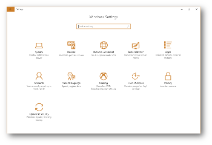
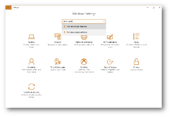
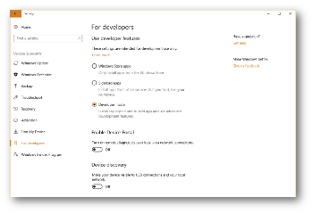
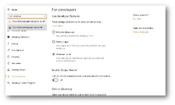
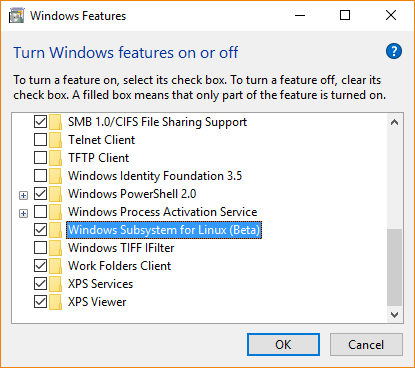
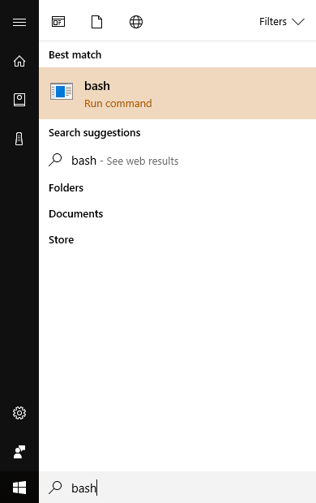
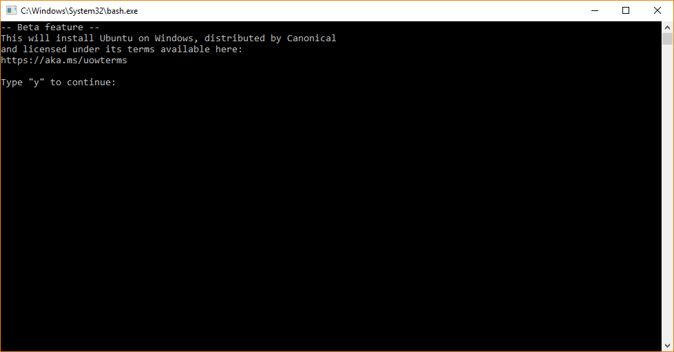
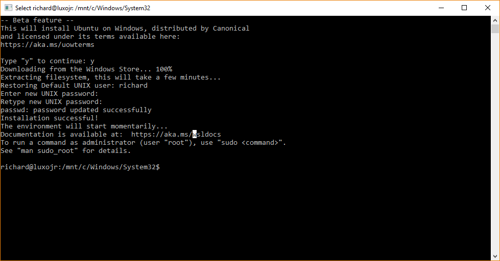
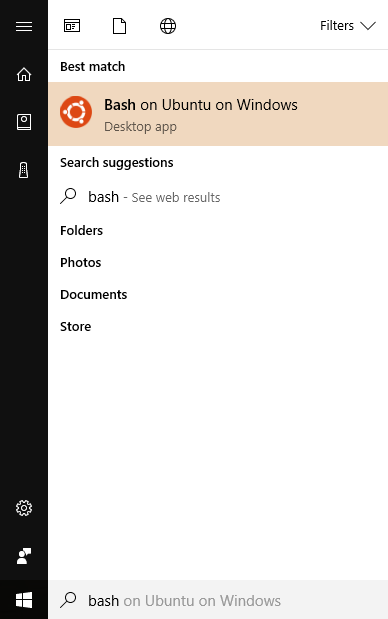
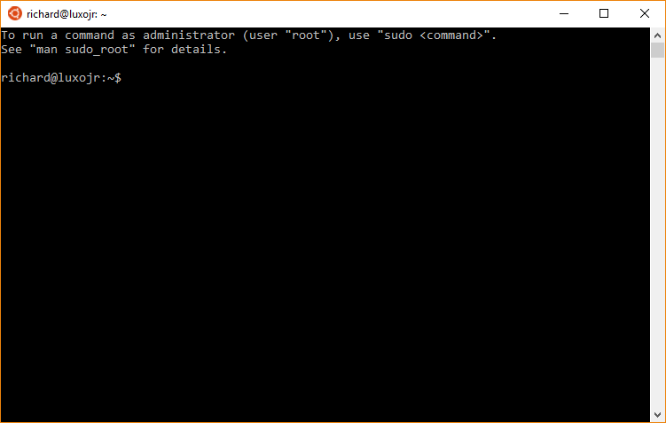

Using LAMMPS with Bash on Windows
=================================

**written by Richard Berger**

----------

Starting with Windows 10 you can install Linux tools directly in Windows. This
allows you to compile LAMMPS following the same procedure as on a real Ubuntu
Linux installation. Software can be easily installed using the package manager
via apt-get and all files are accessible in both the Windows Explorer and your
Linux shell (bash). This avoids switching to a different operating system or
installing a virtual machine. Everything runs on Windows.

Installing Bash on Windows
--------------------------

Prerequisites
^^^^^^^^^^^^^

* Windows 10 (64bit only)
* Latest updates installed

Enable developer mode
^^^^^^^^^^^^^^^^^^^^^

You enable this feature by first opening Windows Settings and enabling
Developer mode. Go to the Windows settings and search for "developer". This
will allow you to install software which comes from outside of the Windows
Store.  You might be prompted to reboot your compute. Please do so.

Install Windows Subsystem for Linux
^^^^^^^^^^^^^^^^^^^^^^^^^^^^^^^^^^^

Next you must ensure that the Window Subsystem for Linux is installed. Again,
search for "enable windows features" in the Settings dialog. This opens a
dialog with a list of features you can install. Add a checkmark to Windows
Subsystem for Linux (Beta) and press OK.

Install Bash for Windows
^^^^^^^^^^^^^^^^^^^^^^^^

After installation completes, type "bash" in the Windows Start menu search.
Select the first found option. This will launch a command-line window which
will prompt you about installing Ubuntu on Windows. Confirm with "y" and press
enter. This will then download Ubuntu for Windows.

During installation, you will be asked for a new password. This will be used
for installing new software and running commands with sudo.

Type exit to close the command-line window.

Go to the Start menu and type "bash" again. This time you will see a "Bash on
Ubuntu on Windows" Icon. Start this program.

Congratulations, you have installed **Bash on Ubuntu on Windows**\ .

----------

Compiling LAMMPS in Bash on Windows
-----------------------------------

The installation of LAMMPS in this environment is identical to working inside
of a real Ubuntu Linux installation. At the time writing, it uses Ubuntu 16.04.

Installing prerequisite packages
^^^^^^^^^^^^^^^^^^^^^^^^^^^^^^^^

First upgrade all existing packages using

.. parsed-literal::

   sudo apt update
   sudo apt upgrade -y

Next install the following packages, which include compilers and libraries
needed for various LAMMPS features:

.. parsed-literal::

   sudo apt install -y build-essential ccache gfortran openmpi-bin libopenmpi-dev libfftw3-dev libjpeg-dev libpng12-dev python-dev python-virtualenv libblas-dev liblapack-dev libhdf5-serial-dev hdf5-tools

Files in Ubuntu on Windows
^^^^^^^^^^^^^^^^^^^^^^^^^^

When you launch "Bash on Ubuntu on Windows" you will start out in your Linux
user home directory /home/[username]\ . You can access your Windows user directory
using the /mnt/c/Users/[username] folder.

Download LAMMPS
^^^^^^^^^^^^^^^

Obtain a copy of the LAMMPS code and go into it using "cd"

Option 1: Downloading LAMMPS tarball using wget
"""""""""""""""""""""""""""""""""""""""""""""""

.. parsed-literal::

   wget http://lammps.sandia.gov/tars/lammps-stable.tar.gz
   tar xvzf lammps-stable.tar.gz
   cd lammps-31Mar17

Option 2: Obtaining LAMMPS code from GitHub
"""""""""""""""""""""""""""""""""""""""""""

.. parsed-literal::

   git clone https://github.com/lammps/lammps.git
   cd lammps

Compiling LAMMPS
^^^^^^^^^^^^^^^^

At this point you can compile LAMMPS like on Ubuntu Linux.

Compiling serial version
""""""""""""""""""""""""

.. parsed-literal::

   cd src/
   make -j 4 serial

This will create an executable called lmp\_serial in the src/ directory

Compiling MPI version
"""""""""""""""""""""

.. parsed-literal::

   cd src/
   make -j 4 mpi

This will create an executable called lmp\_mpi in the src/ directory

----------

Finally, please note the absolute path of your src folder. You can get this using

.. parsed-literal::

   pwd

or

.. parsed-literal::

   echo $PWD

To run any examples you need the location of the executable. For now, let us
save this location in a temporary variable

.. parsed-literal::

   LAMMPS_DIR=$PWD

----------

Running an example script
^^^^^^^^^^^^^^^^^^^^^^^^^

Once compiled you can execute some of the LAMMPS examples. Switch into the
examples/melt folder

.. parsed-literal::

   cd ../examples/melt

The full path of the serial executable is $LAMMPS\_DIR/lmp\_serial, while the mpi
version is $LAMMPS\_DIR/lmp\_mpi. You can run the melt example with either
version as follows:

.. parsed-literal::

   $LAMMPS_DIR/lmp_serial -in in.melt

or

.. parsed-literal::

   mpirun -np 4 $LAMMPS_DIR/lmp_mpi -in in.melt

Note the use of our variable $LAMMPS\_DIR, which expands into the full path of
the LAMMPS src folder we saved earlier.

Adding your executable directory to your PATH
"""""""""""""""""""""""""""""""""""""""""""""

You can avoid having to type the full path of your LAMMPS binary by adding its
parent folder to the PATH environment variable as follows:

.. parsed-literal::

   export PATH=$LAMMPS_DIR:$PATH

Input scripts can then be run like this:

.. parsed-literal::

   lmp_serial -in in.melt

or

.. parsed-literal::

   mpirun -np 4 lmp_mpi -in in.melt

However, this PATH variable will not persist if you close your bash window.
To persist this setting edit the $HOME/.bashrc file using your favorite editor
and add this line

.. parsed-literal::

   export PATH=/full/path/to/your/lammps/src:$PATH

**Example:**

For an executable lmp\_serial with a full path

.. parsed-literal::

   /home/richard/lammps/src/lmp_serial

the PATH variable should be

.. parsed-literal::

   export PATH=/home/richard/lammps/src:$PATH

.. note::

   This should give you a jump start when trying to run LAMMPS on Windows.
   To become effective in this environment I encourage you to look into Linux
   tutorials explaining Bash and Basic Unix commands (e.g., `Linux Journey <https://linuxjourney.com>`_)
