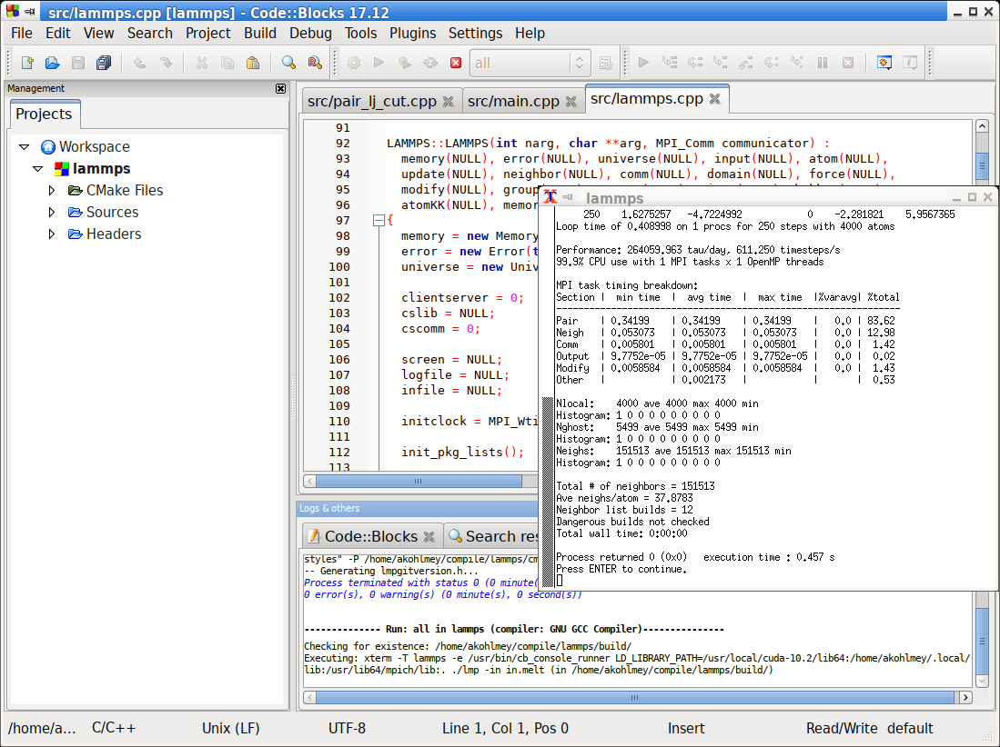

Using CMake with LAMMPS tutorial
================================

The support for building LAMMPS with CMake is a recent addition to
LAMMPS thanks to the efforts of Christoph Junghans (LANL) and Richard
Berger (Temple U).  One of the key strengths of CMake is that it is not
tied to a specific platform or build system and thus generate the files
necessary to build and develop for different build systems and on
different platforms.  Note, that this applies to the build system itself
not the LAMMPS code. In other words, without additional porting effort,
it is not possible - for example - to compile LAMMPS with Visual C++ on
Windows.  The build system output can also include support files
necessary to program LAMMPS as a project in integrated development
environments (IDE) like Eclipse, Visual Studio, QtCreator, Xcode,
CodeBlocks, Kate and others.

A second important feature of CMake is, that it can detect and validate
available libraries, optimal settings, available support tools and so
on, so that by default LAMMPS will take advantage of available tools
without requiring to provide the details about how to enable/integrate
them.

The downside of this approach is, that there is some complexity
associated with running CMake itself and how to customize the building
of LAMMPS.  This tutorial will show how to manage this through some
selected examples.  Please see the chapter about :doc:`building LAMMPS
<Build>` for descriptions of specific flags and options for LAMMPS in
general and for specific packages.

CMake can be used through either the command-line interface (CLI)
program ``cmake`` (or ``cmake3``), a text mode interactive user
interface (TUI) program ``ccmake`` (or ``ccmake3``), or a graphical user
interface (GUI) program ``cmake-gui``.  All of them are portable
software available on all supported platforms and can be used
interchangeably.  The minimum supported CMake version is 3.10 (3.12 or
later is recommended).

All details about features and settings for CMake are in the `CMake
online documentation <https://cmake.org/documentation/>`_. We focus
below on the most important aspects with respect to compiling LAMMPS.

Prerequisites
-------------

This tutorial assumes that you are operating in a command-line environment
using a shell like Bash.

- Linux: any Terminal window will work
- MacOS X: launch the Terminal application.
- Windows 10: install and run the :doc:`Windows subsystem for Linux <Howto_bash>`

We also assume that you have downloaded and unpacked a recent LAMMPS source code package
or used Git to create a clone of the LAMMPS sources on your compilation machine.

You should change into the top level directory of the LAMMPS source tree all
paths mentioned in the tutorial are relative to that.  Immediately after downloading
it should look like this:

.. code-block:: bash

    $ ls
    bench  doc       lib      potentials  README  tools
    cmake  examples  LICENSE  python      src

Build versus source directory
-----------------------------

When using CMake the build procedure is separated into multiple distinct phases:

  #. **Configuration:** detect or define which features and settings
     should be enable and used and how LAMMPS should be compiled
  #. **Compilation:** generate and compile all necessary source files
     and build libraries and executables.
  #. **Installation:** copy selected files from the compilation into
     your file system, so they can be used without having to keep the
     source and build tree around.

The configuration and compilation of LAMMPS has to happen in a dedicated
*build directory* which must be different from the source directory.
Also the source directory (``src``) must remain pristine, so it is not
allowed to "install" packages using the traditional make process and
after an compilation attempt all created source files must be removed.
This can be achieved with ``make no-all purge``.

You can pick **any** folder outside the source tree. We recommend to
create a folder ``build`` in the top-level directory, or multiple
folders in case you want to have separate builds of LAMMPS with
different options (``build-parallel``, ``build-serial``) or with
different compilers (``build-gnu``, ``build-clang``, ``build-intel``)
and so on.  All the auxiliary files created by one build process
(executable, object files, log files, etc) are stored in this directory
or sub-directories within it that CMake creates.

Running CMake
-------------

CLI version
^^^^^^^^^^^

In the (empty) ``build`` directory, we now run the command ``cmake
../cmake``, which will start the configuration phase and you will see
the progress of the configuration printed to the screen followed by a
summary of the enabled features, options and compiler settings. A typical
summary screen will look like this:

.. code-block::

   $ cmake ../cmake/
   -- The CXX compiler identification is GNU 8.2.0
   -- Check for working CXX compiler: /opt/tools/gcc-8.2.0/bin/c++
   -- Check for working CXX compiler: /opt/tools/gcc-8.2.0/bin/c++ - works
   -- Detecting CXX compiler ABI info
   -- Detecting CXX compiler ABI info - done
   -- Detecting CXX compile features
   -- Detecting CXX compile features - done
   -- Found Git: /usr/bin/git (found version "2.25.2") 
   -- Running check for auto-generated files from make-based build system
   -- Found MPI_CXX: /usr/lib64/mpich/lib/libmpicxx.so (found version "3.1") 
   -- Found MPI: TRUE (found version "3.1")  
   -- Looking for C++ include omp.h
   -- Looking for C++ include omp.h - found
   -- Found OpenMP_CXX: -fopenmp (found version "4.5") 
   -- Found OpenMP: TRUE (found version "4.5")  
   -- Found JPEG: /usr/lib64/libjpeg.so (found version "62") 
   -- Found PNG: /usr/lib64/libpng.so (found version "1.6.37") 
   -- Found ZLIB: /usr/lib64/libz.so (found version "1.2.11") 
   -- Found GZIP: /usr/bin/gzip  
   -- Found FFMPEG: /usr/bin/ffmpeg  
   -- Performing Test COMPILER_SUPPORTS-ffast-math
   -- Performing Test COMPILER_SUPPORTS-ffast-math - Success
   -- Performing Test COMPILER_SUPPORTS-march=native
   -- Performing Test COMPILER_SUPPORTS-march=native - Success
   -- Looking for C++ include cmath
   -- Looking for C++ include cmath - found
   -- Generating style_angle.h...
   [...]
   -- Generating lmpinstalledpkgs.h...
   -- The following tools and libraries have been found and configured:
    * Git
    * MPI
    * OpenMP
    * JPEG
    * PNG
    * ZLIB
   
   -- <<< Build configuration >>>
      Build type:       RelWithDebInfo
      Install path:     /home/akohlmey/.local
      Generator:        Unix Makefiles using /usr/bin/gmake
   -- <<< Compilers and Flags: >>>
   -- C++ Compiler:     /opt/tools/gcc-8.2.0/bin/c++
         Type:          GNU
         Version:       8.2.0
         C++ Flags:     -O2 -g -DNDEBUG
         Defines:       LAMMPS_SMALLBIG;LAMMPS_MEMALIGN=64;LAMMPS_JPEG;LAMMPS_PNG;LAMMPS_GZIP;LAMMPS_FFMPEG
         Options:       -ffast-math;-march=native
   -- <<< Linker flags: >>>
   -- Executable name:  lmp
   -- Static library flags:    
   -- <<< MPI flags >>>
   -- MPI includes:     /usr/include/mpich-x86_64
   -- MPI libraries:    /usr/lib64/mpich/lib/libmpicxx.so;/usr/lib64/mpich/lib/libmpi.so;
   -- Configuring done
   -- Generating done
   -- Build files have been written to: /home/akohlmey/compile/lammps/build

The ``cmake`` command has one mandatory argument, and that is a folder
with either the file ``CMakeLists.txt`` or ``CMakeCache.txt``. The
``CMakeCache.txt`` file is created during the CMake configuration run
and contains all active settings, thus after a first run of CMake
all future runs in the build folder can use the folder ``.`` and CMake
will know where to find the CMake scripts and reload the settings
from the previous step.  This means, that one can modify an existing
configuration by re-running CMake, but only needs to provide flags
indicating the desired change, everything else will be retained. One
can also mix compilation and configuration, i.e. start with a minimal
configuration and then, if needed, enable additional features and
recompile.

The steps above **will NOT compile the code**\ . The compilation can be
started in a portable fashion with ``cmake --build .``, or you use the
selected built tool, e.g. ``make``.

TUI version
^^^^^^^^^^^

For the text mode UI CMake program the basic principle is the same.
You start the command ``ccmake ../cmake`` in the ``build`` folder.

.. list-table::

   * - .. figure:: JPG/ccmake-initial.png
          :target: JPG/ccmake-initial.png
          :align: center

          Initial ``ccmake`` screen

     - .. figure:: JPG/ccmake-config.png
          :target: JPG/ccmake-config.png
          :align: center

          Configure output of ``ccmake``

     - .. figure:: JPG/ccmake-options.png
          :target: JPG/ccmake-options.png
          :align: center

          Options screen of ``ccmake``

This will show you the initial screen (left image) with the empty
configuration cache. Now you type the 'c' key to run the configuration
step. That will do a first configuration run and show the summary
(center image). You exit the summary screen with 'e' and see now the
main screen with detected options and settings. You can now make changes
by moving and down with the arrow keys of the keyboard and modify
entries. For on/off settings, the enter key will toggle the state.
For others, hitting enter will allow you to modify the value and
you commit the change by hitting the enter key again or cancel using
the escape key.  All "new" settings will be marked with a star '\*'
and for as long as one setting is marked like this, you have to
re-run the configuration by hitting the 'c' key again, sometimes
multiple times unless the TUI shows the word "generate" next to the
letter 'g' and by hitting the 'g' key the build files will be written
to the folder and the TUI exits.  You can quit without generating
build files by hitting 'q'.

GUI version
^^^^^^^^^^^

For the graphical CMake program the steps are similar to the TUI
version.  You can type the command ``cmake-gui ../cmake`` in the
``build`` folder.  In this case the path to the CMake script folder is
not required, it can also be entered from the GUI.

.. list-table::

   * - .. figure:: JPG/cmake-gui-initial.png
          :target: JPG/cmake-gui-initial.png
          :align: center

          Initial ``cmake-gui`` screen

     - .. figure:: JPG/cmake-gui-popup.png
          :target: JPG/cmake-gui-popup.png
          :align: center

          Generator selection in ``cmake-gui``

     - .. figure:: JPG/cmake-gui-options.png
          :target: JPG/cmake-gui-options.png
          :align: center

          Options screen of ``cmake-gui``

Again, you start with an empty configuration cache (left image) and need
to start the configuration step.  For the very first configuration in a
folder, you will have a pop-up dialog (center image) asking to select
the desired build tool and some configuration settings (stick with the
default) and then you get the option screen with all new settings
highlighted in red.  You can modify them (or not) and click on the
"configure" button again until satisfied and click on the "generate"
button to write out the build files. You can exit the GUI from the
"File" menu or hit "ctrl-q".

Setting options
---------------

Options that enable, disable or modify settings are modified by setting
the value of CMake variables. This is done on the command line with the
*-D* flag in the format ``-D VARIABLE=value``, e.g. ``-D
CMAKE_BUILD_TYPE=Release`` or ``-D BUILD_MPI=on``.  There is one quirk:
when used before the CMake directory, there may be a space between the
*-D* flag and the variable, after it must not be. Such CMake variables
can have boolean values (on/off, yes/no, or 1/0 are all valid) or are
strings representing a choice, or a path, or are free format. If the
string would contain whitespace, it must be put in quotes, for example
``-D CMAKE_TUNE_FLAGS="-ftree-vectorize -ffast-math"``.

CMake variables fall into two categories: 1) common CMake variables that
are used by default for any CMake configuration setup and 2) project
specific variables, i.e. settings that are specific for LAMMPS.
Also CMake variables can be flagged as *advanced*, which means they are
not shown in the text mode or graphical CMake program in the overview
of all settings by default, but only when explicitly requested (by hitting
the 't' key or clicking on the 'Advanced' check-box).

Some common CMake variables
^^^^^^^^^^^^^^^^^^^^^^^^^^^

.. list-table::
   :header-rows: 1
   
   * - Variable
     - Description
   * - ``CMAKE_INSTALL_PREFIX``
     - root directory of install location for ``make install``  (default: ``$HOME/.local``)
   * - ``CMAKE_BUILD_TYPE``
     - controls compilation options:
       one of ``RelWithDebInfo`` (default), ``Release``, ``Debug``, ``MinSizeRel``
   * - ``BUILD_SHARED_LIBS``
     - if set to ``on`` build the LAMMPS library as shared library (default: ``off``)
   * - ``CMAKE_MAKE_PROGRAM``
     - name/path of the compilation command (default depends on *-G* option, usually ``make``)
   * - ``CMAKE_VERBOSE_MAKEFILE``
     - if set to ``on`` echo commands while executing during build (default: ``off``)
   * - ``CMAKE_C_COMPILER``
     - C compiler to be used for compilation (default: system specific, ``gcc`` on Linux)
   * - ``CMAKE_CXX_COMPILER``
     - C++ compiler to be used for compilation (default: system specific, ``g++`` on Linux)
   * - ``CMAKE_Fortran_COMPILER``
     - Fortran compiler to be used for compilation (default: system specific, ``gfortran`` on Linux)
   * - ``CXX_COMPILER_LAUNCHER``
     - tool to launch the C++ compiler, e.g. ``ccache`` or ``distcc`` for faster compilation (default: empty)
       
Some common LAMMPS specific variables
^^^^^^^^^^^^^^^^^^^^^^^^^^^^^^^^^^^^^

.. list-table::
   :header-rows: 1
   
   * - Variable
     - Description
   * - ``BUILD_MPI``
     - build LAMMPS with MPI support (default: ``on`` if a working MPI available, else ``off``)
   * - ``BUILD_OMP``
     - build LAMMPS with OpenMP support (default: ``on`` if compiler supports OpenMP fully, else ``off``)
   * - ``BUILD_TOOLS``
     - compile some additional executables from the ``tools`` folder (default: ``off``)
   * - ``BUILD_DOC``
     - include building the HTML format documentation for packaging/installing (default: ``off``)
   * - ``CMAKE_TUNE_FLAGS``
     - common compiler flags, for optimization or instrumentation (default: compiler specific)
   * - ``LAMMPS_MACHINE``
     - when set to ``name`` the LAMMPS executable and library will be called ``lmp_name`` and ``liblammps_name.a``
   * - ``LAMMPS_EXCEPTIONS``
     - when set to ``on`` errors will throw a C++ exception instead of aborting (default: ``off``)
   * - ``FFT``
     - select which FFT library to use: ``FFTW3``, ``MKL``, ``KISS`` (default, unless FFTW3 is found)
   * - ``FFT_SINGLE``
     - select whether to use single precision FFTs (default: ``off``)
   * - ``WITH_JPEG``
     - whether to support JPEG format in :doc:`dump image <dump_image>` (default: ``on`` if found)
   * - ``WITH_PNG``
     - whether to support PNG format in  :doc:`dump image <dump_image>` (default: ``on`` if found)
   * - ``WITH_GZIP``
     - whether to support reading and writing compressed files (default: ``on`` if found)
   * - ``WITH_FFMPEG``
     - whether to support generating movies with :doc:`dump movie <dump_image>` (default: ``on`` if found)

Enabling or disabling LAMMPS packages
^^^^^^^^^^^^^^^^^^^^^^^^^^^^^^^^^^^^^

The LAMMPS software is organized into a common core that is always
included and a large number of :doc:`add-on packages <Packages>` that
have to be enabled to be included into a LAMMPS executable.  Packages
are enabled through setting variables of the kind ``PKG_<NAME>`` to
``on`` and disabled by setting them to ``off`` (or using ``yes``,
``no``, ``1``, ``0`` correspondingly).  ``<NAME>`` has to be replaced by
the name of the package, e.g. ``MOLECULE`` or ``USER-MISC``.

Using presets
-------------

Since LAMMPS has a lot of optional features and packages, specifying
them all on the command line can be tedious. Or when selecting a
different compiler toolchain, multiple options have to be changed
consistently and that is rather error prone. Or when enabling certain
packages, they require consistent settings to be operated in a
particular mode.  For this purpose, we are providing a selection of
"preset files" for CMake in the folder ``cmake/presets``.  They
represent a way to pre-load or override the CMake configuration cache by
setting or changing CMake variables.  Preset files are loaded using the
*-C* command line flag. You can combine loading multiple preset files or
change some variables later with additional *-D* flags.  A few examples:

.. code-block:: bash

   cmake -C ../cmake/presets/minimal.cmake -D PKG_MISC=on ../cmake
   cmake -C ../cmake/presets/clang.cmake -C ../cmake/presets/most.cmake ../cmake
   cmake -C ../cmake/presets/minimal.cmake -D BUILD_MPI=off ../cmake

The first command will install the packages ``KSPACE``, ``MANYBODY``,
``MOLECULE``, ``RIGID`` and ``MISC``; the first four from the preset
file and the fifth from the explicit variable definition.  The second
command will first switch the compiler toolchain to use the Clang
compilers and install a large number of packages that are not depending
on any special external libraries or tools and are not very unusual.
The third command will enable the first four packages like above and
then enforce compiling LAMMPS as a serial program (using the MPI STUBS
library).

It is also possible to do this incrementally.

.. code-block:: bash

   cmake -C ../cmake/presets/minimal.cmake ../cmake
   cmake -D PKG_MISC=on .

will achieve the same configuration like in the first example above.  In
this scenario it is particularly convenient to do the second
configuration step using either the text mode or graphical user
interface (``ccmake`` or ``cmake-gui``).

Compilation and build targets
-----------------------------

The actual compilation will be started by running the selected build
command (on Linux this is by default ``make``, see below how to select
alternatives).  You can also use the portable command ``cmake --build .``
which will adapt to whatever the selected build command is.
This is particularly convenient, if you have set a custom build command
via the ``CMAKE_MAKE_PROGRAM`` variable.

When calling the build program, you can also select which "target" is to
be build through appending the name of the target to the build command.
Example: ``cmake --build . all``. The following abstract targets are available:

.. list-table::
   :header-rows: 1

   * - Target
     - Description
   * - ``all``
     - build "everything" (default)
   * - ``lammps``
     - build the LAMMPS library and executable
   * - ``doc``
     - build the HTML documentation (if configured)
   * - ``install``
     - install all target files into folders in ``CMAKE_INSTALL_PREFIX``
   * - ``test``
     - run some simple tests (if configured with ``-D ENABLE_TESTING=on``)
   * - ``clean``
     - remove all generated files

   
Choosing generators
-------------------

While CMake usually defaults to creating makefiles to compile software
with the ``make`` program, it supports multiple alternate build tools
(e.g. ``ninja-build`` which tends to be faster and more efficient in
parallelizing builds than ``make``) and can generate project files for
integrated development environments (IDEs) like VisualStudio, Eclipse or
CodeBlocks.  This is specific to how the local CMake version was
configured and compiled. The list of available options can be seen at
the end of the output of ``cmake --help``. Example on Fedora 31 this is:

.. code-block::

   Generators

   The following generators are available on this platform (* marks default):
   * Unix Makefiles               = Generates standard UNIX makefiles.
     Green Hills MULTI            = Generates Green Hills MULTI files
                                    (experimental, work-in-progress).
     Ninja                        = Generates build.ninja files.
     Ninja Multi-Config           = Generates build-<Config>.ninja files.
     Watcom WMake                 = Generates Watcom WMake makefiles.
     CodeBlocks - Ninja           = Generates CodeBlocks project files.
     CodeBlocks - Unix Makefiles  = Generates CodeBlocks project files.
     CodeLite - Ninja             = Generates CodeLite project files.
     CodeLite - Unix Makefiles    = Generates CodeLite project files.
     Sublime Text 2 - Ninja       = Generates Sublime Text 2 project files.
     Sublime Text 2 - Unix Makefiles
                                  = Generates Sublime Text 2 project files.
     Kate - Ninja                 = Generates Kate project files.
     Kate - Unix Makefiles        = Generates Kate project files.
     Eclipse CDT4 - Ninja         = Generates Eclipse CDT 4.0 project files.
     Eclipse CDT4 - Unix Makefiles= Generates Eclipse CDT 4.0 project files.

Below is a screenshot of using the CodeBlocks IDE with the ninja build tool
after running CMake as follows:

.. code-block:: bash

   cmake -G 'CodeBlocks - Ninja' ../cmake/presets/most.cmake ../cmake/

