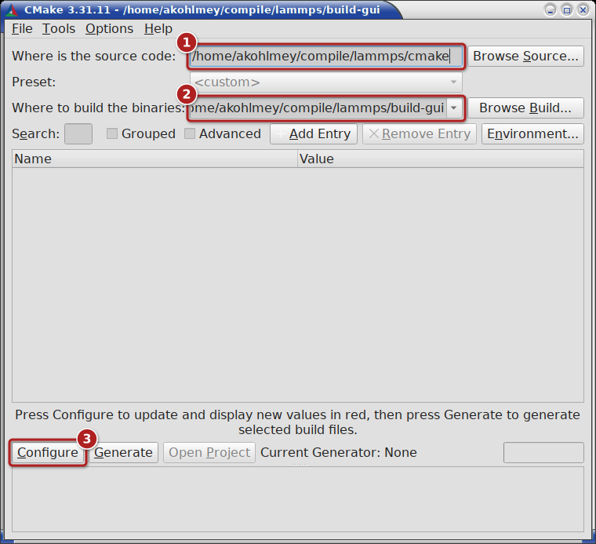
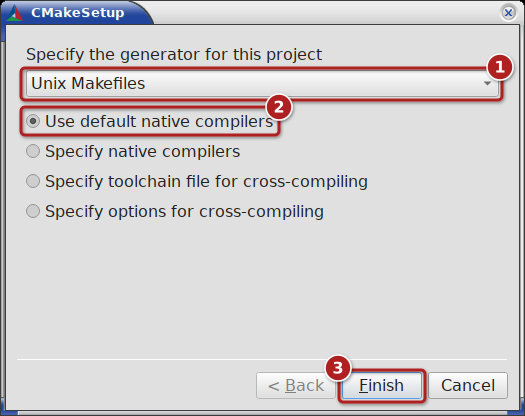
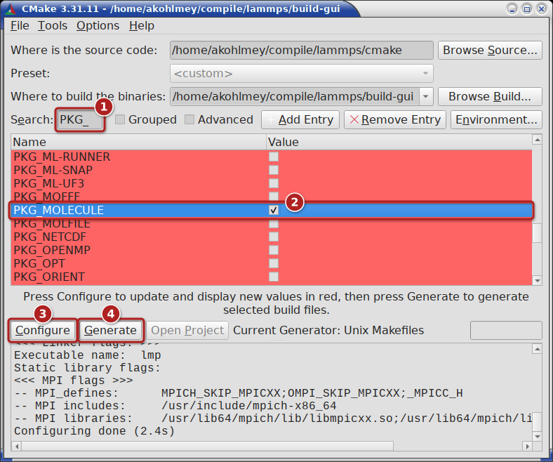

Using CMake with LAMMPS
=======================

CMake is the recommended way of building LAMMPS, and it has been
supported since 2018 thanks to the efforts of Christoph Junghans (LANL)
and Richard Berger (LANL).  The :doc:`legacy build system <Build_make>`
based on GNU make is slated for retirement.  One of the key strengths of
CMake is that it is not tied to a specific platform or build system.
Instead it generates the files necessary to build and develop for
different build systems and on different platforms, e.g. makefiles for
the ``make`` program, files for the faster ``ninja`` build tool, or
project files for integrated development environments (IDE) like Visual
Studio or Xcode.  Several other IDEs, e.g. Visual Studio Code, Qt
Creator, or CLion, can read the CMake configuration files directly.

A second important feature of CMake is that it can detect and validate
available libraries, optimal settings, available support tools and so
on, so that by default LAMMPS will take advantage of available tools
without requiring to provide the details about how to enable/integrate
them.

The downside of this approach is, that there is some complexity
associated with running CMake itself and how to customize the building
of LAMMPS.  This tutorial will show how to manage this through some
selected examples.  Please see the chapter about :doc:`building LAMMPS
<Build>` for descriptions of specific flags and options for LAMMPS in
general and for specific packages.

.. versionchanged:: TBD

CMake can be used through either the command-line interface (CLI)
program ``cmake``, a text mode interactive user interface (TUI)
program ``ccmake``, or a graphical user interface (GUI) program
``cmake-gui``.  All of them are portable software available on
all supported platforms and can be used interchangeably.
The minimum required CMake version is currently 3.27.

All details about features and settings for CMake are in the `CMake
online documentation <https://cmake.org/documentation/>`_. We focus
below on the most important aspects with respect to compiling LAMMPS.

Prerequisites
-------------

This tutorial assumes that you are operating in a command-line environment
using a shell like Bash or Zsh.

- Linux: any Terminal window will work or text console
- macOS: launch the Terminal application
- Windows 10 or 11: install and run the :doc:`Windows Subsystem for Linux <Howto_wsl>`
- other Unix-like operating systems like FreeBSD

.. note::

   It is also possible to use CMake on Windows 10 or 11 through either
   the Microsoft Visual Studio IDE with the bundled CMake or from the
   Windows command prompt using a separately installed CMake package,
   both using the native Microsoft Visual C++ compilers and (optionally)
   the Microsoft MPI SDK.  Please see the page on :doc:`building LAMMPS
   on Windows <Build_windows>` for details.  This tutorial, however,
   only covers Unix-like command-line interfaces.

We also assume that you have downloaded and unpacked a recent LAMMPS
source code package or used Git to create a clone of the LAMMPS sources
on your compilation machine.

You should change into the top-level folder of the LAMMPS source tree;
all paths mentioned in the tutorial are relative to that.  Immediately
after downloading it should look like this:

.. code-block:: console

   $ ls
   AGENTS.md     codemeta.json  lib         README       tools
   bench         doc            LICENSE     SECURITY.md  unittest
   CITATION.cff  examples       potentials  src          update-codemeta.sh
   cmake         fortran        python      third_party

Build versus source folder
--------------------------

When using CMake the build procedure is separated into multiple distinct phases:

  #. **Configuration:** detect or define which features and settings
     should be enabled and used and how LAMMPS should be compiled
  #. **Compilation:** generate and compile all necessary source files
     and build libraries and executables.
  #. **Installation:** copy selected files from the compilation into
     your file system, so they can be used without having to keep the
     source and build tree around.

The configuration and compilation of LAMMPS has to happen in a dedicated
*build folder* which must be different from the source folder.  Also
the source folder (``src``) must remain pristine, so it is not allowed
to "install" packages using the traditional make process and after a
compilation attempt all created source files must be removed.  This can
be achieved with ``make no-all purge`` in the ``src`` folder.

You can pick **any** folder outside the ``src`` folder.  We recommend to
use a folder ``build`` in the top-level folder, or multiple folders in
case you want to have separate builds of LAMMPS with different options
(``build-parallel``, ``build-serial``) or with different compilers
(``build-gnu``, ``build-clang``, ``build-intel``) and so on.  CMake will
create the build folder, if needed.  All the auxiliary files created by
one build process (executable, object files, log files, etc) are stored
in this folder or in folders within it that CMake creates.

Running CMake
-------------

CLI version
^^^^^^^^^^^

From the top-level folder, we now run the command ``cmake -S cmake -B
build``.  The ``-S`` flag points to the folder with the CMake scripts
for LAMMPS (the ``cmake`` folder) and the ``-B`` flag selects the build
folder.  This will start the configuration phase and you will see the
progress of the configuration printed to the screen followed by a
summary of the enabled features, options and compiler settings. A
typical summary screen will look like this:

.. code-block:: console

   $ cmake -S cmake -B build
   -- The CXX compiler identification is GNU 15.3.1
   -- The C compiler identification is GNU 15.3.1
   -- Detecting CXX compiler ABI info
   -- Detecting CXX compiler ABI info - done
   -- Check for working CXX compiler: /usr/bin/c++ - skipped
   -- Detecting CXX compile features
   -- Detecting CXX compile features - done
   -- Detecting C compiler ABI info
   -- Detecting C compiler ABI info - done
   -- Check for working C compiler: /usr/bin/cc - skipped
   -- Detecting C compile features
   -- Detecting C compile features - done
   -- Running check for auto-generated files from make-based build system
   -- Found ZLIB: /usr/lib64/libz.so (found version "1.3.1")
   -- Found MPI_CXX: /usr/lib64/mpich/lib/libmpicxx.so (found version "4.1")
   -- Found MPI: TRUE (found version "4.1") found components: CXX
   -- Looking for C++ include omp.h
   -- Looking for C++ include omp.h - found
   -- Found OpenMP_CXX: -fopenmp (found version "4.5")
   -- Found OpenMP: TRUE (found version "4.5")
   -- Found JPEG: /usr/lib64/libjpeg.so (found version "62")
   -- Found PNG: /usr/lib64/libpng.so (found version "1.6.37")
   -- Found ZLIB: /usr/lib64/libz.so (found version "1.2.11")
   -- Performing Test COMPILER_SUPPORTS-ffast-math
   -- Performing Test COMPILER_SUPPORTS-ffast-math - Success
   -- Performing Test COMPILER_SUPPORTS-march=native
   -- Performing Test COMPILER_SUPPORTS-march=native - Success
   -- Looking for C++ include cmath
   -- Looking for C++ include cmath - found
   -- Generating style headers...
   -- Generating style source files...
   -- Generating package registry...
   -- Generating lmpinstalledpkgs.h...
   -- Found Git: /usr/bin/git (found version "2.55.0")
   -- Found Python3: /usr/bin/python3.14 (found version "3.14.7") found components: Interpreter
   -- The following tools and libraries have been found and configured:
    * ZLIB
    * MPI
    * OpenMP
    * Git
    * Python3

   -- <<< Build configuration >>>
      LAMMPS Version:   2026.9.30.99 patch_30Sep2026-29-g9a2b245af5
      Operating System: Linux Fedora 43
      CMake Version:    3.31.11
      Build type:       RelWithDebInfo
      Install path:     /home/user/.local
      Generator:        Unix Makefiles using /usr/bin/gmake
   -- Enabled packages: <None>
   -- <<< Compilers and Flags: >>>
   -- C++ Compiler:     /usr/bin/c++
         Type:          GNU
         Version:       15.3.1
         C++ Standard:  17
         C++ Flags:     -O2 -g -DNDEBUG
         Defines:       LAMMPS_SMALLBIG;LAMMPS_MEMALIGN=64;LAMMPS_JPEG;LAMMPS_PNG
         Options:       -ffast-math;-march=native
   -- <<< Linker flags: >>>
   -- Executable name:  lmp
   -- Static library flags:
   -- <<< MPI flags >>>
   -- MPI_defines:      MPICH_SKIP_MPICXX;OMPI_SKIP_MPICXX;_MPICC_H
   -- MPI includes:     /usr/include/mpich-x86_64
   -- MPI libraries:    /usr/lib64/mpich/lib/libmpicxx.so;/usr/lib64/mpich/lib/libmpi.so;
   -- Configuring done (2.2s)
   -- Generating done (0.0s)
   -- Build files have been written to: /home/user/lammps/build

Running ``cmake`` again with the same ``-S`` and ``-B`` flags will
reload the settings from the previous run, which are stored in the file
``CMakeCache.txt`` in the build folder.  This means, that one can modify
an existing configuration by re-running CMake, but only needs to provide
flags indicating the desired change, everything else will be retained.
One can also mix compilation and configuration, i.e. start with a
minimal configuration and then, if needed, enable additional features
and recompile.

.. note::

   Using only ``-B build`` without ``-S cmake`` will *not* work for
   LAMMPS, since CMake then assumes the current working directory to be
   the source folder, and the top-level LAMMPS folder has no
   ``CMakeLists.txt`` file.  Alternatively, CMake can be given the path
   to an existing build folder as its only argument, e.g. ``cmake
   build``.

The steps above **will NOT compile the code**\ . The compilation is
started in a portable fashion with ``cmake --build build`` (see
:ref:`below <cmake_build_targets>`).

TUI version
^^^^^^^^^^^

For the text mode UI CMake program the basic principle is the same.
You start the command ``ccmake -S cmake -B build`` in the top-level
folder.  This will show you the initial screen with the empty
configuration cache:

.. code-block:: text

                                                        Page 0 of 1
    EMPTY CACHE

   EMPTY CACHE:
   Keys: [enter] Edit an entry [d] Delete an entry             CMake Version 3.31.8
         [l] Show log output   [c] Configure
         [h] Help              [q] Quit without generating
         [t] Toggle advanced mode (currently off)

Now you type the 'c' key to run the configuration step.  That will do a
first configuration run and show the output with the summary at the end
(you can scroll up and down with the arrow keys):

.. code-block:: text

       Generator:        Unix Makefiles using /usr/bin/gmake
    Enabled packages: <None>
    <<< Compilers and Flags: >>>
    -- C++ Compiler:     /usr/bin/c++
          Type:          GNU
          Version:       11.5.0
          C++ Standard:  17
          C++ Flags:     -O2 -g -DNDEBUG
          Defines:
    LAMMPS_ZLIB;LAMMPS_SMALLBIG;LAMMPS_MEMALIGN=64;LAMMPS_OMP_COMPAT=4;LAMMPS_GZIP

    C compiler:       /usr/bin/cc
          Type:          GNU
          Version:       11.5.0
          C Flags:       -O2 -g -DNDEBUG
    <<< Linker flags: >>>
    Executable name:  lmp
    Static library flags:
    <<< MPI flags >>>
    -- MPI_defines:      MPICH_SKIP_MPICXX;OMPI_SKIP_MPICXX;_MPICC_H
    -- MPI includes:     /usr/include/mpich-x86_64
    -- MPI libraries:
    /usr/lib64/mpich/lib/libmpicxx.so;/usr/lib64/mpich/lib/libmpi.so;
    Configuring done (2.5s)

   Configure produced the following output
                                                               CMake Version 3.31.8
   Press [e] to exit screen

You exit the summary screen with 'e' and now see the main screen with
detected options and settings:

.. code-block:: text

                                                        Page 1 of 6
    BUILD_DOC                       *OFF
    BUILD_LAMMPS_GUI                *OFF
    BUILD_MPI                       *ON
    BUILD_OMP                       *ON
    BUILD_SHARED_LIBS               *OFF
    BUILD_TOOLS                     *OFF
    CMAKE_BUILD_TYPE                *RelWithDebInfo
    CMAKE_CXX_EXTENSIONS            *OFF
    CMAKE_INSTALL_PREFIX            */home/user/.local
    CMAKE_POSITION_INDEPENDENT_COD  *ON
    ENABLE_TESTING                  *OFF
    FLATPAK_BUILDER                 *FLATPAK_BUILDER-NOTFOUND
    FLATPAK_COMMAND                 */usr/bin/flatpak
    GZIP_EXECUTABLE                 */usr/bin/gzip
    LAMMPS_CXX_COMPILER_NAME        *c++
    LAMMPS_INSTALL_RPATH            *OFF
    LAMMPS_LONGLONG_TO_LONG         *OFF
    LAMMPS_MEMALIGN                 *64
    LAMMPS_SIZES                    *smallbig
    MINGW_CMAKE                     *MINGW_CMAKE-NOTFOUND
    MINGW_CXX                       *MINGW_CXX-NOTFOUND
    PKG_ADIOS                       *OFF
    PKG_AMOEBA                      *OFF

   BUILD_DOC: Build LAMMPS HTML documentation
   Keys: [enter] Edit an entry [d] Delete an entry             CMake Version 3.31.8
         [l] Show log output   [c] Configure
         [h] Help              [q] Quit without generating
         [t] Toggle advanced mode (currently off)

You can now make changes by moving up and down with the arrow keys of
the keyboard and modify entries.  For on/off settings, the enter key
will toggle the state.  For others, hitting enter will allow you to
modify the value and you commit the change by hitting the enter key
again or cancel using the escape key.  All "new" settings will be marked
with a star '\*' and for as long as one setting is marked like this,
you have to re-run the configuration by hitting the 'c' key again,
sometimes multiple times unless the TUI shows the word "generate" next
to the letter 'g' and by hitting the 'g' key the build files will be
written to the folder and the TUI exits.  You can quit without
generating build files by hitting 'q'.

GUI version
^^^^^^^^^^^

For the graphical CMake program the steps are similar to the TUI
version.  You can type the command ``cmake-gui -S cmake -B build`` in
the top-level folder.  The program will then start with an empty
configuration cache:

   Initial ``cmake-gui`` screen

On this initial screen, the source folder (1) and the build folder (2)
are already set from the command line; they can also be changed by typing in the path or with the
"Browse Source..." and "Browse Build..." buttons.  Now click on the
"Configure" button (3) to start the configuration step.  For the very
first configuration in a folder, a dialog will appear:

   Generator selection in ``cmake-gui``

In this generator selection dialog, you can select the desired build
tool from a drop-down list (1),
e.g. "Unix Makefiles" for using ``make`` or "Ninja" for using the
:ref:`Ninja build tool <ninja_ccache>`, and how the compilers are
selected (2).  Stick with the default "Use default native compilers" and
click on "Finish" (3).  When the configuration is complete, you will see
the options screen with all new settings highlighted in red:

   Options screen of ``cmake-gui``

On the options screen, you can type part of a name into the "Search"
field (1) to show only matching settings, e.g. ``PKG_`` to list the settings for all optional
packages.  Settings are changed by clicking on a check box (2) for
on/off settings, or by double-clicking on a value to edit it.  Click on
"Configure" (3) again after making changes, until no more settings are
highlighted in red, and then click on "Generate" (4) to write out the
build files.  You can exit the GUI from the "File" menu or hit
"ctrl-q".

Setting options
---------------

Options that enable, disable or modify settings are modified by setting
the value of CMake variables. This is done on the command-line with the
*-D* flag in the format ``-D VARIABLE=value``, e.g. ``-D
CMAKE_BUILD_TYPE=Release`` or ``-D BUILD_MPI=on``.  Such CMake variables
can have boolean values (on/off, yes/no, or 1/0 are all valid) or are
strings representing a choice, or a path, or are free format. If the
string would contain whitespace, it must be put in quotes, for example
``-D CMAKE_CXX_FLAGS="-O3 -Wall -ftree-vectorize -ffast-math"``.

CMake variables fall into two categories: 1) common CMake variables that
are used by default for any CMake configuration setup and 2) project
specific variables, i.e. settings that are specific for LAMMPS.
Also CMake variables can be flagged as *advanced*, which means they are
not shown in the text mode or graphical CMake program in the overview
of all settings by default, but only when explicitly requested (by hitting
the 't' key or clicking on the 'Advanced' check-box).

Some common CMake variables
^^^^^^^^^^^^^^^^^^^^^^^^^^^

.. list-table::
   :header-rows: 1

   * - Variable
     - Description
   * - ``CMAKE_INSTALL_PREFIX``
     - root folder of the install location for ``cmake --install build``  (default: ``$HOME/.local``)
   * - ``LAMMPS_INSTALL_RPATH``
     - set or remove runtime path setting from binaries for ``cmake --install build`` (default: ``off``)
   * - ``CMAKE_BUILD_TYPE``
     - controls compilation options:
       one of ``RelWithDebInfo`` (default), ``Release``, ``Debug``, ``MinSizeRel``
   * - ``BUILD_SHARED_LIBS``
     - if set to ``on`` build the LAMMPS library as shared library (default: ``off``)
   * - ``CMAKE_MAKE_PROGRAM``
     - name/path of the compilation command (default depends on *-G* option, usually ``make``)
   * - ``CMAKE_VERBOSE_MAKEFILE``
     - if set to ``on`` echo commands while executing during build (default: ``off``)
   * - ``CMAKE_C_COMPILER``
     - C compiler to be used for compilation (default: system specific, ``gcc`` on Linux)
   * - ``CMAKE_CXX_COMPILER``
     - C++ compiler to be used for compilation (default: system specific, ``g++`` on Linux)
   * - ``CMAKE_Fortran_COMPILER``
     - Fortran compiler to be used for compilation (default: system specific, ``gfortran`` on Linux)
   * - ``CMAKE_CXX_COMPILER_LAUNCHER``
     - tool to launch the C++ compiler, e.g. ``ccache`` for :ref:`faster re-compilation <ninja_ccache>` (default: empty)
   * - ``CMAKE_EXPORT_COMPILE_COMMANDS``
     - if set to ``on`` write a ``compile_commands.json`` file for use with code analysis tools (default: ``off``)

Some common LAMMPS specific variables
^^^^^^^^^^^^^^^^^^^^^^^^^^^^^^^^^^^^^

.. list-table::
   :header-rows: 1

   * - Variable
     - Description
   * - ``BUILD_MPI``
     - build LAMMPS with MPI support (default: ``on`` if a working MPI available, else ``off``)
   * - ``BUILD_OMP``
     - build LAMMPS with OpenMP support (default: ``on`` if compiler supports OpenMP fully, else ``off``)
   * - ``BUILD_TOOLS``
     - compile some additional executables from the ``tools`` folder (default: ``off``)
   * - ``BUILD_DOC``
     - include building the HTML format documentation for packaging/installing (default: ``off``)
   * - ``ENABLE_TESTING``
     - compile and enable the :doc:`unit tests <Build_development>` (default: ``off``)
   * - ``DOWNLOAD_POTENTIALS``
     - download large potential files that are not included in the source distribution (default: ``on``)
   * - ``LAMMPS_MACHINE``
     - when set to ``name`` the LAMMPS executable and library will be called ``lmp_name`` and ``liblammps_name.a``
   * - ``FFT``
     - select which FFT library to use: ``FFTW3``, ``MKL``, ``NVPL``, ``KISS`` (default, unless FFTW3 is found)
   * - ``FFT_KOKKOS``
     - select which FFT library to use in KOKKOS package styles: ``FFTW3``, ``MKL``, ``NVPL``, ``HIPFFT``, ``CUFFT``, ``MKL_GPU``, ``KISS`` (default)
   * - ``FFT_SINGLE``
     - select whether to use single precision FFTs (default: ``off``)
   * - ``WITH_JPEG``
     - whether to support JPEG format in :doc:`dump image <dump_image>` (default: ``on`` if found, requires the GRAPHICS package)
   * - ``WITH_PNG``
     - whether to support PNG format in :doc:`dump image <dump_image>` (default: ``on`` if found, requires the GRAPHICS package)
   * - ``WITH_FFMPEG``
     - whether to support generating movies with :doc:`dump movie <dump_image>` (default: ``on`` if found, requires the GRAPHICS package)
   * - ``WITH_ZLIB``
     - whether to use the zlib library for compression (default: ``on`` if found)

Enabling or disabling LAMMPS packages
^^^^^^^^^^^^^^^^^^^^^^^^^^^^^^^^^^^^^

The LAMMPS software is organized into a common core that is always
included and a large number of :doc:`add-on packages <Packages>` that
have to be enabled to be included into a LAMMPS executable.  Packages
are enabled through setting variables of the kind ``PKG_<NAME>`` to
``on`` and disabled by setting them to ``off`` (or using ``yes``,
``no``, ``1``, ``0`` correspondingly).  ``<NAME>`` has to be replaced by
the name of the package, e.g. ``MOLECULE`` or ``EXTRA-PAIR``.

Using presets
-------------

Since LAMMPS has a lot of optional features and packages, specifying
them all on the command-line can be tedious. Or when selecting a
different compiler tool chain, multiple options have to be changed
consistently and that is rather error prone. Or when enabling certain
packages, they require consistent settings to be operated in a
particular mode.  For this purpose, we are providing a selection of
"preset files" for CMake in the folder ``cmake/presets``.  They
represent a way to pre-load or override the CMake configuration cache by
setting or changing CMake variables.  Preset files are loaded using the
*-C* command-line flag. You can combine loading multiple preset files or
change some variables later with additional *-D* flags.  A few examples:

.. code-block:: bash

   cmake -S cmake -B build -C cmake/presets/basic.cmake -D PKG_MISC=on
   cmake -S cmake -B build -C cmake/presets/clang.cmake -C cmake/presets/most.cmake
   cmake -S cmake -B build -C cmake/presets/basic.cmake -D BUILD_MPI=off

The first command will install the packages ``GRAPHICS``, ``KSPACE``,
``MANYBODY``, ``MOLECULE``, and ``RIGID`` from the preset file and the
``MISC`` package from the explicit variable definition.  The second
command will first switch the compiler tool chain to use the Clang
compilers and install a large number of packages that are not depending
on any special external libraries or tools and are not very unusual.
The third command will enable the same five packages as the first
command and then enforce compiling LAMMPS as a serial program (using the
MPI STUBS library).

It is also possible to do this incrementally.

.. code-block:: bash

   cmake -S cmake -B build -C cmake/presets/basic.cmake
   cmake -S cmake -B build -D PKG_MISC=on

will achieve the same final configuration as in the first example above.
In this scenario it is particularly convenient to do the second
configuration step using either the text mode or graphical user
interface (``ccmake`` or ``cmake-gui``).

.. note::

   Using a preset to select a compiler package (``clang.cmake``,
   ``gcc.cmake``, ``intel.cmake``, ``oneapi.cmake``, ``nvhpc.cmake``, or
   ``pgi.cmake``) is an exception to the mechanism of updating the
   configuration incrementally, as they will trigger a reset of cached
   internal CMake settings and thus reset settings to their default
   values.

.. _cmake_build_targets:

Compilation and build targets
-----------------------------

The actual compilation will be started by running the selected build
command (on Linux this is by default ``make``, see below how to select
alternatives).  The portable command ``cmake --build build`` will adapt
to whatever the selected build command is.  By default, ``make``
compiles only one source file at a time; to compile multiple files in
parallel, append ``-j N`` (or ``--parallel N``) with *N* being the
number of concurrent compilation tasks.  The Ninja build tool (see
below) uses all available CPU cores by default.

When calling the build program, you can also select which "target" is to
be built through appending the ``--target`` flag and the name of the
target to the build command.  Example: ``cmake --build build --target
lmp``.  The following abstract targets are available:

.. list-table::
   :header-rows: 1

   * - Target
     - Description
   * - ``all``
     - build "everything" (default)
   * - ``lammps``
     - build the LAMMPS library
   * - ``lmp``
     - build the LAMMPS executable (and the library, if needed)
   * - ``doc``
     - build the HTML documentation (if configured)
   * - ``install``
     - install all target files into folders in ``CMAKE_INSTALL_PREFIX``
   * - ``test``
     - run the unit tests (if configured with ``-D ENABLE_TESTING=on``)
   * - ``clean``
     - remove all generated files

Instead of the ``install`` and ``test`` targets, you can also use the
commands ``cmake --install build`` and ``ctest --test-dir build``,
respectively.  The ``ctest`` command offers more options to select which
tests to run and how to report the results.

Choosing generators
-------------------

While CMake usually defaults to creating makefiles to compile software
with the ``make`` program, it supports multiple alternate build tools
(e.g. ``ninja-build`` which tends to be faster and more efficient in
parallelizing builds than ``make``) and can generate project files for
some integrated development environments (IDEs) like Visual Studio or
Xcode.  This is selected with the *-G* flag when a build folder is
configured for the first time, e.g. ``-G Ninja``; see the section on
:ref:`faster compilation with Ninja and ccache <ninja_ccache>` for more
details.  The list of available options can be seen at the end of the
output of ``cmake --help``.  For example, on Linux the main generators
are:

.. code-block:: text

   Generators

   The following generators are available on this platform (* marks default):
     Green Hills MULTI            = Generates Green Hills MULTI files
                                    (experimental, work-in-progress).
   * Unix Makefiles               = Generates standard UNIX makefiles.
     Ninja                        = Generates build.ninja files.
     Ninja Multi-Config           = Generates build-<Config>.ninja files.
     Watcom WMake                 = Generates Watcom WMake makefiles.

The list also contains entries like "CodeBlocks - Ninja" or "Eclipse CDT4
- Unix Makefiles" that generate project files for some other IDEs.
These "extra generators" are marked as deprecated since CMake version
3.27 and should not be used anymore.

Instead, many current IDEs and code editors can use the CMake
configuration directly:

- `Visual Studio Code <https://code.visualstudio.com/>`_ with the
  "CMake Tools" extension: open the top-level LAMMPS folder and set the
  ``cmake.sourceDirectory`` setting to ``${workspaceFolder}/cmake``,
  since the ``CMakeLists.txt`` file is not in the top-level folder.
- `Qt Creator <https://www.qt.io/product/development-tools>`_: open the
  file ``cmake/CMakeLists.txt`` as a project.
- `CLion <https://www.jetbrains.com/clion/>`_: open the file
  ``cmake/CMakeLists.txt`` as a project.
- Visual Studio: see the page on :doc:`building LAMMPS on Windows
  <Build_windows>`.

Code editors that support the language server protocol (e.g. through
the ``clangd`` program) can provide code navigation and completion
based on a ``compile_commands.json`` file, which is written to the build
folder when configuring with ``-D CMAKE_EXPORT_COMPILE_COMMANDS=on``.
