LAMMPS GitHub tutorial
======================

**written by Stefan Paquay**

----------

This document describes the process of how to use GitHub to integrate
changes or additions you have made to LAMMPS into the official LAMMPS
distribution.  It uses the process of updating this very tutorial as
an example to describe the individual steps and options.  You need to
be familiar with git and you may want to have a look at the
`git book <http://git-scm.com/book/>`_ to reacquaint yourself with some
of the more advanced git features used below.

As of fall 2016, submitting contributions to LAMMPS via pull requests
on GitHub is the preferred option for integrating contributed features
or improvements to LAMMPS, as it significantly reduces the amount of
work required by the LAMMPS developers. Consequently, creating a pull
request will increase your chances to have your contribution included
and will reduce the time until the integration is complete. For more
information on the requirements to have your code included into LAMMPS
please see the :doc:`Modify contribute <Modify_contribute>` doc page.

----------

**Making an account**

First of all, you need a GitHub account. This is fairly simple, just
go to `GitHub <https://github.com>`_ and create an account by clicking
the "Sign up for GitHub" button. Once your account is created, you
can sign in by clicking the button in the top left and filling in your
username or e-mail address and password.

----------

**Forking the repository**

To get changes into LAMMPS, you need to first fork the `lammps/lammps`
repository on GitHub. At the time of writing, *master* is the preferred
target branch. Thus go to `LAMMPS on GitHub <https://github.com/lammps/lammps>`_
and make sure branch is set to "master", as shown in the figure below.

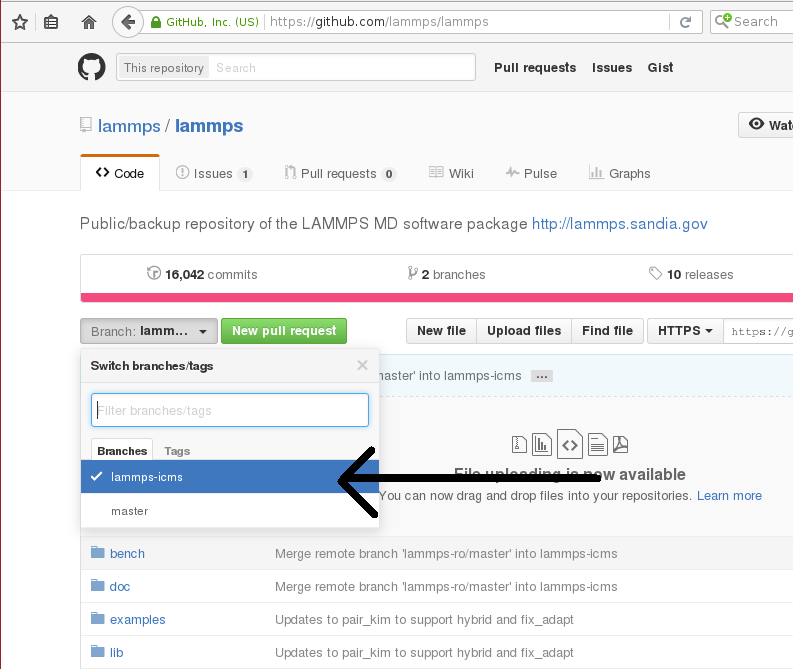

If it is not, use the button to change it to *master*\ . Once it is, use the
fork button to create a fork.

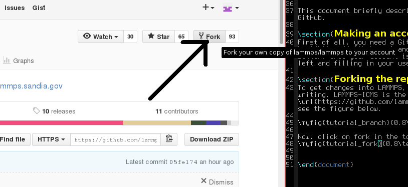

This will create a fork (which is essentially a copy, but uses less
resources) of the LAMMPS repository under your own GitHub account. You
can make changes in this fork and later file *pull requests* to allow
the upstream repository to merge changes from your own fork into the one
we just forked from (or others that were forked from the same repository).
At the same time, you can set things up, so you can include changes from
upstream into your repository and thus keep it in sync with the ongoing
LAMMPS development.

----------

**Adding changes to your own fork**

Additions to the upstream version of LAMMPS are handled using *feature
branches*\ .  For every new feature, a so-called feature branch is
created, which contains only those modification relevant to one specific
feature. For example, adding a single fix would consist of creating a
branch with only the fix header and source file and nothing else.  It is
explained in more detail here: `feature branch workflow <https://www.atlassian.com/git/tutorials/comparing-workflows/feature-branch-workflow>`_.

**Feature branches**

First of all, create a clone of your version on github on your local
machine via HTTPS:

.. parsed-literal::

     $ git clone https://github.com/<your user name>/lammps.git <some name>

or, if you have set up your GitHub account for using SSH keys, via SSH:

.. parsed-literal::

     $ git clone git@github.com:<your user name>/lammps.git

You can find the proper URL by clicking the "Clone or download"-button:

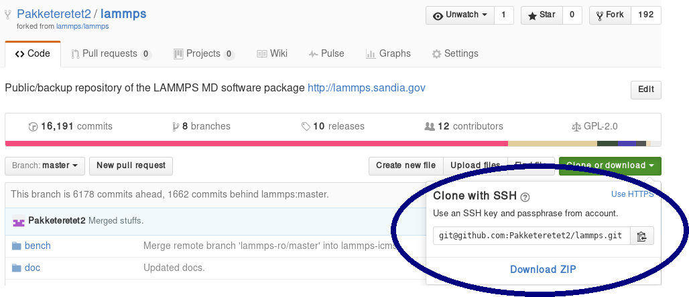

The above command copies ("clones") the git repository to your local
machine to a directory with the name you chose. If none is given, it will
default to "lammps". Typical names are "mylammps" or something similar.

You can use this local clone to make changes and
test them without interfering with the repository on GitHub.

To pull changes from upstream into this copy, you can go to the directory
and use git pull:

.. parsed-literal::

     $ cd mylammps
     $ git checkout master
     $ git pull https://github.com/lammps/lammps

You can also add this URL as a remote:

.. parsed-literal::

     $ git remote add lammps_upstream https://www.github.com/lammps/lammps

At this point, you typically make a feature branch from the updated master
branch for the feature you want to work on. This tutorial contains the
workflow that updated this tutorial, and hence we will call the branch
"github-tutorial-update":

.. parsed-literal::

    $ git checkout -b github-tutorial-update master

Now that we have changed branches, we can make our changes to our local
repository. Just remember that if you want to start working on another,
unrelated feature, you should switch branches!

**After changes are made**

After everything is done, add the files to the branch and commit them:

.. parsed-literal::

    $ git add doc/src/Howto_github.txt
    $ git add doc/src/JPG/tutorial\*.png

.. warning::

   Do not use *git commit -a* (or *git add -A*\ ).  The -a
   flag (or -A flag) will automatically include \_all\\_ modified or new files
   and that is rarely the behavior you want.  It can easily lead to
   accidentally adding unrelated and unwanted changes into the repository.
   Instead it is preferable to explicitly use *git add*\ , *git rm*\ , *git mv*
   for adding, removing, renaming individual files, respectively, and then
   *git commit* to finalize the commit.  Carefully check all pending
   changes with *git status* before committing them.  If you find doing
   this on the command line too tedious, consider using a GUI, for example
   the one included in git distributions written in Tk, i.e. use *git gui*
   (on some Linux distributions it may be required to install an additional
   package to use it).

After adding all files, the change set can be committed with some
useful message that explains the change.

.. parsed-literal::

     $ git commit -m 'Finally updated the github tutorial'

After the commit, the changes can be pushed to the same branch on GitHub:

.. parsed-literal::

   $ git push

Git will ask you for your user name and password on GitHub if you have
not configured anything. If your local branch is not present on GitHub yet,
it will ask you to add it by running

.. parsed-literal::

     $ git push --set-upstream origin github-tutorial-update

If you correctly type your user name and
password, the feature branch should be added to your fork on GitHub.

If you want to make really sure you push to the right repository
(which is good practice), you can provide it explicitly:

.. parsed-literal::

   $ git push origin

or using an explicit URL:

.. parsed-literal::

   $ git push git@github.com:Pakketeretet2/lammps.git

----------

**Filing a pull request**

Up to this point in the tutorial, all changes were to *your* clones of
LAMMPS.  Eventually, however, you want this feature to be included into
the official LAMMPS version.  To do this, you will want to file a pull
request by clicking on the "New pull request" button:

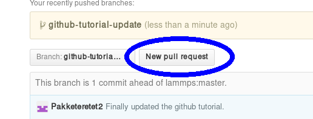

Make sure that the current branch is set to the correct one, which, in
this case, is "github-tutorial-update". If done correctly, the only
changes you will see are those that were made on this branch.

This will open up a new window that lists changes made to the
repository. If you are just adding new files, there is not much to do,
but I suppose merge conflicts are to be resolved here if there are
changes in existing files. If all changes can automatically be merged,
green text at the top will say so and you can click the "Create pull
request" button, see image.

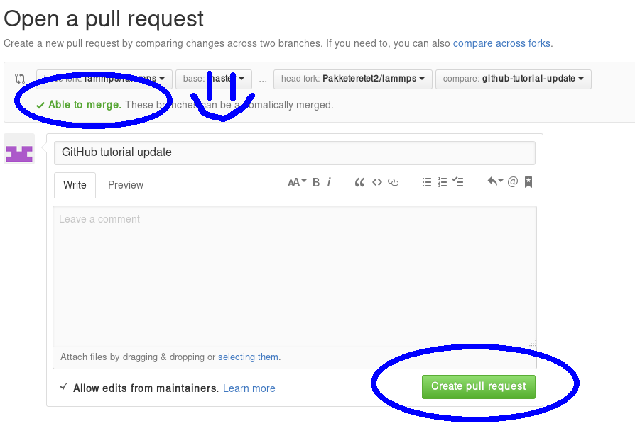

Before creating the pull request, make sure the short title is accurate
and add a comment with details about your pull request.  Here you write
what your modifications do and why they should be incorporated upstream.

Note the checkbox that says "Allow edits from maintainers".
This is checked by default checkbox (although in my version of Firefox, only the checkmark is visible):

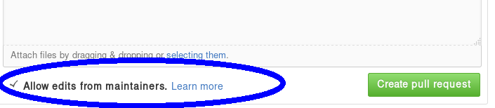

If it is checked, maintainers can immediately add their own edits to the
pull request.  This helps the inclusion of your branch significantly, as
simple/trivial changes can be added directly to your pull request branch
by the LAMMPS maintainers.  The alternative would be that they make
changes on their own version of the branch and file a reverse pull
request to you.  Just leave this box checked unless you have a very good
reason not to.

Now just write some nice comments and click on "Create pull request".

.. image:: JPG/tutorial_create_new_pull_request2.png
   :align: center

----------

**After filing a pull request**

.. note::

   When you submit a pull request (or ask for a pull request) for the
   first time, you will receive an invitation to become a LAMMPS project
   collaborator. Please accept this invite as being a collaborator will
   simplify certain administrative tasks and will probably speed up the
   merging of your feature, too.

You will notice that after filing the pull request, some checks are
performed automatically:

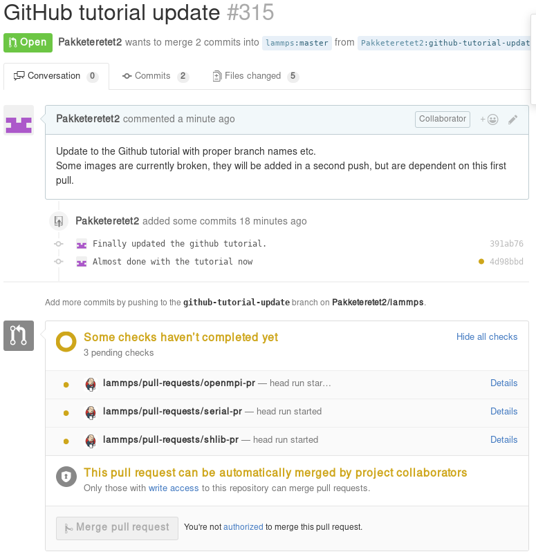

If all is fine, you will see this:

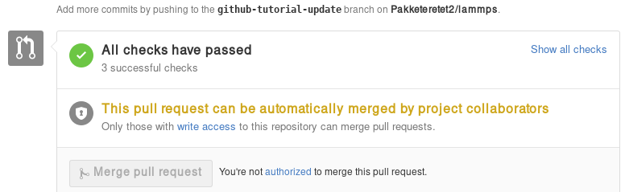

If any of the checks are failing, your pull request will not be
processed, as your changes may break compilation for certain
configurations or may not merge cleanly. It is your responsibility
to remove the reason(s) for the failed test(s). If you need help
with this, please contact the LAMMPS developers by adding a comment
explaining your problems with resolving the failed tests.

A few further interesting things (can) happen to pull requests before
they are included.

**Additional changes**

First of all, any additional changes you push into your branch in your
repository will automatically become part of the pull request:

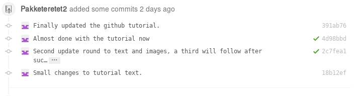

This means you can add changes that should be part of the feature after
filing the pull request, which is useful in case you have forgotten
them, or if a developer has requested that something needs to be changed
before the feature can be accepted into the official LAMMPS version.
After each push, the automated checks are run again.

**Labels**

LAMMPS developers may add labels to your pull request to assign it to
categories (mostly for bookkeeping purposes), but a few of them are
important: needs\_work, work\_in\_progress, test-for-regression, and
full-regression-test. The first two indicate, that your pull request
is not considered to be complete. With "needs\_work" the burden is on
exclusively on you; while "work\_in\_progress" can also mean, that a
LAMMPS developer may want to add changes. Please watch the comments
to the pull requests. The two "test" labels are used to trigger
extended tests before the code is merged. This is sometimes done by
LAMMPS developers, if they suspect that there may be some subtle
side effects from your changes. It is not done by default, because
those tests are very time consuming.

**Reviews**

As of Summer 2018, a pull request needs at least 1 approving review
from a LAMMPS developer with write access to the repository.
In case your changes touch code that certain developers are associated
with, they are auto-requested by the GitHub software.  Those associations
are set in the file
`.github/CODEOWNERS <https://github.com/lammps/lammps/blob/master/.github/CODEOWNERS>`_
Thus if you want to be automatically notified to review when anybody
changes files or packages, that you have contributed to LAMMPS, you can
add suitable patterns to that file, or a LAMMPS developer may add you.

Otherwise, you can also manually request reviews from specific developers,
or LAMMPS developers - in their assessment of your pull request - may
determine who else should be reviewing your contribution and add that person.
Through reviews, LAMMPS developers also may request specific changes from you.
If those are not addressed, your pull requests cannot be merged.

**Assignees**

There is an assignee property for pull requests. If the request has not
been reviewed by any developer yet, it is not assigned to anyone. After
revision, a developer can choose to assign it to either a) you, b) a
LAMMPS developer (including him/herself) or c) Axel Kohlmeyer (akohlmey).

* Case a) happens if changes are required on your part
* Case b) means that at the moment, it is being tested and reviewed by a
  LAMMPS developer with the expectation that some changes would be required.
  After the review, the developer can choose to implement changes directly
  or suggest them to you.
* Case c) means that the pull request has been assigned to the developer
  overseeing the merging of pull requests into the master branch.

In this case, Axel assigned the tutorial to Steve:

.. image:: JPG/tutorial_steve_assignee.png
   :align: center

**Edits from LAMMPS maintainers**

If you allowed edits from maintainers (the default), any LAMMPS
maintainer can add changes to your pull request.  In this case, both
Axel and Richard made changes to the tutorial:

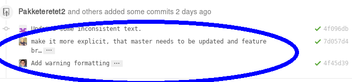

**Reverse pull requests**

Sometimes, however, you might not feel comfortable having other people
push changes into your own branch, or maybe the maintainers are not sure
their idea was the right one.  In such a case, they can make changes,
reassign you as the assignee, and file a "reverse pull request", i.e.
file a pull request in your GitHub repository to include changes in the
branch, that you have submitted as a pull request yourself.  In that
case, you can choose to merge their changes back into your branch,
possibly make additional changes or corrections and proceed from there.
It looks something like this:

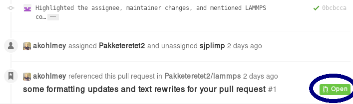

For some reason, the highlighted button didn't work in my case, but I
can go to my own repository and merge the pull request from there:

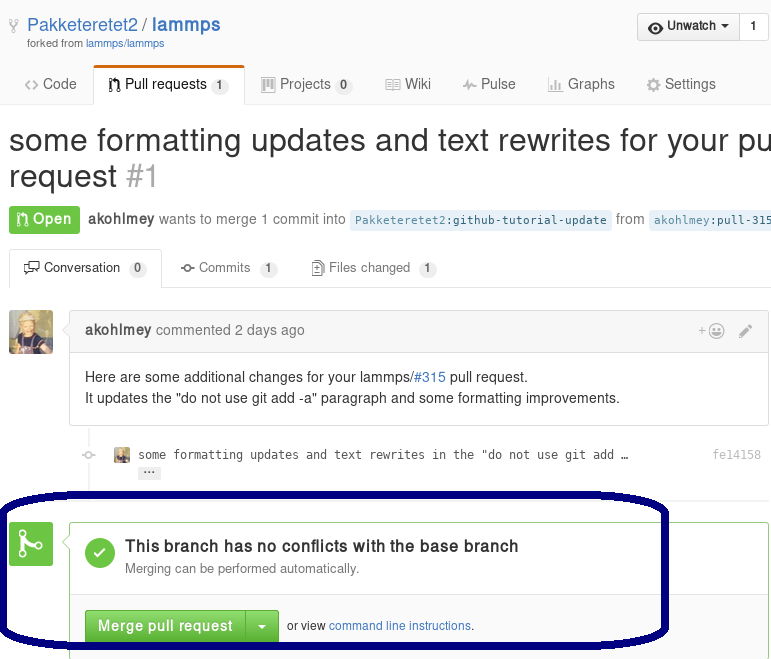

Be sure to check the changes to see if you agree with them by clicking
on the tab button:

.. image:: JPG/tutorial_reverse_pull_request3.png
   :align: center

In this case, most of it is changes in the markup and a short rewrite of
Axel's explanation of the "git gui" and "git add" commands.

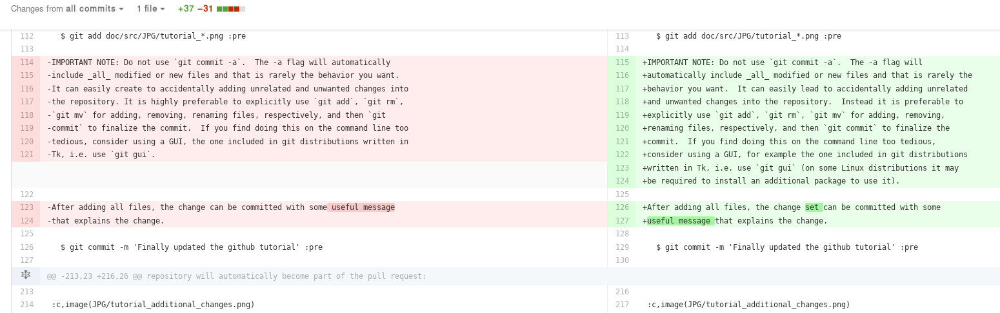

Because the changes are OK with us, we are going to merge by clicking on
"Merge pull request".  After a merge it looks like this:

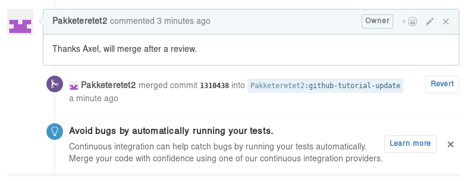

Now, since in the meantime our local text for the tutorial also changed,
we need to pull Axel's change back into our branch, and merge them:

.. parsed-literal::

    $ git add Howto_github.txt
    $ git add JPG/tutorial_reverse_pull_request\*.png
    $ git commit -m "Updated text and images on reverse pull requests"
    $ git pull

In this case, the merge was painless because git could auto-merge:

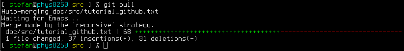

With Axel's changes merged in and some final text updates, our feature
branch is now perfect as far as we are concerned, so we are going to
commit and push again:

.. parsed-literal::

    $ git add Howto_github.txt
    $ git add JPG/tutorial_reverse_pull_request6.png
    $ git commit -m "Merged Axel's suggestions and updated text"
    $ git push git@github.com:Pakketeretet2/lammps

This merge also shows up on the lammps GitHub page:

.. image:: JPG/tutorial_reverse_pull_request7.png
   :align: center

----------

**After a merge**

When everything is fine, the feature branch is merged into the master branch:

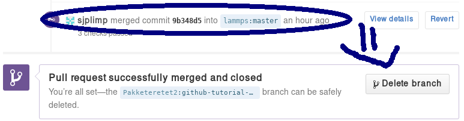

Now one question remains: What to do with the feature branch that got
merged into upstream?

It is in principle safe to delete them from your own fork. This helps
keep it a bit more tidy. Note that you first have to switch to another
branch!

.. parsed-literal::

   $ git checkout master
   $ git pull master
   $ git branch -d github-tutorial-update

If you do not pull first, it is not really a problem but git will warn
you at the next statement that you are deleting a local branch that
was not yet fully merged into HEAD. This is because git does not yet
know your branch just got merged into LAMMPS upstream. If you
first delete and then pull, everything should still be fine.

Finally, if you delete the branch locally, you might want to push this
to your remote(s) as well:

.. parsed-literal::

   $ git push origin :github-tutorial-update

**Recent changes in the workflow**

Some changes to the workflow are not captured in this tutorial.  For
example, in addition to the master branch, to which all new features
should be submitted, there is now also an "unstable" and a "stable"
branch; these have the same content as "master", but are only updated
after a patch release or stable release was made.
Furthermore, the naming of the patches now follow the pattern
"patch\_<Day><Month><Year>" to simplify comparisons between releases.
Finally, all patches and submissions are subject to automatic testing
and code checks to make sure they at the very least compile.

A discussion of the LAMMPS developer GitHub workflow can be found in the file
`doc/github-development-workflow.md <https://github.com/lammps/lammps/blob/master/doc/github-development-workflow.md>`_
