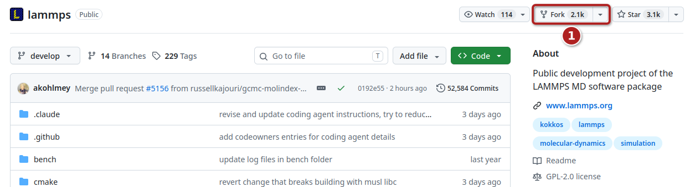
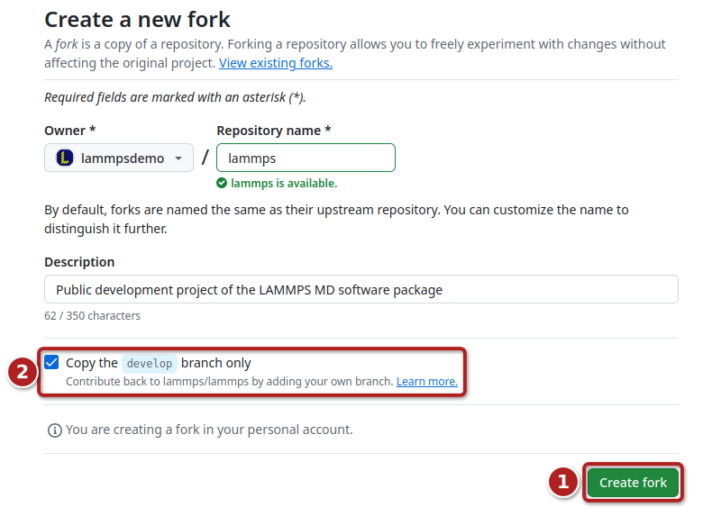
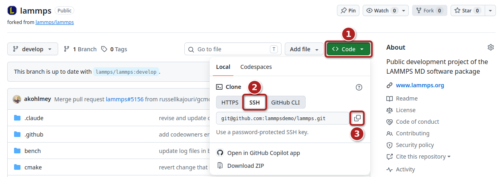
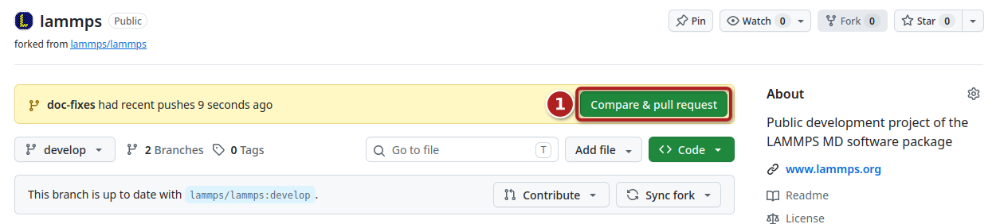
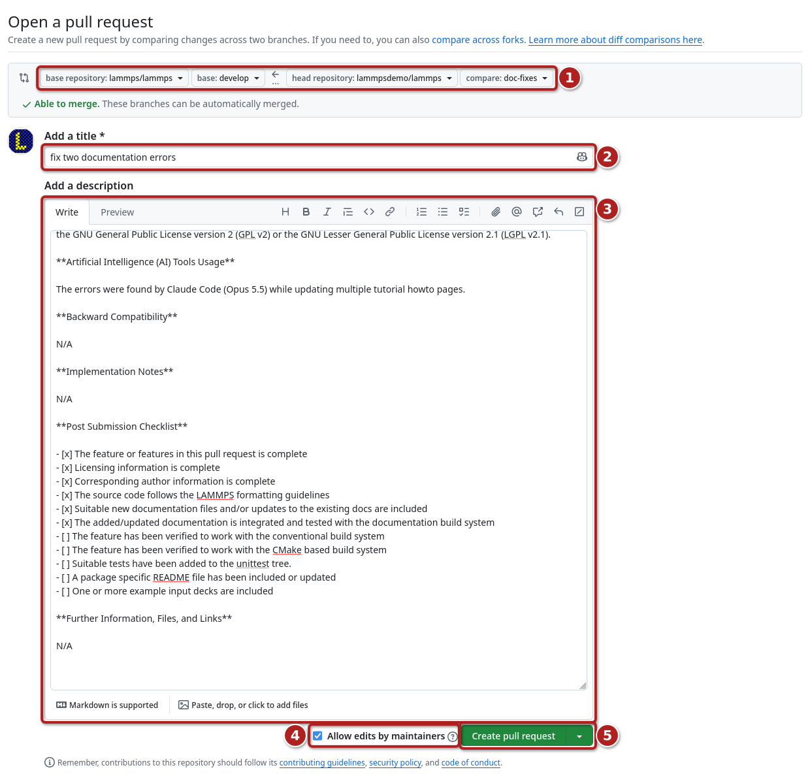
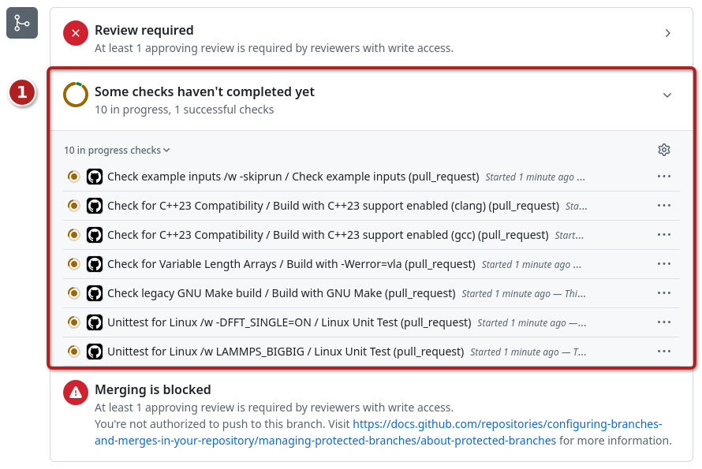
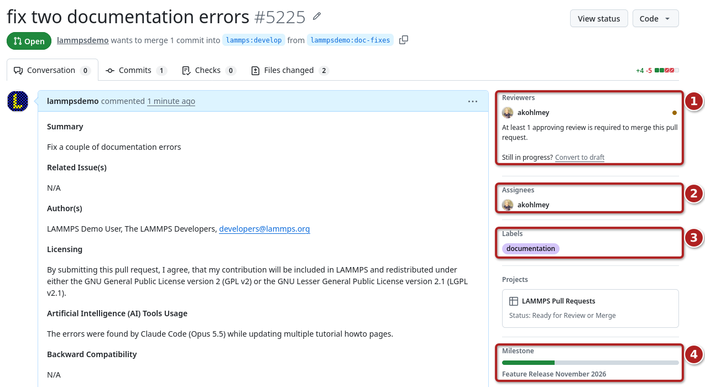
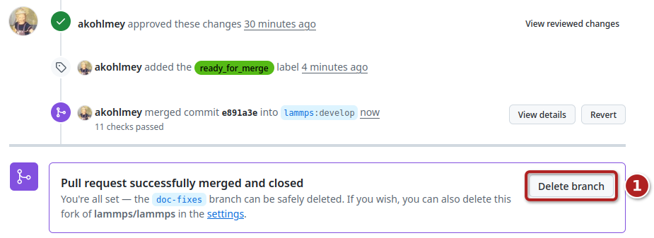

LAMMPS GitHub tutorial
======================

**written by Stefan Paquay, updated in 2026 by Axel Kohlmeyer**

----------

This document describes how to use git and GitHub to contribute changes
or additions you have made to LAMMPS to the official LAMMPS distribution.
Contributions to LAMMPS are submitted as *pull requests* on GitHub,
where they are automatically tested and reviewed by the LAMMPS
developers before they are included.  For more information on the
requirements to have your code included into LAMMPS please see
:doc:`this page <Modify_contribute>`.

This tutorial is meant for people with little or no experience with git
and GitHub.  It uses the ``git`` command-line program for all steps on
your local machine and the GitHub web interface for all steps that need
to be done on the GitHub website.  The `git book
<https://git-scm.com/book/>`_ is a good resource to learn more about git.

----------

Preparations
------------

Create a GitHub account
^^^^^^^^^^^^^^^^^^^^^^^

First of all, you need a GitHub account.  Go to `GitHub
<https://github.com>`_ and click on the "Sign up" button to create
one.

Install and configure git
^^^^^^^^^^^^^^^^^^^^^^^^^

You need the ``git`` program installed on your local machine.  On
Linux and macOS it is often already installed, otherwise it can be
installed with the package manager (e.g. ``sudo apt install git`` on
Debian and Ubuntu).  On Windows, we recommend to use git from within the
:doc:`Windows Subsystem for Linux <Howto_wsl>`.  Before using git for
the first time, set your name and e-mail address, which will be recorded
with every change (commit) you make:

.. code-block:: bash

   git config --global user.name "Your Name"
   git config --global user.email "you@example.com"

Set up access to GitHub with SSH keys
^^^^^^^^^^^^^^^^^^^^^^^^^^^^^^^^^^^^^

To upload ("push") changes to GitHub, git has to authenticate you.
GitHub does not accept your account password for that.  The simplest
way for use with the ``git`` command is an SSH key.  Create one with:

.. code-block:: bash

   ssh-keygen -t ed25519 -C "you@example.com"

and accept the default file location.  Then display the public part of
the key with:

.. code-block:: bash

   cat ~/.ssh/id_ed25519.pub

Copy the output and add it to your GitHub account: click on your profile
picture in the top right corner of the GitHub website, select
"Settings", then "SSH and GPG keys", then "New SSH key", paste the key,
and click on "Add SSH key".  Please see the `GitHub documentation on SSH
keys
<https://docs.github.com/en/authentication/connecting-to-github-with-ssh>`_
for more details.

.. note::

   Alternatively, you can use the `GitHub command-line tool
   <https://cli.github.com>`_ and run ``gh auth login``, which can also
   set up git to authenticate to GitHub (see :ref:`below <github_cli>`).

----------

Forking the repository
----------------------

You cannot upload changes directly to the official LAMMPS repository.
Instead you first create your own copy of it on GitHub, a so-called
*fork*.  Go to the `LAMMPS repository on GitHub
<https://github.com/lammps/lammps>`_ and click on the "Fork" button (1):

   The "Fork" button on the LAMMPS GitHub page

On the next page, keep the default settings and click on "Create fork"
(1).  The option "Copy the develop branch only" (2) should remain
selected, since all contributions to LAMMPS must be based on the
*develop* branch:

   Creating a fork of the LAMMPS repository

This creates a fork of the LAMMPS repository under your GitHub account,
e.g. ``https://github.com/<your user name>/lammps``.  You can make
changes in this fork and then submit a pull request asking the LAMMPS
developers to include them into the official LAMMPS repository.

----------

Working with your fork on your local machine
--------------------------------------------

Clone your fork
^^^^^^^^^^^^^^^

Next you create a local copy (a *clone*) of your fork on your machine.
On the GitHub page of your fork, click on the "Code" button (1), select
"SSH" (2), and copy the URL (3):

   Copying the URL of your fork

Then clone the repository and change into the new folder:

.. code-block:: bash

   git clone git@github.com:<your user name>/lammps.git
   cd lammps

To be able to get the latest changes from the official LAMMPS
repository later, add it as an additional *remote* repository named
"upstream":

.. code-block:: bash

   git remote add upstream https://github.com/lammps/lammps.git

The command ``git remote -v`` should now list "origin" (your fork) and
"upstream" (the official repository).

Create a feature branch
^^^^^^^^^^^^^^^^^^^^^^^

All changes for one specific feature or bug fix are made in a separate
*feature branch*, which contains only the modifications relevant to that
feature, e.g. for a new fix only its source and header files and its
documentation.  For every new feature or bug fix, create a new branch
from the latest version of the *develop* branch of the official
repository.  In this example the branch is called "my-new-feature":

.. code-block:: bash

   git fetch upstream
   git switch --no-track -c my-new-feature upstream/develop

The ``--no-track`` flag is important: without it, git remembers the
*develop* branch of the official repository as the counterpart of your
new branch, and depending on your git settings, a later ``git push``
may then try to upload your changes to the *develop* branch of your
fork instead of a new branch.

.. note::

   Do not make changes in the *develop* branch of your fork, and never
   use the same branch for unrelated changes.  This will make it much
   easier to keep your changes separate and to get them included into
   LAMMPS.

Make and commit your changes
^^^^^^^^^^^^^^^^^^^^^^^^^^^^

Now make your changes, compile and test LAMMPS, and check that your
changes follow the :doc:`requirements for contributions
<Modify_requirements>` and the :doc:`programming style <Modify_style>`.
The command ``git status`` shows which files are modified or new, and
``git diff`` shows the changes in detail.  Then add the modified and new
files to the next commit and record the commit with a short message that
explains the change:

.. code-block:: bash

   git add src/EXTRA-FIX/fix_my_new_feature.cpp src/EXTRA-FIX/fix_my_new_feature.h
   git add doc/src/fix_my_new_feature.rst
   git commit -m "add fix my/new/feature"

.. warning::

   Do not use ``git commit -a`` (or ``git add -A``).  These will
   automatically include **all** modified **and** new files and that is
   rarely the behavior you want.  It can easily lead to accidentally
   adding unrelated and unwanted changes into the repository.  Instead
   it is preferable to explicitly use ``git add``, ``git rm``, and ``git
   mv`` for adding, removing, and renaming individual files,
   respectively, and then ``git commit`` to finalize the commit.
   Carefully check all pending changes with ``git status`` before
   committing them.  If you find doing this on the command-line too
   tedious, consider using a GUI, for example ``git gui`` (on some Linux
   distributions it may be required to install an additional package to
   use it).

You can make as many commits in your branch as you like.

Upload your changes to GitHub
^^^^^^^^^^^^^^^^^^^^^^^^^^^^^

To upload ("push") your branch to your fork on GitHub for the first
time, use:

.. code-block:: bash

   git push -u origin my-new-feature

After that, a plain ``git push`` will upload any additional commits in
this branch.

----------

Filing a pull request
---------------------

So far, all changes were made only in *your* copies of LAMMPS.  To ask
for your changes to be included into the official LAMMPS version, you
need to file a *pull request*.  After pushing a branch, GitHub shows a
banner on the page of your fork (and the LAMMPS repository) with a
"Compare & pull request" button (1):

   Starting a new pull request

This opens the form for a new pull request:

   Creating a pull request

Please check and fill in the following:

- The pull request must be from the feature branch in your fork to the
  *develop* branch of the official LAMMPS repository (1).
- Give the pull request a short title that describes the change (2).
- The description field (3) is pre-filled with a template.  Fill in
  each section and replace the comments with your information.  In
  particular, please state whether and how you used AI tools to create
  the changes in the "Artificial Intelligence (AI) Tools Usage" section.
  Do not change or remove the "Licensing" statement.
- Leave the check box "Allow edits by maintainers" (4) selected.  This allows the LAMMPS developers to make small changes
  or corrections directly in your branch, which can speed up the
  inclusion of your pull request significantly.
- Click on "Create pull request" (5).  If your changes are not yet
  complete, but you want to show them to the LAMMPS developers or see
  the results of the automated tests, select "Create draft pull
  request" from the drop-down menu instead.  You can later mark a draft
  pull request as "Ready for review".

----------

After filing a pull request
---------------------------

Automated checks
^^^^^^^^^^^^^^^^

After filing the pull request, several automated checks are started.
They test, for example, whether your changes compile on several
platforms and with different settings, pass the unit tests, and follow
some of the LAMMPS formatting conventions.  The status of these checks
is shown at the bottom of the "Conversation" tab of the pull request (1):

   Automated checks of a pull request

If any of the checks are failing, your pull request will not be merged.
Click on a failed check (or open the "Checks" tab) to see what went
wrong.  It is your responsibility to remove the reason(s) for the failed test(s).  If
you need help with this, please add a comment to the pull request
explaining your problem.

Updating a pull request
^^^^^^^^^^^^^^^^^^^^^^^

Any additional commits you push to your feature branch automatically
become part of the pull request.  After each push, the automated checks
are run again.  This way you can add changes that you forgot, or that
were requested by the LAMMPS developers.

LAMMPS developers may also push changes to your branch (if you allowed
edits from maintainers).  Thus, before continuing to work on your
branch, always update your local copy first with:

.. code-block:: bash

   git pull

If the *develop* branch has changed in the meantime in a way that
conflicts with your changes, you need to merge those changes into your
branch, resolve the conflicts, and push the result:

.. code-block:: bash

   git fetch upstream
   git merge upstream/develop
   git push

.. note::

   Please do not use ``git rebase`` and ``git push --force`` on a branch
   for which you have filed a pull request.  This rewrites the history
   of the branch and can cause problems for others who have already
   worked with it.

Reviews, labels, and assignments
^^^^^^^^^^^^^^^^^^^^^^^^^^^^^^^^

Every pull request is reviewed by LAMMPS developers.  Some reviewers
are requested automatically, since they are associated with the
modified files in the `.github/CODEOWNERS
<https://github.com/lammps/lammps/blob/develop/.github/CODEOWNERS>`_
file.  Reviewers and other developers may comment on your changes or
request specific changes from you.  Please respond to these comments; if
requested changes are not addressed, your pull request cannot be merged.
Before a pull request can be merged, it has to pass all automated tests
and has to be approved by at least two LAMMPS developers with write
access to the repository, where merging the pull request counts as one
approval.

The reviewers (1), the assigned LAMMPS developer (2), the labels (3),
and the milestone (4) of the pull request are shown on the right side of
the page:

   Reviewers, assignee, labels, and milestone of a pull request

LAMMPS developers may assign a pull request to a developer who looks
after it and determines what is needed before it can be merged.  The
milestone indicates the release in which the pull request is planned to
be included.  The labels are mostly for bookkeeping purposes, but a few
of them are important:
*needs_work* means that the pull request is not complete and changes
from you are required, *work_in_progress* means that changes are still
being made (by you or a LAMMPS developer), and *ready_for_merge* means
that the pull request is considered complete and ready to be merged.

Sometimes LAMMPS developers do not push changes to your branch directly,
but instead file a pull request in **your** fork (a "reverse pull
request") for you to review.  If you agree with the changes, you can
merge them on the GitHub page of that pull request, and then update your
local copy with ``git pull``.

.. note::

   Contributors of new packages or other significant contributions are
   invited to become LAMMPS project collaborators with "Triage"
   permissions.  This allows them to help with reviewing pull requests
   and some administrative tasks, but their approvals are informational
   only.

More details about the processing of pull requests by the LAMMPS
developers are in the file `doc/github-development-workflow.md
<https://github.com/lammps/lammps/blob/develop/doc/github-development-workflow.md>`_.

----------

After the pull request is merged
--------------------------------

When everything is fine, a LAMMPS developer will merge your pull
request into the *develop* branch, and the pull request page shows a
"Delete branch" button (1).  Use it to delete the feature branch from
your fork on GitHub, since it is no longer needed:

   A merged pull request

Then update the *develop* branch on your local machine and delete the
local feature branch:

.. code-block:: bash

   git switch develop
   git pull upstream develop
   git branch -d my-new-feature

If you want to keep the *develop* branch of your fork on GitHub up to
date as well, use the "Sync fork" button on the GitHub page of your
fork, or push the updated local branch with ``git push origin
develop``.

----------

.. _github_cli:

Using the GitHub command-line tool
----------------------------------

Many of the steps on the GitHub website can also be done with the
`GitHub command-line tool <https://cli.github.com>`_ ``gh``, after
logging in to GitHub with ``gh auth login``.  Some examples:

.. code-block:: bash

   gh repo fork lammps/lammps --clone   # create a fork and clone it
   gh pr create --draft                 # file a (draft) pull request for the current branch
   gh pr checks                         # show the status of the automated checks
   gh pr view --web                     # open the pull request in the web browser

Please see the section on the :ref:`GitHub command-line interface
<gh-cli>` for more examples.

----------

LAMMPS branches and releases
----------------------------

All new features and bug fixes are submitted to the *develop* branch.
In addition, there are several other branches in the LAMMPS repository:
the *release* branch is updated from the *develop* branch as part of a
"feature release", and *stable* (together with *release*) is updated
from *develop* when a "stable release" is made.  In between stable
releases, selected bug fixes and infrastructure updates are back-ported
from the *develop* branch to the *maintenance* branch and occasionally
merged into *stable* as an update release.

The release tags follow the pattern "patch\_<Day><Month><Year>", e.g.
"patch_10Sep2025".  Stable releases have additional
"stable\_<Day><Month><Year>" tags, and update releases are tagged with
"stable\_<Day><Month><Year>\_update<Number>".

.. raw:: latex

   \clearpage
