Using the LAMMPS GUI
====================

This document describes **LAMMPS GUI version 1.5**.

-----

LAMMPS GUI is a simple graphical text editor that is linked to the
:ref:`LAMMPS library <lammps_c_api>` and thus can run LAMMPS directly
using the contents of the editor's text buffer as input.  It can
retrieve and display information from LAMMPS while it is running and is
adapted in multiple ways specifically for editing LAMMPS input files.

.. note::

   Pre-compiled, ready-to-use LAMMPS GUI executables for Linux (Ubuntu
   20.04LTS or later and compatible), macOS (version 11 aka Big Sur or
   later), and Windows (version 10 or later) :ref:`are available
   <lammps-gui-install>` for download.  The executables are linked to
   a current version of LAMMPS as well.  The source code for the
   LAMMPS GUI is included in the ``tools/lammps-gui`` folder of the
   LAMMPS distribution and it can be compiled alongside LAMMPS with
   CMake.

LAMMPS GUI tries to be similar to what people traditionally would do
to run LAMMPS using a command line window: editing inputs with a text
editor, run LAMMPS on the input with selected command line flags, and
then extract data from the created files and view them.  That
procedure is quite effective and often required when running LAMMPS on
high-performance computing facilities, or for people proficient in
using the command line, as that allows them to use tools for the
individual steps which they are most comfortable with.

The main benefit of a GUI application is that many basic tasks can be
done directly from the GUI without switching to a text console or
requiring external programs, let alone scripts to extract data from
the generated output.  It also integrates well with graphical desktop
environments.

LAMMPS GUI thus makes it easier for beginners to get started running
simple LAMMPS simulations.  It is very suitable for tutorials on
LAMMPS since you only need to learn how to use a single program.  It
is also designed to keep the barrier low when you decide to switch to
a full featured, standalone programming editor and more sophisticated
visualization and analysis tools and run LAMMPS from a command line.

The following text provides a detailed tour of the features and
functionality of the LAMMPS GUI.

-----

Main window
-----------

When LAMMPS GUI starts, it will show a main window with either an
empty buffer or the contents of a loaded file. In the latter case it
may look like the following:

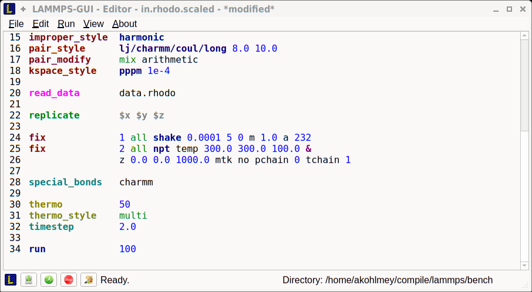

There is the typical menu bar at the top, then the main editor buffer,
and a status bar at the bottom.  The input file contents are shown
with line numbers on the left and the input is colored according to
the LAMMPS input file syntax.  The status bar shows the status of
LAMMPS execution on the left (e.g. "Ready." when idle) and the current
working directory on the right.  The name of the current file in the
buffer is shown in the window title; the word `*modified*` is added if
the buffer edits have not yet saved to a file.  The size of the main
window will be stored when exiting and restored when starting again.

Opening Files
^^^^^^^^^^^^^

The LAMMPS GUI application will try to open the first command line
argument as a LAMMPS input script, further arguments are ignored.
When no argument is given, LAMMPS GUI will start with an empty buffer.
Files can also be opened via the ``File`` menu or by drag-and-drop of
a file from a graphical file manager into the editor window.  Only one
file can be open at a time, so opening a new file with a filled buffer
will close the buffer.  If the buffer has unsaved modifications, you
will be asked to either cancel the operation, discard the changes, or
save them.

Running LAMMPS
^^^^^^^^^^^^^^

From within the LAMMPS GUI main window LAMMPS can be started either
from the ``Run`` menu using the ``Run LAMMPS from Editor Buffer``
entry, by the hotkey `Ctrl-Enter` (`Command-Enter` on macOS), or by
clicking on the green "Run" button in the status bar.  All of these
operations will cause LAMMPS to process the entire input script, which
may contain multiple :doc:`run <run>` or :doc:`minimize <minimize>`
commands.

LAMMPS runs in a separate thread, so the GUI stays responsive and is
able to interact with the running calculation and access data it
produces.  It is important to note that running LAMMPS this way is
using the contents of the input buffer for the run (via the
:cpp:func:`lammps_commands_string()` function of the LAMMPS C-library
interface), and **not** the original file it was read from.  Thus, if
there are unsaved changes in the buffer, they *will* be used.  As an
alternative, it is also possible to run LAMMPS by reading the contents
of a file from the ``Run LAMMPS from File`` menu entry or with
`Ctrl-Shift-Enter`.  This option may be required in some rare cases
where the input uses some functionality that is not compatible with
running LAMMPS from a string buffer.  For consistency, any unsaved
changes in the buffer must be either saved to the file or undone
before LAMMPS can be run from a file.

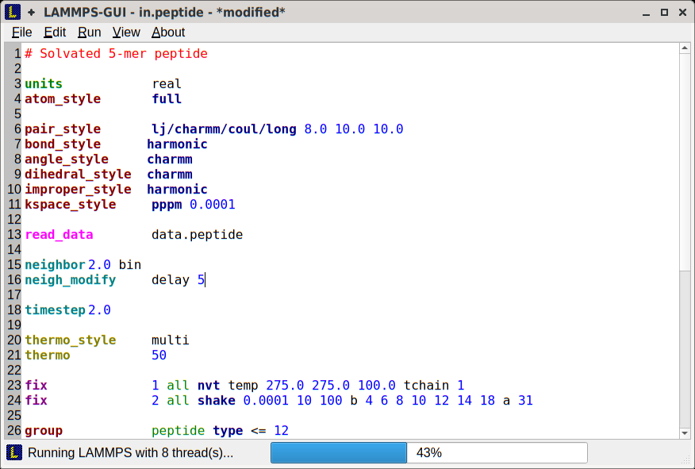

While LAMMPS is running, the contents of the status bar change.  On
the left side there is a text indicating that LAMMPS is running, which
will also show the number of active threads, if thread-parallel
acceleration was selected in the ``Preferences`` dialog.  On the right
side, a progress bar is shown that displays the estimated progress for
the current :doc:`run command <run>`.

Also, the line number of the currently executed command will be
highlighted in green.

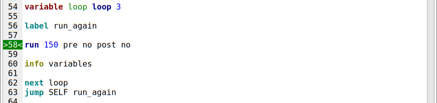

If an error occurs (in the example below the command :doc:`label
<label>` was incorrectly capitalized as "Label"), an error message
dialog will be shown and the line of the input which triggered the
error will be highlighted.  The state of LAMMPS in the status bar will
be set to "Failed." instead of "Ready."

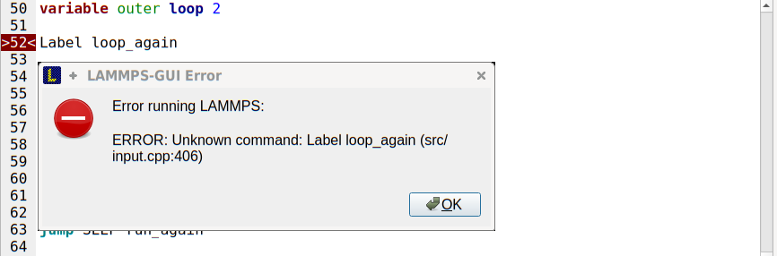

Up to three additional windows will open during a run:

- a log window with the captured screen output
- a chart window with a line graph created from the thermodynamic output of the run
- a slide show window with images created by a :doc:`dump image command <dump_image>`

More information on those windows and how to adjust their behavior and
contents is given below.

An active LAMMPS run can be stopped cleanly by using either the ``Stop
LAMMPS`` entry in the ``Run`` menu, the hotkey `Ctrl-/` (`Command-/`
on macOS), or by clicking on the red button in the status bar.  This
will cause the running LAMMPS process to complete the current timestep
(or iteration for energy minimization) and then complete the
processing of the buffer while skipping all run or minimize commands.
This is equivalent to the input script command :doc:`timer timeout 0
<timer>` and is implemented by calling the
:cpp:func:`lammps_force_timeout()` function of the LAMMPS C-library
interface.  Please see the corresponding documentation pages to
understand the implications of this operation.

Log Window
----------

By default, when starting a run, a "Log Window" will open that displays
the current screen output of the LAMMPS calculation, that would normally
be seen in the command line window, as shown below.

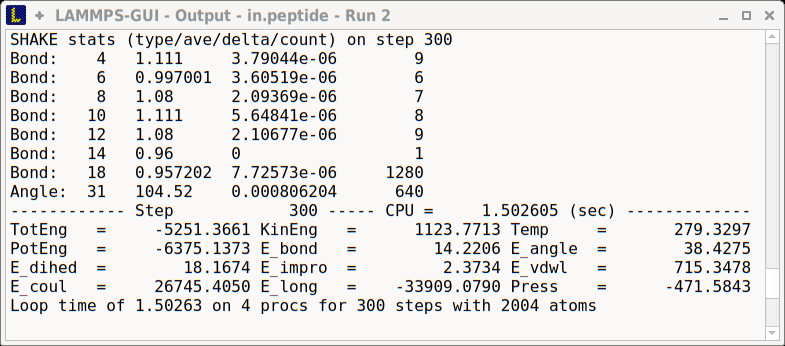

LAMMPS GUI captures the screen output as it is generated and updates
the log window regularly during a run.

By default, there will be a new window for each run, so that it is
possible to visually compare outputs from different runs.  It is also
possible to change the behavior of LAMMPS GUI in the preferences dialog
to *replace* an existing log window for a new run or to not show the log
window by default.  It is also possible to show or hide the current log
window from the ``View`` menu.

The text in the log window is read-only and cannot be modified, but
editor commands to select and copy all or parts of the text can be used.
The "Select All" and "Copy" functions are also available via a context
menu by clicking with the right mouse button.

Chart Window
------------

By default, when starting a run, a "Chart Window" will open that
displays a plot of thermodynamic output of the LAMMPS calculation as
shown below.

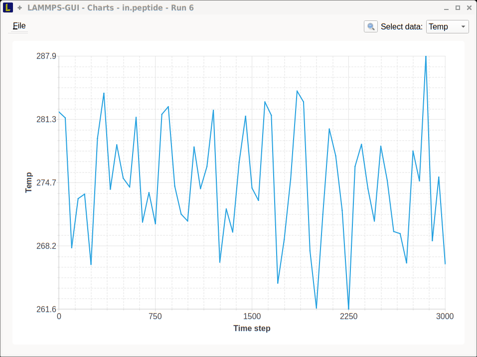

The drop down menu on the top right allows selection of different
properties that are computed and written to thermo output.  Only one
property can be shown at a time.  The plots will be updated with new
data as the run progresses, so they can be used to visually monitor the
evolution of available properties.  From the ``File`` menu on the top
left, it is possible to save an image of the currently displayed plot or
export the data in either plain text columns (for use by plotting tools
like `gnuplot <http://www.gnuplot.info/>`_ or `grace
<https://plasma-gate.weizmann.ac.il/Grace/>`_), or as CSV data which can
be imported for further processing with Microsoft Excel or `pandas
<https://pandas.pydata.org/>`_

Thermo output data from successive run commands in the input script will
be combined into a single data set unless the format, number, or names
of output columns are changed with a :doc:`thermo_style <thermo_style>`
or a :doc:`thermo_modify <thermo_modify>` command, or the current time
step is reset with :doc:`reset_timestep <reset_timestep>`, or if a
:doc:`clear <clear>` command is issued.

Image Slide Show
----------------

By default, if the LAMMPS input contains a :doc:`dump image
<dump_image>` command, a "Slide Show" window will open which loads and
displays the images created by LAMMPS as they are written.

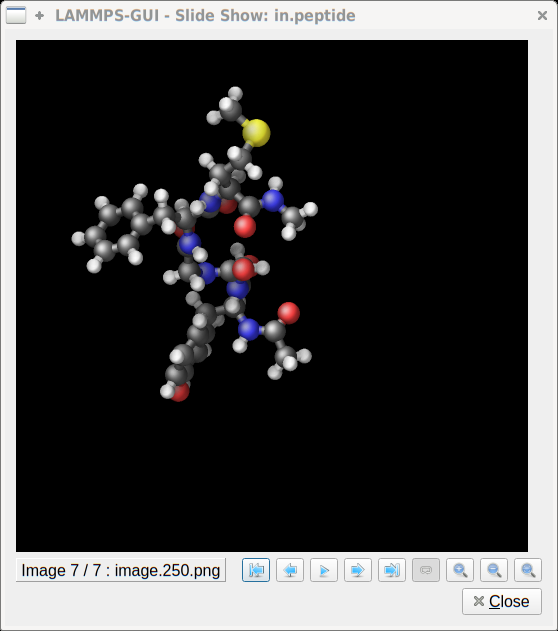

The various buttons at the bottom right of the window allow either
single stepping through the sequence of images or playing an animation
(as a continuous loop or once from first to last).  It is also possible
to zoom in or zoom out of the displayed images.  The slide show window
will be closed when a new file is loaded.

Variable Info
-------------

During a run, it may be of interest to monitor the value of input
script variables, for example to monitor the progress of loops.  This
can be done by enabling the "Variables Window" in the ``View`` menu or
by using the `Ctrl-Shift-W` hotkey.  This will show info similar to
the :doc:`info variables <info>` command in a separate window as shown
below.

.. image:: JPG/lammps-gui-variable-info.png
   :align: center
   :scale: 75%

Like the log and chart windows, its content is continuously updated
during a run.  It will show "(none)" if there are no variables
defined.  Note that it is also possible to *set* :doc:`index style
variables <variable>`, that would normally be set via command line
flags, via the "Set Variables..." dialog from the ``Run`` menu.

Viewing Snapshot Images
-----------------------

By selecting the ``Create Image`` entry in the ``Run`` menu, or by
hitting the `Ctrl-I` (`Command-I` on macOS) hotkey, or by clicking on
the "palette" button in the status bar, LAMMPS GUI will send a custom
:doc:`write_dump image <dump_image>` command to LAMMPS and read the
resulting snapshot image with the current state of the system into an
image viewer window.  This functionality is not available *during* an
ongoing run.  When LAMMPS is not yet initialized, LAMMPS GUI will try to
identify the line with the first run or minimize command and execute all
command up to that line from the input buffer and then add a "run 0"
command.  This will initialize the system so an image of the initial
state of the system can be rendered.  If there was an error, the
snapshot image viewer will not appear.

When possible, LAMMPS GUI will try to detect which elements the atoms
correspond to (via their mass) and then colorize them in the image
accordingly.  Otherwise the default predefined sequence of colors is
assigned to the different atom types.

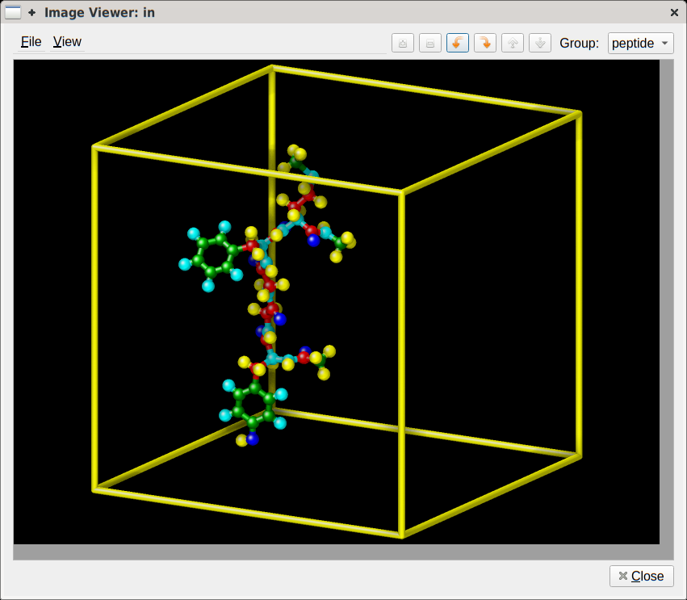

The default image size, some default image quality settings, the view
style and some colors can be changed in the ``Preferences`` dialog
window.  From the image viewer window further adjustments can be made:
actual image size, high-quality (SSAO) rendering, anti-aliasing, view
style, display of box or axes, zoom factor.  The view of the system
can be rotated horizontally and vertically.  It is also possible to
only display the atoms within a group defined in the input script
(default is "all").  After each change, the image is rendered again
and the display updated.  The small palette icon on the top left will
be colored while LAMMPS is running to render the new image; it will be
grayed out when it is finished.  When there are many atoms to render
and high quality images with anti-aliasing are requested, re-rendering
may take several seconds.  From the ``File`` menu of the image window,
the current image can be saved to a file or copied into the
cut-n-paste buffer for pasting into another application.

Editor Functions
----------------

The editor has most of the usual functionality that similar programs
have: text selection via mouse or with cursor moves while holding the
Shift key, Cut (`Ctrl-X`), Copy (`Ctrl-C`), Paste (`Ctrl-V`), Undo
(`Ctrl-Z`), Redo (`Ctrl-Shift-Z`), Select All (`Ctrl-A`).  When trying
to exit the editor with a modified buffer, a dialog will pop up asking
whether to cancel the exit operation, or to save or not save the buffer
contents to a file.

Context Specific Word Completion
^^^^^^^^^^^^^^^^^^^^^^^^^^^^^^^^

By default, LAMMPS GUI will display a small popup frame with possible
completions for LAMMPS input script commands or styles after 2
characters of a word have been typed. The word can then be completed
through selecting an entry by scrolling down with the cursor keys and
selecting with the 'Enter' key or by clicking on the entry with the
mouse.  The automatic completion popup can be disabled in the
``Preferences`` dialog, but the completion can still be requested
manually by either hitting the 'Shift-TAB' key or by right-clicking with
the mouse and selecting the option from the context menu.  Most of the
completion information is taken from the LAMMPS instance and thus it
will be adjusted to only show options available that have been enabled
while compiling LAMMPS, however that excludes accelerated styles and
commands, only non-suffix versions are shown.

Line Reformatting
^^^^^^^^^^^^^^^^^

The editor supports reformatting lines according to the syntax in
order to have consistently aligned lines.  This primarily means adding
space padding to commands, type specifiers, IDs and names.  This
reformatting is performed by default when hitting the 'Enter' key to
start a new line.  This feature can be turned off in the
``Preferences`` dialog, but it can still be manually performed by
hitting the 'TAB' key.

Internally this functionality is achieved by splitting the line into
"words" and then putting it back together with padding added where the
context can be detected; otherwise a single space is used.

Context Specific Help
^^^^^^^^^^^^^^^^^^^^^

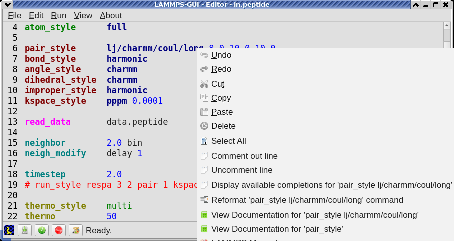

A unique feature of the LAMMPS GUI is the option to look up the
documentation for the command in the current line.  This can be done
by either clicking the right mouse button or by using the `Ctrl-?`
hotkey.  When clicking the mouse there are additional entries in the
context menu that will open the corresponding documentation page in
the online LAMMPS documentation.  When using the hotkey, the first of
those entries will be chosen directly.

Menu
----

The menu bar has entries ``File``, ``Edit``, ``Run``, ``View``, and
``About``.  Instead of using the mouse to click on them, the
individual menus can also be activated by hitting the `Alt` key
together with the corresponding underlined letter, that is `Alt-F`
will activate the ``File`` menu.  For the corresponding activated
sub-menus, the underlined letter together with the `Alt` key can again
be used to select entries instead of using the mouse.

File
^^^^

The ``File`` menu offers the usual options:

- ``New`` will clear the current buffer and reset the file name to ``*unknown*``
- ``Open`` will open a dialog to select a new file
- ``Save`` will save the current file; if the file name is ``*unknown*``
  a dialog will open to select a new file name
- ``Save As`` will open a dialog to select and new file name and save
  the buffer to it
- ``Quit`` will exit LAMMPS GUI. If there are unsaved changes, a dialog
  will appear to either cancel the operation, or to save or not save the
  edited file.

In addition, up to 5 recent file names will be listed after the
``Open`` entry that allows re-opening recent files.  This list is
stored when quitting and recovered when starting again.

Edit
^^^^

The ``Edit`` menu offers the usual editor functions like ``Undo``,
``Redo``, ``Cut``, ``Copy``, ``Paste``.  It can also open a
``Preferences`` dialog (hotkey `Ctrl-P`) and allows deletion of all
stored preferences so they will be reset to default values.

Run
^^^

The ``Run`` menu has options to start and stop a LAMMPS process.
Rather than calling the LAMMPS executable as a separate executable,
the LAMMPS GUI is linked to the LAMMPS library and thus can run LAMMPS
internally through the :ref:`LAMMPS C-library interface
<lammps_c_api>`.

Specifically, a LAMMPS instance will be created by calling
:cpp:func:`lammps_open_no_mpi`.  The buffer contents then executed by
calling :cpp:func:`lammps_commands_string`.  Certain commands and
features are only available after a LAMMPS instance is created.  Its
presence is indicated by a small LAMMPS ``L`` logo in the status bar
at the bottom left of the main window.  As an alternative, it is also
possible to run LAMMPS using the contents of the edited file by
reading the file.  This is mainly provided as a fallback option in
case the input uses some feature that is not available when running
from a string buffer.

The LAMMPS calculation will be run in a concurrent thread so that the
GUI can stay responsive and be updated during the run.  This can be
used to tell the running LAMMPS instance to stop at the next timestep.
The ``Stop LAMMPS`` entry will do this by calling
:cpp:func:`lammps_force_timeout`, which is equivalent to a :doc:`timer
timeout 0 <timer>` command.

The ``Set Variables...`` entry will open a dialog box where
:doc:`index style variables <variable>` can be set. Those variables
will be passed to the LAMMPS instance when it is created and are thus
set *before* a run is started.

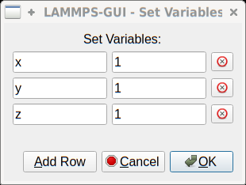

The ``Set Variables`` dialog will be pre-populated with entries that
are set as index variables in the input and any variables that are
used but not defined, if the built-in parser can detect them.  New
rows for additional variables can be added through the ``Add Row``
button and existing rows can be deleted by clicking on the ``X`` icons
on the right.

The ``Create Image`` entry will send a :doc:`dump image <dump_image>`
command to the LAMMPS instance, read the resulting file, and show it
in an ``Image Viewer`` window.

The ``View in OVITO`` entry will launch `OVITO <https://ovito.org>`_
with a :doc:`data file <write_data>` containing the current state of
the system.  This option is only available if the LAMMPS GUI can find
the OVITO executable in the system path.

The ``View in VMD`` entry will launch VMD with a :doc:`data file
<write_data>` containing the current state of the system.  This option
is only available if the LAMMPS GUI can find the VMD executable in the
system path.

View
^^^^

The ``View`` menu offers to show or hide additional windows with log
output, charts, slide show, variables, or snapshot images.  The
default settings for their visibility can be changed in the
``Preferences dialog``.

About
^^^^^

The ``About`` menu finally offers a couple of dialog windows and an
option to launch the LAMMPS online documentation in a web browser.
The ``About LAMMPS`` entry displays a dialog with a summary of the
configuration settings of the LAMMPS library in use and the version
number of LAMMPS GUI itself.  The ``Quick Help`` displays a dialog
with a minimal description of LAMMPS GUI.  The ``LAMMPS GUI Howto``
entry will open this documentation page from the online documentation
in a web browser window.  The ``LAMMPS Manual`` entry will open the
main page of the LAMMPS documentation in the web browser.

-----

Preferences
-----------

The ``Preferences`` dialog allows customization of the behavior and
look of the LAMMPS GUI application.  The settings are grouped and each
group is displayed within a tab.

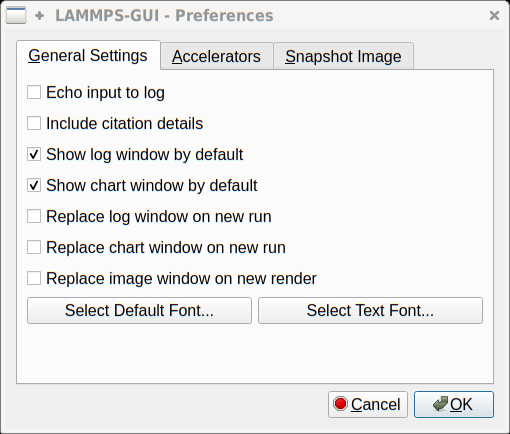

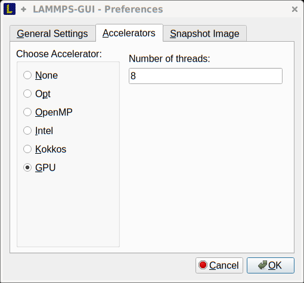

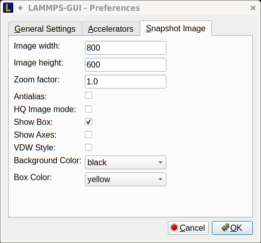

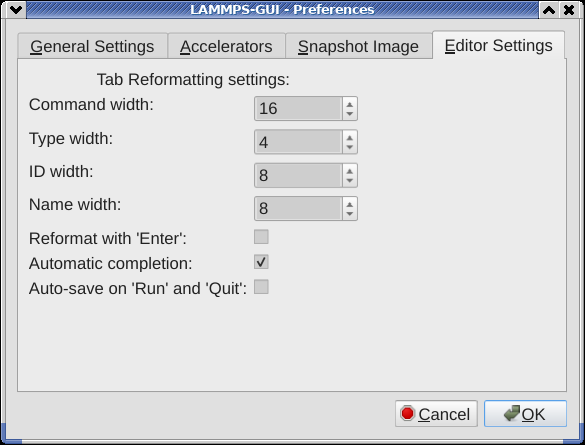

|guiprefs1|  |guiprefs2|  |guiprefs3|  |guiprefs4|

General Settings:
^^^^^^^^^^^^^^^^^

- *Echo input to log:* when checked, all input commands, including
  variable expansions, will be echoed to the log window. This is
  equivalent to using `-echo screen` at the command line.  There is no
  log *file* produced by default, since LAMMPS GUI uses `-log none`.
- *Include citation details:* when checked full citation info will be
  included to the log window.  This is equivalent to using `-cite
  screen` on the command line.
- *Show log window by default:* when checked, the screen output of a
  LAMMPS run will be collected in a log window during the run
- *Show chart window by default:* when checked, the thermodynamic
  output of a LAMMPS run will be collected and displayed in a chart
  window as line graphs.
- *Show slide show window by default:* when checked, a slide show
  window will be shown with images from a dump image command, if
  present, in the LAMMPS input.
- *Replace log window on new run:* when checked, an existing log
  window will be replaced on a new LAMMPS run, otherwise each run will
  create a new log window.
- *Replace chart window on new run:* when checked, an existing chart
  window will be replaced on a new LAMMPS run, otherwise each run will
  create a new chart window.
- *Replace image window on new render:* when checked, an existing
  chart window will be replaced when a new snapshot image is requested,
  otherwise each command will create a new image window.
- *Path to LAMMPS Shared Library File:* this options is only available
  when LAMMPS GUI was compiled to load the LAMMPS library at run time
  instead of being linked to it directly.  With the ``Browse..`` button
  or by changing the text, a different shared library file with a
  different compilation of LAMMPS with different settings or from a
  different version can be loaded.  After this setting was changed,
  LAMMPS GUI needs to be re-launched.
- *Select Default Font:* Opens a font selection dialog where the type
  and size for the default font (used for everything but the editor and
  log) of the application can be set.
- *Select Text Font:* Opens a font selection dialog where the type and
  size for the text editor and log font of the application can be set.
- *GUI update interval:* Allows to set the time interval between GUI
  and data updates during a LAMMPS run in milliseconds. The default is
  to update the GUI every 100 milliseconds. This is good for most cases.
  For LAMMPS runs that run very fast, however, data may be missed and
  through lowering this interval, this can be corrected. However, this
  will make the GUI use more resources, which may be a problem on some
  computers with slower CPUs. The default value is 100 milliseconds.

Accelerators:
^^^^^^^^^^^^^

This tab enables selection of an accelerator package for LAMMPS to use
and is equivalent to using the `-suffix` and `-package` flags on the
command line.  Only settings supported by the LAMMPS library and local
hardware are available.  The `Number of threads` field allows setting
the maximum number of threads for the accelerator packages that use
threads.

Snapshot Image:
^^^^^^^^^^^^^^^

This tab allows setting defaults for the snapshot images displayed in
the ``Image Viewer`` window, such as its dimensions and the zoom
factor applied.  The *Antialias* switch will render images with twice
the number of pixels for width and height and then smoothly scale the
image back to the requested size.  This produces higher quality images
with smoother edges at the expense of requiring more CPU time to
render the image.  The *HQ Image mode* option turns on screen space
ambient occlusion (SSAO) mode when rendering images.  This is also
more time consuming, but produces a more 'spatial' representation of
the system shading of atoms by their depth.  The *VDW Style* checkbox
selects whether atoms are represented by space filling spheres when
checked or by smaller spheres and sticks.  Finally there are a couple
of drop down lists to select the background and box colors.

Editor Settings:
^^^^^^^^^^^^^^^^

This tab allows tweaking settings of the editor window.  Specifically
the amount of padding to be added to LAMMPS commands, types or type
ranges, IDs (e.g. for fixes), and names (e.g. for groups).  The value
set is the minimum width for the text element and it can be chosen in
the range between 1 and 32.

The two settings which follow enable or disable the automatic
reformatting when hitting the 'Enter' key and the automatic display of
the completion popup window.

-----------

Hotkeys
-------

Almost all functionality is accessible from the menu or via hotkeys.
The following hotkeys are available (On macOS use the Command key
instead of Ctrl/Control).

.. list-table::
   :header-rows: 1
   :widths: auto

   * - Hotkey
     - Function
     - Hotkey
     - Function
     - Hotkey
     - Function
   * - Ctrl+N
     - New File
     - Ctrl+Z
     - Undo edit
     - Ctrl+Enter
     - Run Input
   * - Ctrl+O
     - Open File
     - Ctrl+Shift+Z
     - Redo edit
     - Ctrl+/
     - Stop Active Run
   * - Ctrl+S
     - Save File
     - Ctrl+C
     - Copy text
     - Ctrl+Shift+V
     - Set Variables
   * - Ctrl+Shift+S
     - Save File As
     - Ctrl+X
     - Cut text
     - Ctrl+I
     - Snapshot Image
   * - Ctrl+Q
     - Quit
     - Ctrl+V
     - Paste text
     - Ctrl+L
     - Slide Show
   * - Ctrl+W
     - Close Window
     - Ctrl+A
     - Select All
     - Ctrl+P
     - Preferences
   * - Ctrl+Shift+A
     - About LAMMPS
     - Ctrl+Shift+H
     - Quick Help
     - Ctrl+Shift+G
     - LAMMPS GUI Howto
   * - Ctrl+Shift+M
     - LAMMPS Manual
     - Ctrl+?
     - Context Help
     - Ctrl+Shift+W
     - Show Variables
   * - Ctrl+Shift+Enter
     - Run File
     - TAB
     - Reformat line
     - Shift+TAB
     - Show Completions

Further editing keybindings `are documented with the Qt documentation
<https://doc.qt.io/qt-5/qplaintextedit.html#editing-key-bindings>`_.  In
case of conflicts the list above takes precedence.
