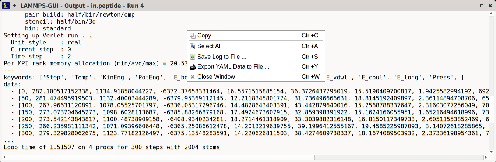
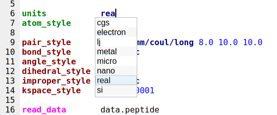
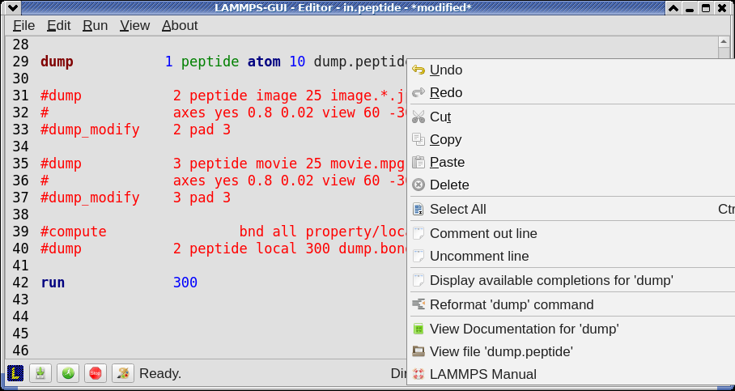

Using LAMMPS-GUI
================

This document describes **LAMMPS-GUI version 1.6**.

-----

LAMMPS-GUI is a graphical text editor customized for editing LAMMPS
input files that is linked to the :ref:`LAMMPS library <lammps_c_api>`
and thus can run LAMMPS directly using the contents of the editor's text
buffer as input.  It can retrieve and display information from LAMMPS
while it is running, display visualizations created with the :doc:`dump
image command <dump_image>`, and is adapted specifically for editing
LAMMPS input files through text completion and reformatting, and linking
to the online LAMMPS documentation for known LAMMPS commands and styles.

.. note::

   Pre-compiled, ready-to-use LAMMPS-GUI executables for Linux x86\_64
   (Ubuntu 20.04LTS or later and compatible), macOS (version 11 aka Big
   Sur or later), and Windows (version 10 or later) :ref:`are available
   <lammps_gui_install>` for download.  None-MPI LAMMPS executables for
   running LAMMPS from the command line and :doc:`some LAMMPS tools <Tools>`
   are also included.

   The source code for LAMMPS-GUI is included in the LAMMPS source code
   distribution and can be found in the ``tools/lammps-gui`` folder.  It
   can be compiled alongside LAMMPS when :doc:`compiling with CMake
   <Build_cmake>`.

LAMMPS-GUI tries to provide an experience similar to what people
traditionally would have running LAMMPS using a command line window
and the console LAMMPS executable but just rolled into a single executable:

- writing & editing LAMMPS input files with a text editor
- run LAMMPS on those input file with selected command line flags
- use or extract data from the created files and visualize it with
  either a molecular visualization program or a plotting program

That procedure is quite effective for people proficient in using the
command line, as that allows them to use tools for the individual steps
that they are most comfortable with.  It is often *required* to adopt
this workflow when running LAMMPS simulations on high-performance
computing facilities.

The main benefit of using LAMMPS-GUI is that many basic tasks can be
done directly from the GUI without switching to a text console window or
using external programs, let alone writing scripts to extract data from
the generated output.  It also integrates well with graphical desktop
environments where the `.lmp` filename extension can be registered with
LAMMPS-GUI as the executable to launch when double clicking on such
files.  Also, LAMMPS-GUI has support for drag-n-drop, i.e.  an input
file can be selected and then moved and dropped on the LAMMPS-GUI
executable, and LAMMPS-GUI will launch and read the file into its
buffer.

LAMMPS-GUI thus makes it easier for beginners to get started running
simple LAMMPS simulations.  It is very suitable for tutorials on LAMMPS
since you only need to learn how to use a single program for most tasks
and thus time can be saved and people can focus on learning LAMMPS.
The tutorials at https://lammpstutorials.github.io/ were specifically
updated for use with LAMMPS-GUI.

Another design goal is to keep the barrier low when replacing part of
the functionality of LAMMPS-GUI with external tools.

The following text provides a detailed tour of the features and
functionality of LAMMPS-GUI.  Suggestions for new features and
reports of bugs are always welcome.  You can use the :doc:`the same
channels as for LAMMPS itself <Errors_bugs>` for that purpose.

-----

Installing Pre-compiled LAMMPS-GUI Packages
-------------------------------------------

LAMMPS-GUI is available as pre-compiled binary packages for Linux
x86\_64, macOS 11 and later, and Windows 10 and later.  Alternately, it
can be compiled from source.

Windows 10 and later
^^^^^^^^^^^^^^^^^^^^

After downloading the ``LAMMPS-Win10-64bit-GUI-<version>.exe`` installer
package, you need to execute it, and start the installation process.
Since those packages are currently unsigned, you have to enable "Developer Mode"
in the Windows System Settings to run the installer.

MacOS 11 and later
^^^^^^^^^^^^^^^^^^

After downloading the ``LAMMPS-macOS-multiarch-GUI-<version>.dmg``
installer package, you need to double-click it and then, in the window
that opens, drag the app bundle as indicated into the "Applications"
folder.  The follow the instructions in the "README.txt" file to
get access to the other included executables.

Linux on x86\_64
^^^^^^^^^^^^^^^^

For Linux with x86\_64 CPU there are currently two variants. The first
is compiled on Ubuntu 20.04LTS, is using some wrapper scripts, and
should be compatible with more recent Linux distributions.  After
downloading and unpacking the
``LAMMPS-Linux-x86_64-GUI-<version>.tar.gz`` package.  You can switch
into the "LAMMPS_GUI" folder and execute "./lammps-gui" directly.

The second variant uses `flatpak <https://www.flatpak.org>`_ and
requires the flatpak management and runtime software to be installed.
After downloading the ``LAMMPS-GUI-Linux-x86_64-GUI-<version>.tar.gz``
flatpak bundle, you can install it with ``flatpak install --user
LAMMPS-GUI-Linux-x86_64-GUI-<version>.tar.gz``.  After installation,
LAMMPS-GUI should be integrated into your desktop environment under
"Applications > Science" but also can be launched from the console with
``flatpak run org.lammps.lammps-gui``.  The flatpak bundle also includes
the console LAMMPS executable ``lmp`` which can be launched to run
simulations with, for example: ``flatpak run --command=lmp
org.lammps.lammps-gui -in in.melt``.

Compiling from Source
^^^^^^^^^^^^^^^^^^^^^

There also are instructions for :ref:`compiling LAMMPS-GUI from source
code <lammps_gui_compilation>` available elsewhere in the manual.
Compilation from source *requires* using CMake.

-----

Starting LAMMPS-GUI
-------------------

When LAMMPS-GUI starts, it shows the main window, labeled *Editor*, with
either an empty buffer or the contents of the file used as argument. In
the latter case it may look like the following:

.. image:: JPG/lammps-gui-main.png
   :align: center
   :scale: 50%

There is the typical menu bar at the top, then the main editor buffer,
and a status bar at the bottom.  The input file contents are shown
with line numbers on the left and the input is colored according to
the LAMMPS input file syntax.  The status bar shows the status of
LAMMPS execution on the left (e.g. "Ready." when idle) and the current
working directory on the right.  The name of the current file in the
buffer is shown in the window title; the word `*modified*` is added if
the buffer edits have not yet saved to a file.  The geometry of the main
window is stored when exiting and restored when starting again.

Opening Files
^^^^^^^^^^^^^

The LAMMPS-GUI application can be launched without command line arguments
and then starts with an empty buffer in the *Editor* window.  If arguments
are given LAMMPS will use first command line argument as the file name for
the *Editor* buffer and reads its contents into the buffer, if the file
exists.  All further arguments are ignored.  Files can also be opened via
the *File* menu, the `Ctrl-O` (`Command-O` on macOS) keyboard shortcut
or by drag-and-drop of a file from a graphical file manager into the editor
window.  If a file extension (e.g. ``.lmp``) has been registered with the
graphical environment to launch LAMMPS-GUI, an existing input file can
be launched with LAMMPS-GUI through double clicking.

Only one file can be edited at a time, so opening a new file with a
filled buffer closes that buffer.  If the buffer has unsaved
modifications, you are asked to either cancel the operation, discard the
changes, or save them.  A buffer with modifications can be saved any
time from the "File" menu, by the keyboard shortcut `Ctrl-S`
(`Command-S` on macOS), or by clicking on the "Save" button at the very
left in the status bar.

Running LAMMPS
^^^^^^^^^^^^^^

From within the LAMMPS-GUI main window LAMMPS can be started either from
the *Run* menu using the *Run LAMMPS from Editor Buffer* entry, by
the keyboard shortcut `Ctrl-Enter` (`Command-Enter` on macOS), or by
clicking on the green "Run" button in the status bar.  All of these
operations causes LAMMPS to process the entire input script in the
editor buffer, which may contain multiple :doc:`run <run>` or
:doc:`minimize <minimize>` commands.

LAMMPS runs in a separate thread, so the GUI stays responsive and is
able to interact with the running calculation and access data it
produces.  It is important to note that running LAMMPS this way is
using the contents of the input buffer for the run (via the
:cpp:func:`lammps_commands_string()` function of the LAMMPS C-library
interface), and **not** the original file it was read from.  Thus, if
there are unsaved changes in the buffer, they *will* be used.  As an
alternative, it is also possible to run LAMMPS by reading the contents
of a file from the *Run LAMMPS from File* menu entry or with
`Ctrl-Shift-Enter`.  This option may be required in some rare cases
where the input uses some functionality that is not compatible with
running LAMMPS from a string buffer.  For consistency, any unsaved
changes in the buffer must be either saved to the file or undone
before LAMMPS can be run from a file.

.. image:: JPG/lammps-gui-running.png
   :align: center
   :scale: 75%

While LAMMPS is running, the contents of the status bar change.  On
the left side there is a text indicating that LAMMPS is running, which
also indicates the number of active threads, when thread-parallel
acceleration was selected in the *Preferences* dialog.  On the right
side, a progress bar is shown that displays the estimated progress for
the current :doc:`run <run>` or :doc:`minimize <minimize>` command.

Also, the line number of the currently executed command is highlighted
in green.

If an error occurs (in the example below the command :doc:`label
<label>` was incorrectly capitalized as "Label"), an error message
dialog is shown and the line of the input which triggered the error is
highlighted.  The state of LAMMPS in the status bar is set to "Failed."
instead of "Ready."

.. image:: JPG/lammps-gui-run-error.png
   :align: center
   :scale: 75%

Up to three additional windows may open during a run:

- an *Output* window with the captured screen output from LAMMPS
- a *Charts* window with a line graph created from thermodynamic output of the run
- a *Slide Show* window with images created by a :doc:`dump image command <dump_image>`
  in the input

More information on those windows and how to adjust their behavior and
contents is given below.

An active LAMMPS run can be stopped cleanly by using either the *Stop
LAMMPS* entry in the *Run* menu, the keyboard shortcut `Ctrl-/`
(`Command-/` on macOS), or by clicking on the red button in the status
bar.  This will cause the running LAMMPS process to complete the current
timestep (or iteration for energy minimization) and then complete the
processing of the buffer while skipping all run or minimize commands.
This is equivalent to the input script command :doc:`timer timeout 0
<timer>` and is implemented by calling the
:cpp:func:`lammps_force_timeout()` function of the LAMMPS C-library
interface.  Please see the corresponding documentation pages to
understand the implications of this operation.

Output Window
-------------

By default, when starting a run, an *Output* window opens that displays
the screen output of the running LAMMPS calculation, as shown below.
This text would normally be seen in the command line window.

.. image:: JPG/lammps-gui-log.png
   :align: center
   :scale: 50%

LAMMPS-GUI captures the screen output from LAMMPS as it is generated and
updates the *Output* window regularly during a run.

By default, the *Output* window is replaced each time a run is started.
The runs are counted and the run number for the current run is displayed
in the window title.  It is possible to change the behavior of
LAMMPS-GUI in the preferences dialog to create a *new* *Output* window
for every run or to not show the current *Output* window.  It is also
possible to show or hide the *current* *Output* window from the *View*
menu.

The text in the *Output* window is read-only and cannot be modified, but
keyboard shortcuts to select and copy all or parts of the text can be
used to transfer text to another program. Also, the keyboard shortcut
`Ctrl-S` (`Command-S` on macOS) is available to save the *Output* buffer to a
file.  The "Select All" and "Copy" functions, as well as a "Save Log to
File" option are also available from a context menu by clicking with the
right mouse button into the *Output* window text area.

.. versionadded:: 1.6

Should the *Output* window contain embedded YAML format text (see above for a
demonstration), for example from using :doc:`thermo_style yaml
<thermo_style>` or :doc:`thermo_modify line yaml <thermo_modify>`, the
keyboard shortcut `Ctrl-Y` (`Command-Y` on macOS) is available to save
only the YAML parts to a file.  This option is also available from a
context menu by clicking with the right mouse button into the *Output* window
text area.

Charts Window
-------------

.. versionadded:: 1.6

   Plot smoothing support

By default, when starting a run, a *Charts* window opens that displays a
plot of thermodynamic output of the LAMMPS calculation as shown below.

.. image:: JPG/lammps-gui-chart.png
   :align: center
   :scale: 33%

The drop down menu on the top right allows selection of different
properties that are computed and written to thermo output.  Only one
property can be shown at a time.  The plots are updated regularly with
new data as the run progresses, so they can be used to visually monitor
the evolution of available properties.  The update interval can be set
in the *Preferences* dialog.  By default, the raw data for the selected
property is plotted as a blue graph. As soon as there are a sufficient
number of data points, there will be a second graph shown in red with a
smoothed version of the data.  From the drop down menu on the top left,
you can select whether to plot only the raw data, only the smoothed
data or both.  The smoothing uses a `Savitzky-Golay convolution filter
<https://en.wikipedia.org/wiki/Savitzky%E2%80%93Golay_filter>`_ The
window width (left) and order (right) parameters can be set in the boxes
next to the drop down menu.  Default settings are 10 and 4 which means
that the smoothing window includes 10 points each to the left and the
right of the current data point and a fourth order polynomial is fit to
the data in the window.

You can use the mouse to zoom into the graph (hold the left button and
drag to mark an area) or zoom out (right click) and you can reset the
view with a click to the "lens" button next to the data drop down menu.

The window title shows the current run number that this chart window
corresponds to.  Same as for the *Output* window, the chart window is
replaced on each new run, but the behavior can be changed in the
*Preferences* dialog.

.. versionadded:: 1.6

   Support for YAML export added

From the *File* menu on the top left, it is possible to save an image
of the currently displayed plot or export the data in either plain text
columns (for use by plotting tools like `gnuplot
<http://www.gnuplot.info/>`_ or `grace
<https://plasma-gate.weizmann.ac.il/Grace/>`_), as CSV data which can be
imported for further processing with Microsoft Excel `LibreOffice Calc
<https://www.libreoffice.org/>`_ or with Python via `pandas
<https://pandas.pydata.org/>`_, or as YAML which can be imported into
Python with `PyYAML <https://pyyaml.org/>`_ or pandas.

Thermo output data from successive run commands in the input script is
combined into a single data set unless the format, number, or names of
output columns are changed with a :doc:`thermo_style <thermo_style>` or
a :doc:`thermo_modify <thermo_modify>` command, or the current time step
is reset with :doc:`reset_timestep <reset_timestep>`, or if a
:doc:`clear <clear>` command is issued.  This is where the YAML export
from the *Charts* window differs from that of the *Output* window:
here you get the compounded data set starting with the last change of
output fields or timestep setting, while the export from the log will
contain *all* YAML output but *segmented* into individual runs.

Image Slide Show
----------------

By default, if the LAMMPS input contains a :doc:`dump image
<dump_image>` command, a "Slide Show" window opens which loads and
displays the images created by LAMMPS as they are written.  This is a
convenient way to visually monitor the progress of the simulation.

.. image:: JPG/lammps-gui-slideshow.png
   :align: center
   :scale: 50%

The various buttons at the bottom right of the window allow single
stepping through the sequence of images or playing an animation (as a
continuous loop or once from first to last).  It is also possible to
zoom in or zoom out of the displayed images. The button on the very
left triggers an export of the slide show animation to a movie file,
provided the `FFmpeg program <https://ffmpeg.org/>`_ is installed.

.. versionadded:: 1.6

When clicking on the "garbage can" icon, all image files of the slide
show will be deleted.  Since their number can be large for long
simulations, this option enables to safely and quickly clean up the
clutter caused in the working directory by those image files without
risk of deleting other files by accident when using wildcards.

Variable Info
-------------

During a run, it may be of interest to monitor the value of input script
variables, for example to monitor the progress of loops.  This can be
done by enabling the "Variables Window" in the *View* menu or by using
the `Ctrl-Shift-W` keyboard shortcut.  This shows info similar to the
:doc:`info variables <info>` command in a separate window as shown
below.

.. image:: JPG/lammps-gui-variable-info.png
   :align: center
   :scale: 75%

Like for the *Output* and *Charts* windows, its content is continuously
updated during a run.  It will show "(none)" if there are no variables
defined.  Note that it is also possible to *set* :doc:`index style
variables <variable>`, that would normally be set via command line
flags, via the "Set Variables..." dialog from the *Run* menu.
LAMMPS-GUI automatically defines the variable "gui_run" to the current
value of the run counter.  That way it is possible to automatically
record a separate log for each run attempt by using the command

.. code-block:: LAMMPS

   log logfile-${gui_run}.txt

at the beginning of an input file. That would record logs to files
``logfile-1.txt``, ``logfile-2.txt``, and so on for successive runs.

.. _snapshot_viewer:

Snapshot Image Viewer
---------------------

By selecting the *Create Image* entry in the *Run* menu, or by
hitting the `Ctrl-I` (`Command-I` on macOS) keyboard shortcut, or by
clicking on the "palette" button in the status bar of the *Editor*
window, LAMMPS-GUI sends a custom :doc:`write_dump image <dump_image>`
command to LAMMPS and reads back the resulting snapshot image with the
current state of the system into an image viewer.  This functionality is
*not* available *during* an ongoing run.  In case LAMMPS is not yet
initialized, LAMMPS-GUI tries to identify the line with the first run or
minimize command and execute all commands from the input buffer up to
that line, and then executes a "run 0" command.  This initializes the
system so an image of the initial state of the system can be rendered.
If there was an error in that process, the snapshot image viewer does
not appear.

When possible, LAMMPS-GUI tries to detect which elements the atoms
correspond to (via their mass) and then colorize them in the image and
set their atom diameters accordingly.  If this is not possible, for
instance when using reduced (= 'lj') :doc:`units <units>`, then
LAMMPS-GUI will check the current pair style and if it is a
Lennard-Jones type potential, it will extract the *sigma* parameter
for each atom type and assign atom diameters from those numbers.

Otherwise the default sequence of colors of the :doc:`dump image
<dump_image>` command is assigned to the different atom types and the
diameters are all the same.

.. figure:: JPG/lammps-gui-image.png
   :align: center
   :scale: 50%

   Visualization of LAMMPS "peptide" example

.. versionchanged:: 1.6

   Buttons for toggling shininess and re-centering were added.

The default image size, some default image quality settings, the view
style and some colors can be changed in the *Preferences* dialog
window.  From the image viewer window further adjustments can be made:
actual image size, high-quality (SSAO) rendering, anti-aliasing, view
style, display of box or axes, zoom factor.  The view of the system can
be rotated horizontally and vertically.  It is also possible to only
display the atoms within a group defined in the input script (default is
"all").  The image can also be re-centered on the center of mass of the
selected group.  After each change, the image is rendered again and the
display updated.  The small palette icon on the top left is colored
while LAMMPS is running to render the new image; it is grayed out when
LAMMPS is finished.  When there are many atoms to render and high
quality images with anti-aliasing are requested, re-rendering may take
several seconds.  From the *File* menu of the image window, the
current image can be saved to a file (keyboard shortcut `Ctrl-S`) or
copied to the clipboard (keyboard shortcut `Ctrl-C`) for pasting the
image into another application.

.. versionadded:: 1.6

From the *File* menu it is also possible to copy the current
:doc:`dump image <dump_image>` and :doc:`dump_modify <dump_image>`
commands to the clipboard so they can be pasted into a LAMMPS input file
so that the visualization settings of the snapshot image can be repeated
for the entire simulation (and thus be repeated in the slide show
viewer). This feature has the keyboard shortcut `Ctrl-D`.

Editor Window
-------------

The *Editor* window of LAMMPS-GUI has most of the usual functionality
that similar programs have: text selection via mouse or with cursor
moves while holding the Shift key, Cut (`Ctrl-X`), Copy (`Ctrl-C`),
Paste (`Ctrl-V`), Undo (`Ctrl-Z`), Redo (`Ctrl-Shift-Z`), Select All
(`Ctrl-A`).  When trying to exit the editor with a modified buffer, a
dialog will pop up asking whether to cancel the exit operation, or to
save or not save the buffer contents to a file.

.. versionadded:: 1.6

The editor has an auto-save mode that can be enabled or disabled in the
*Preferences* dialog.  In auto-save mode, the editor buffer is
automatically saved before running LAMMPS or before exiting LAMMPS-GUI.

Context Specific Word Completion
^^^^^^^^^^^^^^^^^^^^^^^^^^^^^^^^

By default, LAMMPS-GUI displays a small pop-up frame with possible
choices for LAMMPS input script commands or styles after 2 characters of
a word have been typed.

The word can then be completed through selecting an entry by scrolling
up and down with the cursor keys and selecting with the 'Enter' key or
by clicking on the entry with the mouse.  The automatic completion
pop-up can be disabled in the *Preferences* dialog, but the completion
can still be requested manually by either hitting the 'Shift-TAB' key or
by right-clicking with the mouse and selecting the option from the
context menu.  Most of the completion information is retrieved from the
active LAMMPS instance and thus it shows only available options that
have been enabled when compiling LAMMPS. That list, however, excludes
accelerated styles and commands; for improved clarity, only the
non-suffix version of styles are shown.

Line Reformatting
^^^^^^^^^^^^^^^^^

The editor supports reformatting lines according to the syntax in order
to have consistently aligned lines.  This primarily means adding
whitespace padding to commands, type specifiers, IDs and names.  This
reformatting is performed manually by hitting the 'Tab' key.  It is
also possible to have this done automatically when hitting the 'Enter'
key to start a new line.  This feature can be turned on or off in the
*Preferences* dialog for *Editor Settings* with the
"Reformat with 'Enter'" checkbox. The amount of padding for multiple
categories can be adjusted in the same dialog.

Internally this functionality is achieved by splitting the line into
"words" and then putting it back together with padding added where the
context can be detected; otherwise a single space is used between words.

Context Specific Help
^^^^^^^^^^^^^^^^^^^^^

.. |gui-popup1| image:: JPG/lammps-gui-popup-help.png
   :width: 48%

|gui-popup1|  |gui-popup2|

A unique feature of LAMMPS-GUI is the option to look up the LAMMPS
documentation for the command in the current line.  This can be done by
either clicking the right mouse button or by using the `Ctrl-?` keyboard
shortcut.  When using the mouse, there are additional entries in the
context menu that open the corresponding documentation page in the
online LAMMPS documentation in a web browser window.  When using the
keyboard, the first of those entries is chosen.

.. versionadded:: 1.6

If the word under the cursor is a file, then additionally the context
menu has an entry to open the file in a read-only text viewer window.
If the file is a LAMMPS restart file, instead the menu entry offers to
:ref:`inspect the restart <inspect_restart>`.

The text viewer is a convenient way to view the contents of files that
are referenced in the input.  The file viewer also supports on-the-fly
decompression based on the file name suffix in a :ref:`similar fashion
as available with LAMMPS <gzip>`.  If the necessary decompression
program is missing or the file cannot be decompressed, the viewer window
will contain a corresponding message.

.. _inspect_restart:

Inspecting a Restart file
^^^^^^^^^^^^^^^^^^^^^^^^^

.. versionadded:: 1.6

When LAMMPS-GUI is asked to "Inspect a Restart", it will read the
restart file into a LAMMPS instance and then open three different
windows.  The first window is a text viewer with the output of an
:doc:`info command <info>` with system information stored in the
restart.  The second window is text viewer containing a data file
generated with a :doc:`write_data command <write_data>`.  The third
window is a :ref:`Snapshot Image Viewer <snapshot_viewer>` containing a
visualization of the system in the restart.

If the restart file is larger than 250 MBytes, a dialog will ask
for confirmation before continuing, since large restart files
may require large amounts of RAM since the entire system must
be read into RAM.  Thus restart file for large simulations that
have been run on an HPC cluster may overload a laptop or local
workstation. The *Show Details...* button will display a rough
estimate of the additional memory required.

Menu
----

The menu bar has entries *File*, *Edit*, *Run*, *View*, and
*About*.  Instead of using the mouse to click on them, the individual
menus can also be activated by hitting the `Alt` key together with the
corresponding underlined letter, that is `Alt-F` activates the
*File* menu.  For the corresponding activated sub-menus, the key
corresponding the underlined letters can be used to select entries
instead of using the mouse.

File
^^^^

The *File* menu offers the usual options:

- *New* clears the current buffer and resets the file name to ``*unknown*``
- *Open* opens a dialog to select a new file for editing in the *Editor*
- *View* opens a dialog to select a file for viewing in a *separate* window (read-only) with support for on-the-fly decompression as explained above.
- *Inspect restart* opens a dialog to select a file.  If that file is a :doc:`LAMMPS restart <write_restart>` three windows with :ref:`information about the file are opened <inspect_restart>`.
- *Save* saves the current file; if the file name is ``*unknown*``
  a dialog will open to select a new file name
- *Save As* opens a dialog to select and new file name (and folder, if
  desired) and saves the buffer to it.  Writing the buffer to a
  different folder will also switch the current working directory to
  that folder.
- *Quit* exits LAMMPS-GUI. If there are unsaved changes, a dialog will
  appear to either cancel the operation, or to save, or to not save the
  modified buffer.

In addition, up to 5 recent file names will be listed after the *Open*
entry that allows re-opening recently opened files.  This list is stored
when quitting and recovered when starting again.

Edit
^^^^

The *Edit* menu offers the usual editor functions like *Undo*, *Redo*,
*Cut*, *Copy*, *Paste*.  It can also open a *Preferences* dialog
(keyboard shortcut `Ctrl-P`) and allows deleting all stored preferences
and settings, so they are reset to their default values.

Run
^^^

The *Run* menu has options to start and stop a LAMMPS process.  Rather
than calling the LAMMPS executable as a separate executable, the
LAMMPS-GUI is linked to the LAMMPS library and thus can run LAMMPS
internally through the :ref:`LAMMPS C-library interface <lammps_c_api>`
in a separate thread.

Specifically, a LAMMPS instance will be created by calling
:cpp:func:`lammps_open_no_mpi`.  The buffer contents are then executed by
calling :cpp:func:`lammps_commands_string`.  Certain commands and
features are only available after a LAMMPS instance is created.  Its
presence is indicated by a small LAMMPS ``L`` logo in the status bar
at the bottom left of the main window.  As an alternative, it is also
possible to run LAMMPS using the contents of the edited file by
reading the file.  This is mainly provided as a fallback option in
case the input uses some feature that is not available when running
from a string buffer.

The LAMMPS calculations are run in a concurrent thread so that the GUI
can stay responsive and be updated during the run.  The GUI can retrieve
data from the running LAMMPS instance and tell it to stop at the next
timestep.  The *Stop LAMMPS* entry will do this by calling the
:cpp:func:`lammps_force_timeout` library function, which is equivalent
to a :doc:`timer timeout 0 <timer>` command.

The *Set Variables...* entry opens a dialog box where
:doc:`index style variables <variable>` can be set. Those variables
are passed to the LAMMPS instance when it is created and are thus
set *before* a run is started.

.. image:: JPG/lammps-gui-variables.png
   :align: center
   :scale: 75%

The *Set Variables* dialog will be pre-populated with entries that
are set as index variables in the input and any variables that are
used but not defined, if the built-in parser can detect them.  New
rows for additional variables can be added through the *Add Row*
button and existing rows can be deleted by clicking on the *X* icons
on the right.

The *Create Image* entry will send a :doc:`dump image <dump_image>`
command to the LAMMPS instance, read the resulting file, and show it
in an *Image Viewer* window.

The *View in OVITO* entry will launch `OVITO <https://ovito.org>`_
with a :doc:`data file <write_data>` containing the current state of
the system.  This option is only available if LAMMPS-GUI can find
the OVITO executable in the system path.

The *View in VMD* entry will launch VMD with a :doc:`data file
<write_data>` containing the current state of the system.  This option
is only available if LAMMPS-GUI can find the VMD executable in the
system path.

View
^^^^

The *View* menu offers to show or hide additional windows with log
output, charts, slide show, variables, or snapshot images.  The
default settings for their visibility can be changed in the
*Preferences* dialog.

About
^^^^^

The *About* menu finally offers a couple of dialog windows and an
option to launch the LAMMPS online documentation in a web browser.  The
*About LAMMPS-GUI* entry displays a dialog with a summary of the
configuration settings of the LAMMPS library in use and the version
number of LAMMPS-GUI itself.  The *Quick Help* displays a dialog with
a minimal description of LAMMPS-GUI.  The *LAMMPS-GUI Howto* entry
will open this documentation page from the online documentation in a web
browser window.  The *LAMMPS Manual* entry will open the main page of
the LAMMPS online documentation in a web browser window.
The *LAMMPS Tutorial* entry will open the main page of the set of
LAMMPS tutorials authored and maintained by Simon Gravelle at
https://lammpstutorials.github.io/ in a web browser window.

-----

Preferences
-----------

The *Preferences* dialog allows customization of the behavior and
look of LAMMPS-GUI.  The settings are grouped and each group is
displayed within a tab.

.. |guiprefs1| image:: JPG/lammps-gui-prefs-general.png
   :width: 24%

.. |guiprefs2| image:: JPG/lammps-gui-prefs-accel.png
   :width: 24%

.. |guiprefs3| image:: JPG/lammps-gui-prefs-image.png
   :width: 24%

.. |guiprefs4| image:: JPG/lammps-gui-prefs-editor.png
   :width: 24%

|guiprefs1|  |guiprefs2|  |guiprefs3|  |guiprefs4|

General Settings:
^^^^^^^^^^^^^^^^^

- *Echo input to log:* when checked, all input commands, including
  variable expansions, are echoed to the *Output* window. This is
  equivalent to using `-echo screen` at the command line.  There is no
  log *file* produced by default, since LAMMPS-GUI uses `-log none`.
- *Include citation details:* when checked full citation info will be
  included to the log window.  This is equivalent to using `-cite
  screen` on the command line.
- *Show log window by default:* when checked, the screen output of a
  LAMMPS run will be collected in a log window during the run
- *Show chart window by default:* when checked, the thermodynamic
  output of a LAMMPS run will be collected and displayed in a chart
  window as line graphs.
- *Show slide show window by default:* when checked, a slide show
  window will be shown with images from a dump image command, if
  present, in the LAMMPS input.
- *Replace log window on new run:* when checked, an existing log
  window will be replaced on a new LAMMPS run, otherwise each run will
  create a new log window.
- *Replace chart window on new run:* when checked, an existing chart
  window will be replaced on a new LAMMPS run, otherwise each run will
  create a new chart window.
- *Replace image window on new render:* when checked, an existing
  chart window will be replaced when a new snapshot image is requested,
  otherwise each command will create a new image window.
- *Path to LAMMPS Shared Library File:* this option is only visible
  when LAMMPS-GUI was compiled to load the LAMMPS library at run time
  instead of being linked to it directly.  With the *Browse..* button
  or by changing the text, a different shared library file with a
  different compilation of LAMMPS with different settings or from a
  different version can be loaded.  After this setting was changed,
  LAMMPS-GUI needs to be re-launched.
- *Select Default Font:* Opens a font selection dialog where the type
  and size for the default font (used for everything but the editor and
  log) of the application can be set.
- *Select Text Font:* Opens a font selection dialog where the type and
  size for the text editor and log font of the application can be set.
- *Data update interval:* Allows to set the time interval between data
  updates during a LAMMPS run in milliseconds.  The default is to update
  the data (for charts and output window) every 10 milliseconds.  This
  is good for many cases.  Set this to 100 milliseconds or more if
  LAMMPS-GUI consumes too many resources during a run.  For LAMMPS runs
  that run *very* fast (for example in tutorial examples), however, data
  may be missed and through lowering this interval, this can be
  corrected.  However, this will make the GUI use more resources.  This
  setting may be changed to a value between 1 and 1000 milliseconds.
- *Charts update interval:* Allows to set the time interval between redrawing
  the plots in the *Charts* window in milliseconds.  The default is to
  redraw the plots every 500 milliseconds.  This is just for the drawing,
  data collection is managed with the previous setting.

Accelerators:
^^^^^^^^^^^^^

This tab enables selection of an accelerator package for LAMMPS to use
and is equivalent to using the `-suffix` and `-package` flags on the
command line.  Only settings supported by the LAMMPS library and local
hardware are available.  The `Number of threads` field allows setting
the maximum number of threads for the accelerator packages that use
threads.

Snapshot Image:
^^^^^^^^^^^^^^^

This tab allows setting defaults for the snapshot images displayed in
the *Image Viewer* window, such as its dimensions and the zoom factor
applied.  The *Antialias* switch will render images with twice the
number of pixels for width and height and then smoothly scale the image
back to the requested size.  This produces higher quality images with
smoother edges at the expense of requiring more CPU time to render the
image.  The *HQ Image mode* option turns on screen space ambient
occlusion (SSAO) mode when rendering images.  This is also more time
consuming, but produces a more 'spatial' representation of the system
shading of atoms by their depth.  The *Shiny Image mode* option will
render objects with a shiny surface when enabled.  Otherwise the
surfaces will be matted.  The *Show Box* option selects whether the
system box is drawn as a colored set of sticks.  Similarly, the *Show
Axes* option selects whether a representation of the three system axes
will be drawn as colored sticks. The *VDW Style* checkbox selects
whether atoms are represented by space filling spheres when checked or
by smaller spheres and sticks.  Finally there are a couple of drop down
lists to select the background and box colors.

Editor Settings:
^^^^^^^^^^^^^^^^

This tab allows tweaking settings of the editor window.  Specifically
the amount of padding to be added to LAMMPS commands, types or type
ranges, IDs (e.g. for fixes), and names (e.g. for groups).  The value
set is the minimum width for the text element and it can be chosen in
the range between 1 and 32.

The three settings which follow enable or disable the automatic
reformatting when hitting the 'Enter' key, the automatic display of
the completion pop-up window, and whether auto-save mode is enabled.
In auto-save mode the editor buffer is saved before a run or before
exiting LAMMPS-GUI.

-----------

Keyboard Shortcuts
------------------

Almost all functionality is accessible from the menu of the editor
window or through keyboard shortcuts.  The following shortcuts are
available (On macOS use the Command key instead of Ctrl/Control).

.. list-table::
   :header-rows: 1
   :widths: auto

   * - Shortcut
     - Function
     - Shortcut
     - Function
     - Shortcut
     - Function
   * - Ctrl+N
     - New File
     - Ctrl+Z
     - Undo edit
     - Ctrl+Enter
     - Run Input
   * - Ctrl+O
     - Open File
     - Ctrl+Shift+Z
     - Redo edit
     - Ctrl+/
     - Stop Active Run
   * - Ctrl+Shift+F
     - View File
     - Ctrl+C
     - Copy text
     - Ctrl+Shift+V
     - Set Variables
   * - Ctrl+S
     - Save File
     - Ctrl+X
     - Cut text
     - Ctrl+I
     - Snapshot Image
   * - Ctrl+Shift+S
     - Save File As
     - Ctrl+V
     - Paste text
     - Ctrl+L
     - Slide Show
   * - Ctrl+Q
     - Quit Application
     - Ctrl+A
     - Select All
     - Ctrl+P
     - Preferences
   * - Ctrl+W
     - Close Window
     - Ctrl+Shift+H
     - Quick Help
     - Ctrl+Shift+G
     - LAMMPS-GUI Howto
   * - Ctrl+Shift+A
     - About LAMMPS
     - Ctrl+?
     - Context Help
     - Ctrl+Shift+W
     - Show Variables
   * - Ctrl+Shift+M
     - LAMMPS Manual
     - TAB
     - Reformat line
     - Shift+TAB
     - Show Completions
   * - Ctrl+Shift+T
     - LAMMPS Tutorial
     - Ctrl+Shift+Enter
     - Run File
     -
     -

Further editing keybindings `are documented with the Qt documentation
<https://doc.qt.io/qt-5/qplaintextedit.html#editing-key-bindings>`_.  In
case of conflicts the list above takes precedence.

All other windows only support a subset of keyboard shortcuts listed
above.  Typically, the shortcuts `Ctrl-/` (Stop Run), `Ctrl-W` (Close
Window), and `Ctrl-Q` (Quit Application) are supported.
