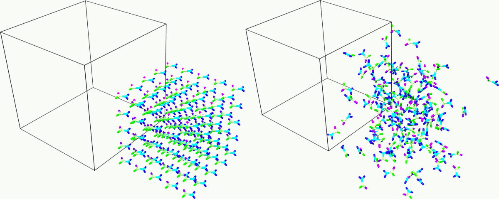
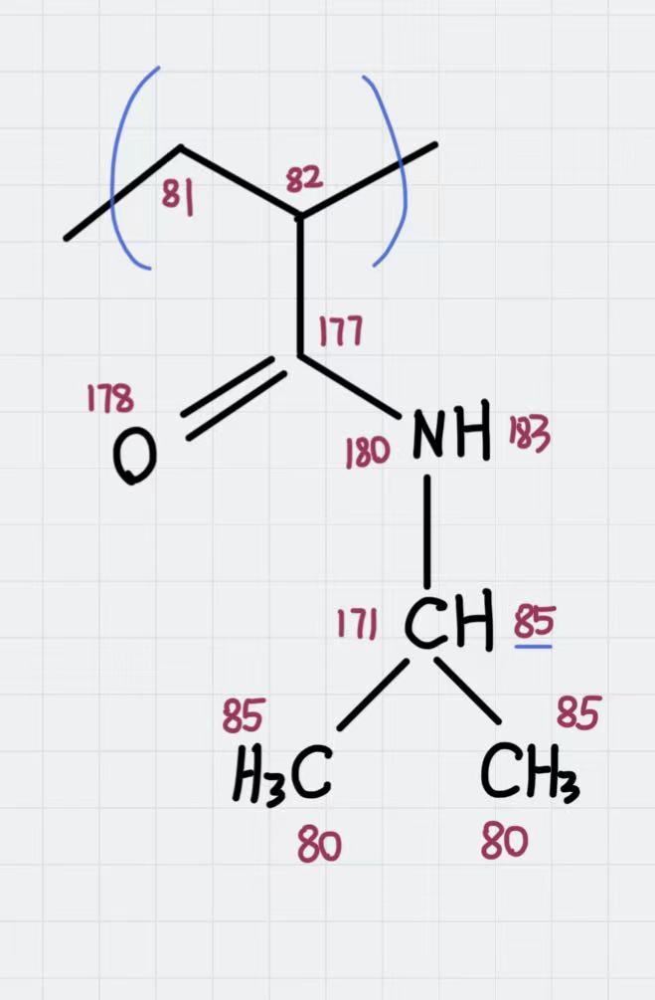
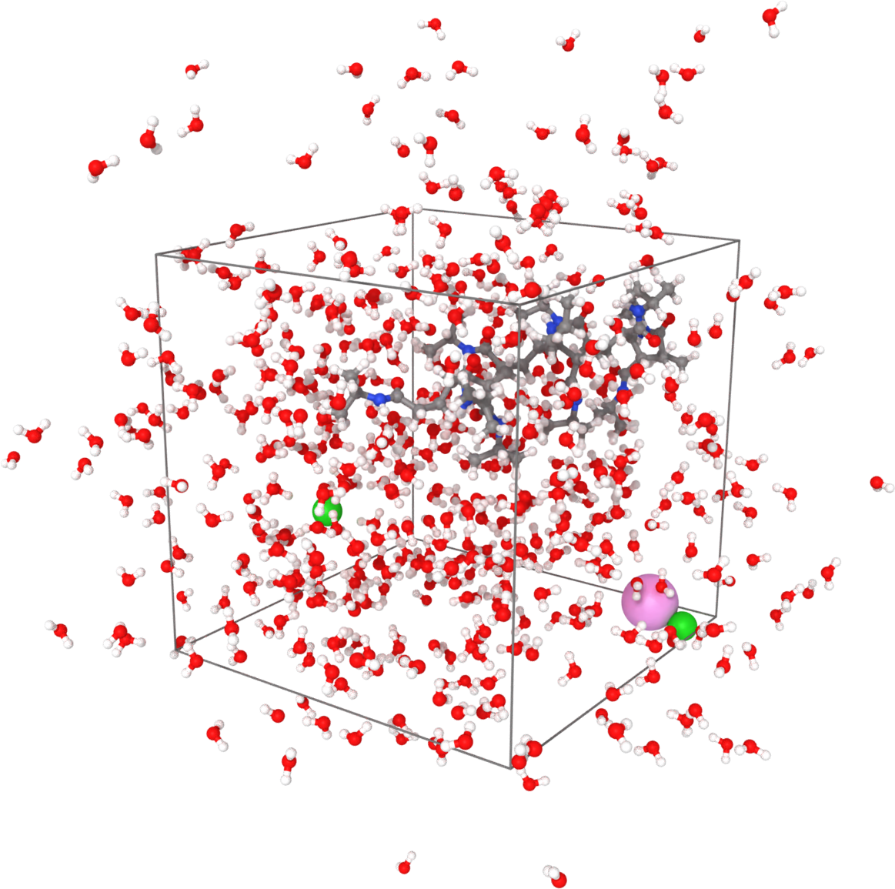

Moltemplate Tutorial
====================

In this tutorial, we are going to use the tool :ref:`Moltemplate
<moltemplate>` to set up a classical molecular dynamic simulation using
the :ref:`OPLS-AA force field <OPLSAA96>`. The first
task is to describe an organic compound and create a complete input deck
for LAMMPS. The second task is to map the OPLS-AA force field to a
molecular sample created with an external tool, e.g. PACKMOL, and
exported as a PDB file.  The files used in this tutorial can be found
in the ``tools/moltemplate/tutorial-files`` folder of the LAMMPS
source code distribution.

Simulating an organic solvent
"""""""""""""""""""""""""""""

This example aims to create a cubic box of the organic solvent
formamide.

The first step is to create a molecular topology in the
LAMMPS-template (LT) file format representing a single molecule, which
will be stored in a Moltemplate object called ``_FAM inherits OPLSAA {}``.
This command states that the object ``_FAM`` is based on an existing
object called ``OPLSAA``, which contains OPLS-AA parameters, atom type
definitions, partial charges, masses and bond-angle rules for many organic
and biological compounds.

The atomic structure is the starting point to populate the command
``write('Data Atoms') {}``, which will write the ``Atoms`` section in the
LAMMPS data file. The OPLS-AA force field uses the ``atom_style full``,
therefore, this column format is used:
``# atomID molID atomType charge coordX coordY coordZ``.
The ``atomID``\ s are replaced with Moltemplate ``$``-type variables, which
are then substituted with unique numerical IDs. The same logic is applied
to the ``molID``, except that the same variable is used for the whole
molecule. The atom types are assigned using ``@``-type variables. The
assignment of atom types (e.g. ``@atom:177``, ``@atom:178``) is done using
the OPLS-AA atom types defined in the "In Charges" section of the file
``oplsaa.lt``, looking for a reasonable match with the description of the atom.
The resulting file (``formamide.lt``) follows:

.. code-block:: bash

   _FAM inherits OPLSAA {

     # atomID    molID  atomType  charge  coordX  coordY  coordZ
     write('Data Atoms') {
       $atom:C00 $mol   @atom:177  0.00    0.100   0.490   0.0
       $atom:O01 $mol   @atom:178  0.00    1.091  -0.250   0.0
       $atom:N02 $mol   @atom:179  0.00   -1.121  -0.181   0.0
       $atom:H03 $mol   @atom:182  0.00   -2.013   0.272   0.0
       $atom:H04 $mol   @atom:182  0.00   -1.056  -1.190   0.0
       $atom:H05 $mol   @atom:221  0.00    0.144   1.570   0.0
     }

     # A list of the bonds in the molecule:
     # BondID   AtomID1   AtomID2
     write('Data Bond List') {
       $bond:C1 $atom:C00 $atom:O01
       $bond:C2 $atom:C00 $atom:H05
       $bond:C3 $atom:C00 $atom:N02
       $bond:C4 $atom:N02 $atom:H03
       $bond:C5 $atom:N02 $atom:H04
     }
   }

You don't have to specify the charge in this example because they will
be assigned according to the atom type. Analogously, only a
"Data Bond List" section is needed as the atom type will determine the
bond type. The other bonded interactions (e.g. angles,
dihedrals, and impropers) will be automatically generated by
Moltemplate.

If the simulation is non-neutral, or Moltemplate complains that you have
missing bond, angle, or dihedral types, this means at least one of your
atom types is incorrect.

The second step is to create a master file with instructions to build a
starting structure and the LAMMPS commands to run an NPT simulation. The
master file (``solv_01.lt``) follows:

.. code-block:: bash

   # Import the force field.
   import /usr/local/moltemplate/moltemplate/force_fields/oplsaa.lt
   import formamide.lt # after oplsaa.lt, as it depends on it.

   # Create the input sample.
   solv = new _FAM [5].move( 4.6, 0, 0)
                   [5].move( 0, 4.6, 0)
                   [5].move( 0, 0, 4.6)
   solv[*][*][*].move(-11.5, -11.5, -11.5)

   # Set the simulation box.
   write_once("Data Boundary") {
    -11.5 11.5 xlo xhi
    -11.5 11.5 ylo yhi
    -11.5 11.5 zlo zhi
   }

   # Create an input deck for LAMMPS.
   write_once("In Init"){
    # Input variables.
    variable run    string solv_01   # output name
    variable ts     equal  1         # timestep
    variable temp   equal  300       # equilibrium temperature
    variable p      equal  1.        # equilibrium pressure
    variable d      equal  1000      # output frequency
    variable equi   equal  5000      # Equilibration steps
    variable prod   equal  30000     # Production steps

    # PBC (set them before the creation of the box).
    boundary p p p
   }

   # Run an NPT simulation.
   write_once("In Run"){
    # Derived variables.
    variable tcouple equal \$\{ts\}*100
    variable pcouple equal \$\{ts\}*1000

    # Output.
    thermo          \$d
    thermo_style custom step etotal evdwl ecoul elong ebond eangle &
    edihed eimp ke pe temp press vol density cpu
    thermo_modify flush yes

    # Trajectory.
    dump TRJ all dcd \$d \$\{run\}.dcd
    dump_modify TRJ unwrap yes

    # Thermalisation and relaxation, NPT ensemble.
    timestep       \$\{ts\}
    fix             NPT all npt temp \$\{temp\} \$\{temp\} \$\{tcouple\} iso \$p \$p \$\{pcouple\}
    velocity all create \$\{temp\} 858096 dist gaussian
    # Short runs to update the PPPM settings as the box shinks.
    run    \$\{equi\} post no
    run    \$\{equi\} post no
    run    \$\{equi\} post no
    run    \$\{equi\}
    # From now on, the density shouldn't change too much.
    run    \$\{prod\}
    unfix NPT
   }

The first two commands insert the content of files ``oplsaa.lt`` and
``formamide.lt`` into the master file. At this point, we can use the
command ``solv = new _FAM [N]`` to create N copies of a molecule of type
``_FAM``. In this case, we create an array of 5*5*5 molecules on a cubic
grid using the coordinate transformation command ``.move( 4.6, 0, 0)``.
See the Moltemplate documentation to learn more about the syntax. As
the sample was created from scratch, we also specify the simulation box
size in the "Data Boundary" section.

The LAMMPS setting for the force field are specified in the file
``oplsaa.lt`` and are written automatically in the input deck. We also
specify the boundary conditions and a set of variables in
the "In Init" section. The remaining commands to run an NPT simulation
are written in the "In Run" section. Note that in this script, LAMMPS
variables are protected with the escape character ``\`` to distinguish
them from Moltemplate variables, e.g. ``\$\{run\}`` is a LAMMPS
variable that is written in the input deck as ``${run}``.

Compile the master file with:

.. code-block:: bash

   moltemplate.sh -overlay-all solv_01.lt

And execute the simulation with the following:

.. code-block:: bash

   mpirun -np 4 lmp -in solv_01.in -l solv_01.log

   Snapshot of the sample at the beginning and end of the simulation.
   Rendered with Ovito.

Mapping an existing structure
"""""""""""""""""""""""""""""

Another helpful way to use Moltemplate is mapping an existing molecular
sample to a force field. This is useful when a complex sample is
assembled from different simulations or created with specialized
software (e.g. PACKMOL). As in the previous example, all molecular
species in the sample must be defined using single-molecule Moltemplate
objects.  For this example, we use a short polymer in a box containing
water molecules and ions in the PDB file ``model.pdb``.

It is essential to understand that the order of atoms in the PDB file
and in the Moltemplate master script must match, as we are using the
coordinates from the PDB file in the order they appear. The order of
atoms and molecules in the PDB file provided is as follows:

- 500 water molecules, with atoms ordered in this sequence:

  .. parsed-literal::

     ATOM      1  O   MOL D   1       5.901   7.384   1.103  0.00  0.00      DUM
     ATOM      2  H   MOL D   1       6.047   8.238   0.581  0.00  0.00      DUM
     ATOM      3  H   MOL D   1       6.188   7.533   2.057  0.00  0.00      DUM

- 1 polymer molecule.
- 1 Ca\ :sup:`2+` ion.
- 2 Cl\ :sup:`-` ions.

In the master LT file, this sequence of molecules is matched with the
following commands:

.. code-block:: bash

   # Create the sample.
   wat=new SPC[500]
   pol=new PolyNIPAM[1]
   cat=new Ca[1]
   ani=new Cl[2]

Note that the first command would create 500 water molecules in the
same position in space, and the other commands will use the coordinates
specified in the corresponding molecular topology block. However, the
coordinates will be overwritten by rendering an external atomic
structure file. Note that if the same molecule species are scattered in
the input structure, it is recommended to reorder and group together
for molecule types to facilitate the creation of the input sample.

The molecular topology for the polymer is created as in the previous
example, with the atom types assigned as in the following schema:

   Atom types assigned to the polymer's repeating unit.

The molecular topology of the water and ions is stated directly into
the master file for the sake of space, but they could also be written
in a separate file(s) and imported before the sample is created.

The resulting master LT file defining short annealing at a fixed volume
(NVT) follows:

.. code-block:: bash

   # Use the OPLS-AA force field for all species.
   import /usr/local/moltemplate/moltemplate/force_fields/oplsaa.lt
   import PolyNIPAM.lt

   # Define the SPC water and ions as in the OPLS-AA
   Ca inherits OPLSAA {
     write("Data Atoms"){
       $atom:a1  $mol:. @atom:354 0.0  0.00000 0.00000 0.000000
     }
   }
   Cl inherits OPLSAA {
     write("Data Atoms"){
       $atom:a1  $mol:. @atom:344 0.0  0.00000 0.00000 0.000000
     }
   }
   SPC inherits OPLSAA {
     write("Data Atoms"){
       $atom:O  $mol:. @atom:76 0.  0.0000000 0.00000 0.000000
       $atom:H1 $mol:. @atom:77 0.  0.8164904 0.00000 0.5773590
       $atom:H2 $mol:. @atom:77 0. -0.8164904 0.00000 0.5773590
     }
     write("Data Bond List") {
       $bond:OH1 $atom:O $atom:H1
       $bond:OH2 $atom:O $atom:H2
     }
   }

   # Create the sample.
   wat=new SPC[500]
   pol=new PolyNIPAM[1]
   cat=new Ca[1]
   ani=new Cl[2]

   # Periodic boundary conditions:
   write_once("Data Boundary"){
     0 26 xlo xhi
     0 26 ylo yhi
     0 26 zlo zhi
   }

   # Define the input variables.
   write_once("In Init"){
     # Input variables.
     variable run    string sample01  # output name
     variable ts     equal  2         # timestep
     variable temp   equal  298.15    # equilibrium temperature
     variable p      equal  1.        # equilibrium pressure
     variable equi   equal  30000     # equilibration steps

     # PBC (set them before the creation of the box).
     boundary p p p
     neighbor        3 bin
   }

   # Run an NVT simulation.
   write_once("In Run"){
     # Set the output.
     thermo          1000
     thermo_style    custom step etotal evdwl ecoul elong ebond eangle &
     edihed eimp pe ke temp press atoms vol density cpu
     thermo_modify flush yes
     compute pe1 all pe/atom pair
     dump TRJ all custom 100 \$\{run\}.dump id xu yu zu c_pe1

     # Minimise the input structure, just in case.
     minimize        .01 .001 1000 100000
     write_data \$\{run\}.min

     # Set the constrains.
     group watergroup type @atom:76 @atom:77
     fix 0 watergroup shake 0.0001 10 0 b @bond:042_043 a @angle:043_042_043

     # Short annealing.
     timestep        \$\{ts\}
     fix       1 all nvt temp \$\{temp\} \$\{temp\} \$(100*dt)
     velocity    all create \$\{temp\} 315443
     run             \$\{equi\}
     unfix 1
   }

In this example, the water model is SPC and it is defined in the
``oplsaa.lt`` file with atom types ``@atom:76`` and ``@atom:77``.  For
water we also use the ``group`` and ``fix shake`` commands with
Moltemplate ``@``-type variables, to ensure consistency with the
numerical values assigned during compilation. To identify the bond and
angle types, look for the extended ``@atom`` IDs, which in this case
are:

.. code-block:: bash

   replace{ @atom:76 @atom:76_b042_a042_d042_i042 }
   replace{ @atom:77 @atom:77_b043_a043_d043_i043 }

From which we can identify the following "Data Bonds By Type":
``@bond:042_043 @atom:*_b042*_a*_d*_i* @atom:*_b043*_a*_d*_i*`` and
"Data Angles By Type": ``@angle:043_042_043 @atom:*_b*_a043*_d*_i*
@atom:*_b*_a042*_d*_i* @atom:*_b*_a043*_d*_i*``

Compile the master file with:

.. code-block:: bash

   moltemplate.sh -overlay-all -pdb model.pdb sample01.lt

And execute the simulation with the following:

.. code-block:: bash

   mpirun -np 4 lmp -in sample01.in -l sample01.log

   Sample visualized with Ovito loading the trajectory into the DATA
   file written after minimization.

------------

.. _OPLSAA96:

**(OPLS-AA)**  Jorgensen, Maxwell, Tirado-Rives, J Am Chem Soc,
118(45), 11225-11236 (1996).
