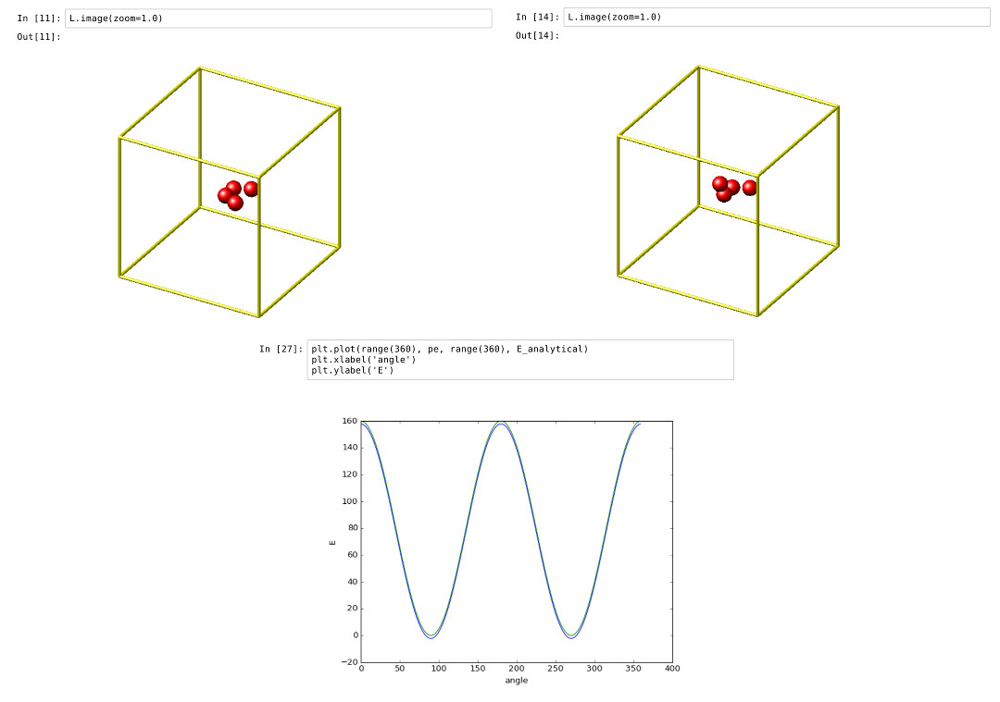
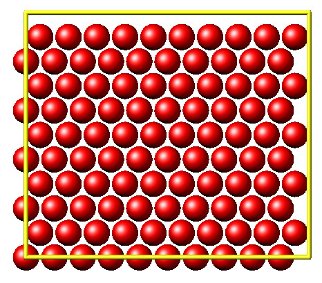

PyLammps Tutorial
=================

.. contents::

Overview
--------

PyLammps is a Python wrapper class which can be created on its own or
use an existing lammps Python object.  It creates a simpler,
Python-like interface to common LAMMPS functionality, in contrast to
the lammps.py wrapper on the C-style LAMMPS library interface which is
written using Python ctypes.  The lammps.py wrapper is discussed on
the :doc:`Python library <Python_library>` doc page.

Unlike the flat ctypes interface, PyLammps exposes a discoverable API.
It no longer requires knowledge of the underlying C++ code
implementation.  Finally, the IPyLammps wrapper builds on top of
PyLammps and adds some additional features for IPython integration
into IPython notebooks, e.g. for embedded visualization output from
dump/image.

Comparison of lammps and PyLammps interfaces
^^^^^^^^^^^^^^^^^^^^^^^^^^^^^^^^^^^^^^^^^^^^

lammps.lammps
"""""""""""""

* uses C-Types
* direct memory access to native C++ data
* provides functions to send and receive data to LAMMPS
* requires knowledge of how LAMMPS internally works (C pointers, etc)

lammps.PyLammps
"""""""""""""""

* higher-level abstraction built on top of original C-Types interface
* manipulation of Python objects
* communication with LAMMPS is hidden from API user
* shorter, more concise Python
* better IPython integration, designed for quick prototyping

Quick Start
-----------

System-wide Installation
^^^^^^^^^^^^^^^^^^^^^^^^

Step 1: Building LAMMPS as a shared library
"""""""""""""""""""""""""""""""""""""""""""

To use LAMMPS inside of Python it has to be compiled as shared library. This
library is then loaded by the Python interface. In this example we enable the
MOLECULE package and compile LAMMPS with C++ exceptions, PNG, JPEG and FFMPEG
output support enabled.

Step 1a: For the CMake based build system, the steps are:

.. parsed-literal::

   mkdir $LAMMPS_DIR/build-shared
   cd  $LAMMPS_DIR/build-shared

   # MPI, PNG, Jpeg, FFMPEG are auto-detected
   cmake ../cmake -DPKG_MOLECULE=yes -DLAMMPS_EXCEPTIONS=yes -DBUILD_LIB=yes -DBUILD_SHARED_LIBS=yes
   make

Step 1b: For the legacy, make based build system, the steps are:

.. parsed-literal::

   cd $LAMMPS_DIR/src

   # add packages if necessary
   make yes-MOLECULE

   # compile shared library using Makefile
   make mpi mode=shlib LMP_INC="-DLAMMPS_PNG -DLAMMPS_JPEG -DLAMMPS_FFMPEG -DLAMMPS_EXCEPTIONS" JPG_LIB="-lpng -ljpeg"

Step 2: Installing the LAMMPS Python package
""""""""""""""""""""""""""""""""""""""""""""

PyLammps is part of the lammps Python package. To install it simply install
that package into your current Python installation with:

.. parsed-literal::

   make install-python

.. note::

   Recompiling the shared library requires re-installing the Python package

Installation inside of a virtualenv
^^^^^^^^^^^^^^^^^^^^^^^^^^^^^^^^^^^

You can use virtualenv to create a custom Python environment specifically tuned
for your workflow.

Benefits of using a virtualenv
""""""""""""""""""""""""""""""

* isolation of your system Python installation from your development installation
* installation can happen in your user directory without root access (useful for HPC clusters)
* installing packages through pip allows you to get newer versions of packages than e.g., through apt-get or yum package managers (and without root access)
* you can even install specific old versions of a package if necessary

**Prerequisite (e.g. on Ubuntu)**

.. parsed-literal::

   apt-get install python-virtualenv

Creating a virtualenv with lammps installed
"""""""""""""""""""""""""""""""""""""""""""

.. parsed-literal::

   # create virtualenv named 'testing'
   virtualenv $HOME/python/testing

   # activate 'testing' environment
   source $HOME/python/testing/bin/activate

Now configure and compile the LAMMPS shared library as outlined above.
When using CMake and the shared library has already been build, you
need to re-run CMake to update the location of the python executable
to the location in the virtual environment with:

.. parsed-literal::

   cmake . -DPYTHON_EXECUTABLE=$(which python)

   # install LAMMPS package in virtualenv
   (testing) make install-python

   # install other useful packages
   (testing) pip install matplotlib jupyter mpi4py

   ...

   # return to original shell
   (testing) deactivate

Creating a new instance of PyLammps
-----------------------------------

To create a PyLammps object you need to first import the class from the lammps
module. By using the default constructor, a new *lammps* instance is created.

.. parsed-literal::

   from lammps import PyLammps
   L = PyLammps()

You can also initialize PyLammps on top of this existing *lammps* object:

.. parsed-literal::

   from lammps import lammps, PyLammps
   lmp = lammps()
   L = PyLammps(ptr=lmp)

Commands
--------

Sending a LAMMPS command with the existing library interfaces is done using
the command method of the lammps object instance.

For instance, let's take the following LAMMPS command:

.. parsed-literal::

   region box block 0 10 0 5 -0.5 0.5

In the original interface this command can be executed with the following
Python code if *L* was a lammps instance:

.. parsed-literal::

   L.command("region box block 0 10 0 5 -0.5 0.5")

With the PyLammps interface, any command can be split up into arbitrary parts
separated by white-space, passed as individual arguments to a region method.

.. parsed-literal::

   L.region("box block", 0, 10, 0, 5, -0.5, 0.5)

Note that each parameter is set as Python literal floating-point number. In the
PyLammps interface, each command takes an arbitrary parameter list and transparently
merges it to a single command string, separating individual parameters by white-space.

The benefit of this approach is avoiding redundant command calls and easier
parameterization. In the original interface parameterization needed to be done
manually by creating formatted strings.

.. parsed-literal::

   L.command("region box block %f %f %f %f %f %f" % (xlo, xhi, ylo, yhi, zlo, zhi))

In contrast, methods of PyLammps accept parameters directly and will convert
them automatically to a final command string.

.. parsed-literal::

   L.region("box block", xlo, xhi, ylo, yhi, zlo, zhi)

System state
------------

In addition to dispatching commands directly through the PyLammps object, it
also provides several properties which allow you to query the system state.

L.system
   Is a dictionary describing the system such as the bounding box or number of atoms

L.system.xlo, L.system.xhi
   bounding box limits along x-axis

L.system.ylo, L.system.yhi
   bounding box limits along y-axis

L.system.zlo, L.system.zhi
   bounding box limits along z-axis

L.communication
   configuration of communication subsystem, such as the number of threads or processors

L.communication.nthreads
   number of threads used by each LAMMPS process

L.communication.nprocs
   number of MPI processes used by LAMMPS

L.fixes
   List of fixes in the current system

L.computes
   List of active computes in the current system

L.dump
   List of active dumps in the current system

L.groups
   List of groups present in the current system

Working with LAMMPS variables
-----------------------------

LAMMPS variables can be both defined and accessed via the PyLammps interface.

To define a variable you can use the :doc:`variable <variable>` command:

.. parsed-literal::

   L.variable("a index 2")

A dictionary of all variables is returned by L.variables

you can access an individual variable by retrieving a variable object from the
L.variables dictionary by name

.. parsed-literal::

   a = L.variables['a']

The variable value can then be easily read and written by accessing the value
property of this object.

.. parsed-literal::

   print(a.value)
   a.value = 4

Retrieving the value of an arbitrary LAMMPS expressions
-------------------------------------------------------

LAMMPS expressions can be immediately evaluated by using the eval method. The
passed string parameter can be any expression containing global thermo values,
variables, compute or fix data.

.. parsed-literal::

   result = L.eval("ke") # kinetic energy
   result = L.eval("pe") # potential energy

   result = L.eval("v_t/2.0")

Accessing atom data
-------------------

All atoms in the current simulation can be accessed by using the L.atoms list.
Each element of this list is an object which exposes its properties (id, type,
position, velocity, force, etc.).

.. parsed-literal::

   # access first atom
   L.atoms[0].id
   L.atoms[0].type

   # access second atom
   L.atoms[1].position
   L.atoms[1].velocity
   L.atoms[1].force

Some properties can also be used to set:

.. parsed-literal::

   # set position in 2D simulation
   L.atoms[0].position = (1.0, 0.0)

   # set position in 3D simulation
   L.atoms[0].position = (1.0, 0.0, 1.)

Evaluating thermo data
----------------------

Each simulation run usually produces thermo output based on system state,
computes, fixes or variables. The trajectories of these values can be queried
after a run via the L.runs list. This list contains a growing list of run data.
The first element is the output of the first run, the second element that of
the second run.

.. parsed-literal::

   L.run(1000)
   L.runs[0] # data of first 1000 time steps

   L.run(1000)
   L.runs[1] # data of second 1000 time steps

Each run contains a dictionary of all trajectories. Each trajectory is
accessible through its thermo name:

.. parsed-literal::

   L.runs[0].step # list of time steps in first run
   L.runs[0].ke   # list of kinetic energy values in first run

Together with matplotlib plotting data out of LAMMPS becomes simple:

import matplotlib.plot as plt

.. parsed-literal::

   steps = L.runs[0].step
   ke    = L.runs[0].ke
   plt.plot(steps, ke)

Error handling with PyLammps
----------------------------

Compiling the shared library with C++ exception support provides a better error
handling experience.  Without exceptions the LAMMPS code will terminate the
current Python process with an error message.  C++ exceptions allow capturing
them on the C++ side and rethrowing them on the Python side. This way you
can handle LAMMPS errors through the Python exception handling mechanism.

.. warning::

   Capturing a LAMMPS exception in Python can still mean that the
   current LAMMPS process is in an illegal state and must be terminated. It is
   advised to save your data and terminate the Python instance as quickly as
   possible.

Using PyLammps in IPython notebooks and Jupyter
-----------------------------------------------

If the LAMMPS Python package is installed for the same Python interpreter as
IPython, you can use PyLammps directly inside of an IPython notebook inside of
Jupyter. Jupyter is a powerful integrated development environment (IDE) for
many dynamic languages like Python, Julia and others, which operates inside of
any web browser. Besides auto-completion and syntax highlighting it allows you
to create formatted documents using Markup, mathematical formulas, graphics and
animations intermixed with executable Python code. It is a great format for
tutorials and showcasing your latest research.

To launch an instance of Jupyter simply run the following command inside your
Python environment (this assumes you followed the Quick Start instructions):

.. parsed-literal::

   jupyter notebook

IPyLammps Examples
------------------

Examples of IPython notebooks can be found in the python/examples/pylammps
sub-directory. To open these notebooks launch *jupyter notebook* inside this
directory and navigate to one of them. If you compiled and installed
a LAMMPS shared library with exceptions, PNG, JPEG and FFMPEG support
you should be able to rerun all of these notebooks.

Validating a dihedral potential
^^^^^^^^^^^^^^^^^^^^^^^^^^^^^^^

This example showcases how an IPython Notebook can be used to compare a simple
LAMMPS simulation of a harmonic dihedral potential to its analytical solution.
Four atoms are placed in the simulation and the dihedral potential is applied on
them using a datafile. Then one of the atoms is rotated along the central axis by
setting its position from Python, which changes the dihedral angle.

.. parsed-literal::

   phi = [d \* math.pi / 180 for d in range(360)]

   pos = [(1.0, math.cos(p), math.sin(p)) for p in phi]

   pe = []
   for p in pos:
       L.atoms[3].position = p
       L.run(0)
       pe.append(L.eval("pe"))

By evaluating the potential energy for each position we can verify that
trajectory with the analytical formula.  To compare both solutions, we plot
both trajectories over each other using matplotlib, which embeds the generated
plot inside the IPython notebook.

Running a Monte Carlo relaxation
^^^^^^^^^^^^^^^^^^^^^^^^^^^^^^^^

This second example shows how to use PyLammps to create a 2D Monte Carlo Relaxation
simulation, computing and plotting energy terms and even embedding video output.

Initially, a 2D system is created in a state with minimal energy.

It is then disordered by moving each atom by a random delta.

.. parsed-literal::

   random.seed(27848)
   deltaperturb = 0.2

   for i in range(L.system.natoms):
       x, y = L.atoms[i].position
       dx = deltaperturb \* random.uniform(-1, 1)
       dy = deltaperturb \* random.uniform(-1, 1)
       L.atoms[i].position  = (x+dx, y+dy)

   L.run(0)

.. image:: JPG/pylammps_mc_disordered.jpg
   :align: center

Finally, the Monte Carlo algorithm is implemented in Python. It continuously
moves random atoms by a random delta and only accepts certain moves.

.. parsed-literal::

   estart = L.eval("pe")
   elast = estart

   naccept = 0
   energies = [estart]

   niterations = 3000
   deltamove = 0.1
   kT = 0.05

   natoms = L.system.natoms

   for i in range(niterations):
       iatom = random.randrange(0, natoms)
       current_atom = L.atoms[iatom]

       x0, y0 = current_atom.position

       dx = deltamove \* random.uniform(-1, 1)
       dy = deltamove \* random.uniform(-1, 1)

       current_atom.position = (x0+dx, y0+dy)

       L.run(1, "pre no post no")

       e = L.eval("pe")
       energies.append(e)

       if e <= elast:
           naccept += 1
           elast = e
       elif random.random() <= math.exp(natoms\*(elast-e)/kT):
           naccept += 1
           elast = e
       else:
           current_atom.position = (x0, y0)

The energies of each iteration are collected in a Python list and finally plotted using matplotlib.

.. image:: JPG/pylammps_mc_energies_plot.jpg
   :align: center

The IPython notebook also shows how to use dump commands and embed video files
inside of the IPython notebook.

Using PyLammps and mpi4py (Experimental)
----------------------------------------

PyLammps can be run in parallel using mpi4py. This python package can be installed using

.. parsed-literal::

   pip install mpi4py

The following is a short example which reads in an existing LAMMPS input file and
executes it in parallel.  You can find in.melt in the examples/melt folder.

.. parsed-literal::

   from mpi4py import MPI
   from lammps import PyLammps

   L = PyLammps()
   L.file("in.melt")

   if MPI.COMM_WORLD.rank == 0:
       print("Potential energy: ", L.eval("pe"))

   MPI.Finalize()

To run this script (melt.py) in parallel using 4 MPI processes we invoke the
following mpirun command:

.. parsed-literal::

   mpirun -np 4 python melt.py

.. warning::

   Any command must be executed by all MPI processes. However, evaluations and querying the system state is only available on rank 0.

Feedback and Contributing
-------------------------

If you find this Python interface useful, please feel free to provide feedback
and ideas on how to improve it to Richard Berger (richard.berger@temple.edu). We also
want to encourage people to write tutorial style IPython notebooks showcasing LAMMPS usage
and maybe their latest research results.

.. _lws: http://lammps.sandia.gov
.. _ld: Manual.html
.. _lc: Commands_all.html
