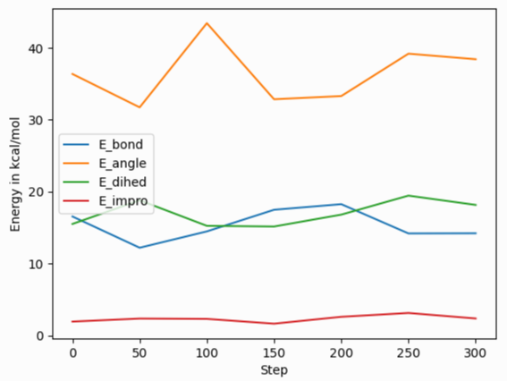

Output structured data from LAMMPS
##################################

LAMMPS can output structured data with the :doc:`print <print>` and :doc:`fix
print <fix_print>` command.  This gives you flexibility since you can build
custom data formats that contain system properties, thermo data, and variables
values. This output can be directed to the screen and/or to a file for post
processing.

Writing the current system state, thermo data, variable values
==============================================================

Use the :doc:`print <print>` command to output the current system state, which
can include system properties, thermo data and variable values.

YAML
----

.. code-block:: LAMMPS

   print """---
   timestep: $(step)
   pe: $(pe)
   ke: $(ke)
   ...""" file current_state.yaml screen no

.. code-block:: yaml
   :caption: current_state.yaml

   ---
   timestep: 250
   pe: -4.7774327356321810711
   ke: 2.4962152903997174569

JSON
----

.. code-block:: LAMMPS

   print """{
     "timestep": $(step),
     "pe": $(pe),
     "ke": $(ke)
   }""" file current_state.json screen no

.. code-block:: json
   :caption: current_state.json

   {
     "timestep": 250,
     "pe": -4.7774327356321810711,
     "ke": 2.4962152903997174569
   }

YAML format thermo_style output
===============================

Extracting data from log file
-----------------------------

.. versionadded:: 24Mar2022

LAMMPS supports the thermo style "yaml" and for "custom" style
thermodynamic output the format can be changed to YAML with
:doc:`thermo_modify line yaml <thermo_modify>`.  This will produce a
block of output in a compact YAML format - one "document" per run - of
the following style:

.. code-block:: yaml

   ---
   keywords: ['Step', 'Temp', 'E_pair', 'E_mol', 'TotEng', 'Press', ]
   data:
     - [100, 0.757453103239935, -5.7585054860159, 0, -4.62236133677021, 0.207261053624721, ]
     - [110, 0.759322359337036, -5.7614668389562, 0, -4.62251889318624, 0.194314975399602, ]
     - [120, 0.759372342462676, -5.76149365656489, 0, -4.62247073844943, 0.191600048851267, ]
     - [130, 0.756833027516501, -5.75777334823494, 0, -4.62255928350835, 0.208792327853067, ]
   ...

This data can be extracted and parsed from a log file using python with:

.. code-block:: python

   import re, yaml
   try:
       from yaml import CSafeLoader as Loader
   except ImportError:
       from yaml import SafeLoader as Loader

   docs = ""
   with open("log.lammps") as f:
       for line in f:
           m = re.search(r"^(keywords:.*$|data:$|---$|\.\.\.$|  - \[.*\]$)", line)
           if m: docs += m.group(0) + '\n'

   thermo = list(yaml.load_all(docs, Loader=Loader))

   print("Number of runs: ", len(thermo))
   print(thermo[1]['keywords'][4], ' = ', thermo[1]['data'][2][4])

After loading the YAML data, `thermo` is a list containing a dictionary
for each "run" where the tag "keywords" maps to the list of thermo
header strings and the tag "data" has a list of lists where the outer
list represents the lines of output and the inner list the values of the
columns matching the header keywords for that step.  The second print()
command for example will print the header string for the fifth keyword
of the second run and the corresponding value for the third output line
of that run:

.. parsed-literal::

   Number of runs:  2
   TotEng  =  -4.62140097780047

.. versionadded:: 4May2022

YAML format output has been added to multiple commands in LAMMPS,
for example :doc:`dump yaml <dump>` or :doc:`fix ave/time <fix_ave_time>`
Depending on the kind of data being written, organization of the data
or the specific syntax used may change, but the principles are very
similar and all files should be readable with a suitable YAML parser.

Processing scalar data with Python
----------------------------------

After reading and parsing the YAML format data, it can be easily
imported for further processing and visualization with the `pandas
<https://pandas.pydata.org/>`_ and `matplotlib
<https://matplotlib.org/>`_ Python modules.  Because of the organization
of the data in the YAML format thermo output, it needs to be told to
process only the 'data' part of the imported data to create a pandas
data frame, and one needs to set the column names from the 'keywords'
entry.  The following Python script code example demonstrates this, and
creates the image shown on the right of a simple plot of various bonded
energy contributions versus the timestep from a run of the 'peptide'
example input after changing the :doc:`thermo style <thermo_style>` to
'yaml'.  The properties to be used for x and y values can be
conveniently selected through the keywords.  Please note that those
keywords can be changed to custom strings with the :doc:`thermo_modify
colname <thermo_modify>` command.

.. code-block:: python

   import re, yaml
   import pandas as pd
   import matplotlib.pyplot as plt

   try:
       from yaml import CSafeLoader as Loader
   except ImportError:
       from yaml import SafeLoader as Loader

   docs = ""
   with open("log.lammps") as f:
       for line in f:
           m = re.search(r"^(keywords:.*$|data:$|---$|\.\.\.$|  - \[.*\]$)", line)
           if m: docs += m.group(0) + '\n'

   thermo = list(yaml.load_all(docs, Loader=Loader))

   df = pd.DataFrame(data=thermo[0]['data'], columns=thermo[0]['keywords'])
   fig = df.plot(x='Step', y=['E_bond', 'E_angle', 'E_dihed', 'E_impro'], ylabel='Energy in kcal/mol')
   plt.savefig('thermo_bondeng.png')

Processing vector data with Python
----------------------------------

Global *vector* data as produced by :doc:`fix ave/time <fix_ave_time>`
uses a slightly different organization of the data. You still have the
dictionary keys 'keywords' and 'data' for the column headers and the
data.  But the data is a dictionary indexed by the time step and for
each step there are multiple rows of values each with a list of the
averaged properties.  This requires a slightly different processing,
since the entire data cannot be directly imported into a single pandas
DataFrame class instance.  The following Python script example
demonstrates how to read such data.  The result will combine the data
for the different steps into one large "multi-index" table.  The pandas
IndexSlice class can then be used to select data from this combined data
frame.

.. code-block:: python

   import yaml
   import pandas as pd

   try:
       from yaml import CSafeLoader as Loader
   except ImportError:
       from yaml import SafeLoader as Loader

   with open("ave.yaml") as f:
       ave = yaml.load(f, Loader=Loader)

   keys = ave['keywords']
   df = {}
   for k in ave['data'].keys():
       df[k] = pd.DataFrame(data=ave['data'][k], columns=keys)

   # create multi-index data frame
   df = pd.concat(df)

   # output only the first 3 value for steps 200 to 300 of the column Pressure
   idx = pd.IndexSlice
   print(df['Pressure'].loc[idx[200:300, 0:2]])

Processing scalar data with Perl
--------------------------------

The ease of processing YAML data is not limited to Python. Here is an
example for extracting and processing a LAMMPS log file with Perl instead.

.. code-block:: perl

   use YAML::XS;

   open(LOG, "log.lammps") or die("could not open log.lammps: $!");
   my $file = "";
   while(my $line = <LOG>) {
       if ($line =~ /^(keywords:.*$|data:$|---$|\.\.\.$|  - \[.*\]$)/) {
           $file .= $line;
       }
   }
   close(LOG);

   # convert YAML to perl as nested hash and array references
   my $thermo = Load $file;

   # convert references to real arrays
   my @keywords = @{$thermo->{'keywords'}};
   my @data = @{$thermo->{'data'}};

   # print first two columns
   print("$keywords[0] $keywords[1]\n");
   foreach (@data) {
       print("${$_}[0]  ${$_}[1]\n");
   }

Writing continuous data during a simulation
===========================================

The :doc:`fix print <fix_print>` command allows you to output an arbitrary string at defined times during a simulation run.

YAML
----

.. code-block:: LAMMPS

   fix extra all print 50 """
   - timestep: $(step)
     pe: $(pe)
     ke: $(ke)""" file output.yaml screen no

.. code-block:: yaml
   :caption: output.yaml

   # Fix print output for fix extra
   - timestep: 0
     pe: -6.77336805325924729
     ke: 4.4988750000000026219

   - timestep: 50
     pe: -4.8082494418323200591
     ke: 2.5257981827119797558

   - timestep: 100
     pe: -4.7875608875581505686
     ke: 2.5062598821985102582

   - timestep: 150
     pe: -4.7471033686005483787
     ke: 2.466095925545450207

   - timestep: 200
     pe: -4.7509052858544134068
     ke: 2.4701136792591693592

   - timestep: 250
     pe: -4.7774327356321810711
     ke: 2.4962152903997174569

Post-processing of YAML files can be easily be done with Python and other
scripting languages. In case of Python the `yaml` package allows you to load the
data files and obtain a list of dictionaries.

.. code-block:: python

   import yaml

   with open("output.yaml") as f:
      data = yaml.load(f, Loader=yaml.FullLoader)

   print(data)

.. code-block::

   [{'timestep': 0, 'pe': -6.773368053259247, 'ke': 4.498875000000003}, {'timestep': 50, 'pe': -4.80824944183232, 'ke': 2.5257981827119798}, {'timestep': 100, 'pe': -4.787560887558151, 'ke': 2.5062598821985103}, {'timestep': 150, 'pe': -4.747103368600548, 'ke': 2.46609592554545}, {'timestep': 200, 'pe': -4.750905285854413, 'ke': 2.4701136792591694}, {'timestep': 250, 'pe': -4.777432735632181, 'ke': 2.4962152903997175}]

Line Delimited JSON (LD-JSON)
-----------------------------

The JSON format itself is very strict when it comes to delimiters. For continuous
output/streaming data it is beneficial use the *line delimited JSON* format.
Each line represents one JSON object.

.. code-block:: LAMMPS

   fix extra all print 50 """{"timestep": $(step), "pe": $(pe), "ke": $(ke)}""" title "" file output.json screen no

.. code-block:: json
   :caption: output.json

   {"timestep": 0, "pe": -6.77336805325924729, "ke": 4.4988750000000026219}
   {"timestep": 50, "pe": -4.8082494418323200591, "ke": 2.5257981827119797558}
   {"timestep": 100, "pe": -4.7875608875581505686, "ke": 2.5062598821985102582}
   {"timestep": 150, "pe": -4.7471033686005483787, "ke": 2.466095925545450207}
   {"timestep": 200, "pe": -4.7509052858544134068, "ke": 2.4701136792591693592}
   {"timestep": 250, "pe": -4.7774327356321810711, "ke": 2.4962152903997174569}

One simple way to load this data into a Python script is to use the `pandas`
package. It can directly load these files into a data frame:

.. code-block:: python

   import pandas as pd

   data = pd.read_json('output.json', lines=True)
   print(data)

.. code-block:: bash

      timestep        pe        ke
   0         0 -6.773368  4.498875
   1        50 -4.808249  2.525798
   2       100 -4.787561  2.506260
   3       150 -4.747103  2.466096
   4       200 -4.750905  2.470114
   5       250 -4.777433  2.496215
