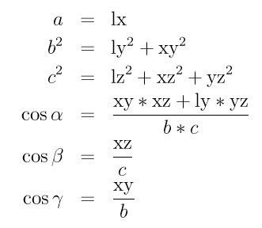

:doc:`Higher level section <Howto>` - `LAMMPS WWW Site <lws_>`_ - `LAMMPS Documentation <ld_>`_ - `LAMMPS Commands <lc_>`_ 

.. _lws: http://lammps.sandia.gov

.. _ld: Manual.html

.. _lc: Commands\_all.html

Triclinic (non-orthogonal) simulation boxes
===========================================

By default, LAMMPS uses an orthogonal simulation box to encompass the
particles.  The :doc:`boundary <boundary>` command sets the boundary
conditions of the box (periodic, non-periodic, etc).  The orthogonal
box has its "origin" at (xlo,ylo,zlo) and is defined by 3 edge vectors
starting from the origin given by **a** = (xhi-xlo,0,0); **b** =
(0,yhi-ylo,0); **c** = (0,0,zhi-zlo).  The 6 parameters
(xlo,xhi,ylo,yhi,zlo,zhi) are defined at the time the simulation box
is created, e.g. by the :doc:`create\_box <create_box>` or
:doc:`read\_data <read_data>` or :doc:`read\_restart <read_restart>`
commands.  Additionally, LAMMPS defines box size parameters lx,ly,lz
where lx = xhi-xlo, and similarly in the y and z dimensions.  The 6
parameters, as well as lx,ly,lz, can be output via the :doc:`thermo\_style custom <thermo_style>` command.

LAMMPS also allows simulations to be performed in triclinic
(non-orthogonal) simulation boxes shaped as a parallelepiped with
triclinic symmetry.  The parallelepiped has its "origin" at
(xlo,ylo,zlo) and is defined by 3 edge vectors starting from the
origin given by **a** = (xhi-xlo,0,0); **b** = (xy,yhi-ylo,0); **c** =
(xz,yz,zhi-zlo).  *xy,xz,yz* can be 0.0 or positive or negative values
and are called "tilt factors" because they are the amount of
displacement applied to faces of an originally orthogonal box to
transform it into the parallelepiped.  In LAMMPS the triclinic
simulation box edge vectors **a**\ , **b**\ , and **c** cannot be arbitrary
vectors.  As indicated, **a** must lie on the positive x axis.  **b** must
lie in the xy plane, with strictly positive y component. **c** may have
any orientation with strictly positive z component.  The requirement
that **a**\ , **b**\ , and **c** have strictly positive x, y, and z components,
respectively, ensures that **a**\ , **b**\ , and **c** form a complete
right-handed basis.  These restrictions impose no loss of generality,
since it is possible to rotate/invert any set of 3 crystal basis
vectors so that they conform to the restrictions.

For example, assume that the 3 vectors **A**\ ,\ **B**\ ,\ **C** are the edge
vectors of a general parallelepiped, where there is no restriction on
**A**\ ,\ **B**\ ,\ **C** other than they form a complete right-handed basis i.e.
**A** x **B** . **C** > 0.  The equivalent LAMMPS **a**\ ,\ **b**\ ,\ **c** are a linear
rotation of **A**\ , **B**\ , and **C** and can be computed as follows:

.. image:: Eqs/transform.jpg
   :align: center

where A = \| **A** \| indicates the scalar length of **A**\ . The hat symbol (\^)
indicates the corresponding unit vector. *beta* and *gamma* are angles
between the vectors described below. Note that by construction,
**a**\ , **b**\ , and **c** have strictly positive x, y, and z components, respectively.
If it should happen that
**A**\ , **B**\ , and **C** form a left-handed basis, then the above equations
are not valid for **c**\ . In this case, it is necessary
to first apply an inversion. This can be achieved
by interchanging two basis vectors or by changing the sign of one of them.

For consistency, the same rotation/inversion applied to the basis vectors
must also be applied to atom positions, velocities,
and any other vector quantities.
This can be conveniently achieved by first converting to
fractional coordinates in the
old basis and then converting to distance coordinates in the new basis.
The transformation is given by the following equation:

.. image:: Eqs/rotate.jpg
   :align: center

where *V* is the volume of the box, **X** is the original vector quantity and
**x** is the vector in the LAMMPS basis.

There is no requirement that a triclinic box be periodic in any
dimension, though it typically should be in at least the 2nd dimension
of the tilt (y in xy) if you want to enforce a shift in periodic
boundary conditions across that boundary.  Some commands that work
with triclinic boxes, e.g. the :doc:`fix deform <fix_deform>` and :doc:`fix npt <fix_nh>` commands, require periodicity or non-shrink-wrap
boundary conditions in specific dimensions.  See the command doc pages
for details.

The 9 parameters (xlo,xhi,ylo,yhi,zlo,zhi,xy,xz,yz) are defined at the
time the simulation box is created.  This happens in one of 3 ways.
If the :doc:`create\_box <create_box>` command is used with a region of
style *prism*\ , then a triclinic box is setup.  See the
:doc:`region <region>` command for details.  If the
:doc:`read\_data <read_data>` command is used to define the simulation
box, and the header of the data file contains a line with the "xy xz
yz" keyword, then a triclinic box is setup.  See the
:doc:`read\_data <read_data>` command for details.  Finally, if the
:doc:`read\_restart <read_restart>` command reads a restart file which
was written from a simulation using a triclinic box, then a triclinic
box will be setup for the restarted simulation.

Note that you can define a triclinic box with all 3 tilt factors =
0.0, so that it is initially orthogonal.  This is necessary if the box
will become non-orthogonal, e.g. due to the :doc:`fix npt <fix_nh>` or
:doc:`fix deform <fix_deform>` commands.  Alternatively, you can use the
:doc:`change\_box <change_box>` command to convert a simulation box from
orthogonal to triclinic and vice versa.

As with orthogonal boxes, LAMMPS defines triclinic box size parameters
lx,ly,lz where lx = xhi-xlo, and similarly in the y and z dimensions.
The 9 parameters, as well as lx,ly,lz, can be output via the
:doc:`thermo\_style custom <thermo_style>` command.

To avoid extremely tilted boxes (which would be computationally
inefficient), LAMMPS normally requires that no tilt factor can skew
the box more than half the distance of the parallel box length, which
is the 1st dimension in the tilt factor (x for xz).  This is required
both when the simulation box is created, e.g. via the
:doc:`create\_box <create_box>` or :doc:`read\_data <read_data>` commands,
as well as when the box shape changes dynamically during a simulation,
e.g. via the :doc:`fix deform <fix_deform>` or :doc:`fix npt <fix_nh>`
commands.

For example, if xlo = 2 and xhi = 12, then the x box length is 10 and
the xy tilt factor must be between -5 and 5.  Similarly, both xz and
yz must be between -(xhi-xlo)/2 and +(yhi-ylo)/2.  Note that this is
not a limitation, since if the maximum tilt factor is 5 (as in this
example), then configurations with tilt = ..., -15, -5, 5, 15, 25,
... are geometrically all equivalent.  If the box tilt exceeds this
limit during a dynamics run (e.g. via the :doc:`fix deform <fix_deform>`
command), then the box is "flipped" to an equivalent shape with a tilt
factor within the bounds, so the run can continue.  See the :doc:`fix deform <fix_deform>` doc page for further details.

One exception to this rule is if the 1st dimension in the tilt
factor (x for xy) is non-periodic.  In that case, the limits on the
tilt factor are not enforced, since flipping the box in that dimension
does not change the atom positions due to non-periodicity.  In this
mode, if you tilt the system to extreme angles, the simulation will
simply become inefficient, due to the highly skewed simulation box.

The limitation on not creating a simulation box with a tilt factor
skewing the box more than half the distance of the parallel box length
can be overridden via the :doc:`box <box>` command.  Setting the *tilt*
keyword to *large* allows any tilt factors to be specified.

Box flips that may occur using the :doc:`fix deform <fix_deform>` or
:doc:`fix npt <fix_nh>` commands can be turned off using the *flip no*
option with either of the commands.

Note that if a simulation box has a large tilt factor, LAMMPS will run
less efficiently, due to the large volume of communication needed to
acquire ghost atoms around a processor's irregular-shaped sub-domain.
For extreme values of tilt, LAMMPS may also lose atoms and generate an
error.

Triclinic crystal structures are often defined using three lattice
constants *a*\ , *b*\ , and *c*\ , and three angles *alpha*\ , *beta* and
*gamma*\ . Note that in this nomenclature, the a, b, and c lattice
constants are the scalar lengths of the edge vectors **a**\ , **b**\ , and **c**
defined above.  The relationship between these 6 quantities
(a,b,c,alpha,beta,gamma) and the LAMMPS box sizes (lx,ly,lz) =
(xhi-xlo,yhi-ylo,zhi-zlo) and tilt factors (xy,xz,yz) is as follows:

The inverse relationship can be written as follows:

.. image:: Eqs/box_inverse.jpg
   :align: center

The values of *a*\ , *b*\ , *c* , *alpha*\ , *beta* , and *gamma* can be printed
out or accessed by computes using the
:doc:`thermo\_style custom <thermo_style>` keywords
*cella*\ , *cellb*\ , *cellc*\ , *cellalpha*\ , *cellbeta*\ , *cellgamma*\ ,
respectively.

As discussed on the :doc:`dump <dump>` command doc page, when the BOX
BOUNDS for a snapshot is written to a dump file for a triclinic box,
an orthogonal bounding box which encloses the triclinic simulation box
is output, along with the 3 tilt factors (xy, xz, yz) of the triclinic
box, formatted as follows:

.. parsed-literal::

   ITEM: BOX BOUNDS xy xz yz
   xlo_bound xhi_bound xy
   ylo_bound yhi_bound xz
   zlo_bound zhi_bound yz

This bounding box is convenient for many visualization programs and is
calculated from the 9 triclinic box parameters
(xlo,xhi,ylo,yhi,zlo,zhi,xy,xz,yz) as follows:

.. parsed-literal::

   xlo_bound = xlo + MIN(0.0,xy,xz,xy+xz)
   xhi_bound = xhi + MAX(0.0,xy,xz,xy+xz)
   ylo_bound = ylo + MIN(0.0,yz)
   yhi_bound = yhi + MAX(0.0,yz)
   zlo_bound = zlo
   zhi_bound = zhi

These formulas can be inverted if you need to convert the bounding box
back into the triclinic box parameters, e.g. xlo = xlo\_bound -
MIN(0.0,xy,xz,xy+xz).

One use of triclinic simulation boxes is to model solid-state crystals
with triclinic symmetry.  The :doc:`lattice <lattice>` command can be
used with non-orthogonal basis vectors to define a lattice that will
tile a triclinic simulation box via the
:doc:`create\_atoms <create_atoms>` command.

A second use is to run Parrinello-Rahman dynamics via the :doc:`fix npt <fix_nh>` command, which will adjust the xy, xz, yz tilt
factors to compensate for off-diagonal components of the pressure
tensor.  The analog for an :doc:`energy minimization <minimize>` is
the :doc:`fix box/relax <fix_box_relax>` command.

A third use is to shear a bulk solid to study the response of the
material.  The :doc:`fix deform <fix_deform>` command can be used for
this purpose.  It allows dynamic control of the xy, xz, yz tilt
factors as a simulation runs.  This is discussed in the next section
on non-equilibrium MD (NEMD) simulations.

