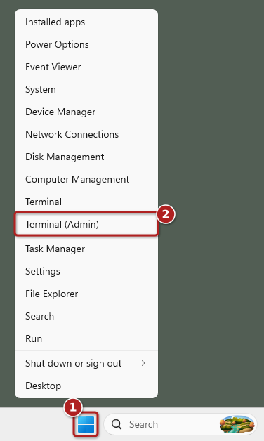
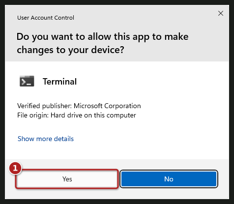
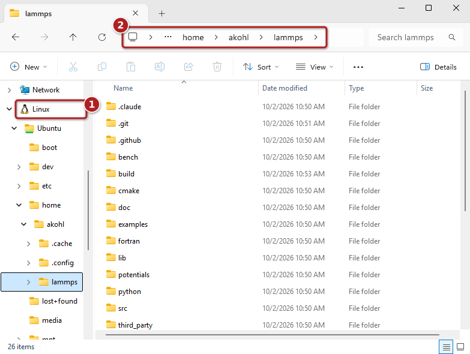

Using LAMMPS on Windows with WSL
################################

**written by Richard Berger, updated for Windows 11 in 2026 by Axel Kohlmeyer**

----------

LAMMPS is primarily developed to run on Linux machines and clusters.
The `Windows Subsystem for Linux (WSL)
<https://learn.microsoft.com/en-us/windows/wsl/>`_ provides a Linux
environment that is tightly integrated into Windows, so that Windows
users can compile and run LAMMPS the same way as on a Linux machine.
WSL version 2 uses a lightweight virtual machine that runs a real Linux
kernel and is installed with a single command.

In this tutorial, we show how to set up WSL on Windows 11 and how to
compile and run LAMMPS in serial and in parallel with MPI.  The same
steps should also work on Windows 10, but note that Windows 10 has
reached end of support status on October 14, 2025.

.. note::

   If you only want to *run* LAMMPS on Windows, you can also use the
   :doc:`pre-compiled Windows installer packages <Install_windows>`.
   It is also possible to compile LAMMPS natively on Windows with Visual
   Studio, see :doc:`Build_windows`.

Installation
============

Install WSL and Ubuntu Linux
----------------------------

WSL is installed from a terminal with administrator privileges.  Right
click on the Windows Start button (1) and select "Terminal (Admin)" from
the menu (2):

   Starting a terminal with administrator privileges

Windows will then ask whether the terminal may make changes to your
device.  Click on "Yes" (1); note that "No" is selected by default:

   Confirming administrator privileges

A terminal window opens, which may run either the Windows Command
Prompt or PowerShell; both work for the following steps.  Type in the
following command to install WSL:

.. code-block:: text

   wsl --install

This will download and install all required components and print
progress messages similar to these:

.. code-block:: text

   C:\Users\username>wsl --install
   Downloading: Windows Subsystem for Linux 3.0.1
   Installing: Windows Subsystem for Linux 3.0.1
   Windows Subsystem for Linux 3.0.1 has been installed.
   Installing Windows optional component: VirtualMachinePlatform

   Deployment Image Servicing and Management tool
   Version: 10.0.26100.8972

   Image Version: 10.0.26200.9457

   Enabling feature(s)
   [==========================100.0%==========================]
   The operation completed successfully.
   The requested operation is successful. Changes will not be effective until the system is rebooted.
   The requested operation is successful. Changes will not be effective until the system is rebooted.

Once the installation is complete, restart your computer.

Install Ubuntu and initial setup
--------------------------------

If the installation of the Linux distribution does not continue by
itself after the restart, open a terminal again (administrator
privileges are no longer needed) and run ``wsl --install`` a second
time.  This time it will download and install the current long-term
support (LTS) version of the Ubuntu Linux distribution and launch it.
The first time Ubuntu is launched, it asks you for a Linux user name
and password.  These do not have to match your Windows user name and
password.  You will need this password to run commands with ``sudo``
later.  Finally, Ubuntu asks whether you want to share anonymous system
reports with Canonical, the company behind Ubuntu:

.. code-block:: text

   C:\Users\username>wsl --install
   Downloading: Ubuntu
   Installing: Ubuntu
   Distribution successfully installed. It can be launched via 'wsl.exe -d Ubuntu'
   Launching Ubuntu...
   Provisioning the new WSL instance Ubuntu
   This might take a while...
   Create a default Unix user account: username
   New password:
   Retype new password:
   passwd: password updated successfully
   usermod: no changes
   Help improve Ubuntu!

   Help us improve Ubuntu features and compatibility by sharing system reports with Canonical.
   Reports are sent anonymously and do not contain any personal data.
   For legal details, please visit: https://ubuntu.com/legal/systems-information-notice

   We will save your answer to Windows and will only ask you once.

   Would you like to opt-in to platform metrics collection (Y/n)? To see an example of the data collected, enter 'e'.
   [Y/n/e]: n
   username@Windows11:/mnt/c/Users/username$

Once completed, your Linux shell is ready for use.  All your actions and
commands will run as the Linux user you specified.  Later, you can
launch Ubuntu from the Start menu or by typing ``wsl`` in a terminal.

You can check that the Linux distribution uses WSL version 2 with the
command ``wsl --list --verbose`` in a Windows terminal:

.. code-block:: text

   C:\Users\username>wsl --list --verbose
     NAME      STATE           VERSION
   * Ubuntu    Running         2

.. note::

   You can see the list of available Linux distributions with ``wsl
   --list --online`` and install a specific one with, e.g., ``wsl
   --install -d Ubuntu-24.04``.  LAMMPS requires CMake version 3.27 or
   later, which is included in Ubuntu 24.04 LTS and later.  The
   installed WSL version can be updated with ``wsl --update``.

Windows Explorer / WSL integration
==================================

Your Linux installation has its own Linux file system with a regular
Linux home folder in :code:`/home/<USERNAME>`.  This folder is different
from your Windows user folder.  Windows and Linux file systems are
connected through WSL:

- All Windows drives are accessible in the :code:`/mnt` folder in Linux.
  E.g., WSL maps the :code:`C:` drive to the :code:`/mnt/c` folder.  That
  means you can access your Windows user folder in
  :code:`/mnt/c/Users/<WINDOWS_USERNAME>`.

- The Windows Explorer can also access the Linux file system.  It is
  shown under "Linux" in the navigation pane (1) and the address bar (2)
  shows the location of the current folder.  To open the current folder
  of an Ubuntu console in the Windows Explorer, use the
  :code:`explorer.exe .` command (**do not forget the final dot!**).

   Linux files in the Windows Explorer

.. note::

   Accessing files across the two file systems is much slower than
   accessing files in the same file system.  Thus you should keep the
   LAMMPS source code, the compiled files, and your simulation inputs and
   outputs in the Linux file system (e.g. in your Linux home folder) and
   not in :code:`/mnt/c`.

--------

Compiling LAMMPS
================

You now have a fully functioning Ubuntu installation and can follow most
guides to install LAMMPS on a Linux system.  Here are the essential
steps:

Install prerequisite packages
-----------------------------

Before we can begin, we need to download the necessary compiler tool
chain and libraries to compile LAMMPS.  In Ubuntu, we use the
:code:`apt` package manager to install additional packages.

First, upgrade all existing packages using :code:`apt update` and
:code:`apt upgrade`.

.. code-block:: bash

   sudo apt update
   sudo apt upgrade -y

Next, install the following packages with :code:`apt install`:

.. code-block:: bash

   sudo apt install -y cmake build-essential ccache gfortran git \
                       openmpi-bin libopenmpi-dev libfftw3-dev libjpeg-dev \
                       libpng-dev ffmpeg python3-dev python3-venv libblas-dev \
                       liblapack-dev libhdf5-dev hdf5-tools

Download LAMMPS
---------------

First make sure that you are in your Linux home folder.  When Ubuntu is
launched from a Windows terminal, the Linux shell starts in the Windows
user folder (e.g. :code:`/mnt/c/Users/username`), so change to the
Linux home folder with:

.. code-block:: bash

   cd ~

Then obtain a copy of the LAMMPS source code and go into it using the
:code:`cd` command.

Option 1: Download the LAMMPS stable version with git (recommended)
^^^^^^^^^^^^^^^^^^^^^^^^^^^^^^^^^^^^^^^^^^^^^^^^^^^^^^^^^^^^^^^^^^^

.. code-block:: bash

   git clone -b stable https://github.com/lammps/lammps.git
   cd lammps

This creates a local copy of the git repository, which makes it easy to
update to newer versions later, see :doc:`Install_git`.

Option 2: Download a LAMMPS tarball using wget
^^^^^^^^^^^^^^^^^^^^^^^^^^^^^^^^^^^^^^^^^^^^^^

The `LAMMPS download page <https://www.lammps.org/download/>`_ lists the
tarballs for the current and previous LAMMPS releases.  The tarball of
the latest release can be downloaded and unpacked with:

.. code-block:: bash

   wget https://download.lammps.org/tars/lammps.tar.gz
   tar xzf lammps.tar.gz

The tarball unpacks into a folder whose name contains the release date,
e.g. :code:`lammps-30Sep2026`.  Use :code:`cd` to change into it.

Configure and Compile LAMMPS with CMake
---------------------------------------

There are countless ways to compile LAMMPS.  It is beyond the scope of
this tutorial to discuss them.  If you want to find out more about what
can be enabled, please consult the :doc:`build documentation <Build>`
and the :doc:`tutorial on using CMake <Howto_cmake>`.

To compile a minimal version of LAMMPS, we are going to use a preset.
Presets are a way to specify a collection of CMake options using a file.
The following command configures LAMMPS in the folder :code:`build` with
the settings from the :code:`basic.cmake` preset file:

.. code-block:: bash

   cmake -S cmake -B build -C cmake/presets/basic.cmake

Then compile LAMMPS with:

.. code-block:: bash

   cmake --build build

This can take a while.  You can speed up the compilation by compiling
multiple files in parallel: add :code:`-j N` to the command, where
:code:`N` is the number of processors in your system, e.g.
:code:`cmake --build build -j 4`.

After the compilation completes successfully, you will have an
executable called :code:`lmp` in the :code:`build` folder.

Please take note of the absolute path of your :code:`build` folder.  You
will need to know the location to execute the LAMMPS binary later.

One way of getting the absolute path of the current folder is through
the :code:`$PWD` variable.  Let us save the path of the build folder in
a variable :code:`LAMMPS_BUILD_DIR` for future use:

.. code-block:: bash

   LAMMPS_BUILD_DIR=$PWD/build
   echo $LAMMPS_BUILD_DIR

The full path of the LAMMPS binary then is
:code:`$LAMMPS_BUILD_DIR/lmp`.

------------

Running an example script
=========================

Now that we have a LAMMPS binary, we will run a script from the examples
folder.

Switch into the :code:`examples/melt` folder:

.. code-block:: bash

   cd examples/melt

To run this example in serial, use the following command:

.. code-block:: bash

   $LAMMPS_BUILD_DIR/lmp -in in.melt

To run the same script in parallel using MPI with 4 processes, do the
following:

.. code-block:: bash

   mpirun -np 4 $LAMMPS_BUILD_DIR/lmp -in in.melt

In either serial or MPI case, LAMMPS executes and will output something
similar to this (here for the parallel run with 4 MPI processes):

.. code-block:: text

   LAMMPS (30 Sep 2026)
   OMP_NUM_THREADS environment is not set. Defaulting to 1 thread.
     using 1 OpenMP thread(s) per MPI task
   # 3d Lennard-Jones melt
   ...
   Created orthogonal box = (0 0 0) to (16.795962 16.795962 16.795962)
     1 by 2 by 2 MPI processor grid
   ...
   Total # of neighbors = 151788
   Ave neighs/atom = 37.947
   Neighbor list builds = 12
   Dangerous builds not checked
   Total wall time: 0:00:00

**Congratulations! You've successfully compiled and executed LAMMPS on WSL!**

Final steps
===========

It is cumbersome to always specify the path of your LAMMPS binary.  You
can avoid this by adding the absolute path of your :code:`build` folder
to your PATH environment variable.

.. code-block:: bash

   export PATH=$LAMMPS_BUILD_DIR:$PATH

You can then run LAMMPS input scripts like this:

.. code-block:: bash

   lmp -in in.melt

or

.. code-block:: bash

   mpirun -np 4 lmp -in in.melt

.. note::

   The value of this :code:`PATH` variable will disappear once you close
   your console window.  To persist this setting edit the
   :code:`$HOME/.bashrc` file using your favorite text editor and add
   this line:

   .. code-block:: bash

      export PATH=/full/path/to/your/lammps/build:$PATH

   **Example:**
   If the LAMMPS executable `lmp` has the following absolute path:

   .. code-block:: bash

      /home/<USERNAME>/lammps/build/lmp

   the :code:`PATH` variable should be:

   .. code-block:: bash

      export PATH=/home/<USERNAME>/lammps/build:$PATH

   Once set up, all your Ubuntu consoles will always have access to your
   :code:`lmp` binary without having to specify its location.

Working with WSL
================

After the installation, a "Welcome to Windows Subsystem for Linux"
window may appear.  It gives an overview of WSL features with links to
more detailed documentation, e.g. about working across the Windows and
Linux file systems ("Working Across File Systems") and about running
graphical Linux programs ("GUI Apps").

A few more hints that make working with LAMMPS in WSL more convenient:

- WSL supports running graphical Linux programs directly from the Linux
  console; their windows appear on the Windows desktop like those of
  Windows programs.
- Windows programs, e.g. a visualization program like `OVITO
  <https://www.ovito.org>`_ installed on Windows, can open files in the
  Linux file system through the "Linux" entry in their file dialogs.
- Several code editors and IDEs that run on Windows, e.g. Visual Studio
  Code, can directly edit files in WSL and run commands there.

Conclusion
==========

We hope this gives you a good overview on how to start compiling and
running LAMMPS on Windows.  WSL makes preparing and running scripts on
Windows a much better experience.

If you are completely new to Linux, we highly recommend investing some
time in studying Linux online tutorials, e.g. tutorials about the Bash
shell and basic Unix commands (e.g., `Linux Journey
<https://labex.io/linuxjourney>`_).  Acquiring these skills will make you
much more productive in this environment.

.. seealso::

   * `Windows Subsystem for Linux Documentation <https://learn.microsoft.com/en-us/windows/wsl/>`_
