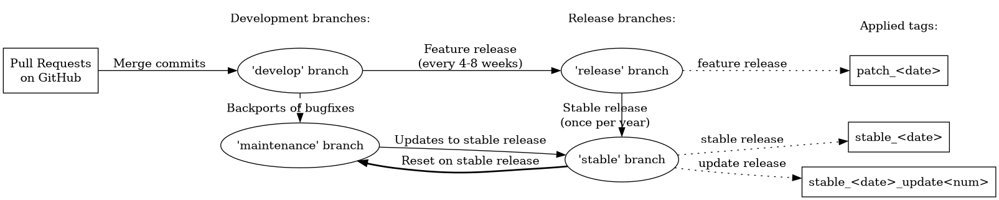

What does a LAMMPS version mean
-------------------------------

The LAMMPS "version" is the date when it was released, such as 1 May
2014.  LAMMPS is updated continuously, and we aim to keep it working
correctly and reliably at all times.  Also, several variants of static
code analysis are run regularly to maintain or improve the overall code
quality, consistency, and compliance with programming standards, best
practices and style conventions.  You can follow its development in a
public `git repository on GitHub <https://github.com/lammps/lammps>`_.

Each version of LAMMPS contains all the documented *features* up to and
including its version date.  For recently added features, we add markers
to the documentation at which specific LAMMPS version a feature or
keyword was added or significantly changed.

Identifying the Version
^^^^^^^^^^^^^^^^^^^^^^^

The version date is printed to the screen and log file every time you
run LAMMPS.  There also is an indication, if a LAMMPS binary was
compiled from version with modifications **after** a release.
It is also visible in the file src/version.h and in the LAMMPS directory
name created when you unpack a downloaded tarball.  And it is on the
first page of the :doc:`manual <Manual>`.

* If you browse the HTML pages of the online version of the LAMMPS
  manual, they will by default describe the most current feature release
  version of LAMMPS.  In the navigation bar on the bottom left, there is
  the option to view instead the documentation for the most recent
  *stable* version or the documentation corresponding to the state of
  the development branch.
* If you browse the HTML pages included in your downloaded tarball, they
  describe the version you have, which may be older than the online
  version.

LAMMPS releases, branches, and tags
^^^^^^^^^^^^^^^^^^^^^^^^^^^^^^^^^^^

   Relations between releases, main branches, and tags in the LAMMPS git repository

Development
"""""""""""

Modifications of the LAMMPS source code (like bug fixes, code
refactoring, updates to existing features, or addition of new features)
are organized into pull requests.  Pull requests will be merged into the
*develop* branch of the git repository after they pass automated testing
and code review by the LAMMPS developers.

Feature Releases
""""""""""""""""

When a sufficient number of new features and updates have accumulated
*and* the LAMMPS version on the *develop* branch passes an extended set
of automated tests, we release it as a *feature release*, which are
currently made every 4 to 8 weeks.  The *release* branch of the git
repository is updated with every such *feature release* and a tag in the
format ``patch_1May2014`` is added.  A summary of the most important
changes of these releases for the current year are posted on `this
website page <https://www.lammps.org/bug.html>`_.  More detailed release
notes are `available on GitHub
<https://github.com/lammps/lammps/releases/>`_.

Stable Releases
"""""""""""""""

About once a year, we release a *stable release* version of LAMMPS.
This is done after a "stabilization period" where we apply only bug
fixes and small, non-intrusive changes to the *develop* branch but no
new features.  At the same time, the code is subjected to more detailed
and thorough manual testing than the default automated testing.
After such a *stable release*, both the *release* and the *stable*
branches are updated and two tags are applied, a ``patch_1May2014`` format
and a ``stable_1May2014`` format tag.

Stable Release Updates
""""""""""""""""""""""

Between *stable releases*, we collect bug fixes and updates back-ported
from the *develop* branch in a branch called *maintenance*.  From the
*maintenance* branch we make occasional *stable update releases* and
update the *stable* branch accordingly.  The first update to the
``stable_1May2014`` release would be tagged as
``stable_1May2014_update1``.  These updates contain no new features.
