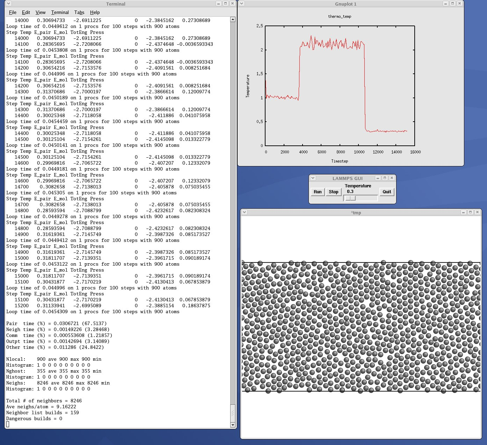
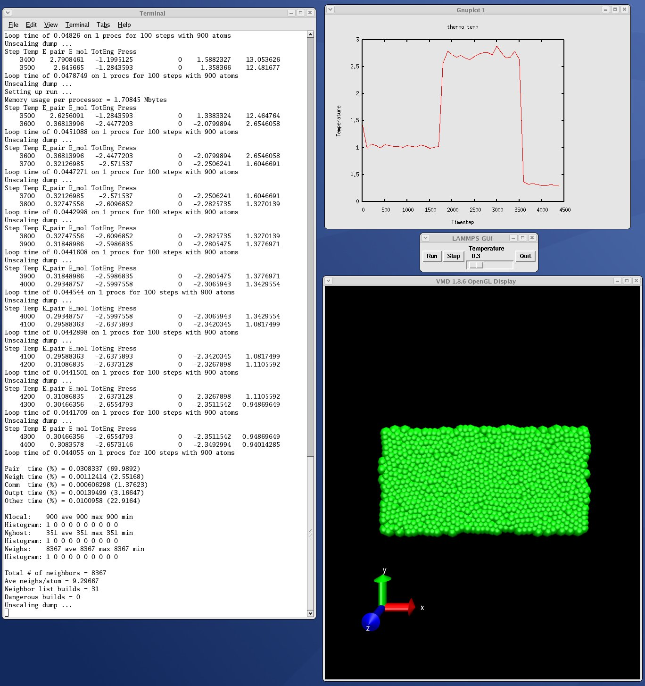

Example Python scripts
======================

The ``python/examples`` directory has Python scripts which show how Python
can run LAMMPS, grab data, change it, and put it back into LAMMPS.

These are the Python scripts included as demos in the ``python/examples``
directory of the LAMMPS distribution, to illustrate the kinds of
things that are possible when Python wraps LAMMPS.  If you create your
own scripts, send them to us and we can include them in the LAMMPS
distribution.

+------------------------+--------------------------------------------------------------------+
| ``trivial.py``         | read/run a LAMMPS input script through Python                      |
+------------------------+--------------------------------------------------------------------+
| ``demo.py``            | invoke various LAMMPS library interface routines                   |
+------------------------+--------------------------------------------------------------------+
| ``simple.py``          | run in parallel, similar to ``examples/COUPLE/simple/simple.cpp``  |
+------------------------+--------------------------------------------------------------------+
| ``split.py``           | same as ``simple.py`` but running in parallel on a subset of procs |
+------------------------+--------------------------------------------------------------------+
| ``gui.py``             | GUI go/stop/temperature-slider to control LAMMPS                   |
+------------------------+--------------------------------------------------------------------+
| ``plot.py``            | real-time temperature plot with GnuPlot via Pizza.py               |
+------------------------+--------------------------------------------------------------------+
| ``viz_TOOL.py``        | real-time viz via some viz package                                 |
+------------------------+--------------------------------------------------------------------+
| ``vizplotgui_TOOL.py`` | combination of ``viz_TOOL.py`` and ``plot.py`` and ``gui.py``      |
+------------------------+--------------------------------------------------------------------+

For the ``viz_TOOL.py`` and ``vizplotgui_TOOL.py`` commands, replace ``TOOL``
with ``gl`` or ``atomeye`` or ``pymol`` or ``vmd``, depending on what
visualization package you have installed.

Note that for GL, you need to be able to run the Pizza.py GL tool,
which is included in the pizza sub-directory.  See the Pizza.py doc pages for more info:

* `https://lammps.github.io/pizza <pizza_>`_

.. _pizza: https://lammps.github.io/pizza

Note that for AtomEye, you need version 3, and there is a line in the
scripts that specifies the path and name of the executable.  See the
AtomEye web pages for more details:

* `http://li.mit.edu/Archive/Graphics/A/ <atomeye_>`_
* `http://li.mit.edu/Archive/Graphics/A3/A3.html <atomeye3_>`_

.. _atomeye: http://li.mit.edu/Archive/Graphics/A/

.. _atomeye3: http://li.mit.edu/Archive/Graphics/A3/A3.html

The latter link is to AtomEye 3 which has the scripting
capability needed by these Python scripts.

Note that for PyMol, you need to have built and installed the
open-source version of PyMol in your Python, so that you can import it
from a Python script.  See the PyMol web pages for more details:

 * `https://www.pymol.org <pymolhome_>`_
 * `https://github.com/schrodinger/pymol-open-source <pymolopen_>`_

.. _pymolhome: https://www.pymol.org

.. _pymolopen: https://github.com/schrodinger/pymol-open-source

The latter link is to the open-source version.

Note that for VMD, you need a fairly current version (1.8.7 works for
me) and there are some lines in the ``pizza/vmd.py`` script for 4 PIZZA
variables that have to match the VMD installation on your system.

----------

See the ``python/README`` file for instructions on how to run them and the
source code for individual scripts for comments about what they do.

Here are screenshots of the ``vizplotgui_tool.py`` script in action for
different visualization package options:

.. |pyex1| image:: img/screenshot_gl.jpg
   :width: 24%

.. |pyex3| image:: img/screenshot_pymol.jpg
   :width: 24%

|pyex1|  |pyex2|  |pyex3|  |pyex4|

.. raw:: html

   Click to see larger versions of the images.

