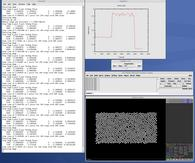

Example Python scripts that use LAMMPS
======================================

These are the Python scripts included as demos in the python/examples
directory of the LAMMPS distribution, to illustrate the kinds of
things that are possible when Python wraps LAMMPS.  If you create your
own scripts, send them to us and we can include them in the LAMMPS
distribution.

+----------------------------------------------------------------+--------------------------------------------------+
| trivial.py                                                     | read/run a LAMMPS input script through Python    |
+----------------------------------------------------------------+--------------------------------------------------+
| demo.py                                                        | invoke various LAMMPS library interface routines |
+----------------------------------------------------------------+--------------------------------------------------+
| simple.py                                                      | run in parallel                                  |
+----------------------------------------------------------------+--------------------------------------------------+
| similar to examples/COUPLE/simple/simple.cpp                   | split.py                                         |
+----------------------------------------------------------------+--------------------------------------------------+
| same as simple.py but running in parallel on a subset of procs | gui.py                                           |
+----------------------------------------------------------------+--------------------------------------------------+
| GUI go/stop/temperature-slider to control LAMMPS               | plot.py                                          |
+----------------------------------------------------------------+--------------------------------------------------+
| real-time temperature plot with GnuPlot via Pizza.py           | viz\_tool.py                                     |
+----------------------------------------------------------------+--------------------------------------------------+
| real-time viz via some viz package                             | vizplotgui\_tool.py                              |
+----------------------------------------------------------------+--------------------------------------------------+
| combination of viz\_tool.py and plot.py and gui.py             |                                                  |
+----------------------------------------------------------------+--------------------------------------------------+

----------

For the viz\_tool.py and vizplotgui\_tool.py commands, replace "tool"
with "gl" or "atomeye" or "pymol" or "vmd", depending on what
visualization package you have installed.

Note that for GL, you need to be able to run the Pizza.py GL tool,
which is included in the pizza sub-directory.  See the `Pizza.py doc pages <pizza_>`_ for more info:

.. _pizza: http://www.sandia.gov/~sjplimp/pizza.html

Note that for AtomEye, you need version 3, and there is a line in the
scripts that specifies the path and name of the executable.  See the
AtomEye WWW pages `here <atomeye_>`_ or `here <atomeye3_>`_ for more details:

.. parsed-literal::

   http://mt.seas.upenn.edu/Archive/Graphics/A
   http://mt.seas.upenn.edu/Archive/Graphics/A3/A3.html

.. _atomeye: http://mt.seas.upenn.edu/Archive/Graphics/A

.. _atomeye3: http://mt.seas.upenn.edu/Archive/Graphics/A3/A3.html

The latter link is to AtomEye 3 which has the scripting
capability needed by these Python scripts.

Note that for PyMol, you need to have built and installed the
open-source version of PyMol in your Python, so that you can import it
from a Python script.  See the PyMol WWW pages `here <pymolhome_>`_ or
`here <pymolopen_>`_ for more details:

.. parsed-literal::

   http://www.pymol.org
   http://sourceforge.net/scm/?type=svn&group_id=4546

.. _pymolhome: http://www.pymol.org

.. _pymolopen: http://sourceforge.net/scm/?type=svn&group\_id=4546

The latter link is to the open-source version.

Note that for VMD, you need a fairly current version (1.8.7 works for
me) and there are some lines in the pizza/vmd.py script for 4 PIZZA
variables that have to match the VMD installation on your system.

----------

See the python/README file for instructions on how to run them and the
source code for individual scripts for comments about what they do.

Here are screenshots of the vizplotgui\_tool.py script in action for
different visualization package options.  Click to see larger images:

.. image:: JPG/screenshot_gl_small.jpg
   :target: JPG/screenshot_gl.jpg

.. image:: JPG/screenshot_atomeye_small.jpg
   :target: JPG/screenshot_atomeye.jpg

.. image:: JPG/screenshot_vmd_small.jpg
   :target: JPG/screenshot_vmd.jpg
