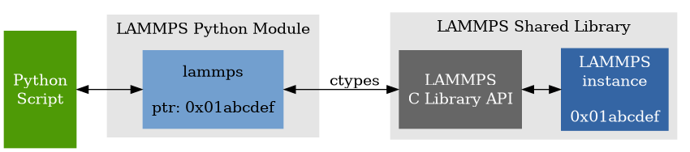
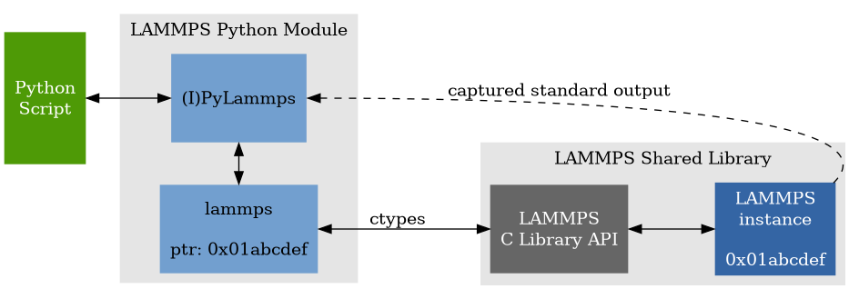
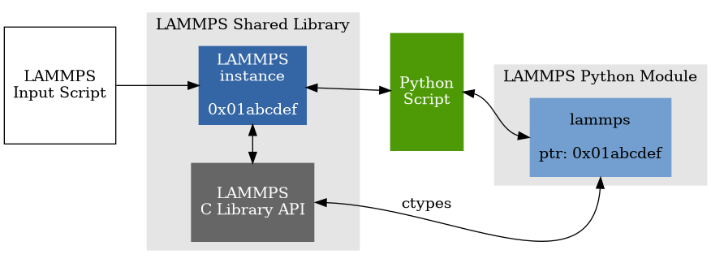

Overview
========

The LAMMPS distribution includes a ``python`` directory with the Python
code needed to run LAMMPS from Python.  The ``python/lammps`` package
contains :doc:`the "lammps" Python module <Python_module>` that wraps the
LAMMPS C-library interface.  This module makes it is possible to do the
following either from a Python script, or interactively from a Python
prompt:

- create one or more instances of LAMMPS
- invoke LAMMPS commands or read them from an input script
- run LAMMPS incrementally
- extract LAMMPS results
- and modify internal LAMMPS data structures.

From a Python script you can do this in serial or in parallel.  Running
Python interactively in parallel does not generally work, unless you
have a version of Python that extends Python to enable multiple
instances of Python to read what you type.

To do all of this, you must build LAMMPS in :ref:`"shared" mode <exe>`
and make certain that your Python interpreter can find the ``lammps``
Python package and the LAMMPS shared library file.

.. _ctypes: https://docs.python.org/3/library/ctypes.html

The Python wrapper for LAMMPS uses the `ctypes <ctypes_>`_ package in
Python, which auto-generates the interface code needed between Python
and a set of C-style library functions.  Ctypes has been part of the
standard Python distribution since version 2.5.  You can check which
version of Python you have by simply typing "python" at a shell prompt.
Below is an example output for Python version 3.8.5.

.. code-block::

   $ python
   Python 3.8.5 (default, Aug 12 2020, 00:00:00)
   [GCC 10.2.1 20200723 (Red Hat 10.2.1-1)] on linux
   Type "help", "copyright", "credits" or "license" for more information.
   >>>

.. warning::

   The options described in this section of the manual for using Python with
   LAMMPS currently support either Python 2 or 3.  Specifically version 2.7 or
   later and 3.6 or later.  Since the Python community no longer maintains Python
   2 (see `this notice <https://www.python.org/doc/sunset-python-2/>`_), we
   recommend use of Python 3 with LAMMPS.  While Python 2 code should continue to
   work, that is not something we can guarantee long-term.

---------

LAMMPS can work together with Python in three ways.  First, Python can
wrap LAMMPS through the its :doc:`library interface <Library>`, so
that a Python script can create one or more instances of LAMMPS and
launch one or more simulations.  In Python terms, this is referred to as
"extending" Python with a LAMMPS module.

   Launching LAMMPS via Python

Second, the lower-level Python interface in the :py:class:`lammps Python
class <lammps.lammps>` can be used indirectly through the provided
:py:class:`PyLammps <lammps.PyLammps>` and :py:class:`IPyLammps
<lammps.IPyLammps>` wrapper classes, also written in Python.  These
wrappers try to simplify the usage of LAMMPS in Python by providing a
more object-based interface to common LAMMPS functionality.  They also
reduce the amount of code necessary to parameterize LAMMPS scripts
through Python and make variables and computes directly accessible.

   Using the PyLammps / IPyLammps wrappers

Third, LAMMPS can use the Python interpreter, so that a LAMMPS input
script or styles can invoke Python code directly, and pass information
back-and-forth between the input script and Python functions you write.
This Python code can also call back to LAMMPS to query or change its
attributes through the LAMMPS Python module mentioned above.  In Python
terms, this is called "embedding" Python into LAMMPS.  When used in this
mode, Python can perform script operations that the simple LAMMPS input
script syntax can not.

   Calling Python code from LAMMPS
