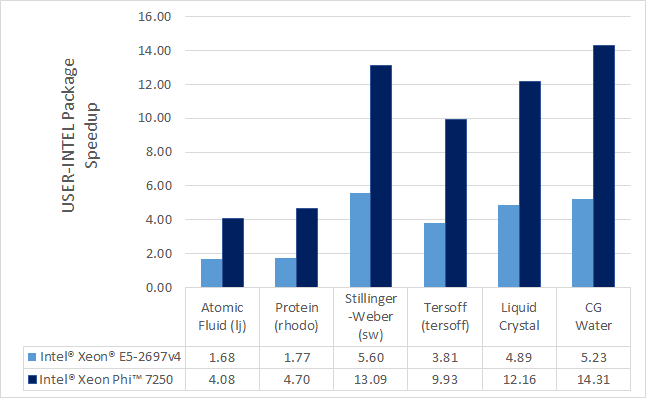
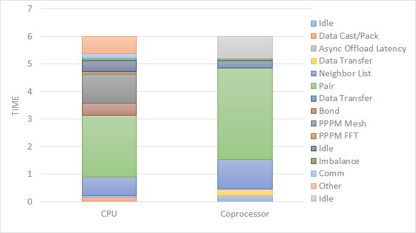

USER-INTEL package
==================

The USER-INTEL package is maintained by Mike Brown at Intel
Corporation.  It provides two methods for accelerating simulations,
depending on the hardware you have.  The first is acceleration on
Intel CPUs by running in single, mixed, or double precision with
vectorization.  The second is acceleration on Intel Xeon Phi
co-processors via offloading neighbor list and non-bonded force
calculations to the Phi.  The same C++ code is used in both cases.
When offloading to a co-processor from a CPU, the same routine is run
twice, once on the CPU and once with an offload flag. This allows
LAMMPS to run on the CPU cores and co-processor cores simultaneously.

**Currently Available USER-INTEL Styles:**

* Angle Styles: charmm, harmonic
* Bond Styles: fene, fourier, harmonic
* Dihedral Styles: charmm, fourier, harmonic, opls
* Fixes: nve, npt, nvt, nvt/sllod, nve/asphere
* Improper Styles: cvff, harmonic
* Pair Styles: airebo, airebo/morse, buck/coul/cut, buck/coul/long,
  buck, dpd, eam, eam/alloy, eam/fs, gayberne, lj/charmm/coul/charmm,
  lj/charmm/coul/long, lj/cut, lj/cut/coul/long, lj/long/coul/long,
  rebo, sw, tersoff
* K-Space Styles: pppm, pppm/disp

.. warning::

   None of the styles in the USER-INTEL package currently
   support computing per-atom stress.  If any compute or fix in your
   input requires it, LAMMPS will abort with an error message.

**Speed-ups to expect:**

The speedups will depend on your simulation, the hardware, which
styles are used, the number of atoms, and the floating-point
precision mode. Performance improvements are shown compared to
LAMMPS *without using other acceleration packages* as these are
under active development (and subject to performance changes). The
measurements were performed using the input files available in
the src/USER-INTEL/TEST directory with the provided run script.
These are scalable in size; the results given are with 512K
particles (524K for Liquid Crystal). Most of the simulations are
standard LAMMPS benchmarks (indicated by the filename extension in
parenthesis) with modifications to the run length and to add a
warm-up run (for use with offload benchmarks).

Results are speedups obtained on Intel Xeon E5-2697v4 processors
(code-named Broadwell), Intel Xeon Phi 7250 processors (code-named
Knights Landing), and Intel Xeon Gold 6148 processors (code-named
Skylake) with "June 2017" LAMMPS built with Intel Parallel Studio
2017 update 2. Results are with 1 MPI task per physical core. See
*src/USER-INTEL/TEST/README* for the raw simulation rates and
instructions to reproduce.

----------

**Accuracy and order of operations:**

In most molecular dynamics software, parallelization parameters
(# of MPI, OpenMP, and vectorization) can change the results due
to changing the order of operations with finite-precision
calculations. The USER-INTEL package is deterministic. This means
that the results should be reproducible from run to run with the
*same* parallel configurations and when using deterministic
libraries or library settings (MPI, OpenMP, FFT). However, there
are differences in the USER-INTEL package that can change the
order of operations compared to LAMMPS without acceleration:

* Neighbor lists can be created in a different order
* Bins used for sorting atoms can be oriented differently
* The default stencil order for PPPM is 7. By default, LAMMPS will
  calculate other PPPM parameters to fit the desired accuracy with
  this order
* The *newton* setting applies to all atoms, not just atoms shared
  between MPI tasks
* Vectorization can change the order for adding pairwise forces
* When using the -DLMP\_USE\_MKL\_RNG define (all included intel optimized
  makefiles do) at build time, the random number generator for
  dissipative particle dynamics (pair style dpd/intel) uses the Mersenne
  Twister generator included in the Intel MKL library (that should be
  more robust than the default Masaglia random number generator)

The precision mode (described below) used with the USER-INTEL
package can change the *accuracy* of the calculations. For the
default *mixed* precision option, calculations between pairs or
triplets of atoms are performed in single precision, intended to
be within the inherent error of MD simulations. All accumulation
is performed in double precision to prevent the error from growing
with the number of atoms in the simulation. *Single* precision
mode should not be used without appropriate validation.

----------

**Quick Start for Experienced Users:**

LAMMPS should be built with the USER-INTEL package installed.
Simulations should be run with 1 MPI task per physical *core*\ ,
not *hardware thread*\ .

* Edit src/MAKE/OPTIONS/Makefile.intel\_cpu\_intelmpi as necessary.
* Set the environment variable KMP\_BLOCKTIME=0
* "-pk intel 0 omp $t -sf intel" added to LAMMPS command-line
* $t should be 2 for Intel Xeon CPUs and 2 or 4 for Intel Xeon Phi
* For some of the simple 2-body potentials without long-range
  electrostatics, performance and scalability can be better with
  the "newton off" setting added to the input script
* For simulations on higher node counts, add "processors \* \* \* grid
  numa" to the beginning of the input script for better scalability
* If using *kspace\_style pppm* in the input script, add
  "kspace\_modify diff ad" for better performance

For Intel Xeon Phi CPUs:

* Runs should be performed using MCDRAM.

For simulations using *kspace\_style pppm* on Intel CPUs supporting
AVX-512:

* Add "kspace\_modify diff ad" to the input script
* The command-line option should be changed to
  "-pk intel 0 omp $r lrt yes -sf intel" where $r is the number of
  threads minus 1.
* Do not use thread affinity (set KMP\_AFFINITY=none)
* The "newton off" setting may provide better scalability

For Intel Xeon Phi co-processors (Offload):

* Edit src/MAKE/OPTIONS/Makefile.intel\_co-processor as necessary
* "-pk intel N omp 1" added to command-line where N is the number of
  co-processors per node.

----------

**Required hardware/software:**

In order to use offload to co-processors, an Intel Xeon Phi
co-processor and an Intel compiler are required. For this, the
recommended version of the Intel compiler is 14.0.1.106 or
versions 15.0.2.044 and higher.

Although any compiler can be used with the USER-INTEL package,
currently, vectorization directives are disabled by default when
not using Intel compilers due to lack of standard support and
observations of decreased performance. The OpenMP standard now
supports directives for vectorization and we plan to transition the
code to this standard once it is available in most compilers. We
expect this to allow improved performance and support with other
compilers.

For Intel Xeon Phi x200 series processors (code-named Knights
Landing), there are multiple configuration options for the hardware.
For best performance, we recommend that the MCDRAM is configured in
"Flat" mode and with the cluster mode set to "Quadrant" or "SNC4".
"Cache" mode can also be used, although the performance might be
slightly lower.

**Notes about Simultaneous Multithreading:**

Modern CPUs often support Simultaneous Multithreading (SMT). On
Intel processors, this is called Hyper-Threading (HT) technology.
SMT is hardware support for running multiple threads efficiently on
a single core. *Hardware threads* or *logical cores* are often used
to refer to the number of threads that are supported in hardware.
For example, the Intel Xeon E5-2697v4 processor is described
as having 36 cores and 72 threads. This means that 36 MPI processes
or OpenMP threads can run simultaneously on separate cores, but that
up to 72 MPI processes or OpenMP threads can be running on the CPU
without costly operating system context switches.

Molecular dynamics simulations will often run faster when making use
of SMT. If a thread becomes stalled, for example because it is
waiting on data that has not yet arrived from memory, another thread
can start running so that the CPU pipeline is still being used
efficiently. Although benefits can be seen by launching a MPI task
for every hardware thread, for multinode simulations, we recommend
that OpenMP threads are used for SMT instead, either with the
USER-INTEL package, :doc:`USER-OMP package <Speed_omp>`, or
:doc:`KOKKOS package <Speed_kokkos>`. In the example above, up
to 36X speedups can be observed by using all 36 physical cores with
LAMMPS. By using all 72 hardware threads, an additional 10-30%
performance gain can be achieved.

The BIOS on many platforms allows SMT to be disabled, however, we do
not recommend this on modern processors as there is little to no
benefit for any software package in most cases. The operating system
will report every hardware thread as a separate core allowing one to
determine the number of hardware threads available. On Linux systems,
this information can normally be obtained with:

.. parsed-literal::

   cat /proc/cpuinfo

**Building LAMMPS with the USER-INTEL package:**

See the :ref:`Build extras <user-intel>` doc page for
instructions.  Some additional details are covered here.

For building with make, several example Makefiles for building with
the Intel compiler are included with LAMMPS in the src/MAKE/OPTIONS/
directory:

.. parsed-literal::

   Makefile.intel_cpu_intelmpi # Intel Compiler, Intel MPI, No Offload
   Makefile.knl                # Intel Compiler, Intel MPI, No Offload
   Makefile.intel_cpu_mpich    # Intel Compiler, MPICH, No Offload
   Makefile.intel_cpu_openpmi  # Intel Compiler, OpenMPI, No Offload
   Makefile.intel_co-processor  # Intel Compiler, Intel MPI, Offload

Makefile.knl is identical to Makefile.intel\_cpu\_intelmpi except that
it explicitly specifies that vectorization should be for Intel Xeon
Phi x200 processors making it easier to cross-compile. For users with
recent installations of Intel Parallel Studio, the process can be as
simple as:

.. parsed-literal::

   make yes-user-intel
   source /opt/intel/parallel_studio_xe_2016.3.067/psxevars.sh
   # or psxevars.csh for C-shell
   make intel_cpu_intelmpi

Note that if you build with support for a Phi co-processor, the same
binary can be used on nodes with or without co-processors installed.
However, if you do not have co-processors on your system, building
without offload support will produce a smaller binary.

The general requirements for Makefiles with the USER-INTEL package
are as follows. When using Intel compilers, "-restrict" is required
and "-qopenmp" is highly recommended for CCFLAGS and LINKFLAGS.
CCFLAGS should include "-DLMP\_INTEL\_USELRT" (unless POSIX Threads
are not supported in the build environment) and "-DLMP\_USE\_MKL\_RNG"
(unless Intel Math Kernel Library (MKL) is not available in the build
environment). For Intel compilers, LIB should include "-ltbbmalloc"
or if the library is not available, "-DLMP\_INTEL\_NO\_TBB" can be added
to CCFLAGS. For builds supporting offload, "-DLMP\_INTEL\_OFFLOAD" is
required for CCFLAGS and "-qoffload" is required for LINKFLAGS. Other
recommended CCFLAG options for best performance are "-O2 -fno-alias
-ansi-alias -qoverride-limits fp-model fast=2 -no-prec-div".

.. note::

   See the src/USER-INTEL/README file for additional flags that
   might be needed for best performance on Intel server processors
   code-named "Skylake".

.. note::

   The vectorization and math capabilities can differ depending on
   the CPU. For Intel compilers, the "-x" flag specifies the type of
   processor for which to optimize. "-xHost" specifies that the compiler
   should build for the processor used for compiling. For Intel Xeon Phi
   x200 series processors, this option is "-xMIC-AVX512". For fourth
   generation Intel Xeon (v4/Broadwell) processors, "-xCORE-AVX2" should
   be used. For older Intel Xeon processors, "-xAVX" will perform best
   in general for the different simulations in LAMMPS. The default
   in most of the example Makefiles is to use "-xHost", however this
   should not be used when cross-compiling.

**Running LAMMPS with the USER-INTEL package:**

Running LAMMPS with the USER-INTEL package is similar to normal use
with the exceptions that one should 1) specify that LAMMPS should use
the USER-INTEL package, 2) specify the number of OpenMP threads, and
3) optionally specify the specific LAMMPS styles that should use the
USER-INTEL package. 1) and 2) can be performed from the command-line
or by editing the input script. 3) requires editing the input script.
Advanced performance tuning options are also described below to get
the best performance.

When running on a single node (including runs using offload to a
co-processor), best performance is normally obtained by using 1 MPI
task per physical core and additional OpenMP threads with SMT. For
Intel Xeon processors, 2 OpenMP threads should be used for SMT.
For Intel Xeon Phi CPUs, 2 or 4 OpenMP threads should be used
(best choice depends on the simulation). In cases where the user
specifies that LRT mode is used (described below), 1 or 3 OpenMP
threads should be used. For multi-node runs, using 1 MPI task per
physical core will often perform best, however, depending on the
machine and scale, users might get better performance by decreasing
the number of MPI tasks and using more OpenMP threads. For
performance, the product of the number of MPI tasks and OpenMP
threads should not exceed the number of available hardware threads in
almost all cases.

.. note::

   Setting core affinity is often used to pin MPI tasks and OpenMP
   threads to a core or group of cores so that memory access can be
   uniform. Unless disabled at build time, affinity for MPI tasks and
   OpenMP threads on the host (CPU) will be set by default on the host
   *when using offload to a co-processor*\ . In this case, it is unnecessary
   to use other methods to control affinity (e.g. taskset, numactl,
   I\_MPI\_PIN\_DOMAIN, etc.). This can be disabled with the *no\_affinity*
   option to the :doc:`package intel <package>` command or by disabling the
   option at build time (by adding -DINTEL\_OFFLOAD\_NOAFFINITY to the
   CCFLAGS line of your Makefile). Disabling this option is not
   recommended, especially when running on a machine with Intel
   Hyper-Threading technology disabled.

**Run with the USER-INTEL package from the command line:**

To enable USER-INTEL optimizations for all available styles used in
the input script, the "-sf intel" :doc:`command-line switch <Run_options>` can be used without any requirement for
editing the input script. This switch will automatically append
"intel" to styles that support it. It also invokes a default command:
:doc:`package intel 1 <package>`. This package command is used to set
options for the USER-INTEL package.  The default package command will
specify that USER-INTEL calculations are performed in mixed precision,
that the number of OpenMP threads is specified by the OMP\_NUM\_THREADS
environment variable, and that if co-processors are present and the
binary was built with offload support, that 1 co-processor per node
will be used with automatic balancing of work between the CPU and the
co-processor.

You can specify different options for the USER-INTEL package by using
the "-pk intel Nphi" :doc:`command-line switch <Run_options>` with
keyword/value pairs as specified in the documentation. Here, Nphi = #
of Xeon Phi co-processors/node (ignored without offload
support). Common options to the USER-INTEL package include *omp* to
override any OMP\_NUM\_THREADS setting and specify the number of OpenMP
threads, *mode* to set the floating-point precision mode, and *lrt* to
enable Long-Range Thread mode as described below. See the :doc:`package intel <package>` command for details, including the default values
used for all its options if not specified, and how to set the number
of OpenMP threads via the OMP\_NUM\_THREADS environment variable if
desired.

Examples (see documentation for your MPI/Machine for differences in
launching MPI applications):

.. parsed-literal::

   mpirun -np 72 -ppn 36 lmp_machine -sf intel -in in.script                                 # 2 nodes, 36 MPI tasks/node, $OMP_NUM_THREADS OpenMP Threads
   mpirun -np 72 -ppn 36 lmp_machine -sf intel -in in.script -pk intel 0 omp 2 mode double   # Don't use any co-processors that might be available, use 2 OpenMP threads for each task, use double precision

**Or run with the USER-INTEL package by editing an input script:**

As an alternative to adding command-line arguments, the input script
can be edited to enable the USER-INTEL package. This requires adding
the :doc:`package intel <package>` command to the top of the input
script. For the second example above, this would be:

.. parsed-literal::

   package intel 0 omp 2 mode double

To enable the USER-INTEL package only for individual styles, you can
add an "intel" suffix to the individual style, e.g.:

.. parsed-literal::

   pair_style lj/cut/intel 2.5

Alternatively, the :doc:`suffix intel <suffix>` command can be added to
the input script to enable USER-INTEL styles for the commands that
follow in the input script.

**Tuning for Performance:**

.. note::

   The USER-INTEL package will perform better with modifications
   to the input script when :doc:`PPPM <kspace_style>` is used:
   :doc:`kspace\_modify diff ad <kspace_modify>` should be added to the
   input script.

Long-Range Thread (LRT) mode is an option to the :doc:`package intel <package>` command that can improve performance when using
:doc:`PPPM <kspace_style>` for long-range electrostatics on processors
with SMT. It generates an extra pthread for each MPI task. The thread
is dedicated to performing some of the PPPM calculations and MPI
communications. This feature requires setting the pre-processor flag
-DLMP\_INTEL\_USELRT in the makefile when compiling LAMMPS. It is unset
in the default makefiles (\ *Makefile.mpi* and *Makefile.serial*\ ) but
it is set in all makefiles tuned for the USER-INTEL package.  On Intel
Xeon Phi x200 series CPUs, the LRT feature will likely improve
performance, even on a single node. On Intel Xeon processors, using
this mode might result in better performance when using multiple nodes,
depending on the specific machine configuration. To enable LRT mode,
specify that the number of OpenMP threads is one less than would
normally be used for the run and add the "lrt yes" option to the "-pk"
command-line suffix or "package intel" command. For example, if a run
would normally perform best with "-pk intel 0 omp 4", instead use
"-pk intel 0 omp 3 lrt yes". When using LRT, you should set the
environment variable "KMP\_AFFINITY=none". LRT mode is not supported
when using offload.

.. note::

   Changing the :doc:`newton <newton>` setting to off can improve
   performance and/or scalability for simple 2-body potentials such as
   lj/cut or when using LRT mode on processors supporting AVX-512.

Not all styles are supported in the USER-INTEL package. You can mix
the USER-INTEL package with styles from the :doc:`OPT <Speed_opt>`
package or the :doc:`USER-OMP package <Speed_omp>`. Of course, this
requires that these packages were installed at build time. This can
performed automatically by using "-sf hybrid intel opt" or "-sf hybrid
intel omp" command-line options. Alternatively, the "opt" and "omp"
suffixes can be appended manually in the input script. For the latter,
the :doc:`package omp <package>` command must be in the input script or
the "-pk omp Nt" :doc:`command-line switch <Run_options>` must be used
where Nt is the number of OpenMP threads. The number of OpenMP threads
should not be set differently for the different packages. Note that
the :doc:`suffix hybrid intel omp <suffix>` command can also be used
within the input script to automatically append the "omp" suffix to
styles when USER-INTEL styles are not available.

.. note::

   For simulations on higher node counts, add :doc:`processors \* \* \* grid numa <processors>` to the beginning of the input script for
   better scalability.

When running on many nodes, performance might be better when using
fewer OpenMP threads and more MPI tasks. This will depend on the
simulation and the machine. Using the :doc:`verlet/split <run_style>`
run style might also give better performance for simulations with
:doc:`PPPM <kspace_style>` electrostatics. Note that this is an
alternative to LRT mode and the two cannot be used together.

Currently, when using Intel MPI with Intel Xeon Phi x200 series
CPUs, better performance might be obtained by setting the
environment variable "I\_MPI\_SHM\_LMT=shm" for Linux kernels that do
not yet have full support for AVX-512. Runs on Intel Xeon Phi x200
series processors will always perform better using MCDRAM. Please
consult your system documentation for the best approach to specify
that MPI runs are performed in MCDRAM.

**Tuning for Offload Performance:**

The default settings for offload should give good performance.

When using LAMMPS with offload to Intel co-processors, best performance
will typically be achieved with concurrent calculations performed on
both the CPU and the co-processor. This is achieved by offloading only
a fraction of the neighbor and pair computations to the co-processor or
using :doc:`hybrid <pair_hybrid>` pair styles where only one style uses
the "intel" suffix. For simulations with long-range electrostatics or
bond, angle, dihedral, improper calculations, computation and data
transfer to the co-processor will run concurrently with computations
and MPI communications for these calculations on the host CPU. This
is illustrated in the figure below for the rhodopsin protein benchmark
running on E5-2697v2 processors with a Intel Xeon Phi 7120p
co-processor. In this plot, the vertical access is time and routines
running at the same time are running concurrently on both the host and
the co-processor.

The fraction of the offloaded work is controlled by the *balance*
keyword in the :doc:`package intel <package>` command. A balance of 0
runs all calculations on the CPU.  A balance of 1 runs all
supported calculations on the co-processor.  A balance of 0.5 runs half
of the calculations on the co-processor.  Setting the balance to -1
(the default) will enable dynamic load balancing that continuously
adjusts the fraction of offloaded work throughout the simulation.
Because data transfer cannot be timed, this option typically produces
results within 5 to 10 percent of the optimal fixed balance.

If running short benchmark runs with dynamic load balancing, adding a
short warm-up run (10-20 steps) will allow the load-balancer to find a
near-optimal setting that will carry over to additional runs.

The default for the :doc:`package intel <package>` command is to have
all the MPI tasks on a given compute node use a single Xeon Phi
co-processor.  In general, running with a large number of MPI tasks on
each node will perform best with offload.  Each MPI task will
automatically get affinity to a subset of the hardware threads
available on the co-processor.  For example, if your card has 61 cores,
with 60 cores available for offload and 4 hardware threads per core
(240 total threads), running with 24 MPI tasks per node will cause
each MPI task to use a subset of 10 threads on the co-processor.  Fine
tuning of the number of threads to use per MPI task or the number of
threads to use per core can be accomplished with keyword settings of
the :doc:`package intel <package>` command.

The USER-INTEL package has two modes for deciding which atoms will be
handled by the co-processor.  This choice is controlled with the *ghost*
keyword of the :doc:`package intel <package>` command.  When set to 0,
ghost atoms (atoms at the borders between MPI tasks) are not offloaded
to the card.  This allows for overlap of MPI communication of forces
with computation on the co-processor when the :doc:`newton <newton>`
setting is "on".  The default is dependent on the style being used,
however, better performance may be achieved by setting this option
explicitly.

When using offload with CPU Hyper-Threading disabled, it may help
performance to use fewer MPI tasks and OpenMP threads than available
cores.  This is due to the fact that additional threads are generated
internally to handle the asynchronous offload tasks.

If pair computations are being offloaded to an Intel Xeon Phi
co-processor, a diagnostic line is printed to the screen (not to the
log file), during the setup phase of a run, indicating that offload
mode is being used and indicating the number of co-processor threads
per MPI task.  Additionally, an offload timing summary is printed at
the end of each run.  When offloading, the frequency for :doc:`atom sorting <atom_modify>` is changed to 1 so that the per-atom data is
effectively sorted at every rebuild of the neighbor lists. All the
available co-processor threads on each Phi will be divided among MPI
tasks, unless the *tptask* option of the "-pk intel" :doc:`command-line switch <Run_options>` is used to limit the co-processor threads per
MPI task.

Restrictions
""""""""""""

When offloading to a co-processor, :doc:`hybrid <pair_hybrid>` styles
that require skip lists for neighbor builds cannot be offloaded.
Using :doc:`hybrid/overlay <pair_hybrid>` is allowed.  Only one intel
accelerated style may be used with hybrid styles when offloading.
:doc:`Special\_bonds <special_bonds>` exclusion lists are not currently
supported with offload, however, the same effect can often be
accomplished by setting cutoffs for excluded atom types to 0.  None of
the pair styles in the USER-INTEL package currently support the
"inner", "middle", "outer" options for rRESPA integration via the
:doc:`run\_style respa <run_style>` command; only the "pair" option is
supported.

**References:**

* Brown, W.M., Carrillo, J.-M.Y., Mishra, B., Gavhane, N., Thakkar, F.M., De Kraker, A.R., Yamada, M., Ang, J.A., Plimpton, S.J., "Optimizing Classical Molecular Dynamics in LAMMPS," in Intel Xeon Phi Processor High Performance Programming: Knights Landing Edition, J. Jeffers, J. Reinders, A. Sodani, Eds. Morgan Kaufmann.
* Brown, W. M., Semin, A., Hebenstreit, M., Khvostov, S., Raman, K., Plimpton, S.J. `Increasing Molecular Dynamics Simulation Rates with an 8-Fold Increase in Electrical Power Efficiency. <http://dl.acm.org/citation.cfm?id=3014915>`_ 2016 High Performance Computing, Networking, Storage and Analysis, SC16: International Conference (pp. 82-95).
* Brown, W.M., Carrillo, J.-M.Y., Gavhane, N., Thakkar, F.M., Plimpton, S.J. Optimizing Legacy Molecular Dynamics Software with Directive-Based Offload. Computer Physics Communications. 2015. 195: p. 95-101.

.. _lws: http://lammps.sandia.gov
.. _ld: Manual.html
.. _lc: Commands_all.html
