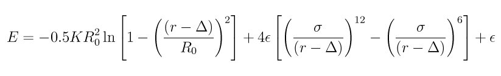

.. index:: bond\_style fene/expand

bond\_style fene/expand command
===============================

bond\_style fene/expand/omp command
===================================

Syntax
""""""

.. parsed-literal::

   bond_style fene/expand

Examples
""""""""

.. parsed-literal::

   bond_style fene/expand
   bond_coeff 1 30.0 1.5 1.0 1.0 0.5

Description
"""""""""""

The *fene/expand* bond style uses the potential

to define a finite extensible nonlinear elastic (FENE) potential
:ref:`(Kremer) <feneexpand-Kremer>`, used for bead-spring polymer models.  The first
term is attractive, the 2nd Lennard-Jones term is repulsive.

The *fene/expand* bond style is similar to *fene* except that an extra
shift factor of delta (positive or negative) is added to *r* to
effectively change the bead size of the bonded atoms.  The first term
now extends to R0 + delta and the 2nd term is cutoff at 2\^(1/6) sigma
+ delta.

The following coefficients must be defined for each bond type via the
:doc:`bond\_coeff <bond_coeff>` command as in the example above, or in
the data file or restart files read by the :doc:`read\_data <read_data>`
or :doc:`read\_restart <read_restart>` commands:

* K (energy/distance\^2)
* R0 (distance)
* epsilon (energy)
* sigma (distance)
* delta (distance)

----------

Styles with a *gpu*\ , *intel*\ , *kk*\ , *omp*\ , or *opt* suffix are
functionally the same as the corresponding style without the suffix.
They have been optimized to run faster, depending on your available
hardware, as discussed on the :doc:`Speed packages <Speed_packages>` doc
page.  The accelerated styles take the same arguments and should
produce the same results, except for round-off and precision issues.

These accelerated styles are part of the GPU, USER-INTEL, KOKKOS,
USER-OMP and OPT packages, respectively.  They are only enabled if
LAMMPS was built with those packages.  See the :doc:`Build package <Build_package>` doc page for more info.

You can specify the accelerated styles explicitly in your input script
by including their suffix, or you can use the :doc:`-suffix command-line switch <Run_options>` when you invoke LAMMPS, or you can use the
:doc:`suffix <suffix>` command in your input script.

See the :doc:`Speed packages <Speed_packages>` doc page for more
instructions on how to use the accelerated styles effectively.

----------

Restrictions
""""""""""""

This bond style can only be used if LAMMPS was built with the MOLECULE
package.  See the :doc:`Build package <Build_package>` doc page for more
info.

You typically should specify :doc:`special\_bonds fene <special_bonds>`
or :doc:`special\_bonds lj/coul 0 1 1 <special_bonds>` to use this bond
style.  LAMMPS will issue a warning it that's not the case.

Related commands
""""""""""""""""

:doc:`bond\_coeff <bond_coeff>`, :doc:`delete\_bonds <delete_bonds>`

**Default:** none

----------

.. _feneexpand-Kremer:

**(Kremer)** Kremer, Grest, J Chem Phys, 92, 5057 (1990).

.. _lws: http://lammps.sandia.gov
.. _ld: Manual.html
.. _lc: Commands_all.html
