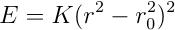

.. index:: bond\_style gromos

bond\_style gromos command
==========================

bond\_style gromos/omp command
==============================

Syntax
""""""

.. parsed-literal::

   bond_style gromos

Examples
""""""""

.. parsed-literal::

   bond_style gromos
   bond_coeff 5 80.0 1.2

Description
"""""""""""

The *gromos* bond style uses the potential

where r0 is the equilibrium bond distance.  Note that the usual 1/4
factor is included in K.

The following coefficients must be defined for each bond type via the
:doc:`bond\_coeff <bond_coeff>` command as in the example above, or in
the data file or restart files read by the :doc:`read\_data <read_data>`
or :doc:`read\_restart <read_restart>` commands:

* K (energy/distance\^4)
* r0 (distance)

----------

Styles with a *gpu*\ , *intel*\ , *kk*\ , *omp*\ , or *opt* suffix are
functionally the same as the corresponding style without the suffix.
They have been optimized to run faster, depending on your available
hardware, as discussed on the :doc:`Speed packages <Speed_packages>` doc
page.  The accelerated styles take the same arguments and should
produce the same results, except for round-off and precision issues.

These accelerated styles are part of the GPU, USER-INTEL, KOKKOS,
USER-OMP and OPT packages, respectively.  They are only enabled if
LAMMPS was built with those packages.  See the :doc:`Build package <Build_package>` doc page for more info.

You can specify the accelerated styles explicitly in your input script
by including their suffix, or you can use the :doc:`-suffix command-line switch <Run_options>` when you invoke LAMMPS, or you can use the
:doc:`suffix <suffix>` command in your input script.

See the :doc:`Speed packages <Speed_packages>` doc page for more
instructions on how to use the accelerated styles effectively.

----------

Restrictions
""""""""""""

This bond style can only be used if LAMMPS was built with the MOLECULE
package.  See the :doc:`Build package <Build_package>` doc page for more
info.

Related commands
""""""""""""""""

:doc:`bond\_coeff <bond_coeff>`, :doc:`delete\_bonds <delete_bonds>`

**Default:** none

.. _lws: http://lammps.sandia.gov
.. _ld: Manual.html
.. _lc: Commands_all.html
