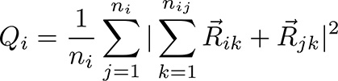

.. index:: compute cnp/atom

compute cnp/atom command
========================

Syntax
""""""

.. parsed-literal::

   compute ID group-ID cnp/atom cutoff

* ID, group-ID are documented in :doc:`compute <compute>` command
* cnp/atom = style name of this compute command
* cutoff = cutoff distance for nearest neighbors (distance units)

Examples
""""""""

.. parsed-literal::

   compute 1 all cnp/atom 3.08

Description
"""""""""""

Define a computation that calculates the Common Neighborhood
Parameter (CNP) for each atom in the group.  In solid-state systems
the CNP is a useful measure of the local crystal structure
around an atom and can be used to characterize whether the
atom is part of a perfect lattice, a local defect (e.g. a dislocation
or stacking fault), or at a surface.

The value of the CNP parameter will be 0.0 for atoms not in the
specified compute group.  Note that normally a CNP calculation should
only be performed on single component systems.

This parameter is computed using the following formula from
:ref:`(Tsuzuki) <Tsuzuki2>`

where the index *j* goes over the *n*\ i nearest neighbors of atom
*i*\ , and the index *k* goes over the *n*\ ij common nearest neighbors
between atom *i* and atom *j*\ . Rik and Rjk are the vectors connecting atom
*k* to atoms *i* and *j*\ .  The quantity in the double sum is computed
for each atom.

The CNP calculation is sensitive to the specified cutoff value.
You should ensure that the appropriate nearest neighbors of an atom are
found within the cutoff distance for the presumed crystal structure.
E.g. 12 nearest neighbor for perfect FCC and HCP crystals, 14 nearest
neighbors for perfect BCC crystals.  These formulas can be used to
obtain a good cutoff distance:

.. image:: Eqs/cnp_cutoff.jpg
   :align: center

where a is the lattice constant for the crystal structure concerned
and in the HCP case, x = (c/a) / 1.633, where 1.633 is the ideal c/a
for HCP crystals.

Also note that since the CNP calculation in LAMMPS uses the neighbors
of an owned atom to find the nearest neighbors of a ghost atom, the
following relation should also be satisfied:

.. image:: Eqs/cnp_cutoff2.jpg
   :align: center

where Rc is the cutoff distance of the potential, Rs is the skin
distance as specified by the :doc:`neighbor <neighbor>` command, and
cutoff is the argument used with the compute cnp/atom command.  LAMMPS
will issue a warning if this is not the case.

The neighbor list needed to compute this quantity is constructed each
time the calculation is performed (e.g. each time a snapshot of atoms
is dumped).  Thus it can be inefficient to compute/dump this quantity
too frequently or to have multiple compute/dump commands, each with a
*cnp/atom* style.

**Output info:**

This compute calculates a per-atom vector, which can be accessed by
any command that uses per-atom values from a compute as input.  See
the :doc:`Howto output <Howto_output>` doc page for an overview of
LAMMPS output options.

The per-atom vector values will be real positive numbers. Some typical CNP
values:

.. parsed-literal::

   FCC lattice = 0.0
   BCC lattice = 0.0
   HCP lattice = 4.4

   FCC (111) surface ~ 13.0
   FCC (100) surface ~ 26.5
   FCC dislocation core ~ 11

Restrictions
""""""""""""

This compute is part of the USER-MISC package.  It is only enabled if
LAMMPS was built with that package.  See the :doc:`Build package <Build_package>` doc page for more info.

Related commands
""""""""""""""""

:doc:`compute cna/atom <compute_cna_atom>`
:doc:`compute centro/atom <compute_centro_atom>`

**Default:** none

----------

.. _Tsuzuki2:

**(Tsuzuki)** Tsuzuki, Branicio, Rino, Comput Phys Comm, 177, 518 (2007).
