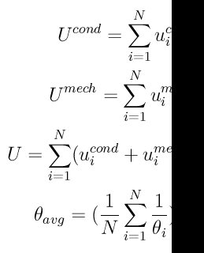

.. index:: compute dpd

compute dpd command
===================

Syntax
""""""

.. parsed-literal::

   compute ID group-ID dpd

* ID, group-ID are documented in :doc:`compute <compute>` command
* dpd = style name of this compute command

Examples
""""""""

.. parsed-literal::

   compute 1 all dpd

Description
"""""""""""

Define a computation that accumulates the total internal conductive
energy (U\_cond), the total internal mechanical energy (U\_mech), the
total chemical energy (U\_chem) and the *harmonic* average of the internal
temperature (dpdTheta) for the entire system of particles.  See the
:doc:`compute dpd/atom <compute_dpd_atom>` command if you want
per-particle internal energies and internal temperatures.

The system internal properties are computed according to the following
relations:

where N is the number of particles in the system

----------

**Output info:**

This compute calculates a global vector of length 5 (U\_cond, U\_mech,
U\_chem, dpdTheta, N\_particles), which can be accessed by indices 1-5.
See the :doc:`Howto output <Howto_output>` doc page for an overview of
LAMMPS output options.

The vector values will be in energy and temperature :doc:`units <units>`.

Restrictions
""""""""""""

This command is part of the USER-DPD package.  It is only enabled if
LAMMPS was built with that package.  See the :doc:`Build package <Build_package>` doc page for more info.

This command also requires use of the :doc:`atom_style dpd <atom_style>`
command.

Related commands
""""""""""""""""

:doc:`compute dpd/atom <compute_dpd_atom>`,
:doc:`thermo_style <thermo_style>`

**Default:** none

----------

.. _Larentzos1:

**(Larentzos)** J.P. Larentzos, J.K. Brennan, J.D. Moore, and
W.D. Mattson, "LAMMPS Implementation of Constant Energy Dissipative
Particle Dynamics (DPD-E)", ARL-TR-6863, U.S. Army Research
Laboratory, Aberdeen Proving Ground, MD (2014).

.. _lws: http://lammps.sandia.gov
.. _ld: Manual.html
.. _lc: Commands_all.html
