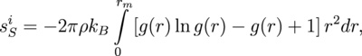
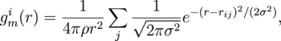

.. index:: compute entropy/atom

compute entropy/atom command
============================

Syntax
""""""

.. parsed-literal::

   compute ID group-ID entropy/atom sigma cutoff keyword value ...

* ID, group-ID are documented in :doc:`compute <compute>` command
* entropy/atom = style name of this compute command
* sigma = width of gaussians used in the g(r) smoothing
* cutoff = cutoff for the g(r) calculation
* one or more keyword/value pairs may be appended

.. parsed-literal::

   keyword = *avg* or *local*
     *avg* values = *yes* or *no* cutoff2
       *yes* = average the pair entropy over neighbors
       *no* = do not average the pair entropy over neighbors
       cutoff2 = cutoff for the averaging over neighbors
     *local* values = *yes* or *no* = use the local density around each atom to normalize the g(r)

Examples
""""""""

.. parsed-literal::

   compute 1 all entropy/atom 0.25 5.
   compute 1 all entropy/atom 0.25 5. avg yes 5.
   compute 1 all entropy/atom 0.125 7.3 avg yes 5.1 local yes

Description
"""""""""""

Define a computation that calculates the pair entropy fingerprint for
each atom in the group. The fingerprint is useful to distinguish between
ordered and disordered environments, for instance liquid and solid-like
environments, or glassy and crystalline-like environments. Some
applications could be the identification of grain boundaries, a
melt-solid interface, or a solid cluster emerging from the melt.
The advantage of this parameter over others is that no a priori
information about the solid structure is required.

This parameter for atom i is computed using the following formula from
:ref:`(Piaggi) <Piaggi>` and :ref:`(Nettleton) <Nettleton>` ,

where r is a distance, g(r) is the radial distribution function of atom
i and rho is the density of the system. The g(r) computed for each
atom i can be noisy and therefore it is smoothed using:

where the sum in j goes through the neighbors of atom i, and sigma is a
parameter to control the smoothing.

The input parameters are *sigma* the smoothing parameter, and the
*cutoff* for the calculation of g(r).

If the keyword *avg* has the setting *yes*\ , then this compute also
averages the parameter over the neighbors  of atom i according to:

.. image:: Eqs/pair_entropy3.jpg
   :align: center

where the sum j goes over the neighbors of atom i and N is the number
of neighbors. This procedure provides a sharper distinction between
order and disorder environments. In this case the input parameter
*cutoff2* is the cutoff for the averaging over the neighbors and
must also be specified.

If the *avg yes* option is used, the effective cutoff of the neighbor
list should be *cutoff*\ +\ *cutoff2* and therefore it might be necessary
to increase the skin of the neighbor list with:

.. parsed-literal::

   neighbor skin bin

See :doc:`neighbor <neighbor>` for details.

If the *local yes* option is used, the g(r) is normalized by the
local density around each atom, that is to say the density around each
atom  is the number of neighbors within the neighbor list cutoff divided
by the corresponding volume. This option can be useful when dealing with
inhomogeneous systems such as those that have surfaces.

Here are typical input parameters for fcc aluminum (lattice
constant 4.05 Angstroms),

.. parsed-literal::

   compute 1 all entropy/atom 0.25 5.7 avg yes 3.7

and for bcc sodium (lattice constant 4.23 Angstroms),

.. parsed-literal::

   compute 1 all entropy/atom 0.25 7.3 avg yes 5.1

**Output info:**

By default, this compute calculates the pair entropy value for each
atom as a per-atom vector, which can be accessed by any command that
uses per-atom values from a compute as input.  See the :doc:`Howto output <Howto_output>` doc page for an overview of LAMMPS output
options.

The pair entropy values have units of the Boltzmann constant. They are
always negative, and lower values (lower entropy) correspond to more
ordered environments.

Restrictions
""""""""""""

This compute is part of the USER-MISC package.  It is only enabled if
LAMMPS was built with that package.  See the :doc:`Build package <Build_package>` doc page for more info.

Related commands
""""""""""""""""

:doc:`compute cna/atom <compute_cna_atom>`
:doc:`compute centro/atom <compute_centro_atom>`

Default
"""""""

The default values for the optional keywords are avg = no and local = no.

----------

.. _Piaggi:

**(Piaggi)** Piaggi and Parrinello, J Chem Phys, 147, 114112 (2017).

.. _Nettleton:

**(Nettleton)** Nettleton and Green, J Chem Phys, 29, 6 (1958).
