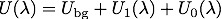
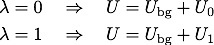
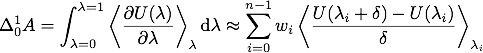
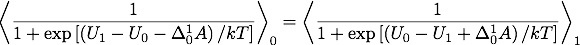

.. index:: compute fep

compute fep command
===================

Syntax
""""""

.. parsed-literal::

   compute ID group-ID fep temp attribute args ... keyword value ...

* ID, group-ID are documented in the :doc:`compute <compute>` command
* fep = name of this compute command
* temp = external temperature (as specified for constant-temperature run)
* one or more attributes with args may be appended
* attribute = *pair* or *atom*
  
  .. parsed-literal::
  
       *pair* args = pstyle pparam I J v_delta
         pstyle = pair style name, e.g. lj/cut
         pparam = parameter to perturb
         I,J = type pair(s) to set parameter for
         v_delta = variable with perturbation to apply (in the units of the parameter)
       *atom* args = aparam I v_delta
         aparam = parameter to perturb
         I = type to set parameter for
         v_delta = variable with perturbation to apply (in the units of the parameter)

* zero or more keyword/value pairs may be appended
* keyword = *tail* or *volume*
  
  .. parsed-literal::
  
       *tail* value = *no* or *yes*
         *no* = ignore tail correction to pair energies (usually small in fep)
         *yes* = include tail correction to pair energies
       *volume* value = *no* or *yes*
         *no* = ignore volume changes (e.g. in *NVE* or *NVT* trajectories)
         *yes* = include volume changes (e.g. in *NpT* trajectories)

Examples
""""""""

.. parsed-literal::

   compute 1 all fep 298 pair lj/cut epsilon 1 \* v_delta pair lj/cut sigma 1 \* v_delta volume yes
   compute 1 all fep 300 atom charge 2 v_delta

Description
"""""""""""

Apply a perturbation to parameters of the interaction potential and
recalculate the pair potential energy without changing the atomic
coordinates from those of the reference, unperturbed system. This
compute can be used to calculate free energy differences using several
methods, such as free-energy perturbation (FEP), finite-difference
thermodynamic integration (FDTI) or Bennet's acceptance ratio method
(BAR).

The potential energy of the system is decomposed in three terms: a
background term corresponding to interaction sites whose parameters
remain constant, a reference term :math:`U_0` corresponding to the
initial interactions of the atoms that will undergo perturbation, and
a term :math:`U_1` corresponding to the final interactions of
these atoms:

A coupling parameter :math:`\lambda` varying from 0 to 1 connects the
reference and perturbed systems:

It is possible but not necessary that the coupling parameter (or a
function thereof) appears as a multiplication factor of the potential
energy. Therefore, this compute can apply perturbations to interaction
parameters that are not directly proportional to the potential energy
(e.g. :math:`\sigma` in Lennard-Jones potentials).

This command can be combined with :doc:`fix adapt <fix_adapt>` to
perform multistage free-energy perturbation calculations along
stepwise alchemical transformations during a simulation run:

.. image:: Eqs/compute_fep_fep.jpg
   :align: center

This compute is suitable for the finite-difference thermodynamic
integration (FDTI) method :ref:`(Mezei) <Mezei>`, which is based on an
evaluation of the numerical derivative of the free energy by a
perturbation method using a very small :math:`\delta`:

.. image:: Eqs/compute_fep_fdti.jpg
   :align: center

where :math:`w_i` are weights of a numerical quadrature. The :doc:`fix adapt <fix_adapt>` command can be used to define the stages of
:math:`\lambda` at which the derivative is calculated and averaged.

The compute fep calculates the exponential Boltzmann term and also the
potential energy difference :math:`U_1 -U_0`. By
choosing a very small perturbation :math:`\delta` the thermodynamic
integration method can be implemented using a numerical evaluation of
the derivative of the potential energy with respect to :math:`\lambda`:

Another technique to calculate free energy differences is the
acceptance ratio method :ref:`(Bennet) <Bennet>`, which can be implemented
by calculating the potential energy differences with :math:`\delta` = 1.0 on
both the forward and reverse routes:

The value of the free energy difference is determined by numerical
root finding to establish the equality.

Concerning the choice of how the atomic parameters are perturbed in
order to setup an alchemical transformation route, several strategies
are available, such as single-topology or double-topology strategies
:ref:`(Pearlman) <Pearlman>`. The latter does not require modification of
bond lengths, angles or other internal coordinates.

NOTES: This compute command does not take kinetic energy into account,
therefore the masses of the particles should not be modified between
the reference and perturbed states, or along the alchemical
transformation route.  This compute command does not change bond
lengths or other internal coordinates :ref:`(Boresch, Karplus) <BoreschKarplus>`.

----------

The *pair* attribute enables various parameters of potentials defined
by the :doc:`pair_style <pair_style>` and :doc:`pair_coeff <pair_coeff>`
commands to be changed, if the pair style supports it.

The *pstyle* argument is the name of the pair style. For example,
*pstyle* could be specified as "lj/cut".  The *pparam* argument is the
name of the parameter to change.  This is a list of
pair styles and parameters that can be used with this compute.  See
the doc pages for individual pair styles and their energy formulas for
the meaning of these parameters:

+---------------------------------------------------------------------+-------------------------+------------+
| :doc:`born <pair_born>`                                             | a,b,c                   | type pairs |
+---------------------------------------------------------------------+-------------------------+------------+
| :doc:`buck <pair_buck>`                                             | a,c                     | type pairs |
+---------------------------------------------------------------------+-------------------------+------------+
| :doc:`buck/mdf <pair_mdf>`                                          | a,c                     | type pairs |
+---------------------------------------------------------------------+-------------------------+------------+
| :doc:`coul/cut <pair_coul>`                                         | scale                   | type pairs |
+---------------------------------------------------------------------+-------------------------+------------+
| :doc:`coul/cut/soft <pair_fep_soft>`                                | lambda                  | type pairs |
+---------------------------------------------------------------------+-------------------------+------------+
| :doc:`coul/long, coul/msm <pair_coul>`                              | scale                   | type pairs |
+---------------------------------------------------------------------+-------------------------+------------+
| :doc:`coul/long/soft <pair_fep_soft>`                               | scale, lambda           | type pairs |
+---------------------------------------------------------------------+-------------------------+------------+
| :doc:`eam <pair_eam>`                                               | scale                   | type pairs |
+---------------------------------------------------------------------+-------------------------+------------+
| :doc:`gauss <pair_gauss>`                                           | a                       | type pairs |
+---------------------------------------------------------------------+-------------------------+------------+
| :doc:`lennard/mdf <pair_mdf>`                                       | a,b                     | type pairs |
+---------------------------------------------------------------------+-------------------------+------------+
| :doc:`lj/class2 <pair_class2>`                                      | epsilon,sigma           | type pairs |
+---------------------------------------------------------------------+-------------------------+------------+
| :doc:`lj/class2/coul/cut, lj/class2/coul/long <pair_class2>`        | epsilon,sigma           | type pairs |
+---------------------------------------------------------------------+-------------------------+------------+
| :doc:`lj/cut <pair_lj>`                                             | epsilon,sigma           | type pairs |
+---------------------------------------------------------------------+-------------------------+------------+
| :doc:`lj/cut/soft <pair_fep_soft>`                                  | epsilon,sigma,lambda    | type pairs |
+---------------------------------------------------------------------+-------------------------+------------+
| :doc:`lj/cut/coul/cut, lj/cut/coul/long, lj/cut/coul/msm <pair_lj>` | epsilon,sigma           | type pairs |
+---------------------------------------------------------------------+-------------------------+------------+
| :doc:`lj/cut/coul/cut/soft, lj/cut/coul/long/soft <pair_fep_soft>`  | epsilon,sigma,lambda    | type pairs |
+---------------------------------------------------------------------+-------------------------+------------+
| :doc:`lj/cut/tip4p/cut, lj/cut/tip4p/long <pair_lj>`                | epsilon,sigma           | type pairs |
+---------------------------------------------------------------------+-------------------------+------------+
| :doc:`lj/cut/tip4p/long/soft <pair_fep_soft>`                       | epsilon,sigma,lambda    | type pairs |
+---------------------------------------------------------------------+-------------------------+------------+
| :doc:`lj/expand <pair_lj_expand>`                                   | epsilon,sigma,delta     | type pairs |
+---------------------------------------------------------------------+-------------------------+------------+
| :doc:`lj/mdf <pair_mdf>`                                            | epsilon,sigma           | type pairs |
+---------------------------------------------------------------------+-------------------------+------------+
| :doc:`lj/sf/dipole/sf <pair_dipole>`                                | epsilon,sigma,scale     | type pairs |
+---------------------------------------------------------------------+-------------------------+------------+
| :doc:`mie/cut <pair_mie>`                                           | epsilon,sigma,gamR,gamA | type pairs |
+---------------------------------------------------------------------+-------------------------+------------+
| :doc:`morse, morse/smooth/linear <pair_morse>`                      | d0,r0,alpha             | type pairs |
+---------------------------------------------------------------------+-------------------------+------------+
| :doc:`morse/soft <pair_morse>`                                      | d0,r0,alpha,lambda      | type pairs |
+---------------------------------------------------------------------+-------------------------+------------+
| :doc:`nm/cut <pair_nm>`                                             | e0,r0,nn,mm             | type pairs |
+---------------------------------------------------------------------+-------------------------+------------+
| :doc:`nm/cut/coul/cut, nm/cut/coul/long <pair_nm>`                  | e0,r0,nn,mm             | type pairs |
+---------------------------------------------------------------------+-------------------------+------------+
| :doc:`ufm <pair_ufm>`                                               | epsilon,sigma,scale     | type pairs |
+---------------------------------------------------------------------+-------------------------+------------+
| :doc:`soft <pair_soft>`                                             | a                       | type pairs |
+---------------------------------------------------------------------+-------------------------+------------+

Note that it is easy to add new potentials and their parameters to
this list.  All it typically takes is adding an extract() method to
the pair\_\*.cpp file associated with the potential.

Similar to the :doc:`pair_coeff <pair_coeff>` command, I and J can be
specified in one of two ways.  Explicit numeric values can be used for
each, as in the 1st example above.  I <= J is required.  LAMMPS sets
the coefficients for the symmetric J,I interaction to the same
values. A wild-card asterisk can be used in place of or in conjunction
with the I,J arguments to set the coefficients for multiple pairs of
atom types.  This takes the form "\*" or "\*n" or "n\*" or "m\*n".  If N =
the number of atom types, then an asterisk with no numeric values
means all types from 1 to N.  A leading asterisk means all types from
1 to n (inclusive).  A trailing asterisk means all types from n to N
(inclusive).  A middle asterisk means all types from m to n
(inclusive).  Note that only type pairs with I <= J are considered; if
asterisks imply type pairs where J < I, they are ignored.

If :doc:`pair_style hybrid or hybrid/overlay <pair_hybrid>` is being
used, then the *pstyle* will be a sub-style name.  You must specify
I,J arguments that correspond to type pair values defined (via the
:doc:`pair_coeff <pair_coeff>` command) for that sub-style.

The *v\_name* argument for keyword *pair* is the name of an
:doc:`equal-style variable <variable>` which will be evaluated each time
this compute is invoked.  It should be specified as v\_name, where name
is the variable name.

----------

The *atom* attribute enables atom properties to be changed.  The
*aparam* argument is the name of the parameter to change.  This is the
current list of atom parameters that can be used with this compute:

* charge = charge on particle

The *v\_name* argument for keyword *pair* is the name of an
:doc:`equal-style variable <variable>` which will be evaluated each time
this compute is invoked.  It should be specified as v\_name, where name
is the variable name.

----------

The *tail* keyword controls the calculation of the tail correction to
"van der Waals" pair energies beyond the cutoff, if this has been
activated via the :doc:`pair_modify <pair_modify>` command. If the
perturbation is small, the tail contribution to the energy difference
between the reference and perturbed systems should be negligible.

If the keyword *volume* = *yes*\ , then the Boltzmann term is multiplied
by the volume so that correct ensemble averaging can be performed over
trajectories during which the volume fluctuates or changes :ref:`(Allen and Tildesley) <AllenTildesley>`:

.. image:: Eqs/compute_fep_vol.jpg
   :align: center

----------

**Output info:**

This compute calculates a global vector of length 3 which contains the
energy difference ( :math:`U_1-U_0` ) as c\_ID[1], the
Boltzmann factor :math:`\exp(-(U_1-U_0)/kT)`, or
:math:`V \exp(-(U_1-U_0)/kT)`, as c\_ID[2] and the
volume of the simulation box :math:`V` as c\_ID[3]. :math:`U_1` is the
pair potential energy obtained with the perturbed parameters and
:math:`U_0` is the pair potential energy obtained with the
unperturbed parameters. The energies include kspace terms if these
are used in the simulation.

These output results can be used by any command that uses a global
scalar or vector from a compute as input.  See the :doc:`Howto output <Howto_output>` doc page for an overview of LAMMPS output
options. For example, the computed values can be averaged using :doc:`fix ave/time <fix_ave_time>`.

The values calculated by this compute are "extensive".

Restrictions
""""""""""""

This compute is distributed as the USER-FEP package.  It is only
enabled if LAMMPS was built with that package.  See the :doc:`Build package <Build_package>` doc page for more info.

Related commands
""""""""""""""""

:doc:`fix adapt/fep <fix_adapt_fep>`, :doc:`fix ave/time <fix_ave_time>`,
:doc:`pair_style .../soft <pair_fep_soft>`

Default
"""""""

The option defaults are *tail* = *no*\ , *volume* = *no*\ .

----------

.. _Pearlman:

**(Pearlman)** Pearlman, J Chem Phys, 98, 1487 (1994)

.. _Mezei:

**(Mezei)** Mezei, J Chem Phys, 86, 7084 (1987)

.. _Bennet:

**(Bennet)** Bennet, J Comput Phys, 22, 245 (1976)

.. _BoreschKarplus:

**(BoreschKarplus)** Boresch and Karplus, J Phys Chem A, 103, 103 (1999)

.. _AllenTildesley:

**(AllenTildesley)** Allen and Tildesley, Computer Simulation of
Liquids, Oxford University Press (1987)

.. _lws: http://lammps.sandia.gov
.. _ld: Manual.html
.. _lc: Commands_all.html
