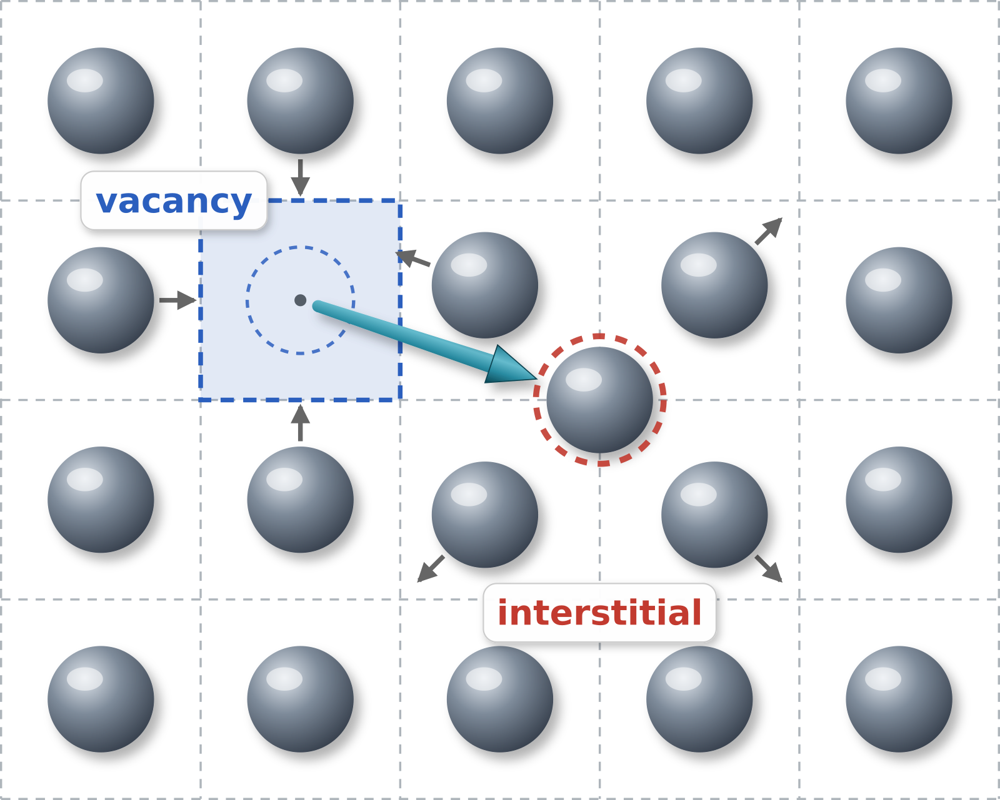
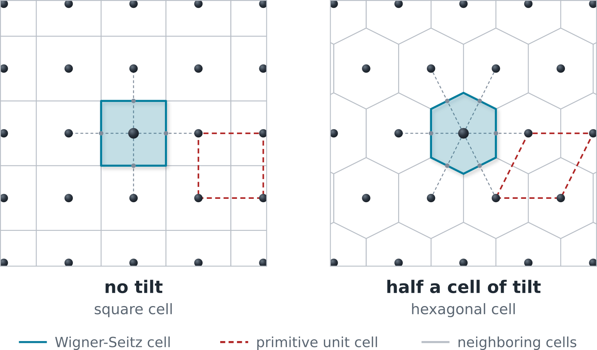
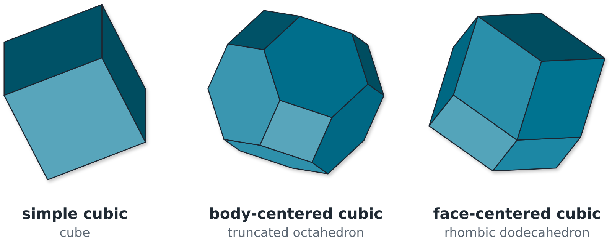
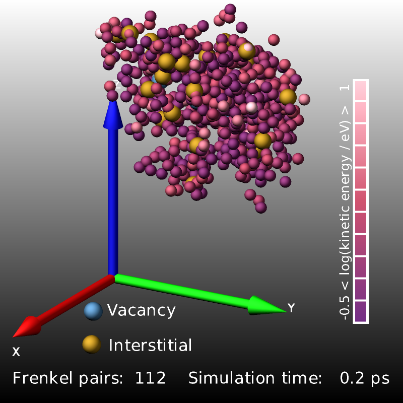
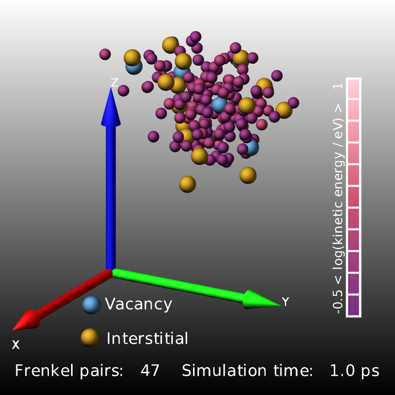
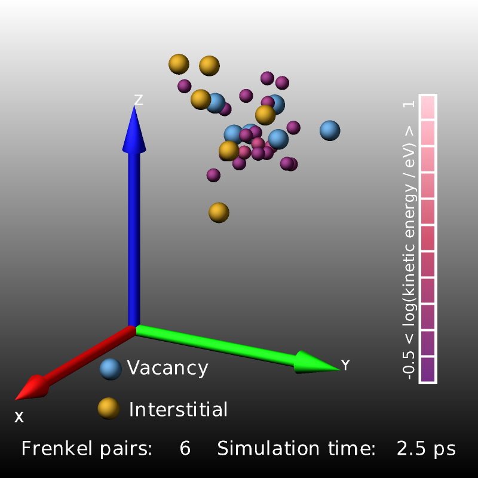

.. index:: compute frenkel

compute frenkel command
=======================

Syntax
""""""

.. code-block:: LAMMPS

   compute ID group-ID frenkel keyword value ...

* ID, group-ID are documented in :doc:`compute <compute>` command
* frenkel = style name of this compute command
* zero or more keyword/value pairs may be appended
* keyword = *drvac* or *drint* or *region* or *rescale* or *site_file*

  .. parsed-literal::

       *drvac* value = distance for including vacancies in a cluster (unitless multiple of nearest neighbor distance)
       *drint* value = distance for including interstitials in a cluster (unitless multiple of nearest neighbor distance)
       *region* value = ID of a region (or *none*) to restrict the reference sites to
       *rescale* value = *yes* or *no* to co-scale the reference sites with the box
       *site_file* value = name of a file with explicit "x y z" site coordinates (or *none*)

Examples
""""""""

.. code-block:: LAMMPS

   compute 1 all frenkel

   compute def all frenkel drvac 1.6 drint 1.9 rescale yes
   compute sub all frenkel region inner site_file sites.txt

Description
"""""""""""

.. versionadded:: TBD

Define a computation that identifies point defects in a crystal by
Wigner-Seitz analysis and counts the number of vacancies and
interstitials (i.e.\ the number of Frenkel pairs) on the fly, without
post-processing.  This is useful for following radiation-damage cascades,
thermal defect formation, or any process that creates or annihilates
point defects.

The reference lattice is taken from the most recently defined
:doc:`lattice <lattice>` command: the compute generates one lattice site
at every basis point of every unit cell that lies inside the simulation
box (exactly as :doc:`create_atoms <create_atoms>` would, but without
adding any atoms to the system).  Each atom in the compute group is then
assigned to the nearest lattice site.  Atoms that are not in the compute
group are ignored and never count as occupants of a lattice site; this
can be used, for example, to exclude gas atoms such as helium in
tungsten from the analysis.  A site with no atoms is a *vacancy*; a site
with two atoms holds an *interstitial*; a site with more than two atoms
is counted as an interstitial and additionally flagged as *irregular*.

   Schematic depiction of a Frenkel pair: an atom is displaced
   from its lattice site leaving a vacancy and gets squeezed in
   between the atoms of neighboring occupied lattice sites

The Wigner-Seitz cell of a lattice site is the region of space that is
closer to that site than to any other site.  Assigning every atom to its
nearest reference site is therefore the same as assigning it to the
Wigner-Seitz cell it falls into, and the occupancy of a site is the
number of atoms that end up in its cell.  Since the cells fill space
without gaps or overlaps, every atom is assigned to exactly one of them.
This construction is also known as a `Voronoi tessellation
<https://en.wikipedia.org/wiki/Voronoi_diagram>`_ of the lattice sites,
and is the same one that :doc:`compute voronoi/atom
<compute_voronoi_atom>` applies to the atoms themselves.  A more detailed
description can be found on the corresponding `Wikipedia page
<https://en.wikipedia.org/wiki/Wigner%E2%80%93Seitz_cell>`_.

   Wigner-Seitz cells of a two-dimensional lattice.  Each cell is bounded
   by the planes that cut the connections to the neighboring sites
   (dashed) in half at a right angle, so the shape of the cell follows
   from the lattice alone: shearing the lattice by half a cell turns the
   square cell into a hexagonal one.  A Wigner-Seitz cell covers the same
   area (in three dimensions, the same volume) as a primitive unit cell,
   but it is centered on a lattice site and has the full symmetry of the
   lattice.

   Wigner-Seitz cells of the three cubic lattices.  The three cells are
   drawn at a common size and are not to scale relative to each other.

To find the nearest reference site of an atom quickly, the sites of each
processor are sorted into a regular grid of bins, in the same way a
neighbor list is built.  An atom is mapped to its bin, the closest site
in that bin is picked, and the list of neighboring sites of that site,
which is built from the same bins, is followed until no closer site is
found.  Whether the atom is really inside the Wigner-Seitz cell of that
site is then confirmed with the bisecting planes described above.  The
bins and the lists of neighboring sites are set up once at the beginning
of a run and rebuilt only when the simulation box changes.

Nearby defective sites (0 or 2+ atoms) are further grouped into
clusters.  Two defective sites are connected when they are closer to
each other than *drvac* if the second site is empty, or closer than
*drint* if it holds more than one atom.  A cluster is a group of
defective sites that are connected in this way, either directly or
through other defective sites of the same cluster.  Every defective site
therefore belongs to exactly one cluster and the clusters do not
overlap.  A cluster is identified by the smallest atom ID among its
sites, and its position is the average of the positions of its sites.

The size of a cluster is the number of its interstitials minus the number
of its vacancies, so the sign of the size distinguishes interstitial-type
from vacancy-type clusters, and a cluster with as many vacancies as
interstitials has a size of zero.  A site holding more than two atoms
counts as one interstitial, not as one per extra atom.  Note that the
identification and counting of the vacancies and interstitials themselves
depends only on the number of atoms at each site, not on this clustering
or the two distances.

The optional keywords listed above adjust the settings of the analysis.

The *drvac* and *drint* distances are specified as unitless multiples of
the nearest neighbor distance of the reference lattice, not in distance
units, so that the same setting has the same meaning for different
lattices and different lattice constants.  They default to 1.5 and 1.82,
respectively.  With those values a vacancy is connected to defects in
the first two neighbor shells and a multiply occupied site to defects in
the first three, and this is the case for simple cubic, bcc, and fcc
lattices alike; the larger value for interstitials accounts for their
spatially more extended configurations such as dumbbells.  The nearest
neighbor distance and the resulting two distances are printed at the
beginning of each run.  With *rescale yes* they follow the box, so that
they remain the same multiples of the nearest neighbor distance of the
rescaled reference lattice.

Use the *region* keyword to exclude reference sites where no atoms are
expected.  This is strongly recommended when parts of the simulation box
are empty, for example the vacuum above a free surface in a non-periodic
dimension, since otherwise every site in the empty space is counted as a
vacancy.  Such a mistake is not detected as such, but a warning is
printed when more than 20 percent of the reference sites are found to be
empty, which also catches a reference lattice that does not match the
crystalline structure of the atoms.

Use *rescale yes* when the box changes size during the run (for example
under :doc:`fix npt <fix_nh>` or while heating), so that the reference
sites expand and contract with the box and thermal expansion is not
mistaken for defect formation.  A warning is printed when the size of the
box changes during a run while *rescale* is not enabled.

The reference sites never follow a change of the box *shape*, so shearing
the box is not supported.  A warning is printed when the box shape will
change during a run, and combining a shearing box with *rescale yes* is
an error.

With the *site_file* keyword the reference sites are not generated from
the lattice but read from the given text file, which must contain one
site per line as three coordinates "x y z" (anything following a "#"
character is ignored).  Blank lines and comment-only lines are skipped.
This allows using a reference structure that is not a perfect lattice,
for example the relaxed atom positions from the beginning of a
simulation.  A :doc:`lattice <lattice>` command is still required, since
the shape of the Wigner-Seitz cells and the nearest neighbor distance
that *drvac* and *drint* refer to are derived from it.

.. note::

   The lattice must match the crystal that the atoms actually occupy.
   If the lattice spacing or orientation is wrong, essentially every
   atom will be flagged as a defect.  For a crystal at finite
   temperature it is usually best to use the thermally expanded lattice
   constant (or *rescale yes*), and to analyze the inherent structure (a
   quenched or minimized snapshot) when the thermal displacements are
   large.

In a restarted simulation this compute behaves like any other compute:
the :doc:`lattice <lattice>` and compute commands must be repeated in
the input script and the reference sites are then regenerated at the
beginning of the run.  With *rescale yes* the lattice constant must be
chosen to match the size of the box stored in the restart file.

This compute is described in :ref:`(Hammond) <compute-frenkel-Hammond>`.

Output info
"""""""""""

This compute calculates a global vector of length 3, a global array, a
per-atom vector, and a local array.

The **global vector** holds, in order, the number of vacancies, the
number of interstitials, and the number of irregular sites (sites with
more than two atoms), each summed over all MPI processes.  Thus
``c_ID[1]`` is the number of Frenkel pairs, provided the crystal has no
sources or sinks for defects such as free surfaces or pre-existing
vacancies, since only then is the number of vacancies equal to the number
of interstitials.

The **global array** has 2 rows and 20 columns and is a histogram of the
defect cluster sizes: row 1 counts vacancy clusters and row 2 counts
interstitial clusters, with column *k* holding the number of clusters
with a net content of *k* defects (clusters larger than 20 are added to
the last column).  Clusters containing as many vacancies as
interstitials, i.e. Frenkel pairs that are about to recombine, have a
net size of zero and are not included in the histogram.

The **per-atom vector** is the distance of each atom from its nearest
lattice site, which can be used to color atoms in a :doc:`dump image
<dump_image>` or to select displaced atoms.  For atoms outside the
compute group the value is 0.0.

The **local array** has 5 columns and one row per defect cluster owned by
the MPI process: the cluster ID, the cluster size (negative for vacancy
clusters, positive for interstitial clusters), and the *x*, *y*, *z*
coordinates of the cluster center, i.e. the average position of the
defective sites that make up the cluster.  To avoid double counting, a cluster
is stored only on the process whose subdomain contains its center.  The
array can be written with the :doc:`dump local <dump>` command.

The following excerpt from a displacement-cascade simulation in bcc iron
started by giving a 2 keV recoil to a primary knock-on atom (PKA) uses
compute frenkel to count and visualize the created Frenkel pairs.

.. code-block:: LAMMPS

   lattice      bcc 2.8553                     # reference lattice for the WS analysis
   compute      ke all ke/atom
   compute      fr all frenkel
   variable     vizstep index 100
   variable     hot atom c_ke>0.5
   variable     acol atom log(c_ke)
   group        hot dynamic all var hot every ${vizstep}

   fix          spheres all graphics/objects ${vizstep} &
                   sphere 1 32.0 10.0 0.0 2.0 &
                   sphere 2 50.0 20.0 0.0 2.0
   fix          label   all graphics/labels  ${vizstep} &
                   text "Frenkel pairs: $(c_fr[1]:% 4.0f)    Simulation time: $(time:% 5.1f) ps" &
                   400 50 0 size 30 &
                colorscale viz "log(kinetic energy / eV)" 700 400 0 vertical length 600 tics 10 &
                text "Vacancy" 280 185 0 size 30  &
                text "Interstitial" 300 115 0 size 30
   variable     acol atom log(c_ke)*v_hot

   dump         viz hot image 100 frenkel-*.png v_acol type size 800 800 &
                    zoom 2.0 view 70 30 center s 0.5 0.5 0.4 &
                    shiny 0.2 fsaa yes box no 0.0 axes yes 0.5 0.05 &
                    compute fr type 0 2 fix label type 1 0 fix spheres type 0 0

   dump_modify  viz pad 6 backcolor black backcolor2 white element Fe Fe Fe O &
                adiam * 2.5  color map2 0.342 0.062 0.429 color map3 0.736 0.216 0.330 &
                amap -0.5 1 cf 0.0 3 min map2 0.5 map3 max pink &
                acolor 1 steelblue acolor 2 darkgoldenrod

|frenkel1|  |frenkel2|  |frenkel3|

The images above are three snapshot images created by the LAMMPS input
from above.  Shown are atoms with elevated kinetic energy (smaller
spheres, colored by their kinetic energy on a logarithmic scale) and the
Frenkel pairs (larger spheres, blue: vacancies, yellow: interstitials).
The cascade of collisions spreads and briefly "melts" a small region
(0.2 ps) whose kinetic energy then quickly dissipates into the
surrounding crystal (1.0 ps) and the system relaxes and the lattice
reconstructs so that only a small number of Frenkel pairs survive.

Dump image info
"""""""""""""""

Compute *frenkel* can be used with the *compute* keyword of :doc:`dump
image <dump_image>`.  It adds one sphere at the center of every defect
cluster to the rendered image, so the spatial distribution of the damage
is shown directly without an external visualization tool.

Each sphere carries a color index of 1 for a vacancy cluster and 2 for an
interstitial cluster.  With color style *type* or *element* these indices
are mapped to the corresponding atom-type (or element) colors; with color
style *const* all spheres use one color, which defaults to white and can
be changed with :doc:`dump_modify ccolor <dump_image>`.  The opacity
defaults to fully opaque and can be changed with *dump_modify ctrans*.

To draw vacancies and interstitials in two distinct colors that are
independent of the real atoms, define one or two extra atom types that no
atoms actually use (give them a mass and a :doc:`pair_coeff <pair_coeff>`
so the input is valid; since no atoms have those types they have no effect
on the simulation) and color them with :doc:`dump_modify acolor
<dump_image>`.  For example, with the metal atoms on type 3 and types 1
and 2 reserved for the defect colors:

.. code-block:: LAMMPS

   compute fr all frenkel
   dump    d all image 1000 defect.*.jpg type type adiam 0.5 compute fr type 0 0
   dump_modify d acolor 1 blue acolor 2 red acolor 3 gray atrans 3 0.1

Each cluster sphere is drawn with a diameter of 0.6 lattice spacings.
The *cflag2* setting is added to that diameter, which allows to enlarge
the markers; the *cflag1* setting is not used for spheres.

Changes to compute frenkel since its publication
""""""""""""""""""""""""""""""""""""""""""""""""

This compute is derived from the implementation published in
:ref:`(Hammond) <compute-frenkel-Hammond>`.  The Wigner-Seitz analysis
itself is unchanged, but the command has been adapted to current LAMMPS
conventions and its interface, one of its defaults, and its behavior in
parallel differ from the published version.  Input scripts written for
the published version therefore need to be adjusted.

*Output instead of extra particles.*  The published version came with a
companion *dump* style that wrote out the identified defects as if they
were particles, which required setting aside an atom type and a group
for them.  This version adds no particles and no dump style.  Instead the
defect clusters are available as a local array that can be written with
the :doc:`dump local <dump>` command, and they can be drawn directly with
the *compute* keyword of :doc:`dump image <dump_image>`, as described
above.  The *frenkelgroup* setting, which selected the group used for
those particles, no longer exists.

*The compute group is used.*  The published version analyzed all atoms.
Here atoms outside the group of the compute are ignored and never count
as occupants of a lattice site, which allows restricting the analysis to
one species of a multi-component system, for example to the tungsten
atoms of a tungsten crystal containing helium.

*Settings are keywords of the compute command.*  The published version
set *drvac*, *drint*, and the other options with the
:doc:`compute_modify <compute_modify>` command.  They are now optional
keywords of the compute command itself, as is customary for LAMMPS
commands, and *compute_modify* no longer accepts them.

*drvac and drint are unitless.*  The published version interpreted these
two settings as distances and derived their defaults from the largest
:doc:`lattice <lattice>` spacing.  For a lattice whose unit cell contains
more than one site, however, the lattice spacing is not the distance
between neighboring sites, and for a non-cubic unit cell there is no
single lattice spacing at all.  They are therefore now multiples of the
nearest neighbor distance of the reference lattice, with the defaults
described above.  For a bcc lattice the defaults connect exactly the same
neighbor shells as the published defaults did.  For an fcc lattice the
published default for *drint* also reached the fourth neighbor shell,
which the new default no longer does, and for a simple cubic lattice the
published default for *drvac* only reached the first neighbor shell,
while the new default reaches the second one as documented.

*Corrections.*  Several defects were found and fixed while adapting the
code: the exchange of information between processors could stall for a
defect cluster spanning several processor subdomains; the analysis could
report defects that are not there after the simulation box had changed
its size; and large settings of *drvac* or *drint* could crash the
calculation.

*Error checks.*  Combinations that the analysis cannot handle, namely
:doc:`comm_style tiled <comm_style>`, :doc:`fix balance <fix_balance>`,
and *rescale yes* for a triclinic box, are now rejected with an error
message.  A warning is printed when the simulation box changes during a
run while *rescale* is not enabled, and when the communication cutoff is
smaller than the distance this compute needs to search.

Restrictions
""""""""""""

This compute is part of the EXTRA-COMPUTE package.  It is only enabled if
LAMMPS was built with that package.  See the :doc:`Build package
<Build_package>` page for more info.

All atoms must have IDs and an :doc:`atom map <atom_modify>` must be
defined (for example with ``atom_modify map array``).  A :doc:`lattice
<lattice>` must be defined to provide the reference sites; a general
triclinic lattice is not supported.

The shape of the Wigner-Seitz cell is determined from the surroundings of
the first site of the unit cell and then used for all sites.  This is
exact when all sites of the lattice have the same surroundings, as for
the simple cubic, body-centered cubic, and face-centered cubic lattices,
and an approximation for a lattice whose unit cell contains sites with
differently oriented surroundings, such as the diamond lattice.

This compute cannot be used together with :doc:`comm_style tiled
<comm_style>` or :doc:`fix balance <fix_balance>`, and the *rescale*
option does not support triclinic simulation boxes.  Each of these is
rejected with an error message.  A simulation box that changes its size
or shape while *rescale* is not enabled, and a communication cutoff that
is smaller than the distance this compute has to search, produce a
warning.

Related commands
""""""""""""""""

:doc:`dump local <dump>`, :doc:`dump image <dump_image>`,
:doc:`compute cluster/atom <compute_cluster_atom>`,
:doc:`compute voronoi/atom <compute_voronoi_atom>`,
:doc:`lattice <lattice>`

Default
"""""""

The *drvac* and *drint* distances default to 1.5 and 1.82 nearest
neighbor distances, respectively; *region* = none, *rescale* = no,
*site_file* = none.

----------

.. _compute-frenkel-Hammond:

**(Hammond)** Hammond, "Parallel point defect identification in molecular
dynamics simulations without post-processing: A compute and dump style for
LAMMPS", Comput. Phys. Commun. 247, 106862 (2020).
