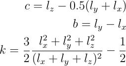

.. index:: compute gyration/shape

compute gyration/shape command
==============================

Syntax
""""""

.. parsed-literal::

   compute ID group-ID gyration/shape compute-ID

* ID, group-ID are documented in :doc:`compute <compute>` command
* gyration/shape = style name of this compute command
* compute-ID = ID of :doc:`compute gyration <compute_gyration>` command

Examples
""""""""

.. parsed-literal::

   compute 1 molecule gyration/shape pe

Description
"""""""""""

Define a computation that calculates the eigenvalues of the gyration tensor of a
group of atoms and three shape parameters. The computation includes all effects
due to atoms passing through periodic boundaries.

The three computed shape parameters are the asphericity, b, the acylindricity, c,
and the relative shape anisotropy, k:

where lx <= ly <= lz are the three eigenvalues of the gyration tensor. A general description 
of these parameters is provided in :ref:`(Mattice) <Mattice1>` while an application to polymer systems 
can be found in :ref:`(Theodorou) <Theodorou1>`.
The asphericity  is always non-negative and zero only when the three principal
moments are equal. This zero condition is met when the distribution of particles
is spherically symmetric (hence the name asphericity) but also whenever the particle
distribution is symmetric with respect to the three coordinate axes, e.g.,
when the particles are distributed uniformly on a cube, tetrahedron or other Platonic
solid. The acylindricity is always non-negative and zero only when the two principal
moments are equal. This zero condition is met when the distribution of particles is
cylindrically symmetric (hence the name, acylindricity), but also whenever the particle
distribution is symmetric with respect to the two coordinate axes, e.g., when the
particles are distributed uniformly on a regular prism. the relative shape anisotropy
is bounded between zero (if all points are spherically symmetric) and one
(if all points lie on a line).

.. note::

   The coordinates of an atom contribute to the gyration tensor in
   "unwrapped" form, by using the image flags associated with each atom.
   See the :doc:`dump custom <dump>` command for a discussion of "unwrapped"
   coordinates. See the Atoms section of the :doc:`read_data <read_data>`
   command for a discussion of image flags and how they are set for each
   atom.  You can reset the image flags (e.g. to 0) before invoking this
   compute by using the :doc:`set image <set>` command.

**Output info:**

This compute calculates a global vector of
length 6, which can be accessed by indices 1-6. The first three values are the
eigenvalues of the gyration tensor followed by the asphericity, the acylindricity
and the relative shape anisotropy.  The computed values can be used by any command
that uses global  vector values from a compute as input.  See the :doc:`Howto output <Howto_output>` doc page for an overview of LAMMPS output
options.

The vector values calculated by this compute are
"intensive".  The first five vector values will be in
distance\^2 :doc:`units <units>` while the sixth one is dimensionless.

Restrictions
""""""""""""

This compute is part of the USER-MISC package.  It is only enabled if
LAMMPS was built with that package.  See the :doc:`Build package <Build_package>` doc page for more info.

Related commands
""""""""""""""""

:doc:`compute gyration <compute_gyration>`

**Default:** none

----------

.. _Mattice1:

**(Mattice)** Mattice, Suter, Conformational Theory of Large Molecules, Wiley, New York, 1994.

.. _Theodorou1:

**(Theodorou)** Theodorou, Suter, Macromolecules, 18, 1206 (1985).
