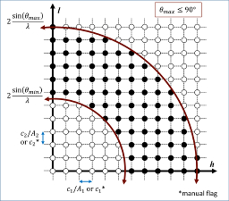

.. index:: compute xrd

compute xrd command
===================

Syntax
""""""

.. parsed-literal::

   compute ID group-ID xrd lambda type1 type2 ... typeN keyword value ...

* ID, group-ID are documented in :doc:`compute <compute>` command
* xrd = style name of this compute command
* lambda = wavelength of incident radiation (length units)
* type1 type2 ... typeN = chemical symbol of each atom type (see valid options below)
* zero or more keyword/value pairs may be appended
* keyword = *2Theta* or *c* or *LP* or *manual* or *echo*

  .. parsed-literal::

       *2Theta* values = Min2Theta Max2Theta
         Min2Theta,Max2Theta = minimum and maximum 2 theta range to explore
         (radians or degrees)
       *c* values = c1 c2 c3
         c1,c2,c3 = parameters to adjust the spacing of the reciprocal
                    lattice nodes in the h, k, and l directions respectively
       *LP* value = switch to apply Lorentz-polarization factor
         0/1 = off/on
       *manual* = flag to use manual spacing of reciprocal lattice points
                  based on the values of the *c* parameters
       *echo* = flag to provide extra output for debugging purposes

Examples
""""""""

.. parsed-literal::

   compute 1 all xrd 1.541838 Al O 2Theta 0.087 0.87 c 1 1 1 LP 1 echo
   compute 2 all xrd 1.541838 Al O 2Theta 10 100 c 0.05 0.05 0.05 LP 1 manual

   fix 1 all ave/histo/weight 1 1 1 0.087 0.87 250 c_1[1] c_1[2] mode vector file Rad2Theta.xrd
   fix 2 all ave/histo/weight 1 1 1 10 100 250 c_2[1] c_2[2] mode vector file Deg2Theta.xrd

Description
"""""""""""

Define a computation that calculates x-ray diffraction intensity as described
in :ref:`(Coleman) <xrd-Coleman>` on a mesh of reciprocal lattice nodes defined
by the entire simulation domain (or manually) using a simulated radiation
of wavelength lambda.

The x-ray diffraction intensity, I, at each reciprocal lattice point, k,
is computed from the structure factor, F, using the equations:

.. math::

   I =             & Lp(\theta)\frac{F^{*}F}{N} \\
   F(\mathbf{k}) = & \sum_{j=1}^{N}f_j(\theta)exp(2\pi i \mathbf{k}\cdot \mathbf{r}_j) \\
   Lp(\theta)    = & \frac{1+cos^{2}(2\theta)}{cos(\theta)sin^{2}(\theta)} \\
   \frac{sin(\theta)}{\lambda} = & \frac{\left | \mathbf{k} \right |}{2}

Here, K is the location of the reciprocal lattice node, :math:`r_j` is the
position of each atom, :math:`f_j` are atomic scattering factors, *Lp* is the
Lorentz-polarization factor, and :math:`\theta` is the scattering angle of
diffraction.  The Lorentz-polarization factor can be turned off using
the optional *LP* keyword.

Diffraction intensities are calculated on a three-dimensional mesh of
reciprocal lattice nodes. The mesh spacing is defined either (a)
by the entire simulation domain or (b) manually using selected values as
shown in the 2D diagram below.

For a mesh defined by the simulation domain, a rectilinear grid is
constructed with spacing *c*\ \*inv(A) along each reciprocal lattice
axis. Where A are the vectors corresponding to the edges of the
simulation cell. If one or two directions has non-periodic boundary
conditions, then the spacing in these directions is defined from the
average of the (inversed) box lengths with periodic boundary conditions.
Meshes defined by the simulation domain must contain at least one periodic
boundary.

If the *manual* flag is included, the mesh of reciprocal lattice nodes
will defined using the *c* values for the spacing along each
reciprocal lattice axis. Note that manual mapping of the reciprocal
space mesh is good for comparing diffraction results from multiple
simulations; however it can reduce the likelihood that Bragg
reflections will be satisfied unless small spacing parameters (< 0.05
Angstrom\^(-1)) are implemented.  Meshes with manual spacing do not
require a periodic boundary.

The limits of the reciprocal lattice mesh are determined by range of
scattering angles explored.  The *2Theta* parameters allows the user
to reduce the scattering angle range to only the region of interest
which reduces the cost of the computation.

The atomic scattering factors, fj, accounts for the reduction in
diffraction intensity due to Compton scattering.  Compute xrd uses
analytical approximations of the atomic scattering factors that vary
for each atom type (type1 type2 ... typeN) and angle of diffraction.
The analytic approximation is computed using the formula
:ref:`(Colliex) <Colliex>`:

.. math::

   f_j\left ( \frac{sin(\theta)}{\lambda} \right )=\sum_{i}^{4}
   a_i exp\left ( -b_i \frac{sin^{2}(\theta)}{\lambda^{2}} \right )+c

Coefficients parameterized by :ref:`(Peng) <Peng>` are assigned for each
atom type designating the chemical symbol and charge of each atom
type. Valid chemical symbols for compute xrd are:

+------+------+------+-------+------+
| H    | He1- | He   | Li    | Li1+ |
+------+------+------+-------+------+
| Be   | Be2+ | B    | C     | Cval |
+------+------+------+-------+------+
| N    | O    | O1-  | F     | F1-  |
+------+------+------+-------+------+
| Ne   | Na   | Na1+ | Mg    | Mg2+ |
+------+------+------+-------+------+
| Al   | Al3+ | Si   | Sival | Si4+ |
+------+------+------+-------+------+
| P    | S    | Cl   | Cl1-  | Ar   |
+------+------+------+-------+------+
| K    | Ca   | Ca2+ | Sc    | Sc3+ |
+------+------+------+-------+------+
| Ti   | Ti2+ | Ti3+ | Ti4+  | V    |
+------+------+------+-------+------+
| V2+  | V3+  | V5+  | Cr    | Cr2+ |
+------+------+------+-------+------+
| Cr3+ | Mn   | Mn2+ | Mn3+  | Mn4+ |
+------+------+------+-------+------+
| Fe   | Fe2+ | Fe3+ | Co    | Co2+ |
+------+------+------+-------+------+
| Co   | Ni   | Ni2+ | Ni3+  | Cu   |
+------+------+------+-------+------+
| Cu1+ | Cu2+ | Zn   | Zn2+  | Ga   |
+------+------+------+-------+------+
| Ga3+ | Ge   | Ge4+ | As    | Se   |
+------+------+------+-------+------+
| Br   | Br1- | Kr   | Rb    | Rb1+ |
+------+------+------+-------+------+
| Sr   | Sr2+ | Y    | Y3+   | Zr   |
+------+------+------+-------+------+
| Zr4+ | Nb   | Nb3+ | Nb5+  | Mo   |
+------+------+------+-------+------+
| Mo3+ | Mo5+ | Mo6+ | Tc    | Ru   |
+------+------+------+-------+------+
| Ru3+ | Ru4+ | Rh   | Rh3+  | Rh4+ |
+------+------+------+-------+------+
| Pd   | Pd2+ | Pd4+ | Ag    | Ag1+ |
+------+------+------+-------+------+
| Ag2+ | Cd   | Cd2+ | In    | In3+ |
+------+------+------+-------+------+
| Sn   | Sn2+ | Sn4+ | Sb    | Sb3+ |
+------+------+------+-------+------+
| Sb5+ | Te   | I    | I1-   | Xe   |
+------+------+------+-------+------+
| Cs   | Cs1+ | Ba   | Ba2+  | La   |
+------+------+------+-------+------+
| La3+ | Ce   | Ce3+ | Ce4+  | Pr   |
+------+------+------+-------+------+
| Pr3+ | Pr4+ | Nd   | Nd3+  | Pm   |
+------+------+------+-------+------+
| Pm3+ | Sm   | Sm3+ | Eu    | Eu2+ |
+------+------+------+-------+------+
| Eu3+ | Gd   | Gd3+ | Tb    | Tb3+ |
+------+------+------+-------+------+
| Dy   | Dy3+ | Ho   | Ho3+  | Er   |
+------+------+------+-------+------+
| Er3+ | Tm   | Tm3+ | Yb    | Yb2+ |
+------+------+------+-------+------+
| Yb3+ | Lu   | Lu3+ | Hf    | Hf4+ |
+------+------+------+-------+------+
| Ta   | Ta5+ | W    | W6+   | Re   |
+------+------+------+-------+------+
| Os   | Os4+ | Ir   | Ir3+  | Ir4+ |
+------+------+------+-------+------+
| Pt   | Pt2+ | Pt4+ | Au    | Au1+ |
+------+------+------+-------+------+
| Au3+ | Hg   | Hg1+ | Hg2+  | Tl   |
+------+------+------+-------+------+
| Tl1+ | Tl3+ | Pb   | Pb2+  | Pb4+ |
+------+------+------+-------+------+
| Bi   | Bi3+ | Bi5+ | Po    | At   |
+------+------+------+-------+------+
| Rn   | Fr   | Ra   | Ra2+  | Ac   |
+------+------+------+-------+------+
| Ac3+ | Th   | Th4+ | Pa    | U    |
+------+------+------+-------+------+
| U3+  | U4+  | U6+  | Np    | Np3+ |
+------+------+------+-------+------+
| Np4+ | Np6+ | Pu   | Pu3+  | Pu4+ |
+------+------+------+-------+------+
| Pu6+ | Am   | Cm   | Bk    | Cf   |
+------+------+------+-------+------+

If the *echo* keyword is specified, compute xrd will provide extra
reporting information to the screen.

**Output info:**

This compute calculates a global array.  The number of rows in the
array is the number of reciprocal lattice nodes that are explored
which by the mesh.  The global array has 2 columns.

The first column contains the diffraction angle in the units (radians
or degrees) provided with the *2Theta* values. The second column contains
the computed diffraction intensities as described above.

The array can be accessed by any command that uses global values from
a compute as input.  See the :doc:`Howto output <Howto_output>` doc page
for an overview of LAMMPS output options.

All array values calculated by this compute are "intensive".

Restrictions
""""""""""""

This compute is part of the USER-DIFFRACTION package.  It is only
enabled if LAMMPS was built with that package.  See the :doc:`Build package <Build_package>` doc page for more info.

The compute\_xrd command does not work for triclinic cells.

Related commands
""""""""""""""""

:doc:`fix ave/histo <fix_ave_histo>`,
:doc:`compute saed <compute_saed>`

Default
"""""""

The option defaults are 2Theta = 1 179 (degrees), c = 1 1 1, LP = 1,
no manual flag, no echo flag.

----------

.. _xrd-Coleman:

**(Coleman)** Coleman, Spearot, Capolungo, MSMSE, 21, 055020
(2013).

.. _Colliex:

**(Colliex)** Colliex et al. International Tables for Crystallography
Volume C: Mathematical and Chemical Tables, 249-429 (2004).

.. _Peng:

**(Peng)** Peng, Ren, Dudarev, Whelan, Acta Crystallogr. A, 52, 257-76
(1996).
