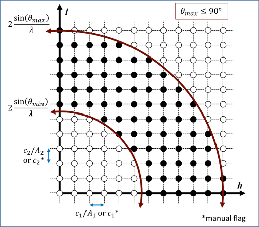

.. index:: compute xrd
.. index:: compute xrd/fft

compute xrd command
===================

compute xrd/fft command
=======================

Syntax
""""""

.. code-block:: LAMMPS

   compute ID group-ID xrd lambda type1 type2 ... typeN keyword value ...

* ID, group-ID are documented in :doc:`compute <compute>` command
* xrd = style name of this compute command
* lambda = wavelength of incident radiation (length units)
* type1 type2 ... typeN = chemical symbol of each atom type (see valid options below)
* zero or more keyword/value pairs may be appended
* keyword = *2Theta* or *c* or *LP* or *manual* or *echo* or *order* or *oversample*

  .. parsed-literal::

       *2Theta* values = Min2Theta Max2Theta
         Min2Theta,Max2Theta = minimum and maximum 2 theta range to explore
         (radians or degrees)
       *c* values = c1 c2 c3
         c1,c2,c3 = parameters to adjust the spacing of the reciprocal
                    lattice nodes in the h, k, and l directions respectively
       *LP* value = switch to apply Lorentz-polarization factor
         0/1 = off/on
       *manual* = flag to use manual spacing of reciprocal lattice points
                  based on the values of the *c* parameters
       *echo* = flag to provide extra output for debugging purposes
       *order* value = width of the spreading stencil of compute xrd/fft
         must be an odd number of 3 or larger
       *oversample* value = oversampling factor of the FFT mesh of compute xrd/fft
         must be 1.25 or larger

Examples
""""""""

.. code-block:: LAMMPS

   compute 1 all xrd 1.541838 Al O 2Theta 0.087 0.87 c 1 1 1 LP 1 echo
   compute 2 all xrd 1.541838 Al O 2Theta 10 100 c 0.05 0.05 0.05 LP 1 manual
   compute 3 all xrd/fft 1.541838 Al O 2Theta 10 100 c 1 1 1 LP 1
   compute 4 all xrd/fft 1.541838 Al O 2Theta 10 100 c 1 1 1 LP 1 order 9

   fix 1 all ave/histo/weight 1 1 1 0.087 0.87 250 c_1[1] c_1[2] mode vector file Rad2Theta.xrd
   fix 2 all ave/histo/weight 1 1 1 10 100 250 c_2[1] c_2[2] mode vector file Deg2Theta.xrd

Description
"""""""""""

Define a computation that calculates X-ray diffraction intensity as described
in :ref:`(Coleman) <xrd-Coleman>` on a mesh of reciprocal lattice nodes defined
by the entire simulation domain (or manually) using a simulated radiation
of wavelength *lambda*.

The X-ray diffraction intensity, :math:`I`, at each reciprocal lattice point,
:math:`k`, is computed from the structure factor, :math:`F`, using the
equations:

.. math::

   I &= L_p(\theta)\frac{F^{*}F}{N} \\
   F(\mathbf{k}) &= \sum_{j=1}^{N}f_j(\theta)exp(2\pi i \mathbf{k}\cdot \mathbf{r}_j) \\
   L_p(\theta) &= \frac{1+\cos^2(2\theta)}{\cos(\theta)\sin^2(\theta)} \\
   \frac{\sin(\theta)}{\lambda} &= \frac{\left\lVert\mathbf{k}\right\rVert}{2}

Here, :math:`\mathbf{k}` is the location of the reciprocal lattice node,
:math:`r_j` is the position of each atom, :math:`f_j` are atomic
scattering factors, *Lp* is the Lorentz-polarization factor, and
:math:`\theta` is the scattering angle of diffraction.  The
Lorentz-polarization factor can be turned off using the optional *LP*
keyword.

Diffraction intensities are calculated on a three-dimensional mesh of
reciprocal lattice nodes. The mesh spacing is defined either (a) by the
entire simulation domain or (b) manually using selected values as shown
in the 2D diagram below.

For a mesh defined by the simulation domain, a rectilinear grid is
constructed with spacing :math:`c A^{-1}` along each reciprocal lattice
axis, where :math:`A` is a matrix containing the vectors corresponding
to the edges of the simulation cell. If one or two directions has
non-periodic boundary conditions, then the spacing in these directions
is defined from the average of the (inversed) box lengths with periodic
boundary conditions.  Meshes defined by the simulation domain must
contain at least one periodic boundary.

If the *manual* flag is included, the mesh of reciprocal lattice nodes
will be defined using the *c* values for the spacing along each
reciprocal lattice axis. Note that manual mapping of the reciprocal
space mesh is good for comparing diffraction results from multiple
simulations; however, it can reduce the likelihood that Bragg
reflections will be satisfied unless small spacing parameters
(:math:`< 0.05~\AA^{-1}`) are implemented.
Meshes with manual spacing do not require a periodic boundary.

The limits of the reciprocal lattice mesh are determined by range of
scattering angles explored.  The *2Theta* parameter allows the user
to reduce the scattering angle range to only the region of interest
which reduces the cost of the computation.

The atomic scattering factor, :math:`f_j`, accounts for the reduction in
diffraction intensity due to Compton scattering.  Compute xrd uses
analytical approximations of the atomic scattering factors that vary
for each atom type (type1 type2 ... typeN) and angle of diffraction.
The analytic approximation is computed using the formula
:ref:`(Colliex) <Colliex>`:

.. math::

   f_j\left ( \frac{\sin(\theta)}{\lambda} \right )=\sum_{i=1}^{4}
   a_i \exp\left ( -b_i \frac{\sin^{2}(\theta)}{\lambda^{2}} \right )+c

Coefficients parameterized by :ref:`(Peng) <Peng>` are assigned for each
atom type designating the chemical symbol and charge of each atom
type. Valid chemical symbols for compute xrd are:

+------+------+------+-------+------+
| H    | He1- | He   | Li    | Li1+ |
+------+------+------+-------+------+
| Be   | Be2+ | B    | C     | Cval |
+------+------+------+-------+------+
| N    | O    | O1-  | F     | F1-  |
+------+------+------+-------+------+
| Ne   | Na   | Na1+ | Mg    | Mg2+ |
+------+------+------+-------+------+
| Al   | Al3+ | Si   | Sival | Si4+ |
+------+------+------+-------+------+
| P    | S    | Cl   | Cl1-  | Ar   |
+------+------+------+-------+------+
| K    | Ca   | Ca2+ | Sc    | Sc3+ |
+------+------+------+-------+------+
| Ti   | Ti2+ | Ti3+ | Ti4+  | V    |
+------+------+------+-------+------+
| V2+  | V3+  | V5+  | Cr    | Cr2+ |
+------+------+------+-------+------+
| Cr3+ | Mn   | Mn2+ | Mn3+  | Mn4+ |
+------+------+------+-------+------+
| Fe   | Fe2+ | Fe3+ | Co    | Co2+ |
+------+------+------+-------+------+
| Co3+ | Ni   | Ni2+ | Ni3+  | Cu   |
+------+------+------+-------+------+
| Cu1+ | Cu2+ | Zn   | Zn2+  | Ga   |
+------+------+------+-------+------+
| Ga3+ | Ge   | Ge4+ | As    | Se   |
+------+------+------+-------+------+
| Br   | Br1- | Kr   | Rb    | Rb1+ |
+------+------+------+-------+------+
| Sr   | Sr2+ | Y    | Y3+   | Zr   |
+------+------+------+-------+------+
| Zr4+ | Nb   | Nb3+ | Nb5+  | Mo   |
+------+------+------+-------+------+
| Mo3+ | Mo5+ | Mo6+ | Tc    | Ru   |
+------+------+------+-------+------+
| Ru3+ | Ru4+ | Rh   | Rh3+  | Rh4+ |
+------+------+------+-------+------+
| Pd   | Pd2+ | Pd4+ | Ag    | Ag1+ |
+------+------+------+-------+------+
| Ag2+ | Cd   | Cd2+ | In    | In3+ |
+------+------+------+-------+------+
| Sn   | Sn2+ | Sn4+ | Sb    | Sb3+ |
+------+------+------+-------+------+
| Sb5+ | Te   | I    | I1-   | Xe   |
+------+------+------+-------+------+
| Cs   | Cs1+ | Ba   | Ba2+  | La   |
+------+------+------+-------+------+
| La3+ | Ce   | Ce3+ | Ce4+  | Pr   |
+------+------+------+-------+------+
| Pr3+ | Pr4+ | Nd   | Nd3+  | Pm   |
+------+------+------+-------+------+
| Pm3+ | Sm   | Sm3+ | Eu    | Eu2+ |
+------+------+------+-------+------+
| Eu3+ | Gd   | Gd3+ | Tb    | Tb3+ |
+------+------+------+-------+------+
| Dy   | Dy3+ | Ho   | Ho3+  | Er   |
+------+------+------+-------+------+
| Er3+ | Tm   | Tm3+ | Yb    | Yb2+ |
+------+------+------+-------+------+
| Yb3+ | Lu   | Lu3+ | Hf    | Hf4+ |
+------+------+------+-------+------+
| Ta   | Ta5+ | W    | W6+   | Re   |
+------+------+------+-------+------+
| Os   | Os4+ | Ir   | Ir3+  | Ir4+ |
+------+------+------+-------+------+
| Pt   | Pt2+ | Pt4+ | Au    | Au1+ |
+------+------+------+-------+------+
| Au3+ | Hg   | Hg1+ | Hg2+  | Tl   |
+------+------+------+-------+------+
| Tl1+ | Tl3+ | Pb   | Pb2+  | Pb4+ |
+------+------+------+-------+------+
| Bi   | Bi3+ | Bi5+ | Po    | At   |
+------+------+------+-------+------+
| Rn   | Fr   | Ra   | Ra2+  | Ac   |
+------+------+------+-------+------+
| Ac3+ | Th   | Th4+ | Pa    | U    |
+------+------+------+-------+------+
| U3+  | U4+  | U6+  | Np    | Np3+ |
+------+------+------+-------+------+
| Np4+ | Np6+ | Pu   | Pu3+  | Pu4+ |
+------+------+------+-------+------+
| Pu6+ | Am   | Cm   | Bk    | Cf   |
+------+------+------+-------+------+

.. versionchanged:: TBD

   The table above listed *Co* twice, in the second and in the third of the
   three cobalt entries, and the lookup returned the last match.  The
   coefficients of the third entry are those of Co\ :math:`^{3+}`, so *Co*
   selected the Co\ :math:`^{3+}` scattering factors and Co\ :math:`^{3+}`
   itself could not be selected at all.  The third entry is now spelled
   *Co3+*, so *Co* selects neutral cobalt.  Diffraction intensities of
   simulations that used *Co* change accordingly.

If the *echo* keyword is specified, compute xrd will provide extra
reporting information to the screen.

FFT version of the calculation
""""""""""""""""""""""""""""""

.. versionadded:: TBD

Compute *xrd* evaluates the structure factor equation directly at every
reciprocal lattice node, which costs one sine and one cosine evaluation per
(node, atom) pair.  The cost therefore grows as the product of the number of
nodes and the number of atoms, which becomes prohibitive for large cells.

Compute *xrd/fft* computes the same quantity with fast Fourier transforms.  The
atoms are spread onto a uniform mesh with a Kaiser-Bessel window, one FFT is
taken per chemical element, and the Fourier transform of the window is divided
out again.  It accepts exactly the same arguments as compute *xrd* and produces
the same rows in the same order, so it is a drop-in replacement in existing
input scripts.

Because compute *xrd* samples reciprocal space at multiples of the spacings
:math:`\Delta k` set by the *c* parameters, and the phase factor
:math:`\exp(2 \pi i m x \Delta k)` repeats with period :math:`1/\Delta k`, the
mesh spans a cell of that edge length and the atom coordinates are folded into
it.  This is exact, and it holds whether that cell is larger than the
simulation box (small *c* values, finer sampling of reciprocal space) or
smaller than it (large *c* values).

The result is not identical to the direct sum, but converges rapidly toward it
as the spreading stencil is widened with the *order* keyword.  For a single
atom, the relative error of the intensity is about :math:`1 \times 10^{-6}` at
the default *order* of 7, :math:`1 \times 10^{-8}` at *order* 9, and
:math:`1 \times 10^{-10}` at *order* 11.  For a system of :math:`N` atoms the
error of a strong reflection stays at that level, while the relative error of
the weak diffuse intensity between reflections grows roughly as
:math:`\sqrt{N}`, since the error scales with the total scattering power while
the diffuse amplitude scales with its square root.  The default settings are
appropriate for peak positions and intensities; *order* 9 or 11 is recommended
for quantitative work on weak diffuse scattering in large systems.

The *oversample* keyword sets how much finer the FFT mesh is than the highest
reciprocal lattice node explored.  Lowering it reduces the memory needed for
the mesh but requires a larger *order* for the same accuracy, and it also
amplifies round-off, so values below 1.5 are not recommended.

The mesh contains roughly :math:`(2\,\mathrm{oversample})^3` grid points per
reciprocal lattice node of the rectilinear search box.  Its size is reported
when the *echo* keyword is used.  If the mesh does not fit in memory, reduce
the *2Theta* range, increase the *c* values, or lower *oversample*.

The mesh depends only on the settings of the compute, not on how many
processors are used, so results are reproducible to round-off across processor
counts.  The mesh is divided into slabs along :math:`z`; if there are more
processors than slabs, the extra processors still contribute their own atoms
but take no part in the transform.

Output info
"""""""""""

This compute calculates a global array.  The number of rows in the
array is the number of reciprocal lattice nodes that are explored
which by the mesh.  The global array has two columns.

The first column contains the diffraction angle in the units (radians
or degrees) provided with the *2Theta* values. The second column contains
the computed diffraction intensities as described above.

The array can be accessed by any command that uses global values from
a compute as input.  See the :doc:`Howto output <Howto_output>` doc page
for an overview of LAMMPS output options.

All array values calculated by this compute are "intensive".

Restrictions
""""""""""""

This compute is part of the DIFFRACTION package.  It is only
enabled if LAMMPS was built with that package.  See the :doc:`Build package <Build_package>` page for more info.

.. versionchanged:: TBD

When the mesh is defined by the simulation domain and the box is resized, by
:doc:`fix npt <fix_nh>`, :doc:`fix deform <fix_deform>` or :doc:`change_box
<change_box>`, the reciprocal lattice is rescaled to follow the cell, so a
Bragg reflection moves to the diffraction angle of the strained lattice.  This
follows the same approach as the :doc:`kspace styles <kspace_style>`: *which*
nodes are explored is fixed when the compute is defined, since the number of
rows of the output array cannot change afterwards, but the reciprocal lattice
vectors are scaled with the cell.  Previously the nodes kept the positions they
had when the compute was defined, which gave the diffraction angles of the
original lattice.

Because the set of nodes is fixed, a large change of box size moves some of
them outside the requested *2Theta* range.  Their true angle is still reported,
so a histogram over the requested range simply excludes them, and a warning is
printed once when more than one percent of the nodes have left the range.  For
a long run over a wide range of box sizes, define the compute at a
representative size, or use the *manual* flag, whose spacing is set in absolute
units and does not depend on the box at all.

Compute *xrd/fft* uses the FFT wrappers of the KSPACE package and is only
available if LAMMPS was built with both the DIFFRACTION and the KSPACE
packages.  Building with single precision FFTs limits the accuracy of weak
diffuse intensities.

The compute_xrd command does not work for triclinic cells.

Related commands
""""""""""""""""

:doc:`fix ave/histo <fix_ave_histo>`,
:doc:`compute saed <compute_saed>`

Default
"""""""

The option defaults are *2Theta* = 1 179 (degrees), *c* = 1 1 1, *LP* = 1,
no manual flag, no echo flag.

----------

.. _xrd-Coleman:

**(Coleman)** Coleman, Spearot, Capolungo, MSMSE, 21, 055020
(2013).

.. _Colliex:

**(Colliex)** Colliex et al. International Tables for Crystallography
Volume C: Mathematical and Chemical Tables, 249-429 (2004).

.. _Peng:

**(Peng)** Peng, Ren, Dudarev, Whelan, Acta Crystallogr. A, 52, 257-76
(1996).
