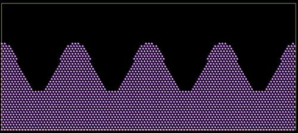

.. index:: create_atoms

create_atoms command
=====================

Syntax
""""""

.. code-block:: LAMMPS

   create_atoms type style args keyword values ...

* type = atom type (1-Ntypes) of atoms to create (offset for molecule creation)
* style = *box* or *region* or *single* or *random*

  .. parsed-literal::

       *box* args = none
       *region* args = region-ID
         region-ID = particles will only be created if contained in the region
       *single* args = x y z
         x,y,z = coordinates of a single particle (distance units)
       *random* args = N seed region-ID
         N = number of particles to create
         seed = random # seed (positive integer)
         region-ID = create atoms within this region, use NULL for entire simulation box

* zero or more keyword/value pairs may be appended
* keyword = *mol* or *basis* or *ratio* or *subset* or *remap* or *var* or *set* or *rotate* or *units*

  .. code-block:: LAMMPS

       *mol* value = template-ID seed
         template-ID = ID of molecule template specified in a separate :doc:`molecule <molecule>` command
         seed = random # seed (positive integer)
       *basis* values = M itype
         M = which basis atom
         itype = atom type (1-N) to assign to this basis atom
       *ratio* values = frac seed
         frac = fraction of lattice sites (0 to 1) to populate randomly
         seed = random # seed (positive integer)
       *subset* values = Nsubset seed
         Nsubset = # of lattice sites to populate randomly
         seed = random # seed (positive integer)
       *remap* value = *yes* or *no*
       *var* value = name = variable name to evaluate for test of atom creation
       *set* values = dim name
         dim = *x* or *y* or *z*
         name = name of variable to set with x, y, or z atom position
       *rotate* values = theta Rx Ry Rz
         theta = rotation angle for single molecule (degrees)
         Rx,Ry,Rz = rotation vector for single molecule
       *units* value = *lattice* or *box*
         *lattice* = the geometry is defined in lattice units
         *box* = the geometry is defined in simulation box units

Examples
""""""""

.. code-block:: LAMMPS

   create_atoms 1 box
   create_atoms 3 region regsphere basis 2 3
   create_atoms 3 region regsphere basis 2 3 ratio 0.5 74637
   create_atoms 3 single 0 0 5
   create_atoms 1 box var v set x xpos set y ypos

Description
"""""""""""

This command creates atoms (or molecules) on a lattice, or a single
atom (or molecule), or a random collection of atoms (or molecules), as
an alternative to reading in their coordinates explicitly via a
:doc:`read_data <read_data>` or :doc:`read_restart <read_restart>`
command.  A simulation box must already exist, which is typically
created via the :doc:`create_box <create_box>` command.  Before using
this command, a lattice must also be defined using the
:doc:`lattice <lattice>` command, unless you specify the *single* style
with units = box or the *random* style.  For the remainder of this doc
page, a created atom or molecule is referred to as a "particle".

If created particles are individual atoms, they are assigned the
specified atom *type*\ , though this can be altered via the *basis*
keyword as discussed below.  If molecules are being created, the type
of each atom in the created molecule is specified in the file read by
the :doc:`molecule <molecule>` command, and those values are added to
the specified atom *type*\ .  E.g. if *type* = 2, and the file specifies
atom types 1,2,3, then each created molecule will have atom types
3,4,5.

For the *box* style, the create\_atoms command fills the entire
simulation box with particles on the lattice.  If your simulation box
is periodic, you should insure its size is a multiple of the lattice
spacings, to avoid unwanted atom overlaps at the box boundaries.  If
your box is periodic and a multiple of the lattice spacing in a
particular dimension, LAMMPS is careful to put exactly one particle at
the boundary (on either side of the box), not zero or two.

For the *region* style, a geometric volume is filled with particles on
the lattice.  This volume what is inside the simulation box and is
also consistent with the region volume.  See the :doc:`region <region>`
command for details.  Note that a region can be specified so that its
"volume" is either inside or outside a geometric boundary.  Also note
that if your region is the same size as a periodic simulation box (in
some dimension), LAMMPS does not implement the same logic described
above as for the *box* style, to insure exactly one particle at
periodic boundaries.  if this is what you desire, you should either
use the *box* style, or tweak the region size to get precisely the
particles you want.

For the *single* style, a single particle is added to the system at
the specified coordinates.  This can be useful for debugging purposes
or to create a tiny system with a handful of particles at specified
positions.

For the *random* style, N particles are added to the system at
randomly generated coordinates, which can be useful for generating an
amorphous system.  The particles are created one by one using the
specified random number *seed*\ , resulting in the same set of particles
coordinates, independent of how many processors are being used in the
simulation.  If the *region-ID* argument is specified as NULL, then
the created particles will be anywhere in the simulation box.  If a
*region-ID* is specified, a geometric volume is filled which is both
inside the simulation box and is also consistent with the region
volume.  See the :doc:`region <region>` command for details.  Note that
a region can be specified so that its "volume" is either inside or
outside a geometric boundary.

.. note::

   Particles generated by the *random* style will typically be
   highly overlapped which will cause many interatomic potentials to
   compute large energies and forces.  Thus you should either perform an
   :doc:`energy minimization <minimize>` or run dynamics with :doc:`fix nve/limit <fix_nve_limit>` to equilibrate such a system, before
   running normal dynamics.

Note that this command adds particles to those that already exist.
This means it can be used to add particles to a system previously read
in from a data or restart file.  Or the create\_atoms command can be
used multiple times, to add multiple sets of particles to the
simulation.  For example, grain boundaries can be created, by
interleaving create\_atoms with :doc:`lattice <lattice>` commands
specifying different orientations.  By using the create\_atoms command
in conjunction with the :doc:`delete_atoms <delete_atoms>` command,
reasonably complex geometries can be created, or a protein can be
solvated with a surrounding box of water molecules.

In all these cases, care should be taken to insure that new atoms do
not overlap existing atoms inappropriately, especially if molecules
are being added.  The :doc:`delete_atoms <delete_atoms>` command can be
used to remove overlapping atoms or molecules.

.. note::

   You cannot use any of the styles explained above to create atoms
   that are outside the simulation box; they will just be ignored by
   LAMMPS.  This is true even if you are using shrink-wrapped box
   boundaries, as specified by the :doc:`boundary <boundary>` command.
   However, you can first use the :doc:`change_box <change_box>` command to
   temporarily expand the box, then add atoms via create\_atoms, then
   finally use change\_box command again if needed to re-shrink-wrap the
   new atoms.  See the :doc:`change_box <change_box>` doc page for an
   example of how to do this, using the create\_atoms *single* style to
   insert a new atom outside the current simulation box.

----------

Individual atoms are inserted by this command, unless the *mol*
keyword is used.  It specifies a *template-ID* previously defined
using the :doc:`molecule <molecule>` command, which reads a file that
defines the molecule.  The coordinates, atom types, charges, etc, as
well as any bond/angle/etc and special neighbor information for the
molecule can be specified in the molecule file.  See the
:doc:`molecule <molecule>` command for details.  The only settings
required to be in this file are the coordinates and types of atoms in
the molecule.

Using a lattice to add molecules, e.g. via the *box* or *region* or
*single* styles, is exactly the same as adding atoms on lattice
points, except that entire molecules are added at each point, i.e. on
the point defined by each basis atom in the unit cell as it tiles the
simulation box or region.  This is done by placing the geometric
center of the molecule at the lattice point, and giving the molecule a
random orientation about the point.  The random *seed* specified with
the *mol* keyword is used for this operation, and the random numbers
generated by each processor are different.  This means the coordinates
of individual atoms (in the molecules) will be different when running
on different numbers of processors, unlike when atoms are being
created in parallel.

Also note that because of the random rotations, it may be important to
use a lattice with a large enough spacing that adjacent molecules will
not overlap, regardless of their relative orientations.

.. note::

   If the :doc:`create_box <create_box>` command is used to create
   the simulation box, followed by the create\_atoms command with its
   *mol* option for adding molecules, then you typically need to use the
   optional keywords allowed by the :doc:`create_box <create_box>` command
   for extra bonds (angles,etc) or extra special neighbors.  This is
   because by default, the :doc:`create_box <create_box>` command sets up a
   non-molecular system which doesn't allow molecules to be added.

----------

This is the meaning of the other allowed keywords.

The *basis* keyword is only used when atoms (not molecules) are being
created.  It specifies an atom type that will be assigned to specific
basis atoms as they are created.  See the :doc:`lattice <lattice>`
command for specifics on how basis atoms are defined for the unit cell
of the lattice.  By default, all created atoms are assigned the
argument *type* as their atom type.

The *ratio* and *subset* keywords can be used in conjunction with the
*box* or *region* styles to limit the total number of particles
inserted.  The lattice defines a set of *Nlatt* eligible sites for
inserting particles, which may be limited by the *region* style or the
*var* and *set* keywords.  For the *ratio* keyword only the specified
fraction of them (0 <= *frac* <= 1) will be assigned particles.  For
the *subset* keyword only the specified *Nsubset* of them will be
assigned particles.  In both cases the assigned lattice sites are
chosen randomly.  An iterative algorithm is used which insures the
correct number of particles are inserted, in a perfectly random
fashion.  Which lattice sites are selected will change with the number
of processors used.

The *remap* keyword only applies to the *single* style.  If it is set
to *yes*\ , then if the specified position is outside the simulation
box, it will mapped back into the box, assuming the relevant
dimensions are periodic.  If it is set to *no*\ , no remapping is done
and no particle is created if its position is outside the box.

The *var* and *set* keywords can be used together to provide a
criterion for accepting or rejecting the addition of an individual
atom, based on its coordinates.  The *name* specified for the *var*
keyword is the name of an :doc:`equal-style variable <variable>` which
should evaluate to a zero or non-zero value based on one or two or
three variables which will store the x, y, or z coordinates of an atom
(one variable per coordinate).  If used, these other variables must be
:doc:`internal-style variables <variable>` defined in the input script;
their initial numeric value can be anything.  They must be
internal-style variables, because this command resets their values
directly.  The *set* keyword is used to identify the names of these
other variables, one variable for the x-coordinate of a created atom,
one for y, and one for z.

When an atom is created, its x,y,z coordinates become the values for
any *set* variable that is defined.  The *var* variable is then
evaluated.  If the returned value is 0.0, the atom is not created.  If
it is non-zero, the atom is created.

As an example, these commands can be used in a 2d simulation, to
create a sinusoidal surface.  Note that the surface is "rough" due to
individual lattice points being "above" or "below" the mathematical
expression for the sinusoidal curve.  If a finer lattice were used,
the sinusoid would appear to be "smoother".  Also note the use of the
"xlat" and "ylat" :doc:`thermo_style <thermo_style>` keywords which
converts lattice spacings to distance.  Click on the image for a
larger version.

.. code-block:: LAMMPS

   dimension       2
   variable        x equal 100
   variable        y equal 25
   lattice         hex 0.8442
   region          box block 0 $x 0 $y -0.5 0.5
   create_box      1 box

   variable        xx internal 0.0
   variable        yy internal 0.0
   variable        v equal "(0.2*v_y*ylat * cos(v_xx/xlat * 2.0*PI*4.0/v_x) + 0.5*v_y*ylat - v_yy) > 0.0"
   create_atoms    1 box var v set x xx set y yy
   write_dump      all atom sinusoid.lammpstrj

The *rotate* keyword allows specification of the orientation
at which molecules are inserted.  The axis of rotation is
determined by the rotation vector (Rx,Ry,Rz) that goes through the
insertion point.  The specified *theta* determines the angle of
rotation around that axis.  Note that the direction of rotation for
the atoms around the rotation axis is consistent with the right-hand
rule: if your right-hand's thumb points along *R*\ , then your fingers
wrap around the axis in the direction of rotation.

The *units* keyword determines the meaning of the distance units used
to specify the coordinates of the one particle created by the *single*
style.  A *box* value selects standard distance units as defined by
the :doc:`units <units>` command, e.g. Angstroms for units = real or
metal.  A *lattice* value means the distance units are in lattice
spacings.

----------

Atom IDs are assigned to created atoms in the following way.  The
collection of created atoms are assigned consecutive IDs that start
immediately following the largest atom ID existing before the
create\_atoms command was invoked.  This is done by the processor's
communicating the number of atoms they each own, the first processor
numbering its atoms from 1 to N1, the second processor from N1+1 to
N2, etc.  Where N1 = number of atoms owned by the first processor, N2
= number owned by the second processor, etc.  Thus when the same
simulation is performed on different numbers of processors, there is
no guarantee a particular created atom will be assigned the same ID in
both simulations.  If molecules are being created, molecule IDs are
assigned to created molecules in a similar fashion.

Aside from their ID, atom type, and xyz position, other properties of
created atoms are set to default values, depending on which quantities
are defined by the chosen :doc:`atom style <atom_style>`.  See the :doc:`atom style <atom_style>` command for more details.  See the
:doc:`set <set>` and :doc:`velocity <velocity>` commands for info on how
to change these values.

* charge = 0.0
* dipole moment magnitude = 0.0
* diameter = 1.0
* shape = 0.0 0.0 0.0
* density = 1.0
* volume = 1.0
* velocity = 0.0 0.0 0.0
* angular velocity = 0.0 0.0 0.0
* angular momentum = 0.0 0.0 0.0
* quaternion = (1,0,0,0)
* bonds, angles, dihedrals, impropers = none

If molecules are being created, these defaults can be overridden by
values specified in the file read by the :doc:`molecule <molecule>`
command.  E.g. the file typically defines bonds (angles,etc) between
atoms in the molecule, and can optionally define charges on each atom.

Note that the *sphere* atom style sets the default particle diameter
to 1.0 as well as the density.  This means the mass for the particle
is not 1.0, but is PI/6 \* diameter\^3 = 0.5236.

Note that the *ellipsoid* atom style sets the default particle shape
to (0.0 0.0 0.0) and the density to 1.0 which means it is a point
particle, not an ellipsoid, and has a mass of 1.0.

Note that the *peri* style sets the default volume and density to 1.0
and thus also set the mass for the particle to 1.0.

The :doc:`set <set>` command can be used to override many of these
default settings.

----------

Restrictions
""""""""""""

An :doc:`atom_style <atom_style>` must be previously defined to use this
command.

A rotation vector specified for a single molecule must be in
the z-direction for a 2d model.

Related commands
""""""""""""""""

:doc:`lattice <lattice>`, :doc:`region <region>`, :doc:`create_box <create_box>`,
:doc:`read_data <read_data>`, :doc:`read_restart <read_restart>`

Default
"""""""

The default for the *basis* keyword is that all created atoms are
assigned the argument *type* as their atom type (when single atoms are
being created).  The other defaults are *remap* = no, *rotate* =
random, and *units* = lattice.
