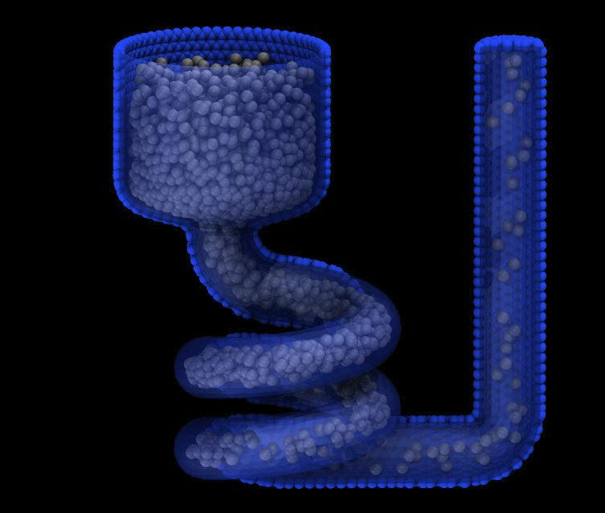
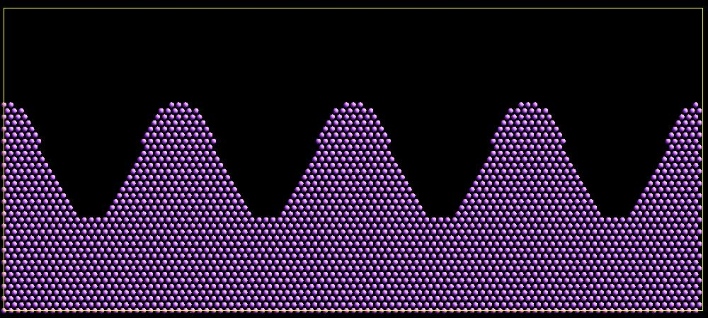

.. index:: create_atoms

create_atoms command
=====================

Syntax
""""""

.. code-block:: LAMMPS

   create_atoms type style args keyword values ...

* type = atom type (1-Ntypes) of atoms to create (offset for molecule creation)
* style = *box* or *region* or *single* or *mesh* or *random*

  .. parsed-literal::

       *box* args = none
       *region* args = region-ID
         region-ID = particles will only be created if contained in the region
       *single* args = x y z
         x,y,z = coordinates of a single particle (distance units)
       *mesh* args = STL-file
         STL-file = file with triangle mesh in STL format
       *random* args = N seed region-ID
         N = number of particles to create
         seed = random # seed (positive integer)
         region-ID = create atoms within this region, use NULL for entire simulation box

* zero or more keyword/value pairs may be appended
* keyword = *mol* or *basis* or *ratio* or *subset* or *remap* or *var* or *set* or *radscale* or *meshmode* or *rotate* or *overlap* or *maxtry* or *units*

  .. parsed-literal::

       *mol* values = template-ID seed
         template-ID = ID of molecule template specified in a separate :doc:`molecule <molecule>` command
         seed = random # seed (positive integer)
       *basis* values = M itype
         M = which basis atom
         itype = atom type (1-N) to assign to this basis atom
       *ratio* values = frac seed
         frac = fraction of lattice sites (0 to 1) to populate randomly
         seed = random # seed (positive integer)
       *subset* values = Nsubset seed
         Nsubset = # of lattice sites to populate randomly
         seed = random # seed (positive integer)
       *remap* value = *yes* or *no*
       *var* value = name = variable name to evaluate for test of atom creation
       *set* values = dim name
         dim = *x* or *y* or *z*
         name = name of variable to set with x, y, or z atom position
       *radscale* value = factor
         factor = scale factor for setting atom radius
       *meshmode* values = mode arg
         mode = *bisect* or *qrand*
         *bisect* arg = radthresh
           radthresh = threshold value for *mesh* to determine when to split triangles (distance units)
         *qrand* arg = density
           density = minimum number density for atoms place on *mesh* triangles (inverse distance squared units)
       *rotate* values = theta Rx Ry Rz
         theta = rotation angle for single molecule (degrees)
         Rx,Ry,Rz = rotation vector for single molecule
       *overlap* value = Doverlap
         Doverlap = only insert if at least this distance from all existing atoms
       *maxtry* value = Ntry
         Ntry = number of attempts to insert a particle before failure
       *units* value = *lattice* or *box*
         *lattice* = the geometry is defined in lattice units
         *box* = the geometry is defined in simulation box units

Examples
""""""""

.. code-block:: LAMMPS

   create_atoms 1 box
   create_atoms 3 region regsphere basis 2 3
   create_atoms 3 region regsphere basis 2 3 ratio 0.5 74637
   create_atoms 3 single 0 0 5
   create_atoms 1 box var v set x xpos set y ypos
   create_atoms 2 random 50 12345 NULL overlap 2.0 maxtry 50
   create_atoms 1 mesh open_box.stl meshmode qrand 0.1 units box
   create_atoms 1 mesh funnel.stl meshmode bisect 4.0 units box radscale 0.9

Description
"""""""""""

This command creates atoms (or molecules) within the simulation box,
either on a lattice, or at random points, or on a surface defined by a
triangulated mesh.  Or it creates a single atom (or molecule) at a
specified point.  It is an alternative to reading in atom coordinates
explicitly via a :doc:`read_data <read_data>` or :doc:`read_restart
<read_restart>` command.

To use this command a simulation box must already exist, which is
typically created via the :doc:`create_box <create_box>` command.
Before using this command, a lattice must typically also be defined
using the :doc:`lattice <lattice>` command, unless you specify the
*single* or *mesh* style with units = box or the *random* style.  To
create atoms on a lattice for general triclinic boxes, see the
discussion below.

For the remainder of this doc page, a created atom or molecule is
referred to as a "particle".

If created particles are individual atoms, they are assigned the
specified atom *type*, though this can be altered via the *basis*
keyword as discussed below.  If molecules are being created, the type
of each atom in the created molecule is specified in a specified file
read by the :doc:`molecule <molecule>` command, and those values are
added to the specified atom *type* (e.g., if *type* = 2 and the file
specifies atom types 1, 2, and 3, then each created molecule will have
atom types 3, 4, and 5).

.. note::

   You cannot use this command to create atoms that are outside the
   simulation box; they will just be ignored by LAMMPS.  This is true
   even if you are using shrink-wrapped box boundaries, as specified
   by the :doc:`boundary <boundary>` command.  However, you can first
   use the :doc:`change_box <change_box>` command to temporarily
   expand the box, then add atoms via create_atoms, then finally use
   change_box command again if needed to re-shrink-wrap the new atoms.
   See the :doc:`change_box <change_box>` doc page for an example of
   how to do this, using the create_atoms *single* style to insert a
   new atom outside the current simulation box.

----------

For the *box* style, the create_atoms command fills the entire
simulation box with particles on the lattice.  If your simulation box
is periodic, you should ensure its size is a multiple of the lattice
spacings, to avoid unwanted atom overlaps at the box boundaries.  If
your box is periodic and a multiple of the lattice spacing in a
particular dimension, LAMMPS is careful to put exactly one particle at
the boundary (on either side of the box), not zero or two.

For the *region* style, a geometric volume is filled with particles on
the lattice.  This volume is what is both inside the simulation box
and also consistent with the region volume.  See the :doc:`region
<region>` command for details.  Note that a region can be specified so
that its "volume" is either inside or outside its geometric boundary.
Also note that if a region is the same size as a periodic simulation
box (in some dimension), LAMMPS does NOT implement the same logic
described above for the *box* style, to ensure exactly one particle at
periodic boundaries.  If this is desired, you should either use the
*box* style, or tweak the region size to get precisely the particles
you want.

----------

If the simulation box is formulated as a general triclinic box defined
by arbitrary edge vectors **A**, **B**, **C**, then the *box* and
*region* styles will create atoms on a lattice commensurate with those
edge vectors.  See the :doc:`Howto_triclinic <Howto_triclinic>` doc
page for a detailed explanation of orthogonal, restricted triclinic,
and general triclinic simulation boxes.  As with the :doc:`create_box
<create_box>` command, the :doc:`lattice <lattice>` command used by
this command must be of style *custom* and use its *triclinic/general*
option.  The *a1, *a2*, *a3* settings of the :doc:`lattice <lattice>`
command define the edge vectors of a unit cell of the general
triclinic lattice. The :doc:`create_box <create_box>` command creates
a simulation box which replicates that unit cell along each of the
**A**, **B**, **C** edge vectors.

.. note::

   LAMMPS allows specification of general triclinic simulation boxes
   as a convenience for users who may be converting data from
   solid-state crystallographic representations or from DFT codes for
   input to LAMMPS.  However, as explained on the
   :doc:`Howto_triclinic <Howto_triclinic>` doc page, internally,
   LAMMPS only uses restricted triclinic simulation boxes.  This means
   the box created by the :doc:`create_box <create_box>` command as
   well as the atoms created by this command with their per-atom
   information (e.g. coordinates, velocities) are converted (rotated)
   from general to restricted triclinic form when the two commands are
   invoked.  The <Howto_triclinic>` doc page also discusses other
   LAMMPS commands which can input/output general triclinic
   representations of the simulation box and per-atom data.

The *box* style will fill the entire general triclinic box with
particles on the lattice, as explained above.

.. note::

    The *region* style also operates as explained above, but the check
    for particles inside the region is performed *after* the particle
    coordinates have been converted to the restricted triclinic box.
    This means the region must also be defined with respect to the
    restricted triclinic box, not the general triclinic box.

If the simulation box is general triclinic, the *single*, *random*,
and *mesh* styles described next operate on the box *after* it has
been converted to restricted triclinic.  So all the settings for those
styles should be made in that context.

----------

For the *single* style, a single particle is added to the system at
the specified coordinates.  This can be useful for debugging purposes
or to create a tiny system with a handful of particles at specified
positions.  For a 2d simulation the specified z coordinate must be
0.0.

.. versionchanged:: 2Jun2022

The *porosity* style has been renamed to *random* with added functionality.

For the *random* style, *N* particles are added to the system at
randomly generated coordinates, which can be useful for generating an
amorphous system.  For 2d simulations, the z coordinates of all added
atoms will be 0.0.

The particles are created one by one using the specified random number
*seed*, resulting in the same set of particle coordinates, independent
of how many processors are being used in the simulation.  Unless the
*overlap* keyword is specified, particles created by the *random*
style will typically be highly overlapped.  Various additional
criteria can be used to accept or reject a random particle insertion;
see the keyword discussion below.  Multiple attempts per particle are
made (see the *maxtry* keyword) until the insertion is either
successful or fails.  If this command fails to add all requested *N*
particles, a warning will be output.

If the *region-ID* argument is specified as NULL, then the randomly
created particles will be anywhere in the simulation box.  If a
*region-ID* is specified, a geometric volume is filled that is both
inside the simulation box and is also consistent with the region
volume.  See the :doc:`region <region>` command for details.  Note
that a region can be specified so that its "volume" is either inside
or outside its geometric boundary.

Note that the create_atoms command adds particles to those that
already exist.  This means it can be used to add particles to a system
previously read in from a data or restart file.  Or the create_atoms
command can be used multiple times, to add multiple sets of particles
to the simulation.  For example, grain boundaries can be created, by
interleaving the create_atoms command with :doc:`lattice <lattice>`
commands specifying different orientations.

When this command is used, care should be taken to ensure the
resulting system does not contain particles that are highly
overlapped.  Such overlaps will cause many interatomic potentials to
compute huge energies and forces, leading to bad dynamics.  There are
several strategies to avoid this problem:

* Use the :doc:`delete_atoms overlap <delete_atoms>` command after
  create_atoms.  For example, this strategy can be used to overlay and
  surround a large protein molecule with a volume of water molecules,
  then delete water molecules that overlap with the protein atoms.

* For the *random* style, use the optional *overlap* keyword to avoid
  overlaps when each new particle is created.

* Before running dynamics on an overlapped system, perform an
  :doc:`energy minimization <minimize>`.  Or run initial dynamics with
  :doc:`pair_style soft <pair_soft>` or with :doc:`fix nve/limit
  <fix_nve_limit>` to un-overlap the particles, before running normal
  dynamics.

.. versionadded:: 2Jun2022

For the *mesh* style, a file with a triangle mesh in `STL format
<https://en.wikipedia.org/wiki/STL_(file_format)>`_ is read and one or
more particles are placed into the area of each triangle.  The reader
supports both ASCII and binary files conforming to the format on the
Wikipedia page.  Binary STL files (e.g. as frequently offered for
3d-printing) can also be first converted to ASCII for editing with the
:ref:`stl_bin2txt tool <stlconvert>`.  The use of the *units box* option
is required. There are two algorithms available for placing atoms:
*bisect* and *qrand*. They can be selected via the *meshmode* option;
*bisect* is the default.  If the atom style allows it, the radius will
be set to a value depending on the algorithm and the value of the
*radscale* parameter (see below), and the atoms created from the mesh
are assigned a new molecule ID.

In *bisect* mode a particle is created at the center of each triangle
unless the average distance of the triangle vertices from its center is
larger than the *radthresh* value (default is lattice spacing in
x-direction).  In case the average distance is over the threshold, the
triangle is recursively split into two halves along the the longest side
until the threshold is reached. There will be at least one sphere per
triangle. The value of *radthresh* is set as an argument to *meshmode
bisect*.  The average distance of the vertices from the center is also
used to set the radius.

In *qrand* mode a quasi-random sequence is used to distribute particles
on mesh triangles using an approach by :ref:`(Roberts) <Roberts2019>`.
Particles are added to the triangle until the minimum number density is
met or exceeded such that every triangle will have at least one
particle.  The minimum number density is set as an argument to the
*qrand* option.  The radius will be set so that the sum of the area of
the radius of the particles created in place of a triangle will be equal
to the area of that triangle.

.. note::

   The atom placement algorithms in the *mesh* style benefit from meshes
   where triangles are close to equilateral.  It is therefore
   recommended to pre-process STL files to optimize the mesh
   accordingly.  There are multiple open source and commercial software
   tools available with the capability to generate optimized meshes.

.. note::

   In most cases the atoms created in *mesh* style will become an
   immobile or rigid object that would not be time integrated or moved
   by :doc:`fix move <fix_move>` or :doc:`fix rigid <fix_rigid>`.  For
   computational efficiency *and* to avoid undesired contributions to
   pressure and potential energy due to close contacts, it is usually
   beneficial to exclude computing interactions between the created
   particles using :doc:`neigh_modify exclude <neigh_modify>`.

----------

Individual atoms are inserted by this command, unless the *mol*
keyword is used.  It specifies a *template-ID* previously defined
using the :doc:`molecule <molecule>` command, which reads a file that
defines the molecule.  The coordinates, atom types, charges, etc, as
well as any bond/angle/etc and special neighbor information for the
molecule can be specified in the molecule file.  See the
:doc:`molecule <molecule>` command for details.  The only settings
required to be in this file are the coordinates and types of atoms in
the molecule.

.. note::

  If you are using the *mol* keyword in combination with the
  :doc:`atom style template <atom_style>` command, they must use
  the same molecule template-ID.

Using a lattice to add molecules, e.g. via the *box* or *region* or
*single* styles, is exactly the same as adding atoms on lattice
points, except that entire molecules are added at each point, i.e. on
the point defined by each basis atom in the unit cell as it tiles the
simulation box or region.  This is done by placing the geometric
center of the molecule at the lattice point, and (by default) giving
the molecule a random orientation about the point.  The random *seed*
specified with the *mol* keyword is used for this operation, and the
random numbers generated by each processor are different.  This means
the coordinates of individual atoms (in the molecules) will be
different when running on different numbers of processors, unlike when
atoms are being created in parallel.

Note that with random rotations, it may be important to use a lattice
with a large enough spacing that adjacent molecules will not overlap,
regardless of their relative orientations.  See the description of the
*rotate* keyword below, which overrides the default random orientation
and inserts all molecules at a specified orientation.

.. note::

   If the :doc:`create_box <create_box>` command is used to create
   the simulation box, followed by the create_atoms command with its
   *mol* option for adding molecules, then you typically need to use the
   optional keywords allowed by the :doc:`create_box <create_box>` command
   for extra bonds (angles,etc) or extra special neighbors.  This is
   because by default, the :doc:`create_box <create_box>` command sets up a
   non-molecular system that does not allow molecules to be added.

----------

This is the meaning of the other optional keywords.

The *basis* keyword is only used when atoms (not molecules) are being
created.  It specifies an atom type that will be assigned to specific
basis atoms as they are created.  See the :doc:`lattice <lattice>`
command for specifics on how basis atoms are defined for the unit cell
of the lattice.  By default, all created atoms are assigned the
argument *type* as their atom type.

The *ratio* and *subset* keywords can be used in conjunction with the
*box* or *region* styles to limit the total number of particles
inserted.  The lattice defines a set of *Nlatt* eligible sites for
inserting particles, which may be limited by the *region* style or the
*var* and *set* keywords.  For the *ratio* keyword, only the specified
fraction of them (:math:`0 \le f \le 1`) will be assigned particles.
For the *subset* keyword only the specified *Nsubset* of them will be
assigned particles.  In both cases the assigned lattice sites are
chosen randomly.  An iterative algorithm is used that ensures the
correct number of particles are inserted, in a perfectly random
fashion.  Which lattice sites are selected will change with the number
of processors used.

The *remap* keyword only applies to the *single* style.  If it is set
to *yes*, then if the specified position is outside the simulation
box, it will mapped back into the box, assuming the relevant
dimensions are periodic.  If it is set to *no*, no remapping is done
and no particle is created if its position is outside the box.

The *var* and *set* keywords can be used together to provide a
criterion for accepting or rejecting the addition of an individual
atom, based on its coordinates.  They apply to all styles except
*single*.  The *name* specified for the *var* keyword is the name of
an :doc:`equal-style variable <variable>` that should evaluate to a
zero or non-zero value based on one or two or three variables that
will store the *x*, *y*, or *z* coordinates of an atom (one variable per
coordinate).  If used, these other variables must be
:doc:`internal-style variables <variable>` defined in the input
script; their initial numeric value can be anything.  They must be
internal-style variables, because this command resets their values
directly.  The *set* keyword is used to identify the names of these
other variables, one variable for the *x*-coordinate of a created atom,
one for *y*, and one for *z*.

When an atom is created, its :math:`(x,y,z)` coordinates become the values for
any *set* variable that is defined.  The *var* variable is then
evaluated.  If the returned value is 0.0, the atom is not created.  If
it is non-zero, the atom is created.

As an example, these commands can be used in a 2d simulation, to
create a sinusoidal surface.  Note that the surface is "rough" due to
individual lattice points being "above" or "below" the mathematical
expression for the sinusoidal curve.  If a finer lattice were used,
the sinusoid would appear to be "smoother".  Also note the use of the
"xlat" and "ylat" :doc:`thermo_style <thermo_style>` keywords, which
converts lattice spacings to distance.

.. only:: html

   (Click on the image for a larger version)

.. code-block:: LAMMPS

   dimension   2
   variable    x equal 100
   variable    y equal 25
   lattice     hex 0.8442
   region      box block 0 $x 0 $y -0.5 0.5
   create_box  1 box

   variable    xx internal 0.0
   variable    yy internal 0.0
   variable    v equal "(0.2*v_y*ylat * cos(v_xx/xlat * 2.0*PI*4.0/v_x) + 0.5*v_y*ylat - v_yy) > 0.0"
   create_atoms  1 box var v set x xx set y yy
   write_dump  all atom sinusoid.lammpstrj

-----

The *rotate* keyword allows specification of the orientation
at which molecules are inserted.  The axis of rotation is
determined by the rotation vector :math:`(R_x,R_y,R_z)` that goes through the
insertion point.  The specified *theta* determines the angle of
rotation around that axis.  Note that the direction of rotation for
the atoms around the rotation axis is consistent with the right-hand
rule: if your right-hand's thumb points along *R*, then your fingers
wrap around the axis in the direction of rotation.

The *radscale* keyword only applies to the *mesh* style and adjusts the
radius of created particles (see above), provided this is supported by
the atom style.  Its value is a prefactor (must be :math:`>` 0.0, default is
1.0) that is applied to the atom radius inferred from the size of the
individual triangles in the triangle mesh that the particle corresponds
to.

.. versionadded:: 2Jun2022

The *overlap* keyword only applies to the *random* style.  It prevents
newly created particles from being created closer than the specified
*Doverlap* distance from any other particle.  If particles have finite
size (see :doc:`atom_style sphere <atom_style>` for example) *Doverlap*
should be specified large enough to include the particle size in the
non-overlapping criterion.  If molecules are being randomly inserted, then
an insertion is only accepted if each particle in the molecule meets the
overlap criterion with respect to other particles (not including particles
in the molecule itself).

.. note::

   Checking for overlaps is a costly :math:`\mathcal{O}(N(N+M))` operation for
   inserting *N* new particles into a system with *M* existing particles.
   This is because distances to all *M* existing particles are computed for
   each new particle that is added.  Thus the intended use of this
   keyword is to add relatively small numbers of particles to systems
   that remain at a relatively low density even after the new
   particles are created.  Careful use of the *maxtry* keyword in
   combination with *overlap* is recommended.  See the discussion
   above about systems with overlapped particles for alternate
   strategies that allow for overlapped insertions.

.. versionadded:: 2Jun2022

The *maxtry* keyword only applies to the *random* style.  It limits
the number of attempts to generate valid coordinates for a single new
particle that satisfy all requirements imposed by the *region*, *var*,
and *overlap* keywords.  The default is 10 attempts per particle
before the loop over the requested *N* particles advances to the next
particle.  Note that if insertion success is unlikely (e.g., inserting
new particles into a dense system using the *overlap* keyword),
setting the *maxtry* keyword to a large value may result in this
command running for a long time.

.. figure:: img/overlap.png
            :figwidth: 30%
            :align: right
            :target: _images/overlap.png

Here is an example for the *random* style using these commands

.. code-block:: LAMMPS

   units         lj
   dimension     2
   region        box block 0 50 0 50 -0.5 0.5
   create_box    1 box
   create_atoms  1 random 2000 13487 NULL overlap 1.0 maxtry 50
   pair_style    lj/cut 2.5
   pair_coeff    1 1 1.0 1.0 2.5

to produce a system as shown in the image with 1520 particles (out of
2000 requested) that are moderately dense and which have no overlaps
sufficient to prevent the LJ pair_style from running properly (because
the overlap criterion is 1.0).  The create_atoms command ran for 0.3 s
on a single CPU core.

.. only:: html

   (Click on the image for a larger version)

-----

The *units* keyword determines the meaning of the distance units used
by parameters for various styles.  A *box* value selects standard
distance units as defined by the :doc:`units <units>` command (e.g.,
:math:`\AA` for units = *real* or *metal*\ .  A *lattice* value means
the distance units are in lattice spacings.  These are affected settings:

* for *single* style: coordinates of the particle created
* for *random* style: overlap distance *Doverlap* by the *overlap* keyword
* for *mesh* style: *bisect* threshold value for *meshmode* = *bisect*
* for *mesh* style: *radthresh* value for *meshmode* = *bisect*
* for *mesh* style: *density* value for *meshmode* = *qrand*

Since *density* represents an area (distance ^2), the lattice spacing
factor is also squared.

----------

Atom IDs are assigned to created atoms in the following way.  The
collection of created atoms are assigned consecutive IDs that start
immediately following the largest atom ID existing before the
create_atoms command was invoked.  This is done by the processor's
communicating the number of atoms they each own, the first processor
numbering its atoms from :math:`1` to :math:`N_1`, the second processor from
:math:`N_1+1` to :math:`N_2`, and so on, where :math:`N_1` is the number of
atoms owned by the first processor, :math:`N_2` is the number owned by the
second processor, and so forth.  Thus, when the same simulation is performed on
different numbers of processors, there is no guarantee a particular created
atom will be assigned the same ID in both simulations.  If molecules are being
created, molecule IDs are assigned to created molecules in a similar fashion.

Aside from their ID, atom type, and :math:`xyz` position, other properties of
created atoms are set to default values, depending on which quantities
are defined by the chosen :doc:`atom style <atom_style>`.  See the
:doc:`atom style <atom_style>` command for more details.  See the
:doc:`set <set>` and :doc:`velocity <velocity>` commands for info on
how to change these values.

* charge = 0.0
* dipole moment magnitude = 0.0
* diameter = 1.0
* shape = 0.0 0.0 0.0
* density = 1.0
* volume = 1.0
* velocity = 0.0 0.0 0.0
* angular velocity = 0.0 0.0 0.0
* angular momentum = 0.0 0.0 0.0
* quaternion = (1,0,0,0)
* bonds, angles, dihedrals, impropers = none

If molecules are being created, these defaults can be overridden by
values specified in the file read by the :doc:`molecule <molecule>`
command. That is, the file typically defines bonds (angles, etc.) between
atoms in the molecule, and can optionally define charges on each atom.

Note that the *sphere* atom style sets the default particle diameter to
1.0 as well as the density.  This means the mass for the particle is not
1.0, but is :math:`\frac{\pi}{6} d^3 = 0.5236`, where :math:`d` is the
diameter.  When using the *mesh* style, the particle diameter is adjusted from
the size of the individual triangles in the triangle mesh.

Note that the *ellipsoid* atom style sets the default particle shape
to (0.0 0.0 0.0) and the density to 1.0, which means it is a point
particle, not an ellipsoid, and has a mass of 1.0.

Note that the *peri* style sets the default volume and density to 1.0
and thus also set the mass for the particle to 1.0.

The :doc:`set <set>` command can be used to override many of these
default settings.

----------

Restrictions
""""""""""""

An :doc:`atom_style <atom_style>` must be previously defined to use this
command.

A rotation vector specified for a single molecule must be in
the z-direction for a 2d model.

For :doc:`molecule templates <molecule>` that are created from multiple
files, i.e. contain multiple molecule *sets*, only the first set is
used.  To create multiple molecules the files currently need to be
merged and different molecule IDs assigned with a Molecules section.

Related commands
""""""""""""""""

:doc:`lattice <lattice>`, :doc:`region <region>`,
:doc:`create_box <create_box>`, :doc:`read_data <read_data>`,
:doc:`read_restart <read_restart>`

Default
"""""""

The default for the *basis* keyword is that all created atoms are
assigned the argument *type* as their atom type (when single atoms are
being created).  The other defaults are *remap* = no, *rotate* = random,
*radscale* = 1.0, *radthresh* = x-lattice spacing, *overlap* not
checked, *maxtry* = 10, and *units* = lattice.

----------

.. _Roberts2019:

**(Roberts)** R. Roberts (2019) "Evenly Distributing Points in a Triangle." Extreme Learning.
`<http://extremelearning.com.au/evenly-distributing-points-in-a-triangle/>`_
