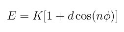

.. index:: dihedral\_style harmonic

dihedral\_style harmonic command
================================

dihedral\_style harmonic/intel command
======================================

dihedral\_style harmonic/kk command
===================================

dihedral\_style harmonic/omp command
====================================

Syntax
""""""

.. parsed-literal::

   dihedral_style harmonic

Examples
""""""""

.. parsed-literal::

   dihedral_style harmonic
   dihedral_coeff 1 80.0 1 2

Description
"""""""""""

The *harmonic* dihedral style uses the potential

The following coefficients must be defined for each dihedral type via the
:doc:`dihedral_coeff <dihedral_coeff>` command as in the example above, or in
the data file or restart files read by the :doc:`read_data <read_data>`
or :doc:`read_restart <read_restart>` commands:

* K (energy)
* d (+1 or -1)
* n (integer >= 0)

.. note::

   Here are important points to take note of when defining LAMMPS
   dihedral coefficients for the harmonic style, so that they are
   compatible with how harmonic dihedrals are defined by other force
   fields:

* The LAMMPS convention is that the trans position = 180 degrees, while
  in some force fields trans = 0 degrees.
* Some force fields reverse the sign convention on *d*\ .
* Some force fields let *n* be positive or negative which corresponds to
  *d* = 1 or -1 for the harmonic style.

----------

Styles with a *gpu*\ , *intel*\ , *kk*\ , *omp*\ , or *opt* suffix are
functionally the same as the corresponding style without the suffix.
They have been optimized to run faster, depending on your available
hardware, as discussed on the :doc:`Speed packages <Speed_packages>` doc
page.  The accelerated styles take the same arguments and should
produce the same results, except for round-off and precision issues.

These accelerated styles are part of the GPU, USER-INTEL, KOKKOS,
USER-OMP and OPT packages, respectively.  They are only enabled if
LAMMPS was built with those packages.  See the :doc:`Build package <Build_package>` doc page for more info.

You can specify the accelerated styles explicitly in your input script
by including their suffix, or you can use the :doc:`-suffix command-line switch <Run_options>` when you invoke LAMMPS, or you can use the
:doc:`suffix <suffix>` command in your input script.

See the :doc:`Speed packages <Speed_packages>` doc page for more
instructions on how to use the accelerated styles effectively.

----------

Restrictions
""""""""""""

This dihedral style can only be used if LAMMPS was built with the
MOLECULE package.  See the :doc:`Build package <Build_package>` doc page
for more info.

Related commands
""""""""""""""""

:doc:`dihedral_coeff <dihedral_coeff>`

**Default:** none
