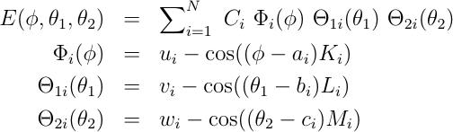

.. index:: dihedral\_style spherical

dihedral\_style spherical command
=================================

Syntax
""""""

.. parsed-literal::

   dihedral_style spherical

Examples
""""""""

.. parsed-literal::

   dihedral_coeff 1 1  286.1  1 124  1    1 90.0 0    1 90.0 0
   dihedral_coeff 1 3  69.3   1 93.9 1    1 90   0    1 90   0  &
                       49.1   0 0.00 0    1 74.4 1    0 0.00 0  &
                       25.2   0 0.00 0    0 0.00 0    1 48.1 1

Description
"""""""""""

The *spherical* dihedral style uses the potential:

.. image:: JPG/dihedral_spherical_angles.jpg
   :align: center

For this dihedral style, the energy can be any function that combines the
4-body dihedral-angle (phi) and the two 3-body bond-angles (theta1, theta2).
For this reason, there is usually no need to define 3-body "angle" forces
separately for the atoms participating in these interactions.
It is probably more efficient to incorporate 3-body angle forces into
the dihedral interaction even if it requires adding additional terms to
the expansion (as was done in the second example).  A careful choice of
parameters can prevent singularities that occur with traditional
force-fields whenever theta1 or theta2 approach 0 or 180 degrees.

The last example above corresponds to an interaction with a single energy
minima located near phi=93.9, theta1=74.4, theta2=48.1 degrees, and it remains
numerically stable at all angles (phi, theta1, theta2). In this example,
the coefficients 49.1, and 25.2 can be physically interpreted as the
harmonic spring constants for theta1 and theta2 around their minima.
The coefficient 69.3 is the harmonic spring constant for phi after
division by sin(74.4)\*sin(48.1) (the minima positions for theta1 and theta2).

The following coefficients must be defined for each dihedral type via the
:doc:`dihedral_coeff <dihedral_coeff>` command as in the example above, or in
the Dihedral Coeffs section of a data file read by the
:doc:`read_data <read_data>` command:

* n (integer >= 1)
* C1 (energy)
* K1 (typically an integer)
* a1 (degrees)
* u1 (typically 0.0 or 1.0)
* L1 (typically an integer)
* b1 (degrees, typically 0.0 or 90.0)
* v1 (typically 0.0 or 1.0)
* M1 (typically an integer)
* c1 (degrees, typically 0.0 or 90.0)
* w1 (typically 0.0 or 1.0)
* [...]
* Cn (energy)
* Kn (typically an integer)
* an (degrees)
* un (typically 0.0 or 1.0)
* Ln (typically an integer)
* bn (degrees, typically 0.0 or 90.0)
* vn (typically 0.0 or 1.0)
* Mn (typically an integer)
* cn (degrees, typically 0.0 or 90.0)
* wn (typically 0.0 or 1.0)

----------

Restrictions
""""""""""""

This dihedral style can only be used if LAMMPS was built with the
USER\_MISC package.  See the :doc:`Build package <Build_package>` doc
page for more info.

Related commands
""""""""""""""""

:doc:`dihedral_coeff <dihedral_coeff>`

**Default:** none
