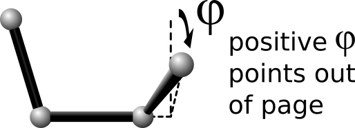

.. index:: dihedral_style

dihedral_style command
======================

Syntax
""""""

.. code-block:: LAMMPS

   dihedral_style style

* style = *none* or *hybrid* or *charmm* or *class2* or *harmonic* or *helix* or         *multi/harmonic* or *opls*

Examples
""""""""

.. code-block:: LAMMPS

   dihedral_style harmonic
   dihedral_style multi/harmonic
   dihedral_style hybrid harmonic charmm

Description
"""""""""""

Set the formula(s) LAMMPS uses to compute dihedral interactions
between quadruplets of atoms, which remain in force for the duration
of the simulation.  The list of dihedral quadruplets is read in by a
:doc:`read_data <read_data>` or :doc:`read_restart <read_restart>` command
from a data or restart file.

Hybrid models where dihedrals are computed using different dihedral
potentials can be setup using the *hybrid* dihedral style.

The coefficients associated with a dihedral style can be specified in
a data or restart file or via the :doc:`dihedral_coeff <dihedral_coeff>`
command.

All dihedral potentials store their coefficient data in binary restart
files which means dihedral\_style and
:doc:`dihedral_coeff <dihedral_coeff>` commands do not need to be
re-specified in an input script that restarts a simulation.  See the
:doc:`read_restart <read_restart>` command for details on how to do
this.  The one exception is that dihedral\_style *hybrid* only stores
the list of sub-styles in the restart file; dihedral coefficients need
to be re-specified.

.. note::

   When both a dihedral and pair style is defined, the
   :doc:`special_bonds <special_bonds>` command often needs to be used to
   turn off (or weight) the pairwise interaction that would otherwise
   exist between 4 bonded atoms.

In the formulas listed for each dihedral style, *phi* is the torsional
angle defined by the quadruplet of atoms.  This angle has a sign
convention as shown in this diagram:

where the I,J,K,L ordering of the 4 atoms that define the dihedral
is from left to right.

This sign convention effects several of the dihedral styles listed
below (e.g. charmm, helix) in the sense that the energy formula
depends on the sign of phi, which may be reflected in the value of the
coefficients you specify.

.. note::

   When comparing the formulas and coefficients for various LAMMPS
   dihedral styles with dihedral equations defined by other force fields,
   note that some force field implementations divide/multiply the energy
   prefactor *K* by the multiple number of torsions that contain the J-K
   bond in an I-J-K-L torsion.  LAMMPS does not do this, i.e. the listed
   dihedral equation applies to each individual dihedral.  Thus you need
   to define *K* appropriately via the
   :doc:`dihedral_coeff <dihedral_coeff>` command to account for this
   difference if necessary.

----------

Here is an alphabetic list of dihedral styles defined in LAMMPS.  Click on
the style to display the formula it computes and coefficients
specified by the associated :doc:`dihedral_coeff <dihedral_coeff>` command.

Click on the style to display the formula it computes, any additional
arguments specified in the dihedral\_style command, and coefficients
specified by the associated :doc:`dihedral_coeff <dihedral_coeff>`
command.

There are also additional accelerated pair styles included in the
LAMMPS distribution for faster performance on CPUs, GPUs, and KNLs.
The individual style names on the :ref:`Commands dihedral <dihedral>` doc page are followed by one or
more of (g,i,k,o,t) to indicate which accelerated styles exist.

* :doc:`none <dihedral_none>` - turn off dihedral interactions
* :doc:`zero <dihedral_zero>` - topology but no interactions
* :doc:`hybrid <dihedral_hybrid>` - define multiple styles of dihedral interactions

* :doc:`charmm <dihedral_charmm>` - CHARMM dihedral
* :doc:`charmmfsw <dihedral_charmm>` - CHARMM dihedral with force switching
* :doc:`class2 <dihedral_class2>` - COMPASS (class 2) dihedral
* :doc:`cosine/shift/exp <dihedral_cosine_shift_exp>` - dihedral with exponential in spring constant
* :doc:`fourier <dihedral_fourier>` - dihedral with multiple cosine terms
* :doc:`harmonic <dihedral_harmonic>` - harmonic dihedral
* :doc:`helix <dihedral_helix>` - helix dihedral
* :doc:`multi/harmonic <dihedral_multi_harmonic>` - dihedral with 5 harmonic terms
* :doc:`nharmonic <dihedral_nharmonic>` - same as multi-harmonic with N terms
* :doc:`opls <dihedral_opls>` - OPLS dihedral
* :doc:`quadratic <dihedral_quadratic>` - dihedral with quadratic term in angle
* :doc:`spherical <dihedral_spherical>` - dihedral which includes angle terms to avoid singularities
* :doc:`table <dihedral_table>` - tabulated dihedral
* :doc:`table/cut <dihedral_table_cut>` - tabulated dihedral with analytic cutoff

----------

Restrictions
""""""""""""

Dihedral styles can only be set for atom styles that allow dihedrals
to be defined.

Most dihedral styles are part of the MOLECULE package.  They are only
enabled if LAMMPS was built with that package.  See the :doc:`Build package <Build_package>` doc page for more info.  The doc pages for
individual dihedral potentials tell if it is part of a package.

Related commands
""""""""""""""""

:doc:`dihedral_coeff <dihedral_coeff>`

Default
"""""""

dihedral\_style none
