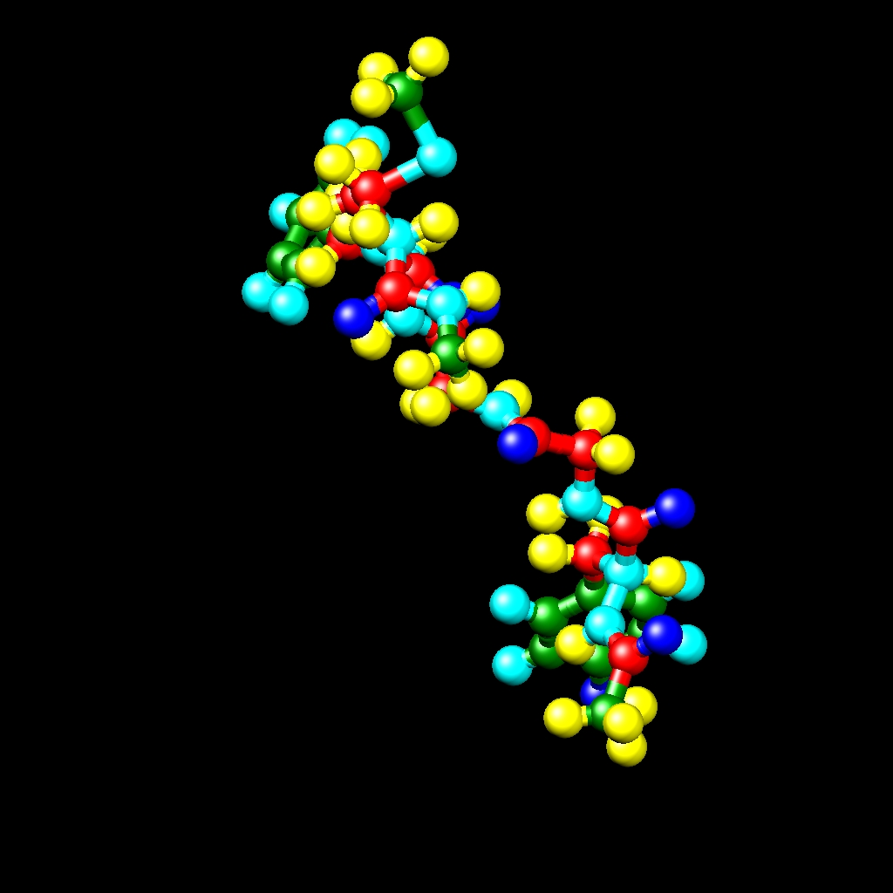

.. index:: dump image
.. index:: dump movie

dump image command
==================

dump movie command
==================

(see below for :ref:`dump_modify options <dump_modify_image>` specific to dump image/movie)

Syntax
""""""

.. code-block:: LAMMPS

   dump ID group-ID style N file color diameter keyword value ...

* ID = user-assigned name for the dump
* group-ID = ID of the group of atoms to be imaged
* style = *image* or *movie* = style of dump command (other styles such as *atom* or *cfg* or *dcd* or *xtc* or *xyz* or *local* or *custom* are discussed on the :doc:`dump <dump>` doc page)
* N = dump every this many timesteps
* file = name of file to write image to
* color = atom attribute that determines color of each atom
* diameter = atom attribute that determines size of each atom
* zero or more keyword/value pairs may be appended
* keyword = *atom* or *adiam* or *bond* or *grid* or *line* or *tri* or *body* or *fix* or *size* or *view* or *center* or *up* or *zoom* or *box* or *axes* or *subbox* or *shiny* or *ssao*

  .. parsed-literal::

       *atom* = *yes* or *no* = do or do not draw atoms
       *adiam* size = numeric value for atom diameter (distance units)
       *bond* values = color width = color and width of bonds
         color = *atom* or *type* or *none*
         width = number or *atom* or *type* or *none*
           number = numeric value for bond width (distance units)
       *grid* = per-grid value to use when coloring each grid cell
         per-grid value = c_ID:gname:dname, c_ID:gname:dname[I], f_ID:gname:dname, f_ID:gname:dname[I]
           gname = name of grid defined by compute or fix
           dname = name of data field defined by compute or fix
           c_ID = per-grid vector calculated by a compute with ID
           c_ID[I] = Ith column of per-grid array calculated by a compute with ID
           f_ID = per-grid vector calculated by a fix with ID
           f_ID[I] = Ith column of per-grid array calculated by a fix with ID
       *line* = color width
         color = *type*
         width = numeric value for line width (distance units)
       *tri* = color tflag width
         color = *type*
         tflag = 1 for just triangle, 2 for just tri edges, 3 for both
         width = numeric value for tringle edge width (distance units)
       *body* = color bflag1 bflag2
         color = *type*
         bflag1,bflag2 = 2 numeric flags to affect how bodies are drawn
       *fix* = fixID color fflag1 fflag2
         fixID = ID of fix that generates objects to draw
         color = *type*
         fflag1,fflag2 = 2 numeric flags to affect how fix objects are drawn
       *size* values = width height = size of images
         width = width of image in # of pixels
         height = height of image in # of pixels
       *view* values = theta phi = view of simulation box
         theta = view angle from +z axis (degrees)
         phi = azimuthal view angle (degrees)
         theta or phi can be a variable (see below)
       *center* values = flag Cx Cy Cz = center point of image
         flag = *s* for static, *d* for dynamic
         Cx,Cy,Cz = center point of image as fraction of box dimension (0.5 = center of box)
         Cx,Cy,Cz can be variables (see below)
       *up* values = Ux Uy Uz = direction that is "up" in image
         Ux,Uy,Uz = components of up vector
         Ux,Uy,Uz can be variables (see below)
       *zoom* value = zfactor = size that simulation box appears in image
         zfactor = scale image size by factor > 1 to enlarge, factor < 1 to shrink
         zfactor can be a variable (see below)
       *box* values = yes/no diam = draw outline of simulation box
         yes/no = do or do not draw simulation box lines
         diam = diameter of box lines as fraction of shortest box length
       *axes* values = axes length diam = draw xyz axes
         axes = *yes* or *no* = do or do not draw xyz axes lines next to simulation box
         length = length of axes lines as fraction of respective box lengths
         diam = diameter of axes lines as fraction of shortest box length
       *subbox* values = lines diam = draw outline of processor sub-domains
         lines = *yes* or *no* = do or do not draw sub-domain lines
         diam = diameter of sub-domain lines as fraction of shortest box length
       *shiny* value = sfactor = shinyness of spheres and cylinders
         sfactor = shinyness of spheres and cylinders from 0.0 to 1.0
       *ssao* value = shading seed dfactor = SSAO depth shading
         shading = *yes* or *no* = turn depth shading on/off
         seed = random # seed (positive integer)
         dfactor = strength of shading from 0.0 to 1.0

.. _dump_modify_image:

dump_modify options for dump image/movie
========================================

Syntax
""""""

.. parsed-literal::

   dump_modify dump-ID keyword values ...

* these keywords apply only to the *image* and *movie* styles and are documented on this page
* keyword = *acolor* or *adiam* or *amap* or *gmap* or *backcolor* or *bcolor* or *bdiam* or *bitrate* or *boxcolor* or *color* or *framerate* or *gmap*
* see the :doc:`dump modify <dump_modify>` doc page for more general keywords

  .. parsed-literal::

       *acolor* args = type color
         type = atom type or range of types (see below)
         color = name of color or color1/color2/...
       *adiam* args = type diam
         type = atom type or range of types (see below)
         diam = diameter of atoms of that type (distance units)
       *amap* args = lo hi style delta N entry1 entry2 ... entryN
         lo = number or *min* = lower bound of range of color map
         hi = number or *max* = upper bound of range of color map
         style = 2 letters = *c* or *d* or *s* plus *a* or *f*
           *c* for continuous
           *d* for discrete
           *s* for sequential
           *a* for absolute
           *f* for fractional
         delta = binsize (only used for style *s*, otherwise ignored)
           binsize = range is divided into bins of this width
         N = # of subsequent entries
         entry = value color (for continuous style)
           value = number or *min* or *max* = single value within range
           color = name of color used for that value
         entry = lo hi color (for discrete style)
           lo/hi = number or *min* or *max* = lower/upper bound of subset of range
           color = name of color used for that subset of values
         entry = color (for sequential style)
           color = name of color used for a bin of values
       *backcolor* arg = color
         color = name of color for background
       *bcolor* args = type color
         type = bond type or range of types (see below)
         color = name of color or color1/color2/...
       *bdiam* args = type diam
         type = bond type or range of types (see below)
         diam = diameter of bonds of that type (distance units)
       *bitrate* arg = rate
         rate = target bitrate for movie in kbps
       *boxcolor* arg = color
         color = name of color for simulation box lines and processor sub-domain lines
       *color* args = name R G B
         name = name of color
         R,G,B = red/green/blue numeric values from 0.0 to 1.0
       *framerate* arg = fps
         fps = frames per second for movie
       *gmap* args = identical to *amap* args

Examples
""""""""

.. code-block:: LAMMPS

   dump d0 all image 100 dump.*.jpg type type
   dump d1 mobile image 500 snap.*.png element element ssao yes 4539 0.6
   dump d2 all image 200 img-*.ppm type type zoom 2.5 adiam 1.5 size 1280 720
   dump m0 all movie 1000 movie.mpg type type size 640 480
   dump m1 all movie 1000 movie.avi type type size 640 480
   dump m2 all movie 100 movie.m4v type type zoom 1.8 adiam v_value size 1280 720

   dump_modify 1 amap min max cf 0.0 3 min green 0.5 yellow max blue boxcolor red

Description
"""""""""""

Dump a high-quality rendered image of the atom configuration every :math:`N`
timesteps and save the images either as a sequence of JPEG or PNG or
PPM files, or as a single movie file.  The options for this command as
well as the :doc:`dump_modify <dump_modify>` command control what is
included in the image or movie and how it appears.  A series of such
images can easily be manually converted into an animated movie of your
simulation or the process can be automated without writing the
intermediate files using the dump movie style; see further details
below.  Other dump styles store snapshots of numerical data associated
with atoms in various formats, as discussed on the :doc:`dump <dump>`
doc page.

Note that a set of images or a movie can be made after a simulation
has been run, using the :doc:`rerun <rerun>` command to read snapshots
from an existing dump file, and using these dump commands in the rerun
script to generate the images/movie.

Here are two sample images, rendered as :math:`1024\times 1024` JPEG files.

.. |dump1| image:: img/dump1.jpg
   :width: 48%

|dump1|  |dump2|

.. raw:: html

   Click to see the full-size images:

Only atoms in the specified group are rendered in the image.  The
:doc:`dump_modify region and thresh <dump_modify>` commands can also
alter what atoms are included in the image.
The filename suffix determines whether a JPEG, PNG, or PPM file is
created with the *image* dump style.  If the suffix is ".jpg" or
".jpeg", then a `JPEG format <jpeg_format_>`_ file is created, if the
suffix is ".png", then a `PNG format <png_format_>`_ is created, else
a `PPM (aka NETPBM) format <ppm_format_>`_ file is created.
The JPEG and PNG files are binary; PPM has a text mode header followed
by binary data. JPEG images have lossy compression, PNG has lossless
compression, and PPM files are uncompressed but can be compressed with
gzip, if LAMMPS has been compiled with -DLAMMPS_GZIP and a ".gz" suffix
is used.

.. _jpeg_format: https://jpeg.org/jpeg/
.. _png_format: https://en.wikipedia.org/wiki/Portable_Network_Graphics
.. _ppm_format: https://en.wikipedia.org/wiki/Netpbm

Similarly, the format of the resulting movie is chosen with the
*movie* dump style. This is handled by the underlying FFmpeg converter
and thus details have to be looked up in the `FFmpeg documentation
<https://ffmpeg.org/ffmpeg.html>`_.  Typical examples are: .avi, .mpg,
.m4v, .mp4, .mkv, .flv, .mov, .gif Additional settings of the movie
compression like *bitrate* and *framerate* can be set using the
dump_modify command as described below.

To write out JPEG and PNG format files, you must build LAMMPS with
support for the corresponding JPEG or PNG library. To convert images
into movies, LAMMPS has to be compiled with the -DLAMMPS_FFMPEG
flag. See the :doc:`Build settings <Build_settings>` page for
details.

.. note::

   Because periodic boundary conditions are enforced only on
   timesteps when neighbor lists are rebuilt, the coordinates of an atom
   in the image may be slightly outside the simulation box.

----------

Dumps are performed on timesteps that are a multiple of :math:`N` (including
timestep 0) and on the last timestep of a minimization if the
minimization converges.  Note that this means a dump will not be
performed on the initial timestep after the dump command is invoked,
if the current timestep is not a multiple of :math:`N`.  This behavior can be
changed via the :doc:`dump_modify first <dump_modify>` command, which
can be useful if the dump command is invoked after a minimization
ended on an arbitrary timestep. :math:`N` can be changed between runs by
using the :doc:`dump_modify every <dump_modify>` command.

Dump *image* filenames must contain a wildcard character "\*" so that
one image file per snapshot is written.  The "\*" character is replaced
with the timestep value.  For example, tmp.dump.\*.jpg becomes
tmp.dump.0.jpg, tmp.dump.10000.jpg, tmp.dump.20000.jpg, etc.  Note
that the :doc:`dump_modify pad <dump_modify>` command can be used to
insure all timestep numbers are the same length (e.g., 00010), which
can make it easier to convert a series of images into a movie in the
correct ordering.

Dump *movie* filenames on the other hand, must not have any wildcard
character since only one file combining all images into a single
movie will be written by the movie encoder.

----------

The *color* and *diameter* settings determine the color and size of
atoms rendered in the image.  They can be any atom attribute defined
for the :doc:`dump custom <dump>` command, including *type* and
*element*\ .  This includes per-atom quantities calculated by a
:doc:`compute <compute>`, :doc:`fix <fix>`, or :doc:`variable <variable>`,
which are prefixed by "c\_", "f\_", or "v\_", respectively.  Note that the
*diameter* setting can be overridden with a numeric value applied to
all atoms by the optional *adiam* keyword.

If *type* is specified for the *color* setting, then the color of each
atom is determined by its atom type.  By default the mapping of types
to colors is as follows:

* type 1 = red
* type 2 = green
* type 3 = blue
* type 4 = yellow
* type 5 = aqua
* type 6 = cyan

and repeats itself for types :math:`> 6`.  This mapping can be changed by the
"dump_modify acolor" command, as described below.

If *type* is specified for the *diameter* setting then the diameter of
each atom is determined by its atom type.  By default all types have
diameter 1.0.  This mapping can be changed by the "dump_modify adiam"
command, as described below.

If *element* is specified for the *color* and/or *diameter* setting,
then the color and/or diameter of each atom is determined by which
element it is, which in turn is specified by the element-to-type
mapping specified by the "dump_modify element" command, as described
below.  By default every atom type is C (carbon).  Every element has a
color and diameter associated with it, which is the same as the colors
and sizes used by the `AtomEye <atomeye_>`_ visualization package.

.. _atomeye: http://li.mit.edu/Archive/Graphics/A/

If other atom attributes are used for the *color* or *diameter*
settings, they are interpreted in the following way.

If "vx", for example, is used as the *color* setting, then the color
of the atom will depend on the x-component of its velocity.  The
association of a per-atom value with a specific color is determined by
a "color map", which can be specified via the dump_modify amap
command, as described below.  The basic idea is that the
atom-attribute will be within a range of values, and every value
within the range is mapped to a specific color.  Depending on how the
color map is defined, that mapping can take place via interpolation so
that a value of -3.2 is halfway between "red" and "blue", or
discretely so that the value of -3.2 is "orange".

If "vx", for example, is used as the *diameter* setting, then the atom
will be rendered using the x-component of its velocity as the
diameter.  If the per-atom value <= 0.0, them the atom will not be
drawn.  Note that finite-size spherical particles, as defined by
:doc:`atom_style sphere <atom_style>` define a per-particle radius or
diameter, which can be used as the *diameter* setting.

----------

The various keywords listed above control how the image is rendered.
As listed below, all of the keywords have defaults, most of which you
will likely not need to change.  As described below, the dump modify
command also has options specific to the dump image style,
particularly for assigning colors to atoms, bonds, and other image
features.

----------

The *atom* keyword allow you to turn off the drawing of all atoms, if
the specified value is *no*\ .  Note that this will not turn off the
drawing of particles that are represented as lines, triangles, or
bodies, as discussed below.  These particles can be drawn separately
if the *line*, *tri*, or *body* keywords are used.

The *adiam* keyword allows you to override the *diameter* setting to
set a single numeric *size*\ .  All atoms will be drawn with that
diameter, e.g. 1.5, which is in whatever distance :doc:`units <units>`
the input script defines, e.g. Angstroms.

----------

The *bond* keyword allows to you to alter how bonds are drawn.  A bond
is only drawn if both atoms in the bond are being drawn due to being
in the specified group and due to other selection criteria
(e.g. region, threshold settings of the
:doc:`dump_modify <dump_modify>` command).  By default, bonds are drawn
if they are defined in the input data file as read by the
:doc:`read_data <read_data>` command.  Using *none* for both the bond
*color* and *width* value will turn off the drawing of all bonds.

If *atom* is specified for the bond *color* value, then each bond is
drawn in 2 halves, with the color of each half being the color of the
atom at that end of the bond.

If *type* is specified for the *color* value, then the color of each
bond is determined by its bond type.  By default the mapping of bond
types to colors is as follows:

* type 1 = red
* type 2 = green
* type 3 = blue
* type 4 = yellow
* type 5 = aqua
* type 6 = cyan

and repeats itself for bond types > 6.  This mapping can be changed by
the "dump_modify bcolor" command, as described below.

The bond *width* value can be a numeric value or *atom* or *type* (or
*none* as indicated above).

If a numeric value is specified, then all bonds will be drawn as
cylinders with that diameter, e.g. 1.0, which is in whatever distance
:doc:`units <units>` the input script defines, e.g. Angstroms.

If *atom* is specified for the *width* value, then each bond
will be drawn with a width corresponding to the minimum diameter
of the 2 atoms in the bond.

If *type* is specified for the *width* value then the diameter of each
bond is determined by its bond type.  By default all types have
diameter 0.5.  This mapping can be changed by the "dump_modify bdiam" command,
as described below.

----------

The *line* keyword can be used when :doc:`atom_style line <atom_style>`
is used to define particles as line segments, and will draw them as
lines.  If this keyword is not used, such particles will be drawn as
spheres, the same as if they were regular atoms.  The only setting
currently allowed for the *color* value is *type*, which will color
the lines according to the atom type of the particle.  By default the
mapping of types to colors is as follows:

* type 1 = red
* type 2 = green
* type 3 = blue
* type 4 = yellow
* type 5 = aqua
* type 6 = cyan

and repeats itself for types > 6.  There is not yet an option to
change this via the dump_modify command.

The line *width* can only be a numeric value, which specifies that all
lines will be drawn as cylinders with that diameter, e.g. 1.0, which
is in whatever distance :doc:`units <units>` the input script defines,
e.g. Angstroms.

----------

The *tri* keyword can be used when :doc:`atom_style tri <atom_style>` is
used to define particles as triangles, and will draw them as triangles
or edges (3 lines) or both, depending on the setting for *tflag*\ .  If
edges are drawn, the *width* setting determines the diameters of the
line segments.  If this keyword is not used, triangle particles will
be drawn as spheres, the same as if they were regular atoms.  The only
setting currently allowed for the *color* value is *type*, which will
color the triangles according to the atom type of the particle.  By
default the mapping of types to colors is as follows:

* type 1 = red
* type 2 = green
* type 3 = blue
* type 4 = yellow
* type 5 = aqua
* type 6 = cyan

and repeats itself for types > 6.  There is not yet an option to
change this via the dump_modify command.

----------

The *body* keyword can be used when :doc:`atom_style body <atom_style>`
is used to define body particles with internal state
(e.g. sub-particles), and will drawn them in a manner specific to the
body style.  If this keyword is not used, such particles will be drawn
as spheres, the same as if they were regular atoms.

The :doc:`Howto body <Howto_body>` page describes the body styles
LAMMPS currently supports, and provides more details as to the kind of
body particles they represent and how they are drawn by this dump
image command.  For all the body styles, individual atoms can be
either a body particle or a usual point (non-body) particle.  Non-body
particles will be drawn the same way they would be as a regular atom.
The *bflag1* and *bflag2* settings are numerical values which are
passed to the body style to affect how the drawing of a body particle
is done.  See the :doc:`Howto body <Howto_body>` page for a
description of what these parameters mean for each body style.

The only setting currently allowed for the *color* value is *type*,
which will color the body particles according to the atom type of the
particle.  By default the mapping of types to colors is as follows:

* type 1 = red
* type 2 = green
* type 3 = blue
* type 4 = yellow
* type 5 = aqua
* type 6 = cyan

and repeats itself for types > 6.  There is not yet an option to
change this via the dump_modify command.

----------

The *fix* keyword can be used with a :doc:`fix <fix>` that produces
objects to be drawn.

The *fflag1* and *fflag2* settings are numerical values which are
passed to the fix to affect how the drawing of its objects is done.
See the individual fix page for a description of what these
parameters mean for a particular fix.

The only setting currently allowed for the *color* value is *type*,
which will color the fix objects according to their type.  By default
the mapping of types to colors is as follows:

* type 1 = red
* type 2 = green
* type 3 = blue
* type 4 = yellow
* type 5 = aqua
* type 6 = cyan

and repeats itself for types > 6.  There is not yet an option to
change this via the dump_modify command.

----------

The *size* keyword sets the width and height of the created images,
i.e. the number of pixels in each direction.

----------

The *view*, *center*, *up*, and *zoom* values determine how
3d simulation space is mapped to the 2d plane of the image.  Basically
they control how the simulation box appears in the image.

All of the *view*, *center*, *up*, and *zoom* values can be
specified as numeric quantities, whose meaning is explained below.
Any of them can also be specified as an :doc:`equal-style variable <variable>`,
by using v_name as the value, where "name" is
the variable name.  In this case the variable will be evaluated on the
timestep each image is created to create a new value.  If the
equal-style variable is time-dependent, this is a means of changing
the way the simulation box appears from image to image, effectively
doing a pan or fly-by view of your simulation.

The *view* keyword determines the viewpoint from which the simulation
box is viewed, looking towards the *center* point.  The *theta* value
is the vertical angle from the +z axis, and must be an angle from 0 to
180 degrees.  The *phi* value is an azimuthal angle around the z axis
and can be positive or negative.  A value of 0.0 is a view along the
+x axis, towards the *center* point.  If *theta* or *phi* are
specified via variables, then the variable values should be in
degrees.

The *center* keyword determines the point in simulation space that
will be at the center of the image.  *Cx*, *Cy*, and *Cz* are
specified as fractions of the box dimensions, so that (0.5,0.5,0.5) is
the center of the simulation box.  These values do not have to be
between 0.0 and 1.0, if you want the simulation box to be offset from
the center of the image.  Note, however, that if you choose strange
values for *Cx*, *Cy*, or *Cz* you may get a blank image.  Internally,
*Cx*, *Cy*, and *Cz* are converted into a point in simulation space.
If *flag* is set to "s" for static, then this conversion is done once,
at the time the dump command is issued.  If *flag* is set to "d" for
dynamic then the conversion is performed every time a new image is
created.  If the box size or shape is changing, this will adjust the
center point in simulation space.

The *up* keyword determines what direction in simulation space will be
"up" in the image.  Internally it is stored as a vector that is in the
plane perpendicular to the view vector implied by the *theta* and
*pni* values, and which is also in the plane defined by the view
vector and user-specified up vector.  Thus this internal vector is
computed from the user-specified *up* vector as

.. parsed-literal::

   up_internal = view cross (up cross view)

This means the only restriction on the specified *up* vector is that
it cannot be parallel to the *view* vector, implied by the *theta* and
*phi* values.

The *zoom* keyword scales the size of the simulation box as it appears
in the image.  The default *zfactor* value of 1 should display an
image mostly filled by the atoms in the simulation box.  A *zfactor* >
1 will make the simulation box larger; a *zfactor* < 1 will make it
smaller.  *Zfactor* must be a value > 0.0.

----------

The *box* keyword determines if and how the simulation box boundaries
are rendered as thin cylinders in the image.  If *no* is set, then the
box boundaries are not drawn and the *diam* setting is ignored.  If
*yes* is set, the 12 edges of the box are drawn, with a diameter that
is a fraction of the shortest box length in x,y,z (for 3d) or x,y (for
2d).  The color of the box boundaries can be set with the "dump_modify
boxcolor" command.

The *axes* keyword determines if and how the coordinate axes are
rendered as thin cylinders in the image.  If *no* is set, then the
axes are not drawn and the *length* and *diam* settings are ignored.
If *yes* is set, 3 thin cylinders are drawn to represent the x,y,z
axes in colors red,green,blue.  The origin of these cylinders will be
offset from the lower left corner of the box by 10%.  The *length*
setting determines how long the cylinders will be as a fraction of the
respective box lengths.  The *diam* setting determines their thickness
as a fraction of the shortest box length in x,y,z (for 3d) or x,y (for
2d).

The *subbox* keyword determines if and how processor sub-domain
boundaries are rendered as thin cylinders in the image.  If *no* is
set (default), then the sub-domain boundaries are not drawn and the
*diam* setting is ignored.  If *yes* is set, the 12 edges of each
processor sub-domain are drawn, with a diameter that is a fraction of
the shortest box length in x,y,z (for 3d) or x,y (for 2d).  The color
of the sub-domain boundaries can be set with the "dump_modify
boxcolor" command.

----------

The *shiny* keyword determines how shiny the objects rendered in the
image will appear.  The *sfactor* value must be a value 0.0 <=
*sfactor* <= 1.0, where *sfactor* = 1 is a highly reflective surface
and *sfactor* = 0 is a rough non-shiny surface.

The *ssao* keyword turns on/off a screen space ambient occlusion
(SSAO) model for depth shading.  If *yes* is set, then atoms further
away from the viewer are darkened via a randomized process, which is
perceived as depth.  The calculation of this effect can increase the
cost of computing the image by roughly 2x.  The strength of the effect
can be scaled by the *dfactor* parameter.  If *no* is set, no depth
shading is performed.

----------

A series of JPEG, PNG, or PPM images can be converted into a movie
file and then played as a movie using commonly available tools. Using
dump style *movie* automates this step and avoids the intermediate
step of writing (many) image snapshot file. But LAMMPS has to be
compiled with -DLAMMPS_FFMPEG and an FFmpeg executable have to be
installed.

To manually convert JPEG, PNG or PPM files into an animated GIF or
MPEG or other movie file you can use:

* a) Use the ImageMagick convert program.

  .. code-block:: bash

     convert *.jpg foo.gif
     convert -loop 1 *.ppm foo.mpg

  Animated GIF files from ImageMagick are not optimized. You can use
  a program like gifsicle to optimize and thus massively shrink them.
  MPEG files created by ImageMagick are in MPEG-1 format with a rather
  inefficient compression and low quality compared to more modern
  compression styles like MPEG-4, H.264, VP8, VP9, H.265 and so on.

* b) Use QuickTime.

  Select "Open Image Sequence" under the File menu Load the images into
  QuickTime to animate them Select "Export" under the File menu Save the
  movie as a QuickTime movie (\*.mov) or in another format.  QuickTime
  can generate very high quality and efficiently compressed movie
  files. Some of the supported formats require to buy a license and some
  are not readable on all platforms until specific runtime libraries are
  installed.

* c) Use FFmpeg

  FFmpeg is a command line tool that is available on many platforms and
  allows extremely flexible encoding and decoding of movies.

  .. code-block:: bash

     cat snap.*.jpg | ffmpeg -y -f image2pipe -c:v mjpeg -i - -b:v 2000k movie.m4v
     cat snap.*.ppm | ffmpeg -y -f image2pipe -c:v ppm -i - -b:v 2400k movie.avi

  Front ends for FFmpeg exist for multiple platforms. For more
  information see the `FFmpeg homepage <https://www.ffmpeg.org/>`_

----------

Play the movie:

* a) Use your browser to view an animated GIF movie.

  Select "Open File" under the File menu
  Load the animated GIF file

* b) Use the freely available mplayer or ffplay tool to view a
  movie. Both are available for multiple OSes and support a large
  variety of file formats and decoders.

  .. code-block:: bash

     mplayer foo.mpg
     ffplay bar.avi

* c) Use the `Pizza.py <https://lammps.github.io/pizza>`_
  `animate tool <https://lammps.github.io/pizza/doc/animate.html>`_,
  which works directly on a series of image files.

  .. code-block:: python

     a = animate("foo*.jpg")

* d) QuickTime and other Windows- or macOS-based media players can
  obviously play movie files directly. Similarly for corresponding tools
  bundled with Linux desktop environments.  However, due to licensing
  issues with some file formats, the formats may require installing
  additional libraries, purchasing a license, or may not be
  supported.

----------

Dump_modify keywords for dump image and dump movie
""""""""""""""""""""""""""""""""""""""""""""""""""

The following dump_modify keywords apply only to the dump image and
dump movie styles.  Any keyword that works with dump image also works
with dump movie, since the movie is simply a collection of images.
Some of the keywords only affect the dump movie style.  The
descriptions give details.

----------

The *acolor* keyword can be used with the dump image command, when its
atom color setting is *type*, to set the color that atoms of each type
will be drawn in the image.

The specified *type* should be an integer from 1 to Ntypes = the
number of atom types.  A wildcard asterisk can be used in place of or
in conjunction with the *type* argument to specify a range of atom
types.  This takes the form "\*" or "\*n" or "n\*" or "m\*n".  If N =
the number of atom types, then an asterisk with no numeric values
means all types from 1 to N.  A leading asterisk means all types from
1 to n (inclusive).  A trailing asterisk means all types from n to N
(inclusive).  A middle asterisk means all types from m to n
(inclusive).

The specified *color* can be a single color which is any of the 140
pre-defined colors (see below) or a color name defined by the
"dump_modify color" command, as described below.  Or it can be two or
more colors separated by a "/" character, e.g. red/green/blue.  In the
former case, that color is assigned to all the specified atom types.
In the latter case, the list of colors are assigned in a round-robin
fashion to each of the specified atom types.

----------

The *adiam* keyword can be used with the dump image command, when its
atom diameter setting is *type*, to set the size that atoms of each
type will be drawn in the image.  The specified *type* should be an
integer from 1 to Ntypes.  As with the *acolor* keyword, a wildcard
asterisk can be used as part of the *type* argument to specify a range
of atom types.  The specified *diam* is the size in whatever distance
:doc:`units <units>` the input script is using, e.g. Angstroms.

----------

The *amap* keyword can be used with the dump image command, with its
*atom* keyword, when its atom setting is an atom-attribute, to setup a
color map.  The color map is used to assign a specific RGB
(red/green/blue) color value to an individual atom when it is drawn,
based on the atom's attribute, which is a numeric value, e.g. its
x-component of velocity if the atom-attribute "vx" was specified.

The basic idea of a color map is that the atom-attribute will be
within a range of values, and that range is associated with a series
of colors (e.g. red, blue, green).  An atom's specific value (vx =
-3.2) can then mapped to the series of colors (e.g. halfway between
red and blue), and a specific color is determined via an interpolation
procedure.

There are many possible options for the color map, enabled by the
*amap* keyword.  Here are the details.

The *lo* and *hi* settings determine the range of values allowed for
the atom attribute.  If numeric values are used for *lo* and/or *hi*,
then values that are lower/higher than that value are set to the
value.  I.e. the range is static.  If *lo* is specified as *min* or
*hi* as *max* then the range is dynamic, and the lower and/or
upper bound will be calculated each time an image is drawn, based
on the set of atoms being visualized.

The *style* setting is two letters, such as "ca".  The first letter is
either "c" for continuous, "d" for discrete, or "s" for sequential.
The second letter is either "a" for absolute, or "f" for fractional.

A continuous color map is one in which the color changes continuously
from value to value within the range.  A discrete color map is one in
which discrete colors are assigned to sub-ranges of values within the
range.  A sequential color map is one in which discrete colors are
assigned to a sequence of sub-ranges of values covering the entire
range.

An absolute color map is one in which the values to which colors are
assigned are specified explicitly as values within the range.  A
fractional color map is one in which the values to which colors are
assigned are specified as a fractional portion of the range.  For
example if the range is from -10.0 to 10.0, and the color red is to be
assigned to atoms with a value of 5.0, then for an absolute color map
the number 5.0 would be used.  But for a fractional map, the number
0.75 would be used since 5.0 is 3/4 of the way from -10.0 to 10.0.

The *delta* setting must be specified for all styles, but is only used
for the sequential style; otherwise the value is ignored.  It
specifies the bin size to use within the range for assigning
consecutive colors to.  For example, if the range is from :math:`-10.0` to
:math:`10.0` and a *delta* of :math:`1.0` is used, then 20 colors will be
assigned to the range.  The first will be from
:math:`-10.0 \le \text{color1} < -9.0`, then second from
:math:`-9.0 \le color2 < -8.0`, etc.

The *N* setting is how many entries follow.  The format of the entries
depends on whether the color map style is continuous, discrete or
sequential.  In all cases the *color* setting can be any of the 140
pre-defined colors (see below) or a color name defined by the
dump_modify color option.

For continuous color maps, each entry has a *value* and a *color*\ .
The *value* is either a number within the range of values or *min* or
*max*\ .  The *value* of the first entry must be *min* and the *value*
of the last entry must be *max*\ .  Any entries in between must have
increasing values.  Note that numeric values can be specified either
as absolute numbers or as fractions (0.0 to 1.0) of the range,
depending on the "a" or "f" in the style setting for the color map.

Here is how the entries are used to determine the color of an individual
atom, given the value :math:`X` of its atom attribute.  :math:`X` will
fall between 2 of the entry values.  The color of the atom is linearly
interpolated (in each of the RGB values) between the 2 colors associated
with those entries.  For example, if :math:`X = -5.0` and the two
surrounding entries are "red" at :math:`-10.0` and "blue" at
:math:`0.0`, then the atom's color will be halfway between "red" and
"blue", which happens to be "purple".

For discrete color maps, each entry has a *lo* and *hi* value and a
*color*\ .  The *lo* and *hi* settings are either numbers within the
range of values or *lo* can be *min* or *hi* can be *max*\ .  The *lo*
and *hi* settings of the last entry must be *min* and *max*\ .  Other
entries can have any *lo* and *hi* values and the sub-ranges of
different values can overlap.  Note that numeric *lo* and *hi* values
can be specified either as absolute numbers or as fractions (0.0 to 1.0)
of the range, depending on the "a" or "f" in the style setting for the
color map.

Here is how the entries are used to determine the color of an individual
atom, given the value X of its atom attribute.  The entries are scanned
from first to last.  The first time that *lo* <= X <= *hi*, X is
assigned the color associated with that entry.  You can think of the
last entry as assigning a default color (since it will always be matched
by X), and the earlier entries as colors that override the default.
Also note that no interpolation of a color RGB is done.  All atoms will
be drawn with one of the colors in the list of entries.

For sequential color maps, each entry has only a *color*\ .  Here is how
the entries are used to determine the color of an individual atom,
given the value X of its atom attribute.  The range is partitioned
into N bins of width *binsize*\ .  Thus X will fall in a specific bin
from 1 to N, say the Mth bin.  If it falls on a boundary between 2
bins, it is considered to be in the higher of the 2 bins.  Each bin is
assigned a color from the E entries.  If E < N, then the colors are
repeated.  For example if 2 entries with colors red and green are
specified, then the odd numbered bins will be red and the even bins
green.  The color of the atom is the color of its bin.  Note that the
sequential color map is really a shorthand way of defining a discrete
color map without having to specify where all the bin boundaries are.

Here is an example of using a sequential color map to color all the
atoms in individual molecules with a different color.  See the
examples/pour/in.pour.2d.molecule input script for an example of how
this is used.

.. code-block:: LAMMPS

   variable        colors string &
                   "red green blue yellow white &
                   purple pink orange lime gray"
   variable        mol atom mol%10
   dump            1 all image 250 image.*.jpg v_mol type &
                   zoom 1.6 adiam 1.5
   dump_modify     1 pad 5 amap 0 10 sa 1 10 ${colors}

In this case, 10 colors are defined, and molecule IDs are
mapped to one of the colors, even if there are 1000s of molecules.

----------

The *backcolor* sets the background color of the images.  The color
name can be any of the 140 pre-defined colors (see below) or a color
name defined by the dump_modify color option.

----------

The *bcolor* keyword can be used with the dump image command, with its
*bond* keyword, when its color setting is *type*, to set the color
that bonds of each type will be drawn in the image.

The specified *type* should be an integer from 1 to :math:`N`, where :math:`N`
is the number of bond types.  A wildcard asterisk can be used in place of or
in conjunction with the *type* argument to specify a range of bond
types.  This takes the form "\*" or "\*n" or "m\*" or "m\*n".  If :math:`N`
is the number of bond types, then an asterisk with no numerical values
means all types from 1 to :math:`N`.  A leading asterisk means all types from
1 to n (inclusive).  A trailing asterisk means all types from m to :math:`N`
(inclusive).  A middle asterisk means all types from m to n
(inclusive).

The specified *color* can be a single color which is any of the 140
pre-defined colors (see below) or a color name defined by the
dump_modify color option.  Or it can be two or more colors separated
by a "/" character (e.g., red/green/blue).  In the former case, that
color is assigned to all the specified bond types.  In the latter
case, the list of colors are assigned in a round-robin fashion to each
of the specified bond types.

----------

The *bdiam* keyword can be used with the dump image command, with its
*bond* keyword, when its *diam* setting is *type*, to set the diameter
that bonds of each type will be drawn in the image.  The specified
*type* should be an integer from 1 to Nbondtypes.  As with the
*bcolor* keyword, a wildcard asterisk can be used as part of the
*type* argument to specify a range of bond types.  The specified
*diam* is the size in whatever distance :doc:`units <units>` you are
using (e.g., Angstroms).

----------

The *bitrate* keyword can be used with the :doc:`dump movie
<dump_image>` command to define the size of the resulting movie file
and its quality via setting how many kbits per second are to be used
for the movie file. Higher bitrates require less compression and will
result in higher quality movies.  The quality is also determined by
the compression format and encoder.  The default setting is 2000
kbit/s, which will result in average quality with older compression
formats.

.. note::

   Not all movie file formats supported by dump movie allow the
   bitrate to be set.  If not, the setting is silently ignored.

----------

The *boxcolor* keyword sets the color of the simulation box drawn
around the atoms in each image as well as the color of processor
sub-domain boundaries.  See the "dump image box" command for how to
specify that a box be drawn via the *box* keyword, and the sub-domain
boundaries via the *subbox* keyword.  The color name can be any of the
140 pre-defined colors (see below) or a color name defined by the
dump_modify color option.

----------

The *color* keyword allows definition of a new color name, in addition
to the 140-predefined colors (see below), and associates three
red/green/blue RGB values with that color name.  The color name can
then be used with any other dump_modify keyword that takes a color
name as a value.  The RGB values should each be floating point values
between 0.0 and 1.0 inclusive.

When a color name is converted to RGB values, the user-defined color
names are searched first, then the 140 pre-defined color names.  This
means you can also use the *color* keyword to overwrite one of the
pre-defined color names with new RBG values.

----------

The *framerate* keyword can be used with the :doc:`dump movie
<dump_image>` command to define the duration of the resulting movie
file.  Movie files written by the dump *movie* command have a default
frame rate of 24 frames per second and the images generated will be
converted at that rate.  Thus a sequence of 1000 dump images will
result in a movie of about 42 seconds.  To make a movie run longer you
can either generate images more frequently or lower the frame rate.
To speed a movie up, you can do the inverse.  Using a frame rate
higher than 24 is not recommended, as it will result in simply
dropping the rendered images. It is more efficient to dump images less
frequently.

----------

The *gmap* keyword can be used with the dump image command, with its
*grid* keyword, to setup a color map.  The color map is used to assign
a specific RGB (red/green/blue) color value to an individual grid cell
when it is drawn, based on the grid cell value, which is a numeric
quantity specified with the *grid* keyword.

The arguments for the *gmap* keyword are identical to those for the
*amap* keyword (for atom coloring) described above.

----------

Restrictions
""""""""""""

To write JPEG images, you must use the -DLAMMPS_JPEG switch when
building LAMMPS and link with a JPEG library. To write PNG images, you
must use the -DLAMMPS_PNG switch when building LAMMPS and link with a
PNG library.

To write *movie* dumps, you must use the -DLAMMPS_FFMPEG switch when
building LAMMPS and have the FFmpeg executable available on the
machine where LAMMPS is being run.  Typically its name is lowercase
(i.e., "ffmpeg").

See the :doc:`Build settings <Build_settings>` page for details.

Note that since FFmpeg is run as an external program via a pipe,
LAMMPS has limited control over its execution and no knowledge about
errors and warnings printed by it. Those warnings and error messages
will be printed to the screen only. Due to the way image data are
communicated to FFmpeg, it will often print the message

.. parsed-literal::

   pipe:: Input/output error

which can be safely ignored. Other warnings
and errors have to be addressed according to the FFmpeg documentation.
One known issue is that certain movie file formats (e.g., MPEG level 1
and 2 format streams) have video bandwidth limits that can be crossed
when rendering too large of image sizes. Typical warnings look like
this:

.. parsed-literal::

   [mpeg @ 0x98b5e0] packet too large, ignoring buffer limits to mux it
   [mpeg @ 0x98b5e0] buffer underflow st=0 bufi=281407 size=285018
   [mpeg @ 0x98b5e0] buffer underflow st=0 bufi=283448 size=285018

In this case it is recommended either to reduce the size of the image
or to encode in a different format that is also supported by your copy of
FFmpeg and which does not have this limitation (e.g., .avi, .mkv, mp4).

Related commands
""""""""""""""""

:doc:`dump <dump>`, :doc:`dump_modify <dump_modify>`, :doc:`undump <undump>`

Default
"""""""

The defaults for the dump image and dump movie keywords are as follows:

* adiam = not specified (use diameter setting)
* atom = yes
* bond = none none (if no bonds in system)
* bond = atom 0.5 (if bonds in system)
* size = 512 512
* view = 60 30 (for 3d)
* view = 0 0 (for 2d)
* center = s 0.5 0.5 0.5
* up = 0 0 1 (for 3d)
* up = 0 1 0 (for 2d)
* zoom = 1.0
* box = yes 0.02
* axes = no 0.0 0.0
* subbox no 0.0
* shiny = 1.0
* ssao = no

----------

The defaults for the dump_modify keywords specific to dump image and dump movie are as follows:

* acolor = \* red/green/blue/yellow/aqua/cyan
* adiam = \* 1.0
* amap = min max cf 0.0 2 min blue max red
* backcolor = black
* bcolor = \* red/green/blue/yellow/aqua/cyan
* bdiam = \* 0.5
* bitrate = 2000
* boxcolor = yellow
* color = 140 color names are pre-defined as listed below
* framerate = 24
* gmap = min max cf 0.0 2 min blue max red

----------

These are the standard 109 element names that LAMMPS pre-defines for
use with the dump image and dump_modify commands.

* 1-10 = "H", "He", "Li", "Be", "B", "C", "N", "O", "F", "Ne"
* 11-20 = "Na", "Mg", "Al", "Si", "P", "S", "Cl", "Ar", "K", "Ca"
* 21-30 = "Sc", "Ti", "V", "Cr", "Mn", "Fe", "Co", "Ni", "Cu", "Zn"
* 31-40 = "Ga", "Ge", "As", "Se", "Br", "Kr", "Rb", "Sr", "Y", "Zr"
* 41-50 = "Nb", "Mo", "Tc", "Ru", "Rh", "Pd", "Ag", "Cd", "In", "Sn"
* 51-60 = "Sb", "Te", "I", "Xe", "Cs", "Ba", "La", "Ce", "Pr", "Nd"
* 61-70 = "Pm", "Sm", "Eu", "Gd", "Tb", "Dy", "Ho", "Er", "Tm", "Yb"
* 71-80 = "Lu", "Hf", "Ta", "W", "Re", "Os", "Ir", "Pt", "Au", "Hg"
* 81-90 = "Tl", "Pb", "Bi", "Po", "At", "Rn", "Fr", "Ra", "Ac", "Th"
* 91-100 = "Pa", "U", "Np", "Pu", "Am", "Cm", "Bk", "Cf", "Es", "Fm"
* 101-109 = "Md", "No", "Lr", "Rf", "Db", "Sg", "Bh", "Hs", "Mt"

----------

These are the 140 colors that LAMMPS pre-defines for use with the dump
image and dump_modify commands.  Additional colors can be defined with
the dump_modify color command.  The 3 numbers listed for each name are
the RGB (red/green/blue) values.  Divide each value by 255 to get the
equivalent 0.0 to 1.0 value.

+-------------------------------+--------------------------------------+---------------------------------+--------------------------------+--------------------------------+
| aliceblue = 240, 248, 255     | antiquewhite = 250, 235, 215         | aqua = 0, 255, 255              | aquamarine = 127, 255, 212     | azure = 240, 255, 255          |
+-------------------------------+--------------------------------------+---------------------------------+--------------------------------+--------------------------------+
| beige = 245, 245, 220         | bisque = 255, 228, 196               | black = 0, 0, 0                 | blanchedalmond = 255, 255, 205 | blue = 0, 0, 255               |
+-------------------------------+--------------------------------------+---------------------------------+--------------------------------+--------------------------------+
| blueviolet = 138, 43, 226     | brown = 165, 42, 42                  | burlywood = 222, 184, 135       | cadetblue = 95, 158, 160       | chartreuse = 127, 255, 0       |
+-------------------------------+--------------------------------------+---------------------------------+--------------------------------+--------------------------------+
| chocolate = 210, 105, 30      | coral = 255, 127, 80                 | cornflowerblue = 100, 149, 237  | cornsilk = 255, 248, 220       | crimson = 220, 20, 60          |
+-------------------------------+--------------------------------------+---------------------------------+--------------------------------+--------------------------------+
| cyan = 0, 255, 255            | darkblue = 0, 0, 139                 | darkcyan = 0, 139, 139          | darkgoldenrod = 184, 134, 11   | darkgray = 169, 169, 169       |
+-------------------------------+--------------------------------------+---------------------------------+--------------------------------+--------------------------------+
| darkgreen = 0, 100, 0         | darkkhaki = 189, 183, 107            | darkmagenta = 139, 0, 139       | darkolivegreen = 85, 107, 47   | darkorange = 255, 140, 0       |
+-------------------------------+--------------------------------------+---------------------------------+--------------------------------+--------------------------------+
| darkorchid = 153, 50, 204     | darkred = 139, 0, 0                  | darksalmon = 233, 150, 122      | darkseagreen = 143, 188, 143   | darkslateblue = 72, 61, 139    |
+-------------------------------+--------------------------------------+---------------------------------+--------------------------------+--------------------------------+
| darkslategray = 47, 79, 79    | darkturquoise = 0, 206, 209          | darkviolet = 148, 0, 211        | deeppink = 255, 20, 147        | deepskyblue = 0, 191, 255      |
+-------------------------------+--------------------------------------+---------------------------------+--------------------------------+--------------------------------+
| dimgray = 105, 105, 105       | dodgerblue = 30, 144, 255            | firebrick = 178, 34, 34         | floralwhite = 255, 250, 240    | forestgreen = 34, 139, 34      |
+-------------------------------+--------------------------------------+---------------------------------+--------------------------------+--------------------------------+
| fuchsia = 255, 0, 255         | gainsboro = 220, 220, 220            | ghostwhite = 248, 248, 255      | gold = 255, 215, 0             | goldenrod = 218, 165, 32       |
+-------------------------------+--------------------------------------+---------------------------------+--------------------------------+--------------------------------+
| gray = 128, 128, 128          | green = 0, 128, 0                    | greenyellow = 173, 255, 47      | honeydew = 240, 255, 240       | hotpink = 255, 105, 180        |
+-------------------------------+--------------------------------------+---------------------------------+--------------------------------+--------------------------------+
| indianred = 205, 92, 92       | indigo = 75, 0, 130                  | ivory = 255, 240, 240           | khaki = 240, 230, 140          | lavender = 230, 230, 250       |
+-------------------------------+--------------------------------------+---------------------------------+--------------------------------+--------------------------------+
| lavenderblush = 255, 240, 245 | lawngreen = 124, 252, 0              | lemonchiffon = 255, 250, 205    | lightblue = 173, 216, 230      | lightcoral = 240, 128, 128     |
+-------------------------------+--------------------------------------+---------------------------------+--------------------------------+--------------------------------+
| lightcyan = 224, 255, 255     | lightgoldenrodyellow = 250, 250, 210 | lightgreen = 144, 238, 144      | lightgrey = 211, 211, 211      | lightpink = 255, 182, 193      |
+-------------------------------+--------------------------------------+---------------------------------+--------------------------------+--------------------------------+
| lightsalmon = 255, 160, 122   | lightseagreen = 32, 178, 170         | lightskyblue = 135, 206, 250    | lightslategray = 119, 136, 153 | lightsteelblue = 176, 196, 222 |
+-------------------------------+--------------------------------------+---------------------------------+--------------------------------+--------------------------------+
| lightyellow = 255, 255, 224   | lime = 0, 255, 0                     | limegreen = 50, 205, 50         | linen = 250, 240, 230          | magenta = 255, 0, 255          |
+-------------------------------+--------------------------------------+---------------------------------+--------------------------------+--------------------------------+
| maroon = 128, 0, 0            | mediumaquamarine = 102, 205, 170     | mediumblue = 0, 0, 205          | mediumorchid = 186, 85, 211    | mediumpurple = 147, 112, 219   |
+-------------------------------+--------------------------------------+---------------------------------+--------------------------------+--------------------------------+
| mediumseagreen = 60, 179, 113 | mediumslateblue = 123, 104, 238      | mediumspringgreen = 0, 250, 154 | mediumturquoise = 72, 209, 204 | mediumvioletred = 199, 21, 133 |
+-------------------------------+--------------------------------------+---------------------------------+--------------------------------+--------------------------------+
| midnightblue = 25, 25, 112    | mintcream = 245, 255, 250            | mistyrose = 255, 228, 225       | moccasin = 255, 228, 181       | navajowhite = 255, 222, 173    |
+-------------------------------+--------------------------------------+---------------------------------+--------------------------------+--------------------------------+
| navy = 0, 0, 128              | oldlace = 253, 245, 230              | olive = 128, 128, 0             | olivedrab = 107, 142, 35       | orange = 255, 165, 0           |
+-------------------------------+--------------------------------------+---------------------------------+--------------------------------+--------------------------------+
| orangered = 255, 69, 0        | orchid = 218, 112, 214               | palegoldenrod = 238, 232, 170   | palegreen = 152, 251, 152      | paleturquoise = 175, 238, 238  |
+-------------------------------+--------------------------------------+---------------------------------+--------------------------------+--------------------------------+
| palevioletred = 219, 112, 147 | papayawhip = 255, 239, 213           | peachpuff = 255, 239, 213       | peru = 205, 133, 63            | pink = 255, 192, 203           |
+-------------------------------+--------------------------------------+---------------------------------+--------------------------------+--------------------------------+
| plum = 221, 160, 221          | powderblue = 176, 224, 230           | purple = 128, 0, 128            | red = 255, 0, 0                | rosybrown = 188, 143, 143      |
+-------------------------------+--------------------------------------+---------------------------------+--------------------------------+--------------------------------+
| royalblue = 65, 105, 225      | saddlebrown = 139, 69, 19            | salmon = 250, 128, 114          | sandybrown = 244, 164, 96      | seagreen = 46, 139, 87         |
+-------------------------------+--------------------------------------+---------------------------------+--------------------------------+--------------------------------+
| seashell = 255, 245, 238      | sienna = 160, 82, 45                 | silver = 192, 192, 192          | skyblue = 135, 206, 235        | slateblue = 106, 90, 205       |
+-------------------------------+--------------------------------------+---------------------------------+--------------------------------+--------------------------------+
| slategray = 112, 128, 144     | snow = 255, 250, 250                 | springgreen = 0, 255, 127       | steelblue = 70, 130, 180       | tan = 210, 180, 140            |
+-------------------------------+--------------------------------------+---------------------------------+--------------------------------+--------------------------------+
| teal = 0, 128, 128            | thistle = 216, 191, 216              | tomato = 253, 99, 71            | turquoise = 64, 224, 208       | violet = 238, 130, 238         |
+-------------------------------+--------------------------------------+---------------------------------+--------------------------------+--------------------------------+
| wheat = 245, 222, 179         | white = 255, 255, 255                | whitesmoke = 245, 245, 245      | yellow = 255, 255, 0           | yellowgreen = 154, 205, 50     |
+-------------------------------+--------------------------------------+---------------------------------+--------------------------------+--------------------------------+
