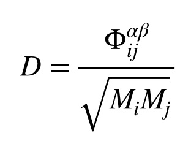
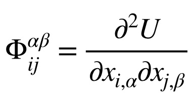

.. index:: dynamical\_matrix

dynamical\_matrix command
=========================

Syntax
""""""

.. parsed-literal::

   dynamical_matrix group-ID style gamma args keyword value ...

* group-ID = ID of group of atoms to displace
* style = *regular* or *eskm*
* gamma = finite different displacement length (distance units)
* one or more keyword/arg pairs may be appended
  
  .. parsed-literal::
  
       keyword = *file* or *binary*
         *file* name = name of output file for the dynamical matrix
         *binary* arg = *yes* or *no* or *gzip*

Examples
""""""""

.. parsed-literal::

   dynamical_matrix 1 regular 0.000001
   dynamical_matrix 1 eskm 0.000001
   dynamical_matrix 3 regular 0.00004 file dynmat.dat
   dynamical_matrix 5 eskm 0.00000001 file dynamical.dat binary yes

Description
"""""""""""

Calculate the dynamical matrix by finite difference of the selected group,

where D is the dynamical matrix and Phi is the force constant matrix defined by

The output for the dynamical matrix is printed three elements at a time. The
three elements are the three beta elements for a respective i/alpha/j combination. 
Each line is printed in order of j increasing first, alpha second, and i last.

If the style eskm is selected, the dynamical matrix will be in units of inverse squared
femtoseconds. These units will then conveniently leave frequencies in THz, where
frequencies, represented as omega, can be calculated from

:c, image(Eqs/dynamical\_matrix\_phonons.jpg)

Restrictions
""""""""""""

The command collects an array of nine times the number of atoms in a group
on every single MPI rank, so the memory requirements can be very significant
for large systems.

This command is part of the USER-PHONON package.  It is only enabled if
LAMMPS was built with that package.  See the :doc:`Build package <Build_package>` doc page for more info.

Related commands
""""""""""""""""

:doc:`fix phonon <fix_phonon>`

:doc:`compute hma <compute_hma>` uses an analytic formulation of the hessian
provided by Pair's single\_hessian.

Default
"""""""

The default settings are file = "dynmat.dyn", binary = no
