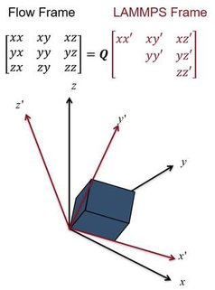

.. index:: fix nvt/uef

fix nvt/uef command
===================

fix npt/uef command
===================

Syntax
""""""

.. parsed-literal::

   fix ID group-ID style_name erate edot_x edot_y temp Tstart Tstop Tdamp keyword value ...

* ID, group-ID are documented in :doc:`fix <fix>` command
* style_name = *nvt/uef* or *npt/uef*
* *Tstart*\ , *Tstop*\ , and *Tdamp* are documented in the :doc:`fix npt <fix_nh>` command
* *edot_x* and *edot_y* are the strain rates in the x and y directions (1/(time units))
* one or more keyword/value pairs may be appended

  .. parsed-literal::

     keyword = *ext* or *strain* or *iso* or *x* or *y* or *z* or *tchain* or *pchain* or *tloop* or *ploop* or *mtk*
       *ext* value = *x* or *y* or *z* or *xy* or *yz* or *xz* = external dimensions
         sets the external dimensions used to calculate the scalar pressure
       *strain* values = e_x e_y = initial strain
         usually not needed, but may be needed to resume a run with a data file.
       *iso*\ , *x*\ , *y*\ , *z*\ , *tchain*\ , *pchain*\ , *tloop*\ , *ploop*\ , *mtk* keywords
         documented by the :doc:`fix npt <fix_nh>` command

Examples
""""""""

.. code-block:: LAMMPS

   fix uniax_nvt all nvt/uef temp 400 400 100 erate 0.00001 -0.000005
   fix biax_nvt all nvt/uef temp 400 400 100 erate 0.000005 0.000005
   fix uniax_npt all npt/uef temp 400 400 300 iso 1 1 3000 erate 0.00001 -0.000005 ext yz
   fix biax_npt all npt/uef temp 400 400 100 erate -0.00001 0.000005 x 1 1 3000

Description
"""""""""""

This fix can be used to simulate non-equilibrium molecular dynamics
(NEMD) under diagonal flow fields, including uniaxial and bi-axial
flow.  Simulations under continuous extensional flow may be carried
out for an indefinite amount of time.  It is an implementation of the
boundary conditions from :ref:`(Dobson) <Dobson>`, and also uses numerical
lattice reduction as was proposed by :ref:`(Hunt) <Hunt>`. The lattice
reduction algorithm is from :ref:`(Semaev) <Semaev>`. The fix is intended for
simulations of homogeneous flows, and integrates the SLLOD equations
of motion, originally proposed by Hoover and Ladd (see :ref:`(Evans and Morriss) <Sllod>`).  Additional detail about this implementation can be
found in :ref:`(Nicholson and Rutledge) <Nicholson>`.

Note that NEMD simulations of a continuously strained system can be
performed using the :doc:`fix deform <fix_deform>`, :doc:`fix nvt/sllod <fix_nvt_sllod>`, and :doc:`compute temp/deform <compute_temp_deform>` commands.

The applied flow field is set by the *eps* keyword. The values
*edot_x* and *edot_y* correspond to the strain rates in the xx and yy
directions.  It is implicitly assumed that the flow field is
traceless, and therefore the strain rate in the zz direction is eqal
to -(*edot_x* + *edot_y*).

.. note::

   Due to an instability in the SLLOD equations under extension,
   :doc:`fix momentum <fix_momentum>` should be used to regularly reset the
   linear momentum.

The boundary conditions require a simulation box that does not have a
consistent alignment relative to the applied flow field. Since LAMMPS
utilizes an upper-triangular simulation box, it is not possible to
express the evolving simulation box in the same coordinate system as
the flow field.  This fix keeps track of two coordinate systems: the
flow frame, and the upper triangular LAMMPS frame. The coordinate
systems are related to each other through the QR decomposition, as is
illustrated in the image below.

During most molecular dynamics operations, the system is represented
in the LAMMPS frame. Only when the positions and velocities are
updated is the system rotated to the flow frame, and it is rotated
back to the LAMMPS frame immediately afterwards. For this reason, all
vector-valued quantities (except for the tensors from
:doc:`compute pressure/uef <compute_pressure_uef>` and
:doc:`compute temp/uef <compute_temp_uef>`) will be computed in the
LAMMPS frame. Rotationally invariant scalar quantities like the
temperature and hydrostatic pressure are frame-invariant and will be
computed correctly. Additionally, the system is in the LAMMPS frame
during all of the output steps, and therefore trajectory files made
using the dump command will be in the LAMMPS frame unless the
:doc:`dump cfg/uef <dump_cfg_uef>` command is used.

----------

Temperature control is achieved with the default Nose-Hoover style
thermostat documented in :doc:`fix npt <fix_nh>`. When this fix is
active, only the peculiar velocity of each atom is stored, defined as
the velocity relative to the streaming velocity. This is in contrast
to :doc:`fix nvt/sllod <fix_nvt_sllod>`, which uses a lab-frame
velocity, and removes the contribution from the streaming velocity in
order to compute the temperature.

Pressure control is achieved using the default Nose-Hoover barostat
documented in :doc:`fix npt <fix_nh>`. There are two ways to control the
pressure using this fix. The first method involves using the *ext*
keyword along with the *iso* pressure style. With this method, the
pressure is controlled by scaling the simulation box isotropically to
achieve the average pressure only in the directions specified by
*ext*\ .  For example, if the *ext* value is set to *xy*\ , the average
pressure (Pxx+Pyy)/2 will be controlled.

This example command will control the total hydrostatic pressure under
uniaxial tension:

.. code-block:: LAMMPS

   fix f1 all npt/uef temp 0.7 0.7 0.5 iso 1 1 5 erate -0.5 -0.5 ext xyz

This example command will control the average stress in compression
directions, which would typically correspond to free surfaces under
drawing with uniaxial tension:

.. code-block:: LAMMPS

   fix f2 all npt/uef temp 0.7 0.7 0.5 iso 1 1 5 erate -0.5 -0.5 ext xy

The second method for pressure control involves setting the normal
stresses using the *x*\ , *y* , and/or *z* keywords. When using this
method, the same pressure must be specified via *Pstart* and *Pstop*
for all dimensions controlled. Any choice of pressure conditions that
would cause LAMMPS to compute a deviatoric stress are not permissible
and will result in an error. Additionally, all dimensions with
controlled stress must have the same applied strain rate. The *ext*
keyword must be set to the default value (\ *xyz*\ ) when using this
method.

For example, the following commands will work:

.. code-block:: LAMMPS

   fix f3 all npt/uef temp 0.7 0.7 0.5 x 1 1 5 y 1 1 5 erate -0.5 -0.5
   fix f4 all npt/uef temp 0.7 0.7 0.5 z 1 1 5 erate 0.5 0.5

The following commands will not work:

.. code-block:: LAMMPS

   fix f5 all npt/uef temp 0.7 0.7 0.5 x 1 1 5 z 1 1 5 erate -0.5 -0.5
   fix f6 all npt/uef temp 0.7 0.7 0.5 x 1 1 5 z 2 2 5 erate 0.5 0.5

----------

These fix computes a temperature and pressure each timestep.  To do
this, it creates its own computes of style "temp/uef" and
"pressure/uef", as if one of these two sets of commands had been
issued:

.. code-block:: LAMMPS

   compute fix-ID_temp group-ID temp/uef
   compute fix-ID_press group-ID pressure/uef fix-ID_temp

   compute fix-ID_temp all temp/uef
   compute fix-ID_press all pressure/uef fix-ID_temp

See the :doc:`compute temp/uef <compute_temp_uef>` and :doc:`compute pressure/uef <compute_pressure_uef>` commands for details.  Note
that the IDs of the new computes are the fix-ID + underscore + "temp"
or fix_ID + underscore + "press".

**Restart, fix_modify, output, run start/stop, minimize info:**

The fix writes the state of all the thermostat and barostat variables,
as well as the cumulative strain applied, to :doc:`binary restart files <restart>`.  See the :doc:`read_restart <read_restart>` command
for info on how to re-specify a fix in an input script that reads a
restart file, so that the operation of the fix continues in an
uninterrupted fashion.

.. note::

   It is not necessary to set the *strain* keyword when resuming a
   run from a restart file. Only for resuming from data files, which do
   not contain the cumulative applied strain, will this keyword be
   necessary.

This fix can be used with the :doc:`fix_modify <fix_modify>` *temp* and
*press* options. The temperature and pressure computes used must be of
type *temp/uef* and *pressure/uef*\ .

This fix computes the same global scalar and vector quantities as :doc:`fix npt <fix_nh>`.

The fix is not invoked during :doc:`energy minimization <minimize>`.

Restrictions
""""""""""""

This fix is part of the USER-UEF package. It is only enabled if LAMMPS
was built with that package. See the :doc:`Build package <Build_package>` doc page for more info.

Due to requirements of the boundary conditions, when the *strain*
keyword is set to zero (or unset), the initial simulation box must be
cubic and have style triclinic. If the box is initially of type ortho,
use :doc:`change_box <change_box>` before invoking the fix.

.. note::

   When resuming from restart files, you may need to use :doc:`box tilt large <box>` since lammps has internal criteria from lattice
   reduction that are not the same as the criteria in the numerical
   lattice reduction algorithm.

Related commands
""""""""""""""""

:doc:`fix nvt <fix_nh>`, :doc:`fix nvt/sllod <fix_nvt_sllod>`, :doc:`compute temp/uef <compute_temp_uef>`, :doc:`compute pressure/uef <compute_pressure_uef>`, :doc:`dump cfg/uef <dump_cfg_uef>`

Default
"""""""

The default keyword values specific to this fix are exy = xyz, strain
= 0 0.  The remaining defaults are the same as for *fix
npt*\ _fix_nh.html except tchain = 1.  The reason for this change is
given in :doc:`fix nvt/sllod <fix_nvt_sllod>`.

----------

.. _Dobson:

**(Dobson)** Dobson, J Chem Phys, 141, 184103 (2014).

.. _Hunt:

**(Hunt)** Hunt, Mol Simul, 42, 347 (2016).

.. _Semaev:

**(Semaev)** Semaev, Cryptography and Lattices, 181 (2001).

.. _Sllod:

**(Evans and Morriss)** Evans and Morriss, Phys Rev A, 30, 1528 (1984).

.. _Nicholson:

**(Nicholson and Rutledge)** Nicholson and Rutledge, J Chem Phys, 145,
244903 (2016).
