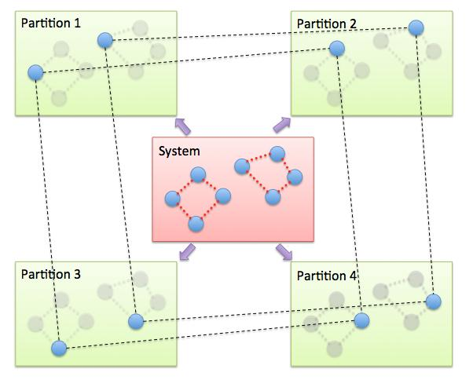

.. index:: fix pimd

fix pimd command
================

Syntax
""""""

.. parsed-literal::

   fix ID group-ID pimd keyword value ...

* ID, group-ID are documented in :doc:`fix <fix>` command
* pimd = style name of this fix command
* zero or more keyword/value pairs may be appended
* keyword = *method* or *fmass* or *sp* or *temp* or *nhc*

  .. parsed-literal::

       *method* value = *pimd* or *nmpimd* or *cmd*
       *fmass* value = scaling factor on mass
       *sp* value = scaling factor on Planck constant
       *temp* value = temperature (temperarate units)
       *nhc* value = Nc = number of chains in Nose-Hoover thermostat

Examples
""""""""

.. code-block:: LAMMPS

   fix 1 all pimd method nmpimd fmass 1.0 sp 2.0 temp 300.0 nhc 4

Description
"""""""""""

This command performs quantum molecular dynamics simulations based on
the Feynman path integral to include effects of tunneling and
zero-point motion.  In this formalism, the isomorphism of a quantum
partition function for the original system to a classical partition
function for a ring-polymer system is exploited, to efficiently sample
configurations from the canonical ensemble :ref:`(Feynman) <Feynman>`.
The classical partition function and its components are given
by the following equations:

.. math::

   Z = & \int d{\bf q} d{\bf p} \cdot \textrm{exp} [ -\beta H_{eff} ] \\
   H_{eff} = & \bigg(\sum_{i=1}^P \frac{p_i^2}{2m_i}\bigg) + V_{eff} \\
   V_{eff} = & \sum_{i=1}^P \bigg[ \frac{mP}{2\beta^2 \hbar^2} (q_i - q_{i+1})^2 + \frac{1}{P} V(q_i)\bigg]

The interested user is referred to any of the numerous references on
this methodology, but briefly, each quantum particle in a path
integral simulation is represented by a ring-polymer of P quasi-beads,
labeled from 1 to P.  During the simulation, each quasi-bead interacts
with beads on the other ring-polymers with the same imaginary time
index (the second term in the effective potential above).  The
quasi-beads also interact with the two neighboring quasi-beads through
the spring potential in imaginary-time space (first term in effective
potential).  To sample the canonical ensemble, a Nose-Hoover massive
chain thermostat is applied :ref:`(Tuckerman) <pimd-Tuckerman>`.  With the
massive chain algorithm, a chain of NH thermostats is coupled to each
degree of freedom for each quasi-bead.  The keyword *temp* sets the
target temperature for the system and the keyword *nhc* sets the
number *Nc* of thermostats in each chain.  For example, for a
simulation of N particles with P beads in each ring-polymer, the total
number of NH thermostats would be 3 x N x P x Nc.

.. note::

   This fix implements a complete velocity-verlet integrator
   combined with NH massive chain thermostat, so no other time
   integration fix should be used.

The *method* keyword determines what style of PIMD is performed.  A
value of *pimd* is standard PIMD.  A value of *nmpimd* is for
normal-mode PIMD.  A value of *cmd* is for centroid molecular dynamics
(CMD).  The difference between the styles is as follows.

In standard PIMD, the value used for a bead's fictitious mass is
arbitrary.  A common choice is to use Mi = m/P, which results in the
mass of the entire ring-polymer being equal to the real quantum
particle.  But it can be difficult to efficiently integrate the
equations of motion for the stiff harmonic interactions in the ring
polymers.

A useful way to resolve this issue is to integrate the equations of
motion in a normal mode representation, using Normal Mode
Path-Integral Molecular Dynamics (NMPIMD) :ref:`(Cao1) <Cao1>`.  In NMPIMD,
the NH chains are attached to each normal mode of the ring-polymer and
the fictitious mass of each mode is chosen as Mk = the eigenvalue of
the Kth normal mode for k > 0. The k = 0 mode, referred to as the
zero-frequency mode or centroid, corresponds to overall translation of
the ring-polymer and is assigned the mass of the real particle.

Motion of the centroid can be effectively uncoupled from the other
normal modes by scaling the fictitious masses to achieve a partial
adiabatic separation.  This is called a Centroid Molecular Dynamics
(CMD) approximation :ref:`(Cao2) <Cao2>`.  The time-evolution (and resulting
dynamics) of the quantum particles can be used to obtain centroid time
correlation functions, which can be further used to obtain the true
quantum correlation function for the original system.  The CMD method
also uses normal modes to evolve the system, except only the k > 0
modes are thermostatted, not the centroid degrees of freedom.

The keyword *fmass* sets a further scaling factor for the fictitious
masses of beads, which can be used for the Partial Adiabatic CMD
:ref:`(Hone) <Hone>`, or to be set as P, which results in the fictitious
masses to be equal to the real particle masses.

The keyword *sp* is a scaling factor on Planck's constant, which can
be useful for debugging or other purposes.  The default value of 1.0
is appropriate for most situations.

The PIMD algorithm in LAMMPS is implemented as a hyper-parallel scheme
as described in :ref:`(Calhoun) <Calhoun>`.  In LAMMPS this is done by using
:doc:`multi-replica feature <Howto_replica>` in LAMMPS, where each
quasi-particle system is stored and simulated on a separate partition
of processors.  The following diagram illustrates this approach.  The
original system with 2 ring polymers is shown in red.  Since each ring
has 4 quasi-beads (imaginary time slices), there are 4 replicas of the
system, each running on one of the 4 partitions of processors.  Each
replica (shown in green) owns one quasi-bead in each ring.

To run a PIMD simulation with M quasi-beads in each ring polymer using
N MPI tasks for each partition's domain-decomposition, you would use P
= MxN processors (cores) and run the simulation as follows:

.. code-block:: bash

   mpirun -np P lmp_mpi -partition MxN -in script

Note that in the LAMMPS input script for a multi-partition simulation,
it is often very useful to define a :doc:`uloop-style variable <variable>` such as

.. code-block:: LAMMPS

   variable ibead uloop M pad

where M is the number of quasi-beads (partitions) used in the
calculation.  The uloop variable can then be used to manage I/O
related tasks for each of the partitions, e.g.

.. code-block:: LAMMPS

   dump dcd all dcd 10 system_${ibead}.dcd
   restart 1000 system_${ibead}.restart1 system_${ibead}.restart2
   read_restart system_${ibead}.restart2

Restrictions
""""""""""""

This fix is part of the USER-MISC package.  It is only enabled if
LAMMPS was built with that package.  See the :doc:`Build package <Build_package>` doc page for more info.

A PIMD simulation can be initialized with a single data file read via
the :doc:`read_data <read_data>` command.  However, this means all
quasi-beads in a ring polymer will have identical positions and
velocities, resulting in identical trajectories for all quasi-beads.
To avoid this, users can simply initialize velocities with different
random number seeds assigned to each partition, as defined by the
uloop variable, e.g.

.. code-block:: LAMMPS

   velocity all create 300.0 1234${ibead} rot yes dist gaussian

Default
"""""""

The keyword defaults are method = pimd, fmass = 1.0, sp = 1.0, temp = 300.0,
and nhc = 2.

----------

.. _Feynman:

**(Feynman)** R. Feynman and A. Hibbs, Chapter 7, Quantum Mechanics and
Path Integrals, McGraw-Hill, New York (1965).

.. _pimd-Tuckerman:

**(Tuckerman)** M. Tuckerman and B. Berne, J Chem Phys, 99, 2796 (1993).

.. _Cao1:

**(Cao1)** J. Cao and B. Berne, J Chem Phys, 99, 2902 (1993).

.. _Cao2:

**(Cao2)** J. Cao and G. Voth, J Chem Phys, 100, 5093 (1994).

.. _Hone:

**(Hone)** T. Hone, P. Rossky, G. Voth, J Chem Phys, 124,
154103 (2006).

.. _Calhoun:

**(Calhoun)** A. Calhoun, M. Pavese, G. Voth, Chem Phys Letters, 262,
415 (1996).
