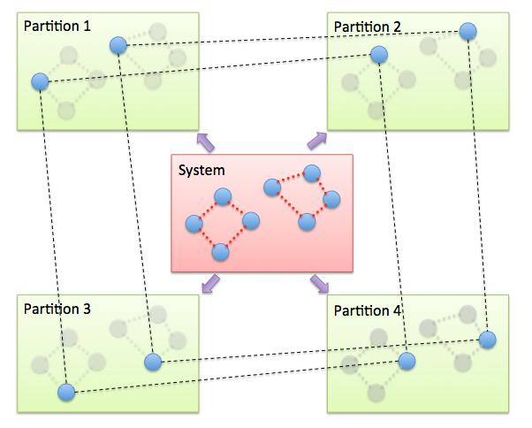

.. index:: fix pimd/langevin
.. index:: fix pimd/nvt
.. index:: fix pimd/langevin/bosonic
.. index:: fix pimd/nvt/bosonic

fix pimd/langevin command
=========================

fix pimd/nvt command
====================

fix pimd/langevin/bosonic command
=================================

fix pimd/nvt/bosonic command
============================

Syntax
""""""

.. code-block:: LAMMPS

   fix ID group-ID style keyword value ...

* ID, group-ID are documented in :doc:`fix <fix>` command
* style = *pimd/langevin* or *pimd/nvt* or *pimd/langevin/bosonic* or *pimd/nvt/bosonic* = style name of this fix command
* zero or more keyword/value pairs may be appended
* keywords for style *pimd/nvt*

  .. parsed-literal::

     *keywords* = *method* or *fmass* or *sp* or *temp* or *nhc*
     *method* value = *pimd* or *nmpimd* or *cmd*
     *fmass* value = scaling factor on mass
     *sp* value = scaling factor on Planck constant
     *temp* value = temperature (temperature units)
     *nhc* value = Nc = number of chains in Nose-Hoover thermostat

* keywords for style *pimd/langevin*

  .. parsed-literal::

     *keywords* = *method* or *integrator* or *ensemble* or *fmmode* or *fmass* or *scale* or *sp* or *temp* or *thermostat* or *tau* or *iso* or *aniso* or *x* or *y* or *z* or *barostat* or *taup* or *fixcom* or *esynch*
     *method* value = *nmpimd* (default) or *pimd*
     *integrator* value = *obabo* or *baoab*
     *ensemble* value = *nvt* or *nve* or *nph* or *npt*
     *fmmode* value = *physical* or *normal*
     *fmass* value = scaling factor on mass
     *sp* value = scaling factor on Planck constant
     *temp* value = temperature (temperature unit)
          temperature = target temperature of the thermostat
     *thermostat* values = style seed
          style value = *PILE_L*
          seed = random number generator seed
     *tau* value = thermostat damping parameter (time unit)
     *scale* value = scaling factor of the damping rates of non-centroid modes of PILE_L thermostat
     *iso* or *aniso* values = pressure (pressure unit)
         pressure = scalar external pressure of the barostat
     *x* or *y* or *z* values = pressure (pressure unit)
         pressure = external pressure for the selected diagonal component
     *barostat* value = *BZP*
     *taup* value = barostat damping parameter (time unit)
     *fixcom* value = *yes* or *no*
     *esynch* value = *yes* or *no* (only in *pimd/langevin/bosonic*)

Examples
""""""""

.. code-block:: LAMMPS

   fix 1 all pimd/nvt method nmpimd fmass 1.0 sp 2.0 temp 300.0 nhc 4
   fix 1 all pimd/langevin ensemble npt integrator obabo temp 113.15 thermostat PILE_L 1234 tau 1.0 iso 1.0 barostat BZP taup 1.0
   fix 1 all pimd/nvt/bosonic method pimd fmass 1.0 sp 1.0 temp 2.0 nhc 4
   fix 1 all pimd/langevin/bosonic integrator obabo temp 113.15 thermostat PILE_L 1234 tau 1.0

Example input files are provided in the examples/PACKAGES/pimd and examples/PACKAGES/pimd_bosonic directories.

Description
"""""""""""

.. versionchanged:: 28Mar2023

Fix pimd was renamed to fix *pimd/nvt* and fix *pimd/langevin* was added.

These fix commands perform quantum molecular dynamics simulations based
on the Feynman path-integral to include effects of tunneling and
zero-point motion.  In this formalism, the isomorphism of a quantum
partition function for the original system to a classical partition
function for a ring-polymer system is exploited, to efficiently sample
configurations from the canonical ensemble :ref:`(Feynman) <Feynman>`.

.. versionadded:: 2Apr2025

   Fix *pimd/langevin/bosonic* and *pimd/nvt/bosonic* were added.

Fix *pimd/nvt* and fix *pimd/langevin* simulate *distinguishable* quantum particles.
Simulations of bosons, including exchange effects, are supported with the
fix *pimd/langevin/bosonic* and the *pimd/nvt/bosonic* commands.

For distinguishable particles, the isomorphic classical partition function and its components are given
by the following equations:

.. math::

   Z = & \int d\mathbf{q} d\mathbf{p} \cdot \textrm{exp} [ -\beta H_{eff} ] \\
   H_{eff} = & \bigg(\sum_{i=1}^P \frac{p_i^2}{2M_i}\bigg) + V_{eff} \\
   V_{eff} = & \sum_{i=1}^P \bigg[ \frac{mP}{2\beta^2 \hbar^2} (q_i - q_{i+1})^2 + \frac{1}{P} V(q_i)\bigg]

:math:`M_i` is the fictitious mass of the :math:`i`-th mode, and m is the actual mass of the atoms.

The interested user is referred to any of the numerous references on
this methodology, but briefly, each quantum particle in a path integral
simulation is represented by a ring-polymer of P quasi-beads, labeled
from 1 to P.  During the simulation, each quasi-bead interacts with
beads on the other ring-polymers with the same imaginary time index (the
second term in the effective potential above).  The quasi-beads also
interact with the two neighboring quasi-beads through the spring
potential in imaginary-time space (first term in effective potential).

For bosons, the method of Hirshberg et. al. :ref:`(Hirshberg1) <Hirshberg>` is employed, which replaces the spring part of :math:`V_{eff}` by the spring potential :math:`V^{[1,N]}` defined through recurrence relation:

.. math::

   e ^ { -\beta  V^{[1,N]} } = & \frac{1}{N} \sum_{k=1}^N e ^ { -\beta \left(  V^{[1,N-k]} + E^{[N-K+1,N]} \right)} \\
   e ^ { -\beta  V^{[1,0]}} = & 1

Here, :math:`E^{[N-K+1,N]}` is the spring energy of the ring polymer
obtained by connecting the beads of particles :math:`N - k + 1, N - k +
2, ..., N` in a cycle.
The implementation of the potential and forces evaluation uses the algorithm developed by Feldman and Hirshberg, which scales like :math:`N^2+PN`
:ref:`(Feldman) <Feldman>`.
The minimum-image convention is employed on
the springs to account for periodic boundary conditions; an elaborate
discussion of the validity of the approximation is available in
:ref:`(Higer) <HigerFeldman>`.

To sample the canonical ensemble, any thermostat can be applied.

Fix *pimd/nvt* applies a Nose-Hoover massive chain thermostat
:ref:`(Tuckerman3) <pimd-Tuckerman>`.  With the massive chain
algorithm, a chain of NH thermostats is coupled to each degree of
freedom for each quasi-bead.  The keyword *temp* sets the target
temperature for the system and the keyword *nhc* sets the number *Nc* of
thermostats in each chain.  For example, for a simulation of N particles
with P beads in each ring-polymer, the total number of NH thermostats
would be 3 x N x P x Nc.

Fix *pimd/langevin* implements a Langevin thermostat in the normal mode
representation, and also provides a barostat to sample the NPH/NPT ensembles.

.. note::

   Both these *fix* styles implement a complete velocity-verlet integrator
   combined with a thermostat, so no other time integration fix should be used.

The *method* keyword determines what style of PIMD is performed.  A
value of *pimd* is standard PIMD.  A value of *nmpimd* is for
normal-mode PIMD.  A value of *cmd* is for centroid molecular dynamics
(CMD).  The difference between the styles is as follows.

   In standard PIMD, the value used for a bead's fictitious mass is
   arbitrary.  A common choice is to use :math:`M_i = m/P`, which results in the
   mass of the entire ring-polymer being equal to the real quantum
   particle.  But it can be difficult to efficiently integrate the
   equations of motion for the stiff harmonic interactions in the ring
   polymers.

   A useful way to resolve this issue is to integrate the equations of
   motion in a normal mode representation, using Normal Mode
   Path-Integral Molecular Dynamics (NMPIMD) :ref:`(Cao1) <Cao1>`.  In
   NMPIMD, the NH chains are attached to each normal mode of the
   ring-polymer and the fictitious mass of each mode is chosen as Mk =
   the eigenvalue of the Kth normal mode for k > 0. The k = 0 mode,
   referred to as the zero-frequency mode or centroid, corresponds to
   overall translation of the ring-polymer and is assigned the mass of
   the real particle.

.. note::

   Motion of the centroid can be effectively uncoupled from the other
   normal modes by scaling the fictitious masses to achieve a partial
   adiabatic separation.  This is called a Centroid Molecular Dynamics
   (CMD) approximation :ref:`(Cao2) <Cao2>`.  The time-evolution (and
   resulting dynamics) of the quantum particles can be used to obtain
   centroid time correlation functions, which can be further used to
   obtain the true quantum correlation function for the original system.
   The CMD method also uses normal modes to evolve the system, except
   only the k > 0 modes are thermostatted, not the centroid degrees of
   freedom.

.. versionadded:: 21Nov2023

   Mode *pimd* added to fix pimd/langevin.

Fix pimd/langevin supports the *method* values *nmpimd* and *pimd*. The
default value is *nmpimd*.  If *method* is *nmpimd*, the normal mode
representation is used to integrate the equations of motion.  The exact
solution of harmonic oscillator is used to propagate the free ring
polymer part of the Hamiltonian.  If *method* is *pimd*, the Cartesian
representation is used to integrate the equations of motion.  The
harmonic force is added to the total force of the system, and the
numerical integrator is used to propagate the Hamiltonian. The *scale*
keyword is not available with *method*=*pimd*, regardless of keyword
ordering.

Fix *pimd/nvt/bosonic* only supports the *pimd* and *nmpimd*
methods. Fix *pimd/langevin/bosonic* only supports the *pimd* method,
which is the default in this fix. These restrictions are related to the
use of normal modes, which change in bosons.

The keyword *integrator* specifies the Trotter splitting method used by *fix
pimd/langevin*.  See :ref:`(Liu3) <Liu>` for a discussion on the OBABO and BAOAB
splitting schemes. Typically either of the two should work fine.

The keyword *fmass* sets a further scaling factor for the fictitious
masses of beads, which can be used for the Partial Adiabatic CMD
:ref:`(Hone) <Hone>`, or to be set as P, which results in the fictitious
masses to be equal to the real particle masses. For all listed fix styles,
*fmass* must be greater than zero and no larger than the number of beads P.

The keyword *fmmode* of *fix pimd/langevin* determines the mode of fictitious
mass preconditioning. There are two options: *physical* and *normal*. If *fmmode* is
*physical*, then the physical mass of the particles are used (and then multiplied by
*fmass*). If *fmmode* is *normal*, then the physical mass is first multiplied by the
eigenvalue of each normal mode, and then multiplied by *fmass*. More precisely, the
fictitious mass of *fix pimd/langevin* is determined by two factors: *fmmode* and *fmass*.
If *fmmode* is *physical*, then the fictitious mass is

.. math::

   M_i = \mathrm{fmass} \times m

If *fmmode* is *normal*, then the fictitious mass is

.. math::

   M_i = \mathrm{fmass} \times \lambda_i \times m

where :math:`\lambda_i` is the eigenvalue of the :math:`i`-th normal mode.

In *pimd/langevin/bosonic*, *fmmode* should not be used, and would raise
an error if set to a value other than *physical*, due to the lack of
support for bosonic normal modes.

.. note::

   Fictitious mass is only used in the momentum of the equation of motion
   (:math:`\mathbf{p}_i=M_i\mathbf{v}_i`), and not used in the spring elastic energy
   (:math:`\sum_{i=1}^P \frac{1}{2}m\omega_P^2(q_i - q_{i+1})^2`, :math:`m` is always the
   actual mass of the particles).

.. versionchanged:: 10Dec2025

   *sp* keyword added to *fix pimd/langevin*

The keyword *sp* is a scaling factor on Planck's constant. Scaling the
Planck's constant means modifying the "quantumness" of the PIMD
simulation. Using the physical value of Planck's constant corresponds to
a fully quantum simulation, while the classical limit is approached as
*sp* tends to zero. The exact value zero is not supported because the
ring-polymer spring frequency contains the inverse of Planck's constant;
*sp* must be positive. An exactly classical simulation should use a
non-PIMD integration fix instead. For unit styles other than *lj*, the
default value of 1.0 is appropriate for most situations.  For *lj* units,
a fully quantum simulation
translates into setting *sp* to the de Boer quantumness parameter
:math:`\Lambda^{\ast}` (see :ref:`de Boer <de Boer>`):

.. math::

   \Lambda^{\ast}=h/\sigma\sqrt{m\varepsilon}

where :math:`h` is Planck's constant, :math:`\sigma` is the length
scale, :math:`\epsilon` is the energy scale, and :math:`m` is the mass
of the particles.  For example, for Neon, :math:`m = 20.1797` Dalton,
:math:`\varepsilon = 3.0747 \times 10^{-3}` eV and :math:`\sigma =
2.7616 \AA`. Then we have

.. math::

   \Lambda^{\ast} = \frac{4.135667403\times 10^{-3}\ \mathrm{eV} \cdot\ \mathrm{ps}}{2.7616\ \mathrm{\AA}\times \sqrt{20.1797\ \mathrm{Dalton}\times\ 3.0747\times 10^{-3}\ \mathrm{eV}\times 1.0364269\times 10^{-4}\ \mathrm{eV}\cdot\mathrm{Dalton}^{-1}\cdot\mathrm{\AA}^{-2}\cdot\mathrm{ps}^{2}}} = 0.600.

Thus for a fully quantum simulation of Neon using *lj* units, *sp*
should be set to 0.600.  The modification of the quantumness should be
done by scaling :math:`\Lambda^{\ast}`.

The keyword *ensemble* for fix style *pimd/langevin* determines which
ensemble is it going to sample. The value can be *nve* (microcanonical),
*nvt* (canonical), *nph* (isoenthalpic), and *npt*
(isothermal-isobaric).  Fix *pimd/langevin/bosonic* currently does not
support *ensemble* other than *nve*, *nvt*.

When :doc:`fix plumed <fix_plumed>` uses a *path_integral* mode, normal-mode
PIMD supports the NVT, NPH, and NPT ensembles.  For *centroid*, the Cartesian
centroid passed to PLUMED is :math:`\mathbf{q}_0/\sqrt{P}` and the returned
force on the zero mode is :math:`\sqrt{P}\mathbf{F}_c`; every non-centroid
mode receives zero bias force.  For *bead_mean* and *bead_density*, PLUMED
evaluates Cartesian bead coordinates and the complete Cartesian force is
transformed, so nonlinear collective variables can exert nonzero forces on
internal modes.  The physical bias :math:`U_B` enters the dynamical
Hamiltonian as :math:`P U_B` because this integrator uses inverse temperature
:math:`\beta/P`.  Bead-mean force increments and virials therefore include
a factor :math:`P` relative to PLUMED's averaged-CV derivatives.  Bead-density
uses unscaled local bias forces and virials, while reporting their mean
physical bias energy once on partition zero.  Physical forces are unchanged.
In NVT the current-step bias virial
contributes to the reported centroid pressure but does not activate a
barostat or update the cell.  NPH and NPT additionally use that pressure in
their BZP barostat path.  Normal-mode NVE path-integral coupling is not
supported.

For these NMPIMD path-integral modes, ``fix plumed`` must be the last fix with
a post-force callback.  Define any other such fixes before it so their
Cartesian force contributions are included in the complete transformation.

The keyword *temp* specifies temperature parameter for fix styles
*pimd/nvt* and *pimd/langevin*. It must be a positive floating-point
number; zero is rejected before initialization.

.. note::

   For pimd simulations, a temperature values should be specified even
   for nve ensemble. Temperature will make a difference for nve pimd,
   since the spring elastic frequency between the beads will be affected
   by the temperature.

The keyword *thermostat* reads *style* and *seed* of thermostat for fix
style *pimd/langevin*.  *style* can only be *PILE_L* (path integral
Langevin equation local thermostat, as described in :ref:`Ceriotti3
<Ceriotti3>`), and *seed* should be a positive integer, which serves
as the seed of the pseudo random number generator. A positive seed must be
provided for the thermostatted *nvt* and *npt* ensembles.

.. note::

   The fix style *pimd/langevin* uses the stochastic PILE_L thermostat to control temperature. This thermostat works on the normal modes
   of the ring polymer. The *tau* parameter controls the centroid mode, and the *scale* parameter controls the non-centroid modes.

The keyword *tau* specifies the thermostat damping time parameter for
fix style *pimd/langevin*. It is in time units and only controls the
centroid mode. For a positive value, the centroid damping rate is
:math:`\gamma_0=1/\mathrm{tau}`. For a non-positive value, the default
:math:`\gamma_0=P/(\beta\hbar)` is used, corresponding to the effective
damping time :math:`\beta\hbar/P`.

The keyword *scale* specifies a scaling parameter for the damping rates
of the non-centroid modes for fix style *pimd/langevin*. For a
non-centroid mode :math:`i`, the damping rate is
:math:`\gamma_i=2\,\mathrm{scale}\,\omega_i`. Therefore, its damping
time is

.. math::

   \tau_i = \frac{\beta\hbar\sqrt{\mathrm{fmass}}}
   {2\,\mathrm{scale}\,P\sqrt{\lambda_i}}

when *fmmode* is *physical*, and

.. math::

   \tau_i = \frac{\beta\hbar\sqrt{\mathrm{fmass}}}
   {2\,\mathrm{scale}\,P}

when *fmmode* is *normal*. A value of zero sets :math:`\gamma_i=0`,
:math:`\tau_i=\infty`, :math:`c_{1,i}=1`, and :math:`c_{2,i}=0` for all
non-centroid modes. Thus it disables their stochastic damping while the
centroid thermostat remains active. Negative values are not allowed.
This keyword should be used only with *method*=*nmpimd*.

.. versionchanged:: TBD

The pressure-control parameters for fix style *pimd/langevin* with the
*npt* or *nph* ensemble are specified using *iso*, *aniso*, or any
combination of the *x*, *y*, and *z* keywords. A *pressure* value should
be given in pressure units. The keyword *iso* couples all three diagonal
components when pressure is computed (hydrostatic pressure) and
dilates/contracts the dimensions together. The keyword *aniso* controls
the x, y, and z dimensions independently using the Pxx, Pyy, and Pzz
components of the stress tensor as the driving forces and one common
external pressure. For the BZP barostat, the *x*, *y*, and *z* keywords
select dimensions independently and assign a separate external pressure
to each selected diagonal component. Dimensions without a target are
not dilated or contracted. If a pressure keyword is repeated, its last
specified pressure is used and the selected dimension is counted once.
These parameters are not supported in
*pimd/langevin/bosonic*.

The keyword *barostat* reads *style* of barostat for fix style
*pimd/langevin*. Currently, only *BZP* (Bussi-Zykova-Parrinello, as
described in :ref:`Bussi <Bussi>`) is supported. The *MTTK*
(Martyna-Tuckerman-Tobias-Klein) style is rejected because this fix does
not implement the required state and simulation-box propagation.
The BZP coordinate propagator evaluates its zero barostat-velocity limit
analytically, so an instantaneous zero barostat velocity remains a valid,
finite state.

The keyword *taup* specifies the barostat damping time parameter for fix
style *pimd/langevin*. It is in time unit. It is not supported in
*pimd/langevin/bosonic*.

The keyword *fixcom* specifies whether the center-of-mass of the
extended ring-polymer system is fixed during the pimd simulation.  Once
*fixcom* is set to be *yes*, the center-of-mass velocity will be
subtracted from the centroid-mode velocities in each step. The value must
be either *yes* or *no*.

Fix *pimd/langevin/bosonic* also has a keyword not available in fix
*pimd/langevin*: *esynch*, with default *yes*. If set to *no*, some time
consuming synchronization of spring energies and the primitive kinetic
energy estimator between processors is avoided.

The PIMD algorithm in LAMMPS is implemented as a hyper-parallel scheme
as described in :ref:`Calhoun <Calhoun>`.  In LAMMPS this is done by
using :doc:`multi-replica feature <Howto_replica>` in LAMMPS, where each
quasi-particle system is stored and simulated on a separate partition of
processors.  The following diagram illustrates this approach.  The
original system with 2 ring polymers is shown in red.  Since each ring
has 4 quasi-beads (imaginary time slices), there are 4 replicas of the
system, each running on one of the 4 partitions of processors.  Each
replica (shown in green) owns one quasi-bead in each ring.

To run a PIMD simulation with M quasi-beads in each ring polymer using N
MPI tasks for each partition's domain-decomposition, you would use P =
MxN processors (cores) and run the simulation as follows:

.. code-block:: bash

   mpirun -np P lmp_mpi -partition MxN -in script

Note that in the LAMMPS input script for a multi-partition simulation,
it is often very useful to define a :doc:`uloop-style variable
<variable>` such as

.. code-block:: LAMMPS

   variable ibead uloop M pad

where M is the number of quasi-beads (partitions) used in the
calculation.  The uloop variable can then be used to manage I/O related
tasks for each of the partitions, e.g.

.. code-block:: LAMMPS

   dump dcd all dcd 10 system_${ibead}.dcd
   dump 1 all custom 100 ${ibead}.xyz id type x y z vx vy vz ix iy iz fx fy fz
   restart 1000 system_${ibead}.restart1 system_${ibead}.restart2
   read_restart system_${ibead}.restart2

.. note::

   Fix *pimd/langevin* dumps the Cartesian coordinates, but dumps the
   velocities and forces in the normal mode representation. If the
   Cartesian velocities and forces are needed, it is easy to perform the
   transformation when doing post-processing.

   It is recommended to dump the image flags (*ix iy iz*) for fix
   *pimd/langevin*. It will be useful if you want to calculate some
   estimators during post-processing.

Major differences of *fix pimd/nvt* and *fix pimd/langevin* are:

   #. *Fix pimd/nvt* includes Cartesian pimd, normal mode pimd, and centroid md. *Fix pimd/langevin* only intends to support normal mode pimd, as it is commonly enough for thermodynamic sampling.
   #. *Fix pimd/nvt* uses Nose-Hoover chain thermostat. *Fix pimd/langevin* uses Langevin thermostat.
   #. *Fix pimd/langevin* provides barostat, so the npt ensemble can be sampled. *Fix pimd/nvt* only support nvt ensemble.
   #. *Fix pimd/langevin* provides several quantum estimators in output.
   #. *Fix pimd/langevin* allows multiple processes for each bead. For *fix pimd/nvt*, there is a large chance that multi-process tasks for each bead may fail.
   #. The dump of *fix pimd/nvt* are all Cartesian. *Fix pimd/langevin* dumps normal-mode velocities and forces, and Cartesian coordinates.

Initially, the inter-replica communication and normal mode
transformation parts of *fix pimd/langevin* are written based on those
of *fix pimd/nvt*, but are significantly revised.

Restart, fix_modify, output, run start/stop, minimize info
"""""""""""""""""""""""""""""""""""""""""""""""""""""""""""

.. versionchanged:: TBD

Restart files from versions that stored only the six barostat variables can
be read, but do not contain the thermostat random-number state. A warning is
printed when such a file is used with a thermostat; stochastic trajectory
continuity is not available in that case. Restoring the random-number state
from newer files requires the same number of MPI processes per partition.

Fix *pimd/nvt* writes the state of the Nose/Hoover thermostat over all
quasi-beads to :doc:`binary restart files <restart>`.  See the
:doc:`read_restart <read_restart>` command for info on how to re-specify
a fix in an input script that reads a restart file, so that the
operation of the fix continues in an uninterrupted fashion.

Fix *pimd/langevin* writes the state of the barostat over all beads and
the complete per-process PILE_L random-number state to :doc:`binary
restart files <restart>`.  This includes a cached Gaussian variate, so
the PILE_L random-number sequence is continued exactly when the restart
uses the same LAMMPS executable and the same number of MPI processes per bead.
If the process count changes, the barostat is restored but LAMMPS emits
a warning and retains the newly initialized random-number state.

None of the :doc:`fix_modify <fix_modify>` options are relevant to fix
pimd/nvt.

Fix *pimd/nvt* computes a global 3-vector, which can be accessed by
various :doc:`output commands <Howto_output>`.  The three quantities in
the global vector are:

   #. the total spring energy of the quasi-beads,
   #. the current temperature of the classical system of ring polymers,
   #. the current value of the scalar virial estimator for the kinetic
      energy of the quantum system :ref:`(Herman) <Herman>`.

The vector values calculated by fix *pimd/nvt* are "extensive", except for the
temperature, which is "intensive".
The three values are reduced across all bead partitions and their MPI tasks,
so they do not depend on how atoms are assigned to processors.

Fix *pimd/nvt/bosonic* computes a global 4-vector. The first three are
the same as in *pimd/nvt* (the justification for the correctness of the
virial estimator for bosons appears in the supporting information of
:ref:`(Hirshberg2) <HirshbergInvernizzi>`). The fourth is the current
value of the scalar primitive estimator for the kinetic energy of the
quantum system :ref:`(Hirshberg1) <Hirshberg>`.

Fix *pimd/langevin* computes a global vector of quantities, which can be
accessed by various :doc:`output commands <Howto_output>`. Note that it
outputs multiple log files, and different log files contain information
about different beads or modes (see detailed explanations below). If
*ensemble* is *nve* or *nvt*, the vector has 10 values:

   #. kinetic energy of the bead (if *method*=*pimd*) or normal mode (if *method*=*nmpimd*)
   #. spring elastic energy of the bead (if *method*=*pimd*) or normal mode (if *method*=*nmpimd*)
   #. potential energy of the bead
   #. total energy of all beads (conserved if *ensemble* is *nve*)
   #. primitive kinetic energy estimator
   #. virial energy estimator
   #. centroid-virial energy estimator
   #. primitive pressure estimator
   #. thermodynamic pressure estimator
   #. centroid-virial pressure estimator

The first 3 are different for different log files, and the others are
the same for different log files.
The first 7 values are "extensive", while the three pressure estimators
are "intensive".

If *ensemble* is *nph* or *npt*, the vector stores internal variables of
the barostat. If *iso* is used, the vector has 15 values:

   #. kinetic energy of the normal mode
   #. spring elastic energy of the normal mode
   #. potential energy of the bead
   #. total energy of all beads (conserved if *ensemble* is *nve*)
   #. primitive kinetic energy estimator
   #. virial energy estimator
   #. centroid-virial energy estimator
   #. primitive pressure estimator
   #. thermodynamic pressure estimator
   #. centroid-virial pressure estimator
   #. barostat velocity
   #. barostat kinetic energy
   #. barostat potential energy
   #. barostat cell Jacobian
   #. enthalpy of the extended system (sum of 4, 12, 13, and 14; conserved if *ensemble* is *nph*)

If *aniso* or *x* or *y* or *z* is used for the barostat, the vector has
17 values:

   #. kinetic energy of the normal mode
   #. spring elastic energy of the normal mode
   #. potential energy of the bead
   #. total energy of all beads (conserved if *ensemble* is *nve*)
   #. primitive kinetic energy estimator
   #. virial energy estimator
   #. centroid-virial energy estimator
   #. primitive pressure estimator
   #. thermodynamic pressure estimator
   #. centroid-virial pressure estimator
   #. x component of barostat velocity
   #. y component of barostat velocity
   #. z component of barostat velocity
   #. barostat kinetic energy
   #. barostat potential energy
   #. barostat cell Jacobian
   #. enthalpy of the extended system (sum of 4, 14, 15, and 16; conserved if *ensemble* is *nph*)

The barostat velocity components are "intensive".  The barostat kinetic
and potential energies, cell Jacobian, and extended-system enthalpy are
"extensive".

Fix *pimd/langevin/bosonic* computes a global 6-vector. The quantities
in the global vector are:

   #. kinetic energy of the beads,
   #. spring elastic energy of the beads,
   #. potential energy of the bead,
   #. total energy of all beads (conserved if *ensemble* is *nve*) if *esynch* is *yes*
   #. primitive kinetic energy estimator :ref:`(Hirshberg1) <Hirshberg>`
   #. virial energy estimator :ref:`(Herman) <Herman>` (see the justification in the supporting information of :ref:`(Hirshberg2) <HirshbergInvernizzi>`).

The first three are different for different log files, and the others
are the same for different log files, except for the primitive kinetic
energy estimator when setting *esynch* to *no*. Then, the primitive
kinetic energy estimator is obtained by summing over all log files.
Also note that when *esynch* is set to *no*, the fourth output gives the
total energy of all beads excluding the spring elastic energy; the total
classical energy can then be obtained by adding the sum of second output
over all log files.  All vector values calculated by fix
*pimd/langevin/bosonic* are "extensive".

For both *pimd/nvt/bosonic* and *pimd/langevin/bosonic*, the
contribution of the exterior spring to the primitive estimator is
printed to the first log file.  The contribution of the :math:`P-1`
interior springs is printed to the other :math:`P-1` log files.  The
contribution of the constant :math:`\frac{PdN}{2 \beta}` (with :math:`d`
being the dimensionality) is equally divided over log files.

No parameter of fix *pimd/nvt* or *pimd/langevin* can be used with the
*start/stop* keywords of the :doc:`run <run>` command.  Fix *pimd/nvt*
or *pimd/langevin* is not invoked during :doc:`energy minimization
<minimize>`.

Restrictions
""""""""""""

These fixes are part of the REPLICA package.  They are only enabled if
LAMMPS was built with that package.  See the :doc:`Build package
<Build_package>` page for more info.

Fix *pimd/nvt* cannot be used with :doc:`lj units <units>`.
Fix *pimd/langevin* can be used with :doc:`lj units <units>`.
See the documentation above for how to use it.

.. versionchanged:: 30Sep2026

Fixes *pimd/nvt* and *pimd/nvt/bosonic* require at least two beads,
i.e. running with the :doc:`-partition <Run_options>` command-line
switch, and stop with an error otherwise.  A ring polymer of a single
bead has no neighboring beads to couple to.

Fix *pimd/nvt*, *pimd/nvt/bosonic*, and *pimd/langevin/bosonic* require
the group-ID to be *all*.  The non-bosonic *pimd/langevin* style supports
a static group other than *all*, but every bead partition must assign the
same group membership to each atom ID.  Dynamic groups are not supported.

All four fix styles documented on this page require a three-dimensional
system.  All bead partitions must contain the same number of MPI
processes and atoms. They must also assign the same atom type to every
atom ID and use the same per-type atom masses, simulation cell geometry,
and boundary settings.  Atom styles with per-atom masses, such as
:doc:`sphere <atom_style>`, are not supported.

Only some combinations of fix styles and their options support
partitions with multiple processors.  LAMMPS will stop with an error if
multi-processor partitions are not supported.
Supported multi-processor partitions may assign the same atom ID to
different MPI ranks in different beads, and that ownership may change
during a run.

A PIMD simulation can be initialized with a single data file read via
the :doc:`read_data <read_data>` command.  However, this means all
quasi-beads in a ring polymer will have identical positions and
velocities, resulting in identical trajectories for all quasi-beads.  To
avoid this, users can simply initialize velocities with different random
number seeds assigned to each partition, as defined by the uloop
variable, e.g.

.. code-block:: LAMMPS

   velocity all create 300.0 1234${ibead} rot yes dist gaussian

Related commands
""""""""""""""""

:doc:`fix ipi <fix_ipi>`

Default
"""""""

The keyword defaults for fix *pimd/nvt* are method = pimd, fmass = 1.0,
sp = 1.0, temp = 300.0, and nhc = 2.

The keyword defaults for fix *pimd/langevin* are integrator = obabo,
method = nmpimd, ensemble = nvt, fmmode = physical, fmass = 1.0, scale =
1, temp = 298.15, thermostat = PILE_L, tau = 1.0, iso = 1.0, taup = 1.0,
barostat = BZP, fixcom = yes, and sp = 1.0 for all its arguments.
The PILE_L thermostat style is the default, but its random seed has no
default.  The *thermostat* keyword with a positive seed is required when
*ensemble* is *nvt* or *npt*.

----------

.. _Feynman:

**(Feynman)** R. Feynman and A. Hibbs, Chapter 7, Quantum Mechanics and
Path Integrals, McGraw-Hill, New York (1965).

.. _pimd-Tuckerman:

**(Tuckerman3)** M. Tuckerman and B. Berne, J Chem Phys, 99, 2796 (1993).

.. _Cao1:

**(Cao1)** J. Cao and B. Berne, J Chem Phys, 99, 2902 (1993).

.. _Cao2:

**(Cao2)** J. Cao and G. Voth, J Chem Phys, 100, 5093 (1994).

.. _de Boer:

**(de Boer)** J. de Boer, "Quantum Effects and Exchange Effects on the Thermodynamic Properties of Liquid Helium," Progress in Low Temperature Physics, Volume 2, Pages 1-58 (1957).

.. _Hone:

**(Hone)** T. Hone, P. Rossky, G. Voth, J Chem Phys, 124,
154103 (2006).

.. _Calhoun:

**(Calhoun)** A. Calhoun, M. Pavese, G. Voth, Chem Phys Letters, 262,
415 (1996).

.. _Herman:

**(Herman)** M. F. Herman, E. J. Bruskin, B. J. Berne, J Chem Phys, 76, 5150 (1982).

.. _Bussi:

**(Bussi)** G. Bussi, T. Zykova-Timan, M. Parrinello, J Chem Phys, 130, 074101 (2009).

.. _Ceriotti3:

**(Ceriotti3)** M. Ceriotti, M. Parrinello, T. Markland, D. Manolopoulos, J. Chem. Phys. 133, 124104 (2010).

.. _Martyna3:

**(Martyna)** G. Martyna, D. Tobias, M. Klein, J. Chem. Phys. 101, 4177 (1994).

.. _Martyna4:

**(Martyna2)** G. Martyna, A. Hughes, M. Tuckerman, J. Chem. Phys. 110, 3275 (1999).

.. _Liujian:

**(Liu)** J. Liu, D. Li, X. Liu, J. Chem. Phys. 145, 024103 (2016).

.. _Hirshberg:

**(Hirshberg1)** B. Hirshberg, V. Rizzi, and M. Parrinello, "Path integral molecular dynamics for bosons," Proc. Natl. Acad. Sci. U. S. A. 116, 21445 (2019)

.. _HirshbergInvernizzi:

**(Hirshberg2)** B. Hirshberg, M. Invernizzi, and M. Parrinello, "Path integral molecular dynamics for fermions: Alleviating the sign problem with the Bogoliubov inequality," J Chem Phys, 152, 171102 (2020)

.. _Feldman:

**(Feldman)** Y. M. Y. Feldman and B. Hirshberg, "Quadratic scaling bosonic path integral molecular dynamics," J. Chem. Phys. 159, 154107 (2023)

.. _HigerFeldman:

**(Higer)** J. Higer, Y. M. Y. Feldman, and B. Hirshberg, "Periodic Boundary Conditions for Bosonic Path Integral Molecular Dynamics," J. Chem. Phys. 163, 024101 (2025)
