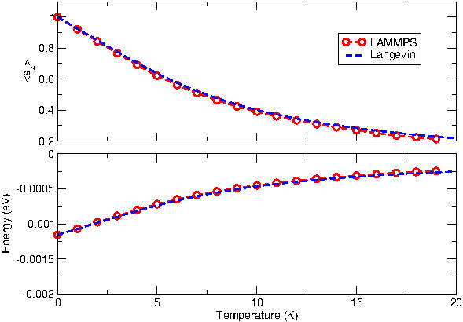

.. index:: fix precession/spin

fix precession/spin command
===========================

Syntax
""""""

.. code-block:: LAMMPS

   fix ID group precession/spin style args

* ID, group are documented in :doc:`fix <fix>` command
* precession/spin = style name of this fix command
* style = *zeeman* or *anisotropy* or *cubic*

  .. parsed-literal::

       *zeeman* args = H x y z
         H = intensity of the magnetic field (in Tesla)
         x y z = vector direction of the field
       *anisotropy* args = K x y z
         K = intensity of the magnetic anisotropy (in eV)
         x y z = vector direction of the anisotropy

  .. parsed-literal::

       *cubic* args = K1 K2c n1x n1y n1x n2x n2y n2z n3x n3y n3z
         K1 and K2c = intensity of the magnetic anisotropy (in eV)
         n1x to n3z = three direction vectors of the cubic anisotropy

Examples
""""""""

.. code-block:: LAMMPS

   fix 1 all precession/spin zeeman 0.1 0.0 0.0 1.0
   fix 1 3 precession/spin anisotropy 0.001 0.0 0.0 1.0
   fix 1 iron precession/spin cubic 0.001 0.0005 1.0 0.0 0.0 0.0 1.0 0.0 0.0 0.0 1.0
   fix 1 all precession/spin zeeman 0.1 0.0 0.0 1.0 anisotropy 0.001 0.0 0.0 1.0

Description
"""""""""""

This fix applies a precession torque to each magnetic spin in the group.

Style *zeeman* is used for the simulation of the interaction
between the magnetic spins in the defined group and an external
magnetic field:

.. math::

   H_{Zeeman} = -g \sum_{i=0}^{N}\mu_{i}\, \vec{s}_{i} \cdot\vec{B}_{ext}

with:

* :math:`\vec{B}_{ext}` the external magnetic field (in T)
* :math:`g` the Lande factor (hard-coded as :math:`g=2.0`)
* :math:`\vec{s}_i` the unitary vector describing the orientation of spin :math:`i`
* :math:`\mu_i` the atomic moment of spin :math:`i` given as a multiple of the
  Bohr magneton :math:`\mu_B` (for example, :math:`\mu_i \approx 2.2` in bulk iron).

The field value in Tesla is multiplied by the gyromagnetic
ratio, :math:`g \cdot \mu_B/\hbar`, converting it into a precession frequency in
rad.THz (in metal units and with :math:`\mu_B = 5.788 eV/T`).

As a comparison, the figure below displays the simulation of a
single spin (of norm :math:`\mu_i = 1.0`) submitted to an external
magnetic field of :math:`\vert B_{ext}\vert = 10.0\; \mathrm{Tesla}` (and oriented along the z
axis).
The upper plot shows the average magnetization along the
external magnetic field axis and the lower plot the Zeeman
energy, both as a function of temperature.
The reference result is provided by the plot of the Langevin
function for the same parameters.

The temperature effects are accounted for by connecting the spin
:math:`i` to a thermal bath using a Langevin thermostat (see
:doc:`fix langevin/spin <fix_langevin_spin>` for the definition of
this thermostat).

Style *anisotropy* is used to simulate an easy axis or an easy plane
for the magnetic spins in the defined group:

.. math::

   H_{aniso}  = -\sum_{{ i}=1}^{N} K_{an}(\mathbf{r}_{i})\, \left( \vec{s}_{i} \cdot \vec{n}_{i} \right)^2

with :math:`n` defining the direction of the anisotropy, and :math:`K` (in eV) its intensity.
If :math:`K > 0`, an easy axis is defined, and if :math:`K < 0`, an easy plane is defined.

Style *cubic* is used to simulate a cubic anisotropy, with three
possible easy axis for the magnetic spins in the defined group:

.. math::

   H_{cubic} = -\sum_{{ i}=1}^{N} K_{1}
   \Big[
   \left(\vec{s}_{i} \cdot \vec{n_1} \right)^2
   \left(\vec{s}_{i} \cdot \vec{n_2} \right)^2 +
   \left(\vec{s}_{i} \cdot \vec{n_2} \right)^2
   \left(\vec{s}_{i} \cdot \vec{n_3} \right)^2 +
   \left(\vec{s}_{i} \cdot \vec{n_1} \right)^2
   \left(\vec{s}_{i} \cdot \vec{n_3} \right)^2 \Big]
   +K_{2}^{(c)} \left(\vec{s}_{i} \cdot \vec{n_1} \right)^2
   \left(\vec{s}_{i} \cdot \vec{n_2} \right)^2
   \left(\vec{s}_{i} \cdot \vec{n_3} \right)^2

with :math:`K_1` and :math:`K_{2c}` (in eV) the intensity coefficients and
:math:`\vec{n}_1`, :math:`\vec{n}_2` and :math:`\vec{n}_3` defining the three anisotropic directions
defined by the command (from *n1x* to *n3z*).
For :math:`\vec{n}_1 = (1 0 0)`, :math:`\vec{n}_2 = (0 1 0)`, and :math:`\vec{n}_3 = (0 0 1)`, :math:`K_1 < 0` defines an
iron type anisotropy (easy axis along the :math:`(0 0 1)`-type cube
edges), and :math:`K_1 > 0` defines a nickel type anisotropy (easy axis
along the :math:`(1 1 1)`-type cube diagonals).
:math:`K_2^c > 0` also defines easy axis along the :math:`(1 1 1)`-type cube
diagonals.
See chapter 2 of :ref:`(Skomski) <Skomski1>` for more details on cubic
anisotropies.

In all cases, the choice of :math:`(x y z)` only imposes the vector
directions for the forces. Only the direction of the vector is
important; its length is ignored (the entered vectors are
normalized).

Those styles can be combined within one single command line.

----------

**Restart, fix_modify, output, run start/stop, minimize info:**

By default, the energy associated to this fix is not added to the potential
energy of the system.
The :doc:`fix_modify <fix_modify>` *energy* option is supported by this fix
to add this magnetic potential energy to the potential energy of the system,

.. code-block:: LAMMPS

   fix             1 all precession/spin zeeman 1.0 0.0 0.0 1.0
   fix_modify      1 energy yes

This fix computes a global scalar which can be accessed by various
:doc:`output commands <Howto_output>`.

No information about this fix is written to :doc:`binary restart files <restart>`.

Restrictions
""""""""""""

The *precession/spin* style is part of the SPIN package.  This style
is only enabled if LAMMPS was built with this package, and if the
atom_style "spin" was declared.  See the :doc:`Build package <Build_package>` doc page for more info.

Related commands
""""""""""""""""

:doc:`atom_style spin <atom_style>`

**Default:**

none

----------

.. _Skomski1:

**(Skomski)** Skomski, R. (2008). Simple models of magnetism.
Oxford University Press.
