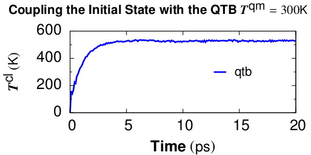
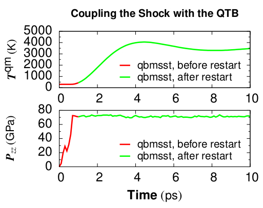

.. index:: fix qbmsst

fix qbmsst command
==================

Syntax
""""""

.. parsed-literal::

   fix ID group-ID qbmsst dir shockvel keyword value ...

* ID, group-ID are documented in :doc:`fix <fix>` command
* qbmsst = style name of this fix
* dir = *x* or *y* or *z*
* shockvel = shock velocity (strictly positive, velocity units)
* zero or more keyword/value pairs may be appended
* keyword = *q* or *mu* or *p0* or *v0* or *e0* or *tscale* or *damp* or *seed* or *f_max* or *N_f* or *eta* or *beta* or *T_init*

  .. parsed-literal::

       *q* value = cell mass-like parameter (mass\^2/distance\^4 units)
       *mu* value = artificial viscosity (mass/distance/time units)
       *p0* value = initial pressure in the shock equations (pressure units)
       *v0* value = initial simulation cell volume in the shock equations (distance\^3 units)
       *e0* value = initial total energy (energy units)
       *tscale* value = reduction in initial temperature (unitless fraction between 0.0 and 1.0)
       *damp* value = damping parameter (time units) inverse of friction *gamma*
       *seed* value = random number seed (positive integer)
       *f_max* value = upper cutoff frequency of the vibration spectrum (1/time units)
       *N_f* value = number of frequency bins (positive integer)
       *eta* value = coupling constant between the shock system and the quantum thermal bath (positive unitless)
       *beta* value = the quantum temperature is updated every beta time steps (positive integer)
       *T_init* value = quantum temperature for the initial state (temperature units)

Examples
""""""""

.. code-block:: LAMMPS

   # (liquid methane modeled with the REAX force field, real units)
   fix 1 all qbmsst z 0.122 q 25 mu 0.9 tscale 0.01 damp 200 seed 35082 f_max 0.3 N_f 100 eta 1 beta 400 T_init 110
   # (quartz modeled with the BKS force field, metal units)
   fix 2 all qbmsst z 72 q 40 tscale 0.05 damp 1 seed 47508 f_max 120.0 N_f 100 eta 1.0 beta 500 T_init 300

Two example input scripts are given, including shocked
:math:`\alpha\textrm{-quartz}` and shocked liquid methane.  The input
script first equilibrates an initial state with the quantum thermal
bath at the target temperature and then applies *fix qbmsst* to simulate
shock compression with quantum nuclear correction.  The following two
figures plot relevant quantities for shocked
:math:`\alpha\textrm{-quartz}`.

Figure 1. Classical temperature
:math:`T_{cl} = \sum \frac{m_iv_i^2}{3Nk_B}` vs. time for coupling the
:math:`\alpha\textrm{-quartz}` initial state with the quantum thermal
bath at target quantum temperature :math:`T^{qm} = 300 K`. The NpH
ensemble is used for time integration while QTB provides the colored
random force. :math:`T^{cl}` converges at the timescale of *damp*
which is set to be 1 ps.

Figure 2. Quantum temperature and pressure vs. time for simulating
shocked :math:`\alpha\textrm{-quartz}` with *fix qbmsst*\. The shock
propagates along the z direction. Restart of the *fix qbmsst* command
is demonstrated in the example input script. Thermodynamic quantities
stay continuous before and after the restart.

Description
"""""""""""

This command performs the Quantum-Bath coupled Multi-Scale Shock
Technique (QBMSST) integration. See :ref:`(Qi) <Qi>` for a detailed
description of this method.  QBMSST provides description of the
thermodynamics and kinetics of shock processes while incorporating
quantum nuclear effects.  The *shockvel* setting determines the steady
shock velocity that will be simulated along direction *dir*\ .

Quantum nuclear effects :doc:`(fix qtb) <fix_qtb>` can be crucial
especially when the temperature of the initial state is below the
classical limit or there is a great change in the zero point energies
between the initial and final states. Theoretical post processing
quantum corrections of shock compressed water and methane have been
reported as much as 30% of the temperatures :ref:`(Goldman) <Goldman1>`.  A
self-consistent method that couples the shock to a quantum thermal
bath described by a colored noise Langevin thermostat has been
developed by Qi et al :ref:`(Qi) <Qi>` and applied to shocked methane.  The
onset of chemistry is reported to be at a pressure on the shock
Hugoniot that is 40% lower than observed with classical molecular
dynamics.

It is highly recommended that the system be already in an equilibrium
state with a quantum thermal bath at temperature of *T_init*.  The fix
command :doc:`fix qtb <fix_qtb>` at constant temperature *T_init* could
be used before applying this command to introduce self-consistent
quantum nuclear effects into the initial state.

The parameters *q*, *mu*, *e0*, *p0*, *v0* and *tscale* are described
in the command :doc:`fix msst <fix_msst>`. The values of *e0*, *p0*, or
*v0* will be calculated on the first step if not specified.  The
parameter of *damp*, *f_max*, and *N_f* are described in the command
:doc:`fix qtb <fix_qtb>`.

The *fix qbmsst* command couples the shock system to a quantum thermal
bath with a rate that is proportional to the change of the total
energy of the shock system, :math:`E^{tot} - E^{tot}_0`.
Here :math:`E^{etot}` consists of both the system energy and a thermal
term, see :ref:`(Qi) <Qi>`, and :math:`E^{tot}_0 = e0` is the
initial total energy.

The *eta* (:math:`\eta`) parameter is a unitless coupling constant
between the shock system and the quantum thermal bath. A small :math:`\eta`
value cannot adjust the quantum temperature fast enough during the
temperature ramping period of shock compression while large :math:`\eta`
leads to big temperature oscillation. A value of :math:`\eta` between 0.3 and
1 is usually appropriate for simulating most systems under shock
compression. We observe that different values of :math:`\eta` lead to almost
the same final thermodynamic state behind the shock, as expected.

The quantum temperature is updated every *beta* (:math:`\beta`) steps
with an integration time interval :math:`\beta` times longer than the
simulation time step. In that case, :math:`E^{tot}` is taken as its
average over the past :math:`\beta` steps. The temperature of the quantum
thermal bath :math:`T^{qm}` changes dynamically according to
the following equation where :math:`\Delta_t` is the MD time step and
:math:`\gamma` is the friction constant which is equal to the inverse
of the *damp* parameter.

.. math::

   \frac{dT^{qm}}{dt} = \gamma\eta\sum^\beta_{l=1}\frac{E^{tot}(t-l\Delta t) - E^{tot}_0}{3\beta N k_B}

The parameter *T_init* is the initial temperature of the quantum
thermal bath and the system before shock loading.

For all pressure styles, the simulation box stays orthorhombic in
shape. Parrinello-Rahman boundary conditions (tilted box) are
supported by LAMMPS, but are not implemented for QBMSST.

----------

Restart, fix_modify, output, run start/stop, minimize info
"""""""""""""""""""""""""""""""""""""""""""""""""""""""""""

Because the state of the random number generator is not written to
:doc:`binary restart files <restart>`, this fix cannot be restarted
"exactly" in an uninterrupted fashion. However, in a statistical
sense, a restarted simulation should produce similar behaviors of the
system as if it is not interrupted.  To achieve such a restart, one
should write explicitly the same value for *q*, *mu*, *damp*,
*f_max*, *N_f*, *eta*, and *beta* and set *tscale* = 0 if the system
is compressed during the first run.

The cumulative energy change in the system imposed by this fix is
included in the :doc:`thermodynamic output <thermo_style>` keywords
*ecouple* and *econserve*.  See the :doc:`thermo_style <thermo_style>`
doc page for details.

This fix computes a global scalar which can be accessed by various
:doc:`output commands <Howto_output>`.  The scalar is the same
cumulative energy change due to this fix described in the previous
paragraph.  The scalar value calculated by this fix is "extensive".

The progress of the QBMSST can be monitored by printing the global
scalar and global vector quantities computed by the fix.

As mentioned above, the scalar is the cumulative energy change due to
the fix.  By monitoring the thermodynamic *econserve* output, this can
be used to test if the MD timestep is sufficiently small for accurate
integration of the dynamic equations.

The global vector contains five values in the following order.  The
vector values output by this fix are "intensive".

[\ *dhugoniot*, *drayleigh*, *lagrangian_speed*, *lagrangian_position*,
*quantum_temperature*]

1. *dhugoniot* is the departure from the Hugoniot (temperature units).
2. *drayleigh* is the departure from the Rayleigh line (pressure units).
3. *lagrangian_speed* is the laboratory-frame Lagrangian speed (particle velocity) of the computational cell (velocity units).
4. *lagrangian_position* is the computational cell position in the reference frame moving at the shock speed. This is the distance of the computational cell behind the shock front.
5. *quantum_temperature* is the temperature of the quantum thermal bath :math:`T^{qm}`.

To print these quantities to the log file with descriptive column
headers, the following LAMMPS commands are suggested.

.. parsed-literal::

   fix             fix_id all msst z
   variable        dhug    equal f_fix_id[1]
   variable        dray    equal f_fix_id[2]
   variable        lgr_vel equal f_fix_id[3]
   variable        lgr_pos equal f_fix_id[4]
   variable        T_qm    equal f_fix_id[5]
   thermo_style    custom  step temp ke pe lz pzz econserve v_dhug v_dray v_lgr_vel v_lgr_pos v_T_qm f_fix_id

It is worth noting that the temp keyword for the :doc:`thermo_style
<thermo_style>` command prints the instantaneous classical temperature
:math:`T^{cl}` as described by the :doc:`fix qtb <fix_qtb>` command.

----------

Restrictions
""""""""""""

This fix style is part of the QTB package.  It is only enabled if
LAMMPS was built with that package. See the :doc:`Build package
<Build_package>` page for more info.

All cell dimensions must be periodic. This fix can not be used with a
triclinic cell.  The QBMSST fix has been tested only for the group-ID
all.

----------

Related commands
""""""""""""""""

:doc:`fix qtb <fix_qtb>`, :doc:`fix msst <fix_msst>`

----------

Default
"""""""

The keyword defaults are q = 10, mu = 0, tscale = 0.01, damp = 1, seed
= 880302, f_max = 200.0, N_f = 100, eta = 1.0, beta = 100, and
T_init=300.0. e0, p0, and v0 are calculated on the first step.

----------

.. _Goldman1:

**(Goldman)** Goldman, Reed and Fried, J. Chem. Phys. 131, 204103 (2009)

.. _Qi:

**(Qi)** Qi and Reed, J. Phys. Chem. A 116, 10451 (2012).
