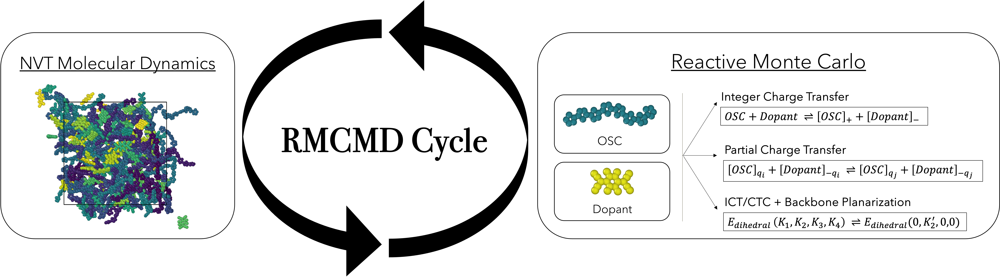

.. index:: fix rmc/partial

fix rmc/partial command
=======================

Syntax
"""""""

.. code-block:: LAMMPS

   fix ID group-ID rmc/partial filename.json

* ID, group-ID = fix ID and group ID (as defined in :doc:`fix <fix>`)
* filename.json = A JSON file containing the inputs for the RMC run

Example
"""""""

.. code-block:: LAMMPS
    
    fix 1 all nvt temp 800 800 100
    fix 2 all rmc/partial rmc_input.json

An example ``rmc_input.json`` file, along with input file ``in.rmc`` and data
file rmc_struct.data are provided in the ``examples/mc`` folder.

Description
"""""""""""

This fix performs Reactive Monte Carlo Molecular Dynamics (RMCMD)
simulations for the simultaneous treatment of the doping reaction and
morphology evolution in doped organic semiconductors, based on
:ref:`Verma2024<Verma2024>` and
:ref:`Raghuraman2025<Raghuraman2025>`. The method alternates between MD
steps (for the morphology) and MC steps where a neutral semiconductor
and dopant molecule is chosen randomly, and the atomic charges are
replaced to ionize the molecule. The fix is capable of capturing Integer
Charge Transfer (ICT), where a molecule goes from neutral to fully
ionized, and Charge Transfer Complexes (CTC), where a molecule can
partially ionize. In addition to switching out charges, the fix can also
switch out dihedral types, angle types and bond types of the chosen
molecules, enabling the study of intramolecular conformational effects
as a function of doping. The fix should used be alongside an MD fix like
nvt or npt.

The figure above shows a schematic of the RMCMD cycle, using NVT MD as
the fix for morphology.

A step-by-step guide on running RMCMD will be made available shortly at
`thejacksonlab.github.io website <https://thejacksonlab.github.io>`_.

Input file format
"""""""""""""""""

The inputs for fix rmc/partial should be provided in a JSON file. Here we go through what this file looks like, with all the relevant fields.

.. code-block:: json

      {    
        "sysname" : "p3ht_f4tcnq",
        "temperature": 800.0,
        "restart": "y",
        "cycle": {
           "mdsteps" : 100,
           "mcsteps" : 20
        },
        "system" : {
           "semiconductor_num_atoms" : 2,
           "dopant_num_atoms" : 2,
           "num_semiconductors" : 100,
           "num_dopants" : 25
        },  
        "type_threshold" : 16,
        "num_charge_states" : 6,
        "barrier" : [0.0, 1.0, 2.0, 3.0, 4.0, 30.1],
        "semiconductor_charges" : {
           "neutral" : [
            0.3924909999999989,
            0.045532
            ],
            "charged" : [
            0.42590700000000004,
            0.049222
            ] 
        },  
        "dopant_charges" : {
            "neutral" : [
            -0.0043649999999999705,
            -0.009380
            ],
            "charged" : [
            -0.109287,
            -0.120895 
            ]
        },
        "dihedral_modification" : "y",
        "dihedral_types" : [3, 3, 3, 3, 3, 3],
        "dihedral_list" : [
          [ 166, 169, 172, 173]
        ],
        "angle_modification" : "y",
        "angle_types" : [6, 6, 6, 6, 6, 6],
        "angle_list" : [
          [3876,3879,3882]
        ],
        "bond_modification" : "y",
        "bond_types" : [4, 4, 4, 4, 4, 4],
        "bond_list" : [
          [999,1000]
        ]
      }

The inputs are described in the table below.

.. list-table::
   :header-rows: 1

   * - Keyword
     - Argument(s)
     - Required
     - Description
   * - sysname
     - a string
     - yes
     - indicates the name of the system; the restart filenames will be based on this.
   * - temperature
     - a double
     - yes
     - the temperature at which the MC simulation should occur
   * - restart
     - "y" or "n"
     - no
     - use "y" or "n" to indicate if the run is a restart or a fresh run. The fix looks for files "sysname_type.dat" and "sysname_charge.dat" which are created in a fresh run. If not specified, fresh run assumed.
   * - cycle
     - a data block
     - yes
     - information about the RMCMD cycle
   * - system
     - a data block
     - yes
     - information about the system
   * - type_threshold
     - an integer
     - yes
     - if atom_type > type_threshold, that atom belongs to a dopant, otherwise it belongs to a semiconductor.
   * - num_charge_states
     - an integer
     - yes
     - indicates number of charge states for RMC calculation, 2 means only 0 and +-1, more than 2 introduces partial charge states.
   * - barrier
     - list of num_charge_states doubles
     - yes
     - reaction free energies for each of the charge states.
   * - semiconductor_charges
     - a data block
     - yes
     - information on the semiconductor atomic charges
   * - dopant_charges
     - a data block
     - yes
     - information on the dopant atomic charges
   * - dihedral_modification
     - "y" or "n"
     - no
     - indicates if dihedral coefficients will be modified during the MC step. If not specified, assumed no.
   * - dihedral_types
     - list with num_charge_states integers
     - depends
     - list of dihedral types for each charge state. Required if dihedral_modification is set to "y"
   * - dihedral_list
     - list of 4 integer lists.
     - depends
     - list of dihedrals whose coefficents are to be switched during the MC step, specified by 4 global indices for each.
   * - angle_modification
     - "y" or "n"
     - no
     - indicates if angle coefficients will be modified during the MC step. If not specified, assumed no.
   * - angle_types
     - list with num_charge_states integers
     - depends
     - list of angle types for each charge state. Required if angle_modification is set to "y"
   * - angle_list
     - list of 3 integer lists.
     - depends
     - list of angles whose coefficents are to be switched during the MC step, specified by 3 global indices for each.
   * - bond_modification
     - "y" or "n"
     - no
     - indicates if bond coefficients will be modified during the MC step. If not specified, assumed no.
   * - bond_types
     - list with num_charge_states integers
     - depends
     - list of bond types for each charge state. Required if bond_modification is set to "y"
   * - bond_list
     - list of 2 integer lists.
     - depends
     - list of bonds whose coefficents are to be switched during the MC step, specified by the 2 global indices.
 
The following table highlights the sub-sections for the "cycle" entry from above.

.. list-table::
   :header-rows: 1

   * - Subsection
     - Argument(s)
     - Required
     - Description
   * - mdsteps
     - an integer
     - yes
     - The number of MD steps to be performed in each RMCMD cycle.
   * - mcsteps
     - an integer
     - yes
     - The number of RMC steps to be performed in each RMCMD cycle.

The following table highlights the sub-sections for the "system" entry from above.

.. list-table::
   :header-rows: 1

   * - Subsection
     - Argument(s)
     - Required
     - Description
   * - semiconductor_num_atoms
     - an integer
     - yes
     - The number of atoms in a semiconductor molecule.
   * - dopant_num_atoms
     - an integer
     - yes
     - The number of atoms in a dopant molecule.
   * - num_semiconductors
     - an integer
     - yes
     - The number of semiconductor molecules in the system.
   * - num_dopants
     - an integer
     - yes
     - The number of dopant atoms in the system.

The following table highlights the sub-sections for the "semiconductor_charges" and "dopant_charges" entries from above.

.. list-table::
   :header-rows: 1

   * - Subsection
     - Argument(s)
     - Required
     - Description
   * - neutral
     - a list of semiconductor_num_atoms/dopant_num_atoms doubles.
     - yes
     - A list of atomic charges for a neutral semiconductor/dopant molecule, specified in order of global atom ID. Note that global IDs within a molecule must be contiguous. 
   * - charged
     - a list of semiconductor_num_atoms/dopant_num_atoms doubles.
     - yes
     - A list of atomic charges for a semiconductor/dopant molecule with +1/-1 charge, specified in order of global atom ID. Note that global IDs within a molecule must be contiguous. 

Restrictions
""""""""""""

This fix is part of the MC package.  It is only enabled if LAMMPS was
built with that package.  See the :doc:`Build package <Build_package>`
doc page for more info.

This fix requires using an atom style with molecule IDs.

--------------

.. _Verma2024:

**(Verma2024)** Verma, A.; Jackson, N. E. Assessing molecular doping efficiency in organic semiconductors with reactive Monte Carlo, Journal of Chemical Physics 
2024, 160 

.. _Raghuraman2025:

**(Raghuraman2025)**  Raghuraman V, Verma A, Jackson N. All-Atom Reactive Monte Carlo Molecular Dynamics for Molecular Doping in Organic Semiconductors. ChemRxiv. 2025; doi:10.26434/chemrxiv-2025-713hw-v2  This content is a preprint and has not been peer-reviewed.

