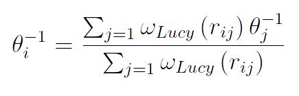
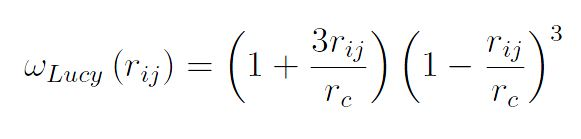

.. index:: fix rx

fix rx command
==============

fix rx/kk command
=================

Syntax
""""""

.. parsed-literal::

   fix ID group-ID rx file localTemp matrix solver minSteps ...

* ID, group-ID are documented in :doc:`fix <fix>` command
* rx = style name of this fix command
* file = filename containing the reaction kinetic equations and Arrhenius parameters
* localTemp = *none,lucy* = no local temperature averaging or local temperature defined through Lucy weighting function
* matrix = *sparse, dense* format for the stoichiometric matrix
* solver = *lammps\_rk4,rkf45* = rk4 is an explicit 4th order Runge-Kutta method; rkf45 is an adaptive 4th-order Runge-Kutta-Fehlberg method
* minSteps = # of steps for rk4 solver or minimum # of steps for rkf45 (rk4 or rkf45)
* maxSteps = maximum number of steps for the rkf45 solver (rkf45 only)
* relTol = relative tolerance for the rkf45 solver (rkf45 only)
* absTol = absolute tolerance for the rkf45 solver (rkf45 only)
* diag   = Diagnostics frequency for the rkf45 solver (optional, rkf45 only)

Examples
""""""""

.. parsed-literal::

   fix 1 all rx kinetics.rx none dense lammps_rk4
   fix 1 all rx kinetics.rx none sparse lammps_rk4 1
   fix 1 all rx kinetics.rx lucy sparse lammps_rk4 10
   fix 1 all rx kinetics.rx none dense rkf45 1 100 1e-6 1e-8
   fix 1 all rx kinetics.rx none dense rkf45 1 100 1e-6 1e-8 -1

Description
"""""""""""

Fix *rx* solves the reaction kinetic ODEs for a given reaction set that is
defined within the file associated with this command.

For a general reaction such that

.. image:: Eqs/fix_rx_reaction.jpg
   :align: center

the reaction rate equation is defined to be of the form

.. image:: Eqs/fix_rx_reactionRate.jpg
   :align: center

In the current implementation, the exponents are defined to be equal
to the stoichiometric coefficients.  A given reaction set consisting
of *n* reaction equations will contain a total of *m* species.  A set
of *m* ordinary differential equations (ODEs) that describe the change
in concentration of a given species as a function of time are then
constructed based on the *n* reaction rate equations.

The ODE systems are solved over the full DPD timestep *dt* using either a 4th
order Runge-Kutta *rk4* method with a fixed step-size *h*\ , specified
by the *lammps\_rk4* keyword, or a 4th order Runge-Kutta-Fehlberg (rkf45) method
with an adaptive step-size for *h*\ . The number of ODE steps per DPD timestep
for the rk4 method is optionally specified immediately after the rk4
keyword. The ODE step-size is set as *dt/num\_steps*. Smaller
step-sizes tend to yield more accurate results but there is not
control on the error. For error control, use the rkf45 ODE solver.

The rkf45 method adjusts the step-size so that the local truncation error is held
within the specified absolute and relative tolerances. The initial step-size *h0*
can be specified by the user or estimated internally. It is recommended that the user
specify *h0* since this will generally reduced the number of ODE integration steps
required. *h0* is defined as *dt / min\_steps* if min\_steps >= 1. If min\_steps == 0,
*h0* is estimated such that an explicit Euler method would likely produce
an acceptable solution. This is generally overly conservative for the 4th-order
method and users are advised to specify *h0* as some fraction of the DPD timestep.
For small DPD timesteps, only one step may be necessary depending upon the tolerances.
Note that more than min\_steps ODE steps may be taken depending upon the ODE stiffness
but no more than max\_steps will be taken. If max\_steps is reached, an error warning
is printed and the simulation is stopped.

After each ODE step, the solution error *e* is tested and weighted using the absTol
and relTol values. The error vector is weighted as *e* / (relTol \* \|\ *u*\ \| + absTol)
where *u* is the solution vector. If the norm of the error is <= 1, the solution is
accepted, *h* is increased by a proportional amount, and the next ODE step is begun.
Otherwise, *h* is shrunk and the ODE step is repeated.

Run-time diagnostics are available for the rkf45 ODE solver. The frequency
(in time-steps) that diagnostics are reported is controlled by the last (optional)
12th argument. A negative frequency means that diagnostics are reported once at the
end of each run. A positive value N means that the diagnostics are reported once
per N time-steps.

The diagnostics report the average # of integrator steps and RHS function evaluations
and run-time per ODE as well as the average/RMS/min/max per process. If the
reporting frequency is 1, the RMS/min/max per ODE are also reported. The per ODE
statistics can be used to adjust the tolerance and min/max step parameters. The
statistics per MPI process can be useful to examine any load imbalance caused by the
adaptive ODE solver. (Some DPD particles can take longer to solve than others. This
can lead to an imbalance across the MPI processes.)

----------

The filename specifies a file that contains the entire set of reaction
kinetic equations and corresponding Arrhenius parameters.  The format of
this file is described below.

There is no restriction on the total number or reaction equations that
are specified.  The species names are arbitrary string names that are
associated with the species concentrations.  Each species in a given
reaction must be preceded by it's stoichiometric coefficient.  The
only delimiters that are recognized between the species are either a
*+* or *=* character.  The *=* character corresponds to an
irreversible reaction.  After specifying the reaction, the reaction
rate constant is determined through the temperature dependent
Arrhenius equation:

.. image:: Eqs/fix_rx.jpg
   :align: center

where *A* is the Arrhenius factor in time units or concentration/time
units, *n* is the unitless exponent of the temperature dependence, and
*E\_a* is the activation energy in energy units.  The temperature
dependence can be removed by specifying the exponent as zero.

The internal temperature of the coarse-grained particles can be used
in constructing the reaction rate constants at every DPD timestep by
specifying the keyword *none*\ .  Alternatively, the keyword *lucy* can
be specified to compute a local-average particle internal temperature
for use in the reaction rate constant expressions.  The local-average
particle internal temperature is defined as:

where the Lucy function is expressed as:

The self-particle interaction is included in the above equation.

The stoichiometric coefficients for the reaction mechanism are stored
in either a sparse or dense matrix format. The dense matrix should only be
used for small reaction mechanisms. The sparse matrix should be used when there
are many reactions (e.g., more than 5). This allows the number of reactions and
species to grow while keeping the computational cost tractable. The matrix
format can be specified as using either the *sparse* or *dense* keywords.
If all stoichiometric coefficients for a reaction are small integers (whole
numbers <= 3), a fast exponential function is used. This can save significant
computational time so users are encouraged to use integer coefficients
where possible.

----------

The format of a tabulated file is as follows (without the
parenthesized comments):

.. parsed-literal::

   # Rxn equations and parameters                                               (one or more comment or blank lines)

   1.0 hcn + 1.0 no2 = 1.0  no + 0.5 n2  + 0.5 h2 + 1.0 co   2.49E+01 0.0 1.34  (rxn equation, A, n, Ea)
   1.0 hcn + 1.0  no = 1.0  co + 1.0 n2  + 0.5 h2            2.16E+00 0.0 1.52
   ...
   1.0  no + 1.0  co = 0.5  n2 + 1.0 co2                     1.66E+06 0.0 0.69

A section begins with a non-blank line whose 1st character is not a
"#"; blank lines or lines starting with "#" can be used as comments
between sections.

Following a blank line, the next N lines list the N reaction
equations.  Each species within the reaction equation is specified
through its stoichiometric coefficient and a species tag.  Reactant
species are specified on the left-hand side of the equation and
product species are specified on the right-hand side of the equation.
After specifying the reactant and product species, the final three
arguments of each line represent the Arrhenius parameter *A*\ , the
temperature exponent *n*\ , and the activation energy *Ea*\ .

Note that the species tags that are defined in the reaction equations
are used by the :doc:`fix eos/table/rx <fix_eos_table_rx>` command to
define the thermodynamic properties of each species.  Furthermore, the
number of species molecules (i.e., concentration) can be specified
either with the :doc:`set <set>` command using the "d\_" prefix or by
reading directly the concentrations from a data file.  For the latter
case, the :doc:`read_data <read_data>` command with the fix keyword
should be specified, where the fix-ID will be the "fix rx`ID with a <SPECIES">`_ suffix, e.g.

fix          foo all rx reaction.file ...
read\_data    data.dpd fix foo\_SPECIES NULL Species

----------

Styles with a *gpu*\ , *intel*\ , *kk*\ , *omp*\ , or *opt* suffix are
functionally the same as the corresponding style without the suffix.
They have been optimized to run faster, depending on your available
hardware, as discussed on the :doc:`Speed packages <Speed_packages>` doc
page.  The accelerated styles take the same arguments and should
produce the same results, except for round-off and precision issues.

These accelerated styles are part of the GPU, USER-INTEL, KOKKOS,
USER-OMP and OPT packages, respectively.  They are only enabled if
LAMMPS was built with those packages.  See the :doc:`Build package <Build_package>` doc page for more info.

You can specify the accelerated styles explicitly in your input script
by including their suffix, or you can use the :doc:`-suffix command-line switch <Run_options>` when you invoke LAMMPS, or you can use the
:doc:`suffix <suffix>` command in your input script.

See the :doc:`Speed packages <Speed_packages>` doc page for more
instructions on how to use the accelerated styles effectively.

----------

Restrictions
""""""""""""

This command is part of the USER-DPD package.  It is only enabled if
LAMMPS was built with that package.  See the :doc:`Build package <Build_package>` doc page for more info.

This command also requires use of the :doc:`atom_style dpd <atom_style>`
command.

This command can only be used with a constant energy or constant
enthalpy DPD simulation.

Related commands
""""""""""""""""

:doc:`fix eos/table/rx <fix_eos_table_rx>`,
:doc:`fix shardlow <fix_shardlow>`,
:doc:`pair dpd/fdt/energy <pair_dpd_fdt>`

**Default:** none
