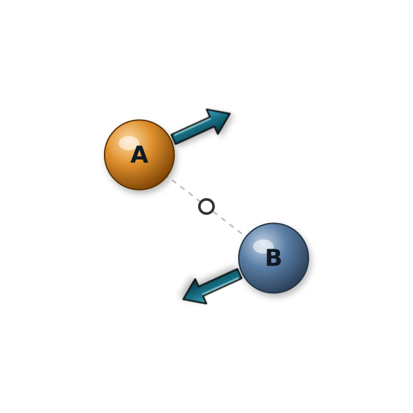
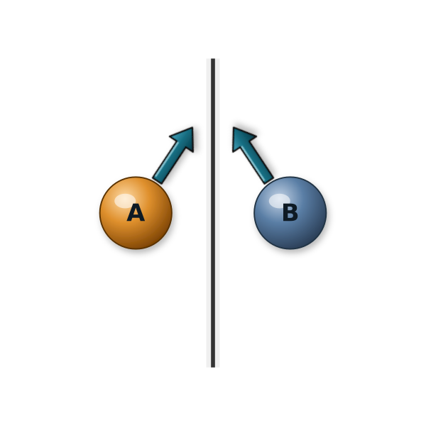
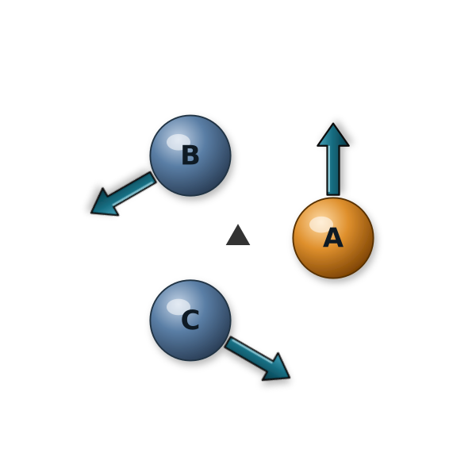
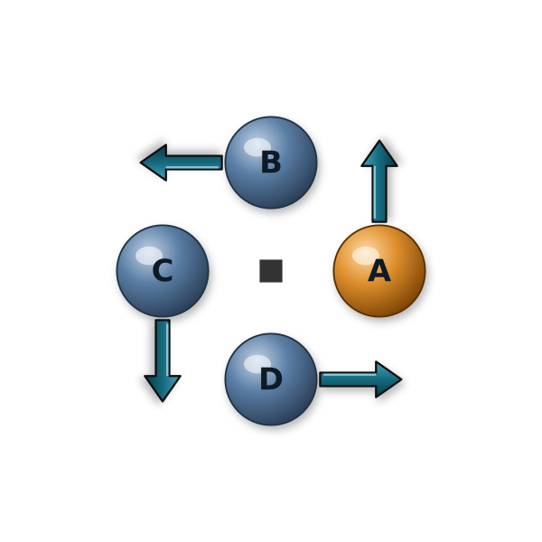

.. index:: fix symmetry

fix symmetry command
====================

Syntax
""""""

.. code-block:: LAMMPS

   fix ID group-ID symmetry file keyword value ...

* ID, group-ID are documented in :doc:`fix <fix>` command
* file = path to a symmetry-data file describing the space group and orbit map
* zero or more keyword/value pairs may be appended
* keyword = *tol*

  .. parsed-literal::

       *tol* value = epsilon
         epsilon = fractional-coordinate tolerance

Examples
""""""""

.. code-block:: LAMMPS

   fix sym all symmetry symgroup.pm.json
   fix sym all symmetry symgroup.fm-3m.json tol 1.0e-8

Example input scripts available: examples/PACKAGES/symmetry

Description
"""""""""""

.. versionadded:: TBD

This fix constrains a molecular dynamics simulation to obey a chosen
crystallographic space-group symmetry at every timestep. The algorithm
follows :ref:`(Cox) <Cox2022>`, and the LAMMPS implementation is derived
from the `symd <https://github.com/whitead/symd>`_ reference
implementation.

Atoms are organized into *orbits*. Each orbit has one *asymmetric
representative* and one image atom per non-identity operator of the
declared space group. Per step the fix:

* averages the forces and velocities of the atoms in each orbit (mapped
  back to the asymmetric unit through the operator inverses) and
  redistributes the symmetrized values to every image, and
* re-folds the image positions from the asymmetric representative using
  the affine operators to cancel numerical drift.

The user is responsible for setting up the data file so that the full
unit cell is already present and consistent with the symmetry at the
start of the run; the fix verifies this at init within *tol*.

Purpose and typical use
"""""""""""""""""""""""

Ordinary molecular dynamics almost never preserves an exact
crystallographic symmetry: thermal fluctuations and round-off break it
within a few steps, and the trajectory drifts to whatever nearby
lower-symmetry arrangement the forces prefer. This fix instead makes the
space group an *input setting* and keeps every configuration exactly
symmetric throughout the run.  It is the dynamical counterpart of the
symmetry-constrained structure searches common in crystallography, and
differs from a harmonic *symmetry restraint* (which merely biases the
system to stay near symmetric) in that no symmetry-breaking motion is
possible at all.

The method used by the fix was introduced for crystal-structure
prediction and enumeration in :ref:`(Cox) <Cox2022>`.  Because there is
a finite number of space groups, one can run the same system under each
candidate group and relax it to obtain the symmetric structure
compatible with that group; comparing the resulting energies (and
testing which structures survive a subsequent *unconstrained* run)
identifies stable and metastable polymorphs.  Other suggested uses are
modeling highly symmetric biological assemblies and, more generally, any
study in which a particular symmetry is to be imposed by construction,
for instance to prevent a metastable structure from collapsing during
equilibration.  Symmetric MD is a special case of *objective molecular
dynamics*.

A practical workflow is: build the fully symmetric unit cell, run under
the fix to relax/equilibrate it on the symmetric manifold, then remove
the fix and continue in ordinary MD to test whether the structure is
(meta)stable or breaks symmetry.

Parallel efficiency and system size
"""""""""""""""""""""""""""""""""""

Unlike the `symd <https://github.com/whitead/symd>`_ reference engine,
which integrates only the asymmetric unit and treats the images as
non-integrated ghost particles, this fix keeps the *entire unit cell* as
ordinary, fully integrated LAMMPS atoms and re-imposes the symmetry
every step by symmetrizing their forces, velocities, and positions.  The
constraint that results is the same, but the bookkeeping fits LAMMPS's
domain decomposition without special-casing the images in the neighbor
lists, force kernels, or communication.

The fix works unchanged in serial and in parallel and adds very little
overhead.  Its per-step work is a local pass over the declared atoms
plus three fixed-size ``MPI_Allreduce`` calls (the per-orbit force sum,
the velocity sum, and the asymmetric-unit positions).  The fix
introduces no pairwise or long-range communication of its own and never
migrates atoms between ranks. An orbit whose representative and images
are spread across different subdomains is handled correctly: each rank
contributes the atoms it owns to the per-orbit sums and reads back the
global result.

Consequently the fix is not restricted to tiny systems -- it runs at
essentially the cost of unconstrained MD for the same atom count, and the
dominant expense remains the normal force evaluation.  The characteristic
setups are nonetheless modest in size (one asymmetric unit tiled by the
group order :math:`|G|`, so from a few up to some tens of atoms per unit
cell in the reference study), but nothing in the implementation caps the
system size.

.. note::

   Because all image atoms are integrated as normal atoms, they
   contribute to the kinetic energy and therefore to the temperature
   reported by :doc:`compute temp <compute_temp>` and used by
   thermostats. The images move as rigid symmetry copies of their
   asymmetric representative, so the number of *independent* degrees of
   freedom is smaller than :math:`3N` -- it is :math:`D\,(n-1)` for a
   general-position orbit set (with :math:`n` the asymmetric-unit size
   and :math:`D` the dimensionality), reduced further by any
   Wyckoff-site constraints :ref:`(Cox) <Cox2022>`.  This fix does not
   subtract those redundant and constrained degrees of freedom from the
   count LAMMPS uses for temperature, so a thermostat controls the
   temperature of the full tiled cell rather than of the independent
   coordinates; since this number does not change during a run, it can
   be adjusted using :doc:`compute_modify extra/dof <compute_modify>`.
   The provided examples avoid this issue and use :doc:`fix nve
   <fix_nve>`.

Special positions (Wyckoff sites)
"""""""""""""""""""""""""""""""""

Atoms sitting on a special position (a mirror plane, axis, or inversion
center) are invariant under one or more non-identity operators of the
space group.  To declare such an atom, set its orbit's *tags* slot at
every stabilizer-op index equal to the asymmetric tag and list those op
indices in a per-orbit *site_symmetry* array (see the file-format
section).  Per step the fix then applies a Lagrange-multiplier
projection that drives the asym atom's fractional position and velocity
back onto the constraint subspace defined by its stabilizer.  The
pseudo-inverse used for the projection is pre-computed at init from a
Jacobi eigen- decomposition of :math:`B = \sum_k (R_k - I)^T (R_k - I)`
over the stabilizer ops.

|sym_inv|  |sym_mir|  |sym_r3|  |sym_r4|

The figures above show how *fix symmetry* treats orbits for four example
operators.  In each panel the asymmetric representative A (amber) and
its images (B, C, D, blue) are related by the operator - an inversion
center, a mirror plane, a 3-fold rotation axis, or a 4-fold rotation
axis.  In each timestep the fix maps the images' forces and velocities
back onto A through the operator, inverses, averages them, and
redistributes the symmetric result, so each image carries the operator
applied to A's force and velocity (arrows); image positions are
re-folded from A the same way. An orbit contains one image per
non-identity operator, so its size is the group order (2, 2, 3, and 4
here).

----------

Symmetry-data file format
"""""""""""""""""""""""""

The file is in JSON format with the top-level schema:

.. code-block:: json

   {
     "group_name": "Pm",
     "lattice":    "monoclinic",

     "ops": [
       { "R": [[1, 0, 0], [0,  1, 0], [0, 0, 1]],
         "t": [0, 0, 0] },
       { "R": [[1, 0, 0], [0, -1, 0], [0, 0, 1]],
         "t": ["0", "0", "0"] }
     ],

     "orbits": [
       { "tags": [1, 2] },
       { "tags": [3, 4] },
       { "tags": [5, 5], "site_symmetry": [2] }
     ]
   }

* ``lattice`` must be one of ``triclinic``, ``monoclinic``,
  ``orthorhombic``, ``tetragonal``, ``hexagonal``, ``trigonal``,
  ``cubic``.
* Operators act on fractional coordinates: :math:`s' = R \cdot s + t`.
  ``R`` is an integer-valued lattice operator with :math:`|\det R| = 1`.
  ``t`` components accept either JSON numbers (``0.5``) or rational
  strings (``"1/2"``).
* The first entry in ``ops`` must be the identity. The full operator list
  must be closed under composition modulo lattice translations; the fix
  verifies this at init.
* Each orbit's ``tags`` array is parallel to ``ops``: ``tags[0]`` is the
  asymmetric representative and ``tags[k]`` for :math:`k \ge 1` is the
  atom tag related to it by ``ops[k]``. For atoms on Wyckoff special
  positions, set ``tags[k]`` equal to ``tags[0]`` for every op ``k`` in
  the stabilizer and list those op indices (1-based, excluding 1) in an
  optional ``site_symmetry`` array on the same orbit. The fix verifies
  at init that each declared Wyckoff atom actually sits on its constraint
  manifold to within *tol*.
* Any JSON key not listed above (for example fields starting with
  ``_comment``) is silently ignored, so the file can carry documentation
  inline.

LAMMPS provides a `JSON schema file <https://json-schema.org/>`_ for
symmetry files in the :ref:`tools/json folder <json>`.  Using the schema
file the files can be validated to be conforming to the syntax
requirement and conventions without running LAMMPS.  Please note that
the format requirement for JSON files in general are very strict and the
JSON reader in LAMMPS does not accept JSON files with extensions like
comments.  Validating a particular JSON format symmetry file against
this schema ensures that both, the JSON syntax requirement *and* the
LAMMPS conventions.  LAMMPS should be able to read and parse any JSON
file that passes the schema check.  This is a formal check only and thus
it **cannot** check whether the file contents are consistent or
physically meaningful.

----------

Adapting JSON files from the symd reference engine
""""""""""""""""""""""""""""""""""""""""""""""""""

The JSON format used here is **not** the format used by the `symd
<https://github.com/whitead/symd>`_ reference engine.  symd's
space-group tables (``python/symd/data/{2,3}dgroups.json``) describe
each group in abstract crystallographic terms.  To use a symd entry in a
fix symmetry file you have to convert it in three steps:

1. **Lattice family** -- lowercase the symd ``lattice`` string. symd uses
   ``"Triclinic"``; this fix wants ``"triclinic"``.

2. **Operators** -- expand each ``genpos`` string into an explicit
   :math:`(R, t)` block. The expression ``"x,y,z"`` means the identity
   :math:`R = I, t = 0`. The expression ``"-x+1/2, y, -z"`` means

   .. code-block:: json

      { "R": [[-1, 0, 0], [0, 1, 0], [0, 0, -1]],
        "t": ["1/2", 0, 0] }

   In general each comma-separated component is an affine combination of
   ``x``, ``y``, ``z`` (coefficients +/- 1 or 0, giving one row of
   :math:`R`) plus an optional rational constant (one component of
   :math:`t`).  Rational strings (``"1/2"``) are preferred over decimal
   approximations to preserve exactness through the parser.  The first
   ``genpos`` entry is required to be the identity by both formats.

3. **Orbits and Wyckoff sites** -- symd auto-generates image atoms from
   an *asymmetric unit*; this fix does not. You have to place the full
   unit cell yourself (in the LAMMPS data file or via ``create_atoms``)
   and then list every orbit explicitly:

   * For each general-position asymmetric atom with tag ``T``, build a
     ``tags`` array of length equal to the number of operators, with
     ``tags[k]`` set to the tag of the atom you placed at
     :math:`R_k \cdot s_T + t_k`. The fix verifies this layout at init.

   * For each atom you place on a symd ``specpos`` site, also declare
     the ``site_symmetry`` array on its orbit. The stabilizer ops are
     those :math:`R_k` for which :math:`R_k \cdot s + t_k \equiv s`
     (modulo lattice translations) at the special-position coordinates.
     For Wyckoff site "h" in the example above (``1/2,1/2,1/2`` under
     P-1), op 2 (inversion) fixes the site, so the orbit reads
     ``{ "tags": [T, T], "site_symmetry": [2] }``.

A few Python conversion scripts for generating symmetry files are available
alongside the example in the ``examples/PACKAGES/symmetry/`` folder.

----------

Restart, fix_modify, output, run start/stop, minimize info
"""""""""""""""""""""""""""""""""""""""""""""""""""""""""""

No information about this fix is written to :doc:`binary restart files
<restart>`. None of the :doc:`fix_modify <fix_modify>` options are
relevant to this fix. No global or per-atom quantities are stored by
this fix for access by various :doc:`output commands <Howto_output>`.

This fix can be used with :doc:`run_style respa <run_style>`. Force
symmetrization is applied at every RESPA level so each per-level force
contribution is individually symmetric; position re-folding and Wyckoff
projection still run once per outer step in *end_of_step*.

This fix is not invoked during :doc:`energy minimization <minimize>`.

----------

Restrictions
""""""""""""

This fix is part of the EXTRA-FIX package. It is only enabled if LAMMPS
was built with that package. See the :doc:`Build package
<Build_package>` page for more info.

The full unit cell (asymmetric atom plus all images) must already be
present in the system at the start of the run; the fix does not create
atoms.

The simulation box must be compatible with the declared lattice family.
When using :doc:`fix npt <fix_nh>` or :doc:`fix box/relax
<fix_box_relax>` the user must select a coupling (e.g. *iso*, *aniso*,
*tri*) that preserves the Bravais lattice type; the fix does not project
box deformation onto the symmetric subspace.

.. warning::

   Do not apply fix symmetry to atoms that are at the same time
   controlled by another fix which enforces its own rigid-body
   constraints or fixed bond and angle geometries, such as :doc:`fix
   rigid and its variants <fix_rigid>`, :doc:`fix shake <fix_shake>`,
   :doc:`fix rattle <fix_shake>`, or :doc:`fix ilves <fix_ilves>`.  Fix
   symmetry and each of those constraint algorithms independently
   overwrite the forces, velocities, and/or positions of the affected
   atoms every step with no coordination between them, so they interfere
   and neither the rigid geometry nor the imposed symmetry is reliably
   maintained.  There is no automatic check for this overlap.  Combining
   such fixes with fix symmetry is only safe when they act on disjoint
   sets of atoms; atoms not listed in the symmetry file are left
   untouched by fix symmetry.

----------

Related commands
""""""""""""""""

:doc:`fix manifoldforce <fix_manifoldforce>`,
:doc:`fix rigid <fix_rigid>`,
:doc:`fix shake <fix_shake>`,
:doc:`fix ilves <fix_ilves>`

Default
"""""""

tol = 1.0e-6.

----------

.. _Cox2022:

**(Cox)** Cox and White, J. Chem. Theor. Comput., 18, 4077 (2022).
