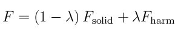
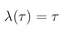
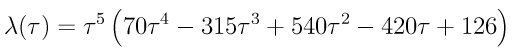

.. index:: fix ti/spring

fix ti/spring command
=====================

Syntax
""""""

.. parsed-literal::

   fix ID group-ID ti/spring k t_s t_eq keyword value ...

* ID, group-ID are documented in :doc:`fix <fix>` command
* ti/spring = style name of this fix command
* k = spring constant (force/distance units)
* t\_eq = number of steps for the equilibration procedure
* t\_s = number of steps for the switching procedure
* zero or more keyword/value pairs may be appended to args
* keyword = *function*
  
  .. parsed-literal::
  
       *function* value = function-ID
         function-ID = ID of the switching function (1 or 2)

**Example:**

.. parsed-literal::

   fix 1 all ti/spring 50.0 2000 1000 function 2

Description
"""""""""""

This fix allows you to compute the free energy of crystalline solids
by performing a nonequilibrium thermodynamic integration between the
solid of interest and an Einstein crystal. A detailed explanation of
how to use this command and choose its parameters for optimal
performance and accuracy is given in the paper by
:ref:`Freitas <Freitas1>`. The paper also presents a short summary of the
theory of nonequilibrium thermodynamic integration.

The thermodynamic integration procedure is performed by rescaling the
force on each atom. Given an atomic configuration the force (F) on
each atom is given by

where F\_solid is the force that acts on an atom due to an interatomic
potential (\ *e.g.* EAM potential), F\_harm is the force due to the
Einstein crystal harmonic spring, and lambda is the coupling parameter
of the thermodynamic integration. An Einstein crystal is a solid where
each atom is attached to its equilibrium position by a harmonic spring
with spring constant *k*\ . With this fix a spring force is applied
independently to each atom in the group defined by the fix to tether
it to its initial position. The initial position of each atom is its
position at the time the fix command was issued.

The fix acts as follows: during the first *t\_eq* steps after the fix
is defined the value of lambda is zero. This is the period to
equilibrate the system in the lambda = 0 state. After this the value
of lambda changes dynamically during the simulation from 0 to 1
according to the function defined using the keyword *function*
(described below), this switching from lambda from 0 to 1 is done in
*t\_s* steps. Then comes the second equilibration period of *t\_eq* to
equilibrate the system in the lambda = 1 state. After that, the
switching back to the lambda = 0 state is made using *t\_s* timesteps
and following the same switching function. After this period the value
of lambda is kept equal to zero and the fix has no other effect on the
dynamics of the system.

The processes described above is known as nonequilibrium thermodynamic
integration and is has been shown (:ref:`Freitas <Freitas1>`) to present a
much superior efficiency when compared to standard equilibrium
methods. The reason why the switching it is made in both directions
(potential to Einstein crystal and back) is to eliminate the
dissipated heat due to the nonequilibrium process. Further details
about nonequilibrium thermodynamic integration and its implementation
in LAMMPS is available in :ref:`Freitas <Freitas1>`.

The *function* keyword allows the use of two different lambda
paths. Option *1* results in a constant rate of change of lambda with
time:

where tau is the scaled time variable *t/t\_s*. The option *2* performs
the lambda switching at a rate defined by the following switching
function

This function has zero slope as lambda approaches its extreme values
(0 and 1), according to :ref:`de Koning <deKoning96>` this results in
smaller fluctuations on the integral to be computed on the
thermodynamic integration. The use of option *2* is recommended since
it results in better accuracy and less dissipation without any
increase in computational resources cost.

.. note::

   As described in :ref:`Freitas <Freitas1>`, it is important to keep the
   center-of-mass fixed during the thermodynamic integration. A nonzero
   total velocity will result in divergences during the integration due
   to the fact that the atoms are 'attached' to their equilibrium
   positions by the Einstein crystal. Check the option *zero* of :doc:`fix langevin <fix_langevin>` and :doc:`velocity <velocity>`. The use of
   the Nose-Hoover thermostat (:doc:`fix nvt <fix_nh>`) is *NOT*
   recommended due to its well documented issues with the canonical
   sampling of harmonic degrees of freedom (notice that the *chain*
   option will *NOT* solve this problem). The Langevin thermostat (:doc:`fix langevin <fix_langevin>`) correctly thermostats the system and we
   advise its usage with ti/spring command.

**Restart, fix\_modify, output, run start/stop, minimize info:**

This fix writes the original coordinates of tethered atoms to :doc:`binary restart files <restart>`, so that the spring effect will be the
same in a restarted simulation. See the :doc:`read restart <read_restart>` command for info on how to re-specify a fix
in an input script that reads a restart file, so that the operation of
the fix continues in an uninterrupted fashion.

The :doc:`fix modify <fix_modify>` *energy* option is supported by this
fix to add the energy stored in the per-atom springs to the system's
potential energy as part of :doc:`thermodynamic output <thermo_style>`.

This fix computes a global scalar and a global vector quantities which
can be accessed by various :doc:`output commands <Howto_output>`. The
scalar is an energy which is the sum of the spring energy for each
atom, where the per-atom energy is 0.5 \* k \* r\^2. The vector has 2
positions, the first one is the coupling parameter lambda and the
second one is the time derivative of lambda. The scalar and vector
values calculated by this fix are "extensive".

No parameter of this fix can be used with the *start/stop* keywords of
the :doc:`run <run>` command.

The forces due to this fix are imposed during an energy minimization,
invoked by the :doc:`minimize <minimize>` command.

.. note::

   If you want the per-atom spring energy to be included in the
   total potential energy of the system (the quantity being minimized),
   you MUST enable the :doc:`fix modify <fix_modify>` *energy* option for
   this fix.

Related commands
""""""""""""""""

:doc:`fix spring <fix_spring>`, :doc:`fix adapt <fix_adapt>`

Restrictions
""""""""""""

This fix is part of the USER-MISC package. It is only enabled if
LAMMPS was built with that package. See the :doc:`Build package <Build_package>` doc page for more info.

Default
"""""""

The keyword default is function = 1.

----------

.. _Freitas1:

**(Freitas)** Freitas, Asta, and de Koning, Computational Materials
Science, 112, 333 (2016).

.. _deKoning96:

**(de Koning)** de Koning and Antonelli, Phys Rev E, 53, 465 (1996).

