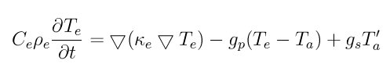
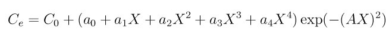
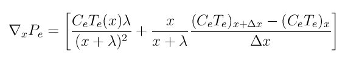

.. index:: fix ttm

fix ttm command
===============

fix ttm/mod command
===================

Syntax
""""""

.. parsed-literal::

   fix ID group-ID ttm seed C_e rho_e kappa_e gamma_p gamma_s v_0 Nx Ny Nz T_infile N T_outfile
   fix ID group-ID ttm/mod seed init_file Nx Ny Nz T_infile N T_outfile

* ID, group-ID are documented in :doc:`fix <fix>` command
* style = *ttm* or *ttm\_mod*
* seed = random number seed to use for white noise (positive integer)
* remaining arguments for fix ttm:
  
  .. parsed-literal::
  
       C_e  = electronic specific heat (energy/(electron\*temperature) units)
       rho_e = electronic density (electrons/volume units)
       kappa_e = electronic thermal conductivity (energy/(time\*distance\*temperature) units)
       gamma_p = friction coefficient due to electron-ion interactions (mass/time units)
       gamma_s = friction coefficient due to electronic stopping (mass/time units)
       v_0 = electronic stopping critical velocity (velocity units)
       Nx = number of thermal solve grid points in the x-direction (positive integer)
       Ny = number of thermal solve grid points in the y-direction (positive integer)
       Nz = number of thermal solve grid points in the z-direction (positive integer)
       T_infile = filename to read initial electronic temperature from
       N = dump TTM temperatures every this many timesteps, 0 = no dump
       T_outfile = filename to write TTM temperatures to (only needed if N > 0)

* remaining arguments for fix ttm/mod:
  
  .. parsed-literal::
  
       init_file = file with the parameters to TTM
       Nx = number of thermal solve grid points in the x-direction (positive integer)
       Ny = number of thermal solve grid points in the y-direction (positive integer)
       Nz = number of thermal solve grid points in the z-direction (positive integer)
       T_infile = filename to read initial electronic temperature from
       N = dump TTM temperatures every this many timesteps, 0 = no dump
       T_outfile = filename to write TTM temperatures to (only needed if N > 0)

Examples
""""""""

.. parsed-literal::

   fix 2 all ttm 699489 1.0 1.0 10 0.1 0.0 2.0 1 12 1 initialTs 1000 T.out
   fix 2 all ttm 123456 1.0 1.0 1.0 1.0 1.0 5.0 5 5 5 Te.in 1 Te.out
   fix 2 all ttm/mod 34277 parameters.txt 5 5 5 T_init 10 T_out

Description
"""""""""""

Use a two-temperature model (TTM) to represent heat transfer through
and between electronic and atomic subsystems.  LAMMPS models the
atomic subsystem as usual with a molecular dynamics model and the
classical force field specified by the user, but the electronic
subsystem is modeled as a continuum, or a background "gas", on a
regular grid.  Energy can be transferred spatially within the grid
representing the electrons.  Energy can also be transferred between
the electronic and the atomic subsystems.  The algorithm underlying
this fix was derived by D. M.  Duffy and A. M. Rutherford and is
discussed in two J Physics: Condensed Matter papers: :ref:`(Duffy) <Duffy>`
and :ref:`(Rutherford) <Rutherford>`.  They used this algorithm in cascade
simulations where a primary knock-on atom (PKA) was initialized with a
high velocity to simulate a radiation event.

The description in this sub-section applies to both fix ttm and fix
ttm/mod.  Fix ttm/mod adds options to account for external heat
sources (e.g. at a surface) and for specifying parameters that allow
the electronic heat capacity to depend strongly on electronic
temperature.  It is more expensive computationally than fix ttm
because it treats the thermal diffusion equation as non-linear.  More
details on fix ttm/mod are given below.

Heat transfer between the electronic and atomic subsystems is carried
out via an inhomogeneous Langevin thermostat.  This thermostat differs
from the regular Langevin thermostat (:doc:`fix langevin <fix_langevin>`) in three important ways.  First, the
Langevin thermostat is applied uniformly to all atoms in the
user-specified group for a single target temperature, whereas the TTM
fix applies Langevin thermostatting locally to atoms within the
volumes represented by the user-specified grid points with a target
temperature specific to that grid point.  Second, the Langevin
thermostat couples the temperature of the atoms to an infinite heat
reservoir, whereas the heat reservoir for fix TTM is finite and
represents the local electrons.  Third, the TTM fix allows users to
specify not just one friction coefficient, but rather two independent
friction coefficients: one for the electron-ion interactions
(*gamma\_p*), and one for electron stopping (*gamma\_s*).

When the friction coefficient due to electron stopping, *gamma\_s*, is
non-zero, electron stopping effects are included for atoms moving
faster than the electron stopping critical velocity, *v\_0*.  For
further details about this algorithm, see :ref:`(Duffy) <Duffy>` and
:ref:`(Rutherford) <Rutherford>`.

Energy transport within the electronic subsystem is solved according
to the heat diffusion equation with added source terms for heat
transfer between the subsystems:

where C\_e is the specific heat, rho\_e is the density, kappa\_e is the
thermal conductivity, T is temperature, the "e" and "a" subscripts
represent electronic and atomic subsystems respectively, g\_p is the
coupling constant for the electron-ion interaction, and g\_s is the
electron stopping coupling parameter.  C\_e, rho\_e, and kappa\_e are
specified as parameters to the fix.  The other quantities are derived.
The form of the heat diffusion equation used here is almost the same
as that in equation 6 of :ref:`(Duffy) <Duffy>`, with the exception that the
electronic density is explicitly represented, rather than being part
of the specific heat parameter.

Currently, fix ttm assumes that none of the user-supplied parameters
will vary with temperature. Note that :ref:`(Duffy) <Duffy>` used a tanh()
functional form for the temperature dependence of the electronic
specific heat, but ignored temperature dependencies of any of the
other parameters.  See more discussion below for fix ttm/mod.

These fixes require use of periodic boundary conditions and a 3D
simulation.  Periodic boundary conditions are also used in the heat
equation solve for the electronic subsystem.  This varies from the
approach of :ref:`(Rutherford) <Rutherford>` where the atomic subsystem was
embedded within a larger continuum representation of the electronic
subsystem.

The initial electronic temperature input file, *T\_infile*, is a text
file LAMMPS reads in with no header and with four numeric columns
(ix,iy,iz,Temp) and with a number of rows equal to the number of
user-specified grid points (Nx by Ny by Nz).  The ix,iy,iz are node
indices from 0 to nxnodes-1, etc.  For example, the initial electronic
temperatures on a 1 by 2 by 3 grid could be specified in a *T\_infile*
as follows:

.. parsed-literal::

   0 0 0 1.0
   0 0 1 1.0
   0 0 2 1.0
   0 1 0 2.0
   0 1 1 2.0
   0 1 2 2.0

where the electronic temperatures along the y=0 plane have been set to
1.0, and the electronic temperatures along the y=1 plane have been set
to 2.0.  The order of lines in this file is no important.  If all the
nodal values are not specified, LAMMPS will generate an error.

The temperature output file, *T\_oufile*, is created and written by
this fix.  Temperatures for both the electronic and atomic subsystems
at every node and every N timesteps are output.  If N is specified as
zero, no output is generated, and no output filename is needed.  The
format of the output is as follows.  One long line is written every
output timestep.  The timestep itself is given in the first column.
The next Nx\*Ny\*Nz columns contain the temperatures for the atomic
subsystem, and the final Nx\*Ny\*Nz columns contain the temperatures for
the electronic subsystem.  The ordering of the Nx\*Ny\*Nz columns is
with the z index varying fastest, y the next fastest, and x the
slowest.

These fixes do not change the coordinates of their atoms; they only
scales their velocities.  Thus a time integration fix (e.g. :doc:`fix nve <fix_nve>`) should still be used to time integrate the affected
atoms.  The fixes should not normally be used on atoms that have their
temperature controlled by another fix - e.g. :doc:`fix nvt <fix_nh>` or
:doc:`fix langevin <fix_langevin>`.

.. note::

   The current implementations of these fixes create a copy of the
   electron grid that overlays the entire simulation domain, for each
   processor.  Values on the grid are summed across all processors.  Thus
   you should insure that this grid is not too large, else your
   simulation could incur high memory and communication costs.

----------

**Additional details for fix ttm/mod**

Fix ttm/mod uses the heat diffusion equation with possible external
heat sources (e.g. laser heating in ablation simulations):

.. image:: Eqs/fix_ttm_mod.jpg
   :align: center

where theta is the Heaviside step function, I\_0 is the (absorbed)
laser pulse intensity for ablation simulations, l\_skin is the depth
of skin-layer, and all other designations have the same meaning as in
the former equation. The duration of the pulse is set by the parameter
*tau* in the *init\_file*.

Fix ttm/mod also allows users to specify the dependencies of C\_e and
kappa\_e on the electronic temperature. The specific heat is expressed
as

where *X* = T\_e/1000, and the thermal conductivity is defined as
kappa\_e = D\_e\*rho\_e\*C\_e, where D\_e is the thermal diffusion
coefficient.

Electronic pressure effects are included in the TTM model to account
for the blast force acting on ions because of electronic pressure
gradient (see :ref:`(Chen) <Chen>`, :ref:`(Norman) <Norman>`).  The total force
acting on an ion is:

.. image:: Eqs/fix_ttm_blast.jpg
   :align: center

where F\_langevin is a force from Langevin thermostat simulating
electron-phonon coupling, and nabla P\_e/n\_ion is the electron blast
force.

The electronic pressure is taken to be P\_e = B\*rho\_e\*C\_e\*T\_e

The current fix ttm/mod implementation allows TTM simulations with a
vacuum. The vacuum region is defined as the grid cells with zero
electronic temperature. The numerical scheme does not allow energy
exchange with such cells. Since the material can expand to previously
unoccupied region in some simulations, the vacuum border can be
allowed to move. It is controlled by the *surface\_movement* parameter
in the *init\_file*. If it is set to 1, then "vacuum" cells can be
changed to "electron-filled" cells with the temperature *T\_e_min* if
atoms move into them (currently only implemented for the case of
1-dimensional motion of flat surface normal to the X axis). The
initial borders of vacuum can be set in the *init\_file* via *lsurface*
and *rsurface* parameters. In this case, electronic pressure gradient
is calculated as

where lambda is the electron mean free path (see :ref:`(Norman) <Norman>`,
:ref:`(Pisarev) <Pisarev>`)

The fix ttm/mod parameter file *init\_file* has the following syntax/
Every line with the odd number is considered as a comment and
ignored. The lines with the even numbers are treated as follows:

.. parsed-literal::

   a_0, energy/(temperature\*electron) units
   a_1, energy/(temperature\^2\*electron) units
   a_2, energy/(temperature\^3\*electron) units
   a_3, energy/(temperature\^4\*electron) units
   a_4, energy/(temperature\^5\*electron) units
   C_0, energy/(temperature\*electron) units
   A, 1/temperature units
   rho_e, electrons/volume units
   D_e, length\^2/time units
   gamma_p, mass/time units
   gamma_s, mass/time units
   v_0, length/time units
   I_0, energy/(time\*length\^2) units
   lsurface, electron grid units (positive integer)
   rsurface, electron grid units (positive integer)
   l_skin, length units
   tau, time units
   B, dimensionless
   lambda, length units
   n_ion, ions/volume units
   surface_movement: 0 to disable tracking of surface motion, 1 to enable
   T_e_min, temperature units

----------

**Restart, fix\_modify, output, run start/stop, minimize info:**

These fixes write the state of the electronic subsystem and the energy
exchange between the subsystems to :doc:`binary restart files <restart>`.  See the :doc:`read_restart <read_restart>` command
for info on how to re-specify a fix in an input script that reads a
restart file, so that the operation of the fix continues in an
uninterrupted fashion.

Because the state of the random number generator is not saved in the
restart files, this means you cannot do "exact" restarts with this
fix, where the simulation continues on the same as if no restart had
taken place.  However, in a statistical sense, a restarted simulation
should produce the same behavior.

None of the :doc:`fix_modify <fix_modify>` options are relevant to these
fixes.

Both fixes compute 2 output quantities stored in a vector of length 2,
which can be accessed by various :doc:`output commands <Howto_output>`.
The first quantity is the total energy of the electronic
subsystem. The second quantity is the energy transferred from the
electronic to the atomic subsystem on that timestep. Note that the
velocity verlet integrator applies the fix ttm forces to the atomic
subsystem as two half-step velocity updates: one on the current
timestep and one on the subsequent timestep.  Consequently, the change
in the atomic subsystem energy is lagged by half a timestep relative
to the change in the electronic subsystem energy. As a result of this,
users may notice slight fluctuations in the sum of the atomic and
electronic subsystem energies reported at the end of the timestep.

The vector values calculated are "extensive".

No parameter of the fixes can be used with the *start/stop* keywords
of the :doc:`run <run>` command.  The fixes are not invoked during
:doc:`energy minimization <minimize>`.

Restrictions
""""""""""""

Fix *ttm* is part of the MISC package. It is only enabled if LAMMPS
was built with that package.  Fix *ttm/mod* is part of the USER-MISC
package. It is only enabled if LAMMPS was built with that package.
See the :doc:`Build package <Build_package>` doc page for more info.

These fixes can only be used for 3d simulations and orthogonal
simulation boxes.  You must also use periodic
:doc:`boundary <boundary>` conditions.

Related commands
""""""""""""""""

:doc:`fix langevin <fix_langevin>`, :doc:`fix dt/reset <fix_dt_reset>`

**Default:** none

----------

.. _Duffy:

**(Duffy)** D M Duffy and A M Rutherford, J. Phys.: Condens. Matter, 19,
016207-016218 (2007).

.. _Rutherford:

**(Rutherford)** A M Rutherford and D M Duffy, J. Phys.:
Condens. Matter, 19, 496201-496210 (2007).

.. _Chen:

**(Chen)** J Chen, D Tzou and J Beraun, Int. J. Heat
Mass Transfer, 49, 307-316 (2006).

.. _Norman:

**(Norman)** G E Norman, S V Starikov, V V Stegailov et al., Contrib.
Plasma Phys., 53, 129-139 (2013).

.. _Pisarev:

**(Pisarev)** V V Pisarev and S V Starikov, J. Phys.: Condens. Matter, 26,
475401 (2014).

