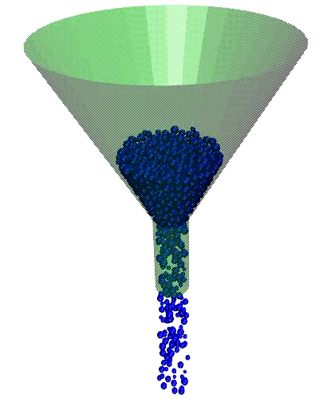
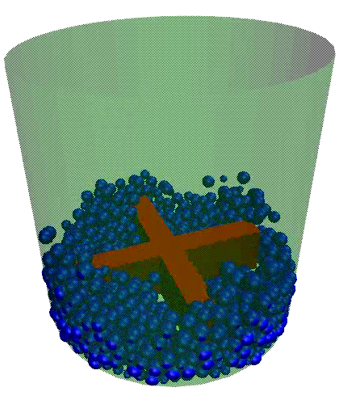

.. index:: fix wall/gran/region

fix wall/gran/region command
============================

Syntax
""""""

.. parsed-literal::

   fix ID group-ID wall/gran/region fstyle fstyle_params wallstyle regionID keyword values ...

* ID, group-ID are documented in :doc:`fix <fix>` command
* wall/region = style name of this fix command
* fstyle = style of force interactions between particles and wall

  .. parsed-literal::

       possible choices: hooke, hooke/history, hertz/history, granular

* fstyle_params = parameters associated with force interaction style

  .. parsed-literal::

       For *hooke*, *hooke/history*, and *hertz/history*, *fstyle_params* are:
             Kn = elastic constant for normal particle repulsion (force/distance units or pressure units - see discussion below)
             Kt = elastic constant for tangential contact (force/distance units or pressure units - see discussion below)
             gamma_n = damping coefficient for collisions in normal direction (1/time units or 1/time-distance units - see discussion below)
             gamma_t = damping coefficient for collisions in tangential direction (1/time units or 1/time-distance units - see discussion below)
             xmu = static yield criterion (unitless value between 0.0 and 1.0e4)
             dampflag = 0 or 1 if tangential damping force is excluded or included

  .. parsed-literal::

       For *granular*, *fstyle_params* are set using the same syntax as for the *pair_coeff* command of :doc:`pair_style granular <pair_granular>`

* wallstyle = region (see :doc:`fix wall/gran <fix_wall_gran>` for options for other kinds of walls)
* region-ID = region whose boundary will act as wall
* keyword = *contacts*

  .. parsed-literal::

      *contacts* value = none
         generate contact information for each particle

Examples
""""""""

.. code-block:: LAMMPS

   fix wall all wall/gran/region hooke/history 1000.0 200.0 200.0 100.0 0.5 1 region myCone
   fix 3 all wall/gran/region granular hooke 1000.0 50.0 tangential linear_nohistory 1.0 0.4 damping velocity region myBox
   fix 4 all wall/gran/region granular jkr 1e5 1500.0 0.3 10.0 tangential mindlin NULL 1.0 0.5 rolling sds 500.0 200.0 0.5 twisting marshall region myCone
   fix 5 all wall/gran/region granular dmt 1e5 0.2 0.3 10.0 tangential mindlin NULL 1.0 0.5 rolling sds 500.0 200.0 0.5 twisting marshall damping tsuji region myCone
   fix wall all wall/gran/region hooke/history 1000.0 200.0 200.0 100.0 0.5 1 region myCone contacts

Description
"""""""""""

Treat the surface of the geometric region defined by the *region-ID*
as a bounding frictional wall which interacts with nearby finite-size
granular particles when they are close enough to touch the wall.  See
the :doc:`fix wall/region <fix_wall_region>` and :doc:`fix wall/gran <fix_wall_gran>` commands for related kinds of walls for
non-granular particles and simpler wall geometries, respectively.

Here are snapshots of example models using this command.  Corresponding
input scripts can be found in examples/granregion.  Movies of these
simulations are `here on the Movies page <https://www.lammps.org/movies.html#granregion>`_
of the LAMMPS website.

|wallgran1|  |wallgran2|

.. raw:: html

   Click on the images to see a bigger picture.

----------

The distance between a particle and the region boundary is the
distance to the nearest point on the region surface.  The force the
wall exerts on the particle is along the direction between that point
and the particle center, which is the direction normal to the surface
at that point.  Note that if the region surface is comprised of
multiple "faces", then each face can exert a force on the particle if
it is close enough.  E.g. for :doc:`region_style block <region>`, a
particle in the interior, near a corner of the block, could feel wall
forces from 1, 2, or 3 faces of the block.

Regions are defined using the :doc:`region <region>` command.  Note that
the region volume can be interior or exterior to the bounding surface,
which will determine in which direction the surface interacts with
particles, i.e. the direction of the surface normal. The exception to
this is if one or more *open* options are specified for the region
command, in which case particles interact with both the interior and
exterior surfaces of regions.

Regions can either be primitive shapes (block, sphere, cylinder, etc)
or combinations of primitive shapes specified via the *union* or
*intersect* region styles.  These latter styles can be used to
construct particle containers with complex shapes.

Regions can also move dynamically via the :doc:`region <region>` command
keywords (move) and *rotate*, or change their shape by use of variables
as inputs to the :doc:`region <region>` command.  If such a region is used
with this fix, then the region surface will move in time in the
corresponding manner.

.. note::

   As discussed on the :doc:`region <region>` command doc page,
   regions in LAMMPS do not get wrapped across periodic boundaries.  It
   is up to you to ensure that the region location with respect to
   periodic or non-periodic boundaries is specified appropriately via the
   :doc:`region <region>` and :doc:`boundary <boundary>` commands when using
   a region as a wall that bounds particle motion.

.. note::

   For primitive regions with sharp corners and/or edges (e.g. a
   block or cylinder), wall/particle forces are computed accurately for
   both interior and exterior regions.  For *union* and *intersect*
   regions, additional sharp corners and edges may be present due to the
   intersection of the surfaces of 2 or more primitive volumes.  These
   corners and edges can be of two types: concave or convex.  Concave
   points/edges are like the corners of a cube as seen by particles in
   the interior of a cube.  Wall/particle forces around these features
   are computed correctly.  Convex points/edges are like the corners of a
   cube as seen by particles exterior to the cube, i.e. the points jut
   into the volume where particles are present.  LAMMPS does NOT compute
   the location of these convex points directly, and hence wall/particle
   forces in the cutoff volume around these points suffer from
   inaccuracies.  The basic problem is that the outward normal of the
   surface is not continuous at these points.  This can cause particles
   to feel no force (they don't "see" the wall) when in one location,
   then move a distance epsilon, and suddenly feel a large force because
   they now "see" the wall.  In a worst-case scenario, this can blow
   particles out of the simulation box.  Thus, as a general rule you
   should not use the fix wall/gran/region command with *union* or
   *interesect* regions that have convex points or edges resulting from
   the union/intersection (convex points/edges in the union/intersection
   due to a single sub-region are still OK).

.. note::

   Similarly, you should not define *union* or *intersert* regions
   for use with this command that share an overlapping common face that
   is part of the overall outer boundary (interior boundary is OK), even
   if the face is smooth.  E.g. two regions of style block in a *union*
   region, where the two blocks overlap on one or more of their faces.
   This is because LAMMPS discards points that are part of multiple
   sub-regions when calculating wall/particle interactions, to avoid
   double-counting the interaction.  Having two coincident faces could
   cause the face to become invisible to the particles.  The solution is
   to make the two faces differ by epsilon in their position.

The nature of the wall/particle interactions are determined by the
*fstyle* setting.  It can be any of the styles defined by the
:doc:`pair_style gran/\* <pair_gran>` or the more general
:doc:`pair_style granular <pair_granular>` commands.  Currently the
options are *hooke*, *hooke/history*, or *hertz/history* for the
former, and *granular* with all the possible options of the associated
*pair_coeff* command for the latter.  The equation for the force
between the wall and particles touching it is the same as the
corresponding equation on the :doc:`pair_style gran/\* <pair_gran>` and
:doc:`pair_style granular <pair_granular>` doc pages, but the effective
radius is calculated using the radius of the particle and the radius of
curvature of the wall at the contact point.

Specifically, delta = radius - r = overlap of particle with wall,
m_eff = mass of particle, and RiRj/Ri+Rj is the effective radius, with
Rj replaced by the radius of curvature of the wall at the contact
point.  The radius of curvature can be negative for a concave wall
section, e.g. the interior of cylinder.  For a flat wall, delta =
radius - r = overlap of particle with wall, m_eff = mass of particle,
and the effective radius of contact is just the radius of the
particle.

The parameters *Kn*, *Kt*, *gamma_n*, *gamma_t*, *xmu*, *dampflag*,
and the optional keyword *limit_damping*
have the same meaning and units as those specified with the
:doc:`pair_style gran/\* <pair_gran>` commands.  This means a NULL can be
used for either *Kt* or *gamma_t* as described on that page.  If a
NULL is used for *Kt*, then a default value is used where *Kt* = 2/7
*Kn*\ .  If a NULL is used for *gamma_t*, then a default value is used
where *gamma_t* = 1/2 *gamma_n*.

All the model choices for cohesion, tangential friction, rolling
friction and twisting friction supported by the :doc:`pair_style granular <pair_granular>` through its *pair_coeff* command are also
supported for walls. These are discussed in greater detail on the doc
page for :doc:`pair_style granular <pair_granular>`.

Note that you can choose a different force styles and/or different
values for the 6 wall/particle coefficients than for particle/particle
interactions.  E.g. if you wish to model the wall as a different
material.

Restart, fix_modify, output, run start/stop, minimize info
"""""""""""""""""""""""""""""""""""""""""""""""""""""""""""

Similar to :doc:`fix wall/gran <fix_wall_gran>` command, this fix writes
the shear friction state of atoms interacting with the wall to :doc:`binary restart files <restart>`, so that a simulation can continue
correctly if granular potentials with shear "history" effects are
being used.  This fix also includes info about a moving region in the
restart file.  See the :doc:`read_restart <read_restart>` command for
info on how to re-specify a fix in an input script that reads a
restart file, so that the operation of the fix continues in an
uninterrupted fashion.

.. note::

   Information about region definitions is NOT included in restart
   files, as discussed on the :doc:`read_restart <read_restart>` doc page.
   So you must re-define your region and if it is a moving region, define
   its motion attributes in a way that is consistent with the simulation
   that wrote the restart file.  In particular, if you want to change the
   region motion attributes (e.g. its velocity), then you should ensure
   the position/orientation of the region at the initial restart timestep
   is the same as it was on the timestep the restart file was written.
   If this is not possible, you may need to ignore info in the restart
   file by defining a new fix wall/gran/region command in your restart
   script, e.g. with a different fix ID.  Or if you want to keep the
   shear history info but discard the region motion information, you can
   use the same fix ID for fix wall/gran/region, but assign it a region
   with a different region ID.

If the :code:`contacts` option is used, this fix generates a per-atom array
with 8 columns as output, containing the contact information for owned
particles (nlocal on each processor). All columns in this per-atom array will
be zero if no contact has occurred. The values of these columns are listed in
the following table:

+-------+----------------------------------------------------+----------------+
| Index | Value                                              | Units          |
+=======+====================================================+================+
|     1 | 1.0 if particle is in contact with wall,           |                |
|       | 0.0 otherwise                                      |                |
+-------+----------------------------------------------------+----------------+
|     2 | Force :math:`f_x` exerted by the wall              | force units    |
+-------+----------------------------------------------------+----------------+
|     3 | Force :math:`f_y` exerted by the wall              | force units    |
+-------+----------------------------------------------------+----------------+
|     4 | Force :math:`f_z` exerted by the wall              | force units    |
+-------+----------------------------------------------------+----------------+
|     5 | :math:`x`-coordinate of contact point on wall      | distance units |
+-------+----------------------------------------------------+----------------+
|     6 | :math:`y`-coordinate of contact point on wall      | distance units |
+-------+----------------------------------------------------+----------------+
|     7 | :math:`z`-coordinate of contact point on wall      | distance units |
+-------+----------------------------------------------------+----------------+
|     8 | Radius :math:`r` of atom                           | distance units |
+-------+----------------------------------------------------+----------------+

None of the :doc:`fix_modify <fix_modify>` options are relevant to this fix.
No parameter of this fix can be used with the *start/stop* keywords of the
:doc:`run <run>` command. This fix is not invoked during :doc:`energy
minimization <minimize>`.

Restrictions
""""""""""""

This fix is part of the GRANULAR package.  It is only enabled if
LAMMPS was built with that package.  See the :doc:`Build package <Build_package>` page for more info.

Related commands
""""""""""""""""

:doc:`fix_move <fix_move>`,
:doc:`fix wall/gran <fix_wall_gran>`,
:doc:`fix wall/region <fix_wall_region>`,
:doc:`pair_style granular <pair_gran>`,
:doc:`region <region>`

Default
"""""""

none
